---  
title: "Guinness U20 Six Nations 2024 Status"  
date: 2024-01-15 6:00:00 -0500  
categories: model review projection  
layout: article  
aside:  
    toc: true  
---
# Current Team Rankings

# Standings

## Projected Total Table

| Club         |   Total Matches |   Wins |   Point Differential |   Losing Bonus Points |   Try Bonus Points |   Competition Points |
|:-------------|----------------:|-------:|---------------------:|----------------------:|-------------------:|---------------------:|
| France U20   |               5 |    4.9 |            206.019   |                   0.1 |                3.6 |                 23.4 |
| Ireland U20  |               5 |    3.5 |             61.231   |                   0.3 |                2.5 |                 16.7 |
| England U20  |               5 |    3   |             13.2867  |                   0.5 |                1.9 |                 14.2 |
| Wales U20    |               5 |    2.4 |              3.48791 |                   0.4 |                1.9 |                 12   |
| Italy U20    |               5 |    1   |           -106.408   |                   0.3 |                1.1 |                  5.5 |
| Scotland U20 |               5 |    0.2 |           -177.617   |                   0.2 |                0.7 |                  1.8 |

# Future Predictions

## Week 1

### Wales U20 V Scotland U20 on 2024/02/02

Average Margin: Wales U20 by 32.8

Average Scoreline: 54-21

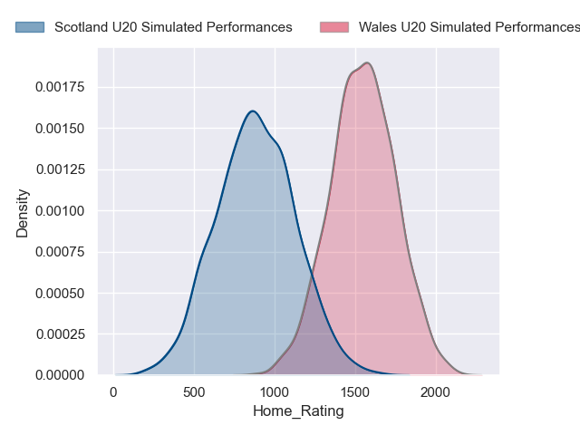
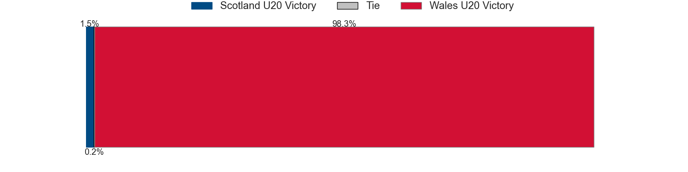
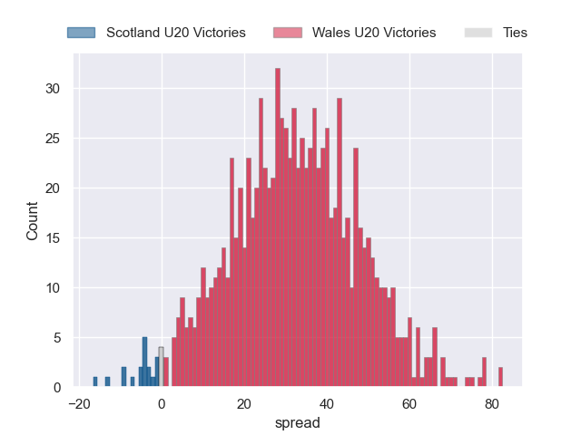

### Italy U20 V England U20 on 2024/02/02

Average Margin: England U20 by 16.9

Average Scoreline: 28-11

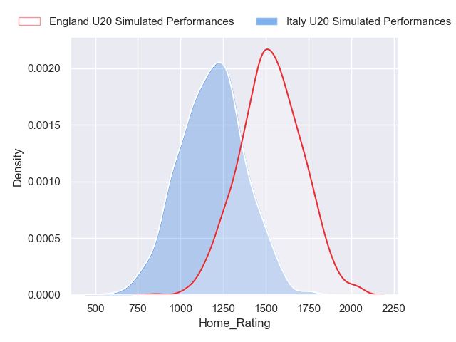
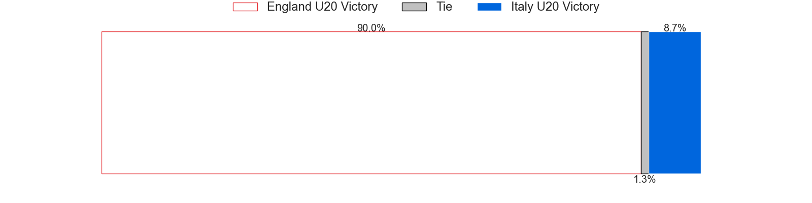
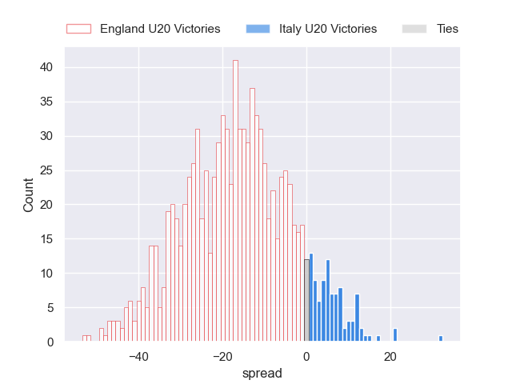

### France U20 V Ireland U20 on 2024/02/03

Average Margin: France U20 by 27.2

Average Scoreline: 46-19

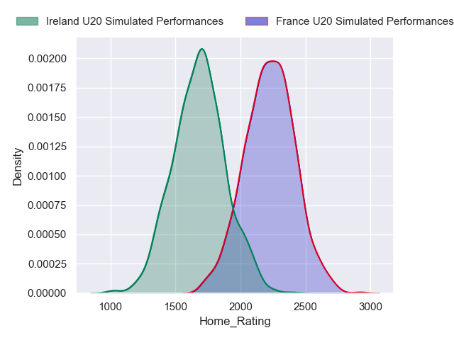
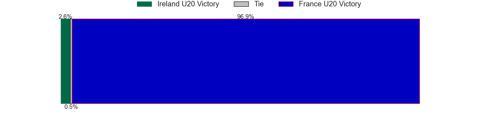
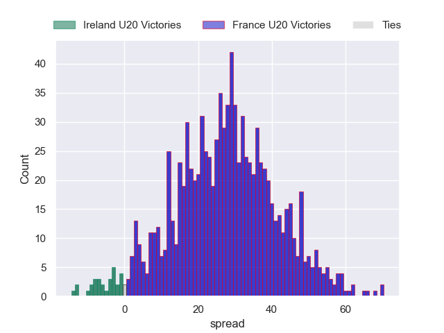

## Week 2

### Scotland U20 V France U20 on 2024/02/09

Average Margin: France U20 by 60.4

Average Scoreline: 48--12

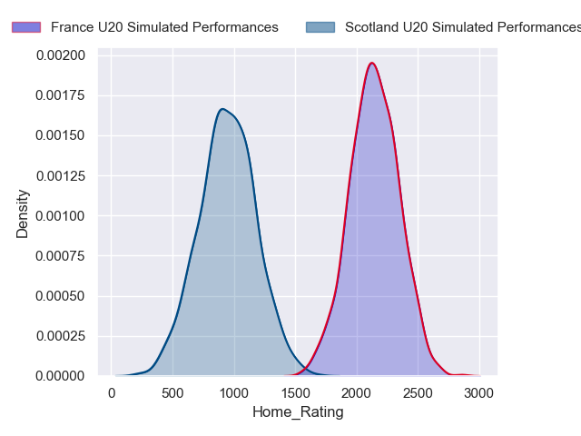
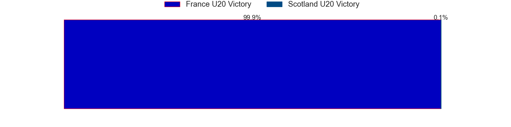
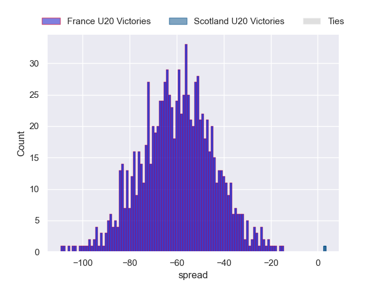

### Ireland U20 V Italy U20 on 2024/02/09

Average Margin: Ireland U20 by 30.4

Average Scoreline: 53-22

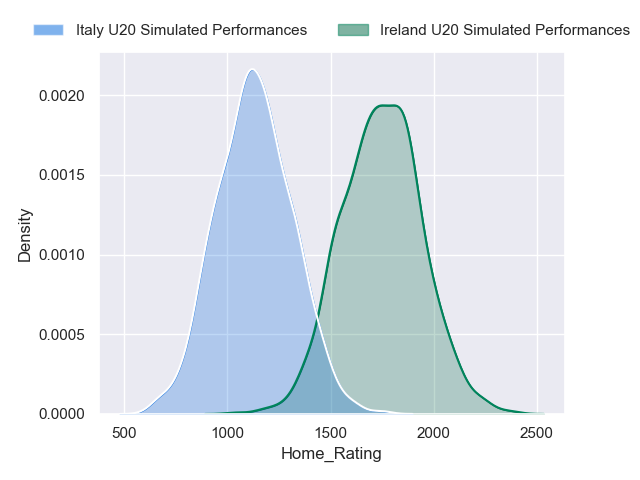

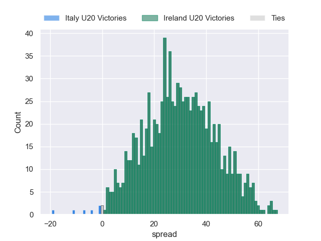

### England U20 V Wales U20 on 2024/02/09

Average Margin: England U20 by 6.7

Average Scoreline: 29-22

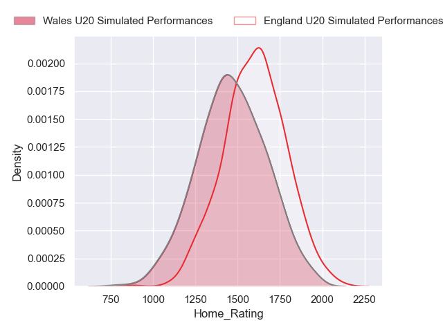
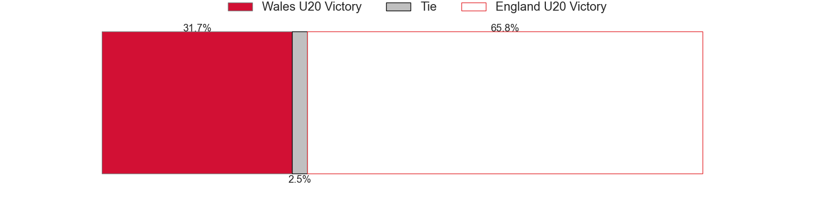
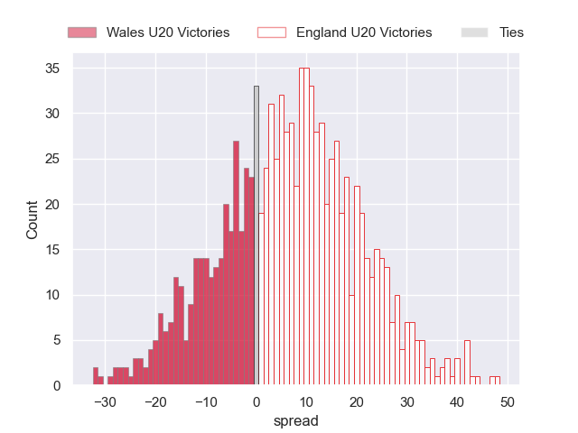

## Week 3

### Ireland U20 V Wales U20 on 2024/02/23

Average Margin: Ireland U20 by 13.6

Average Scoreline: 36-22

### Scotland U20 V England U20 on 2024/02/23

Average Margin: England U20 by 28.5

Average Scoreline: 39-11

### France U20 V Italy U20 on 2024/02/23

Average Margin: France U20 by 54.2

Average Scoreline: 58-4

## Week 4

### Wales U20 V France U20 on 2024/03/07

Average Margin: France U20 by 29.1

Average Scoreline: 32-3

### England U20 V Ireland U20 on 2024/03/08

Average Margin: Ireland U20 by 3.7

Average Scoreline: 29-25

### Italy U20 V Scotland U20 on 2024/03/08

Average Margin: Italy U20 by 15.1

Average Scoreline: 35-19

## Week 5

### Ireland U20 V Scotland U20 on 2024/03/15

Average Margin: Ireland U20 by 40.9

Average Scoreline: 54-13

### France U20 V England U20 on 2024/03/15

Average Margin: France U20 by 35.1

Average Scoreline: 45-10

### Wales U20 V Italy U20 on 2024/03/15

Average Margin: Wales U20 by 20.1

Average Scoreline: 37-17

