---  
title: "Guinness U20 Six Nations 2024 Status"  
date: 2024-02-13 6:00:00 -0500  
categories: model review projection  
layout: article  
aside:  
    toc: true  
---
# Current Team Rankings

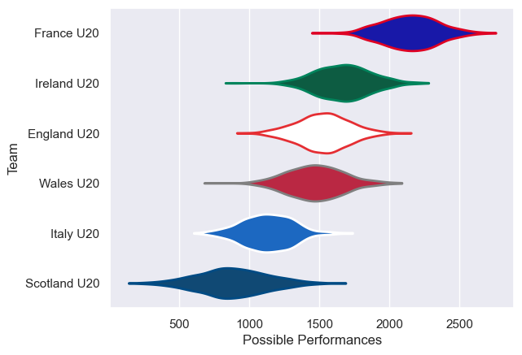
# Standings

## Current Standings

| Club         |   Played |   Wins |   Point Differential |   Losing Bonus Points |   Try Bonus Points |   Competition Points |
|:-------------|---------:|-------:|---------------------:|----------------------:|-------------------:|---------------------:|
| England U20  |        3 |      3 |                   67 |                     0 |                nan |                   12 |
| Ireland U20  |        3 |      3 |                    8 |                     0 |                nan |                   12 |
| France U20   |        3 |      2 |                   24 |                     1 |                nan |                    9 |
| Wales U20    |        3 |      1 |                  -34 |                     0 |                nan |                    4 |
| Italy U20    |        3 |      0 |                  -27 |                     2 |                nan |                    2 |
| Scotland U20 |        3 |      0 |                  -38 |                     0 |                nan |                    0 |

## Projected Remaining Table

| Club         |   Matches Remaining |   Wins |   Point Differential |   Losing Bonus Points |   Try Bonus Points |   Competition Points |
|:-------------|--------------------:|-------:|---------------------:|----------------------:|-------------------:|---------------------:|
| France U20   |                   3 |    2.8 |              62.4176 |                   0.2 |                1.8 |                 13.1 |
| Ireland U20  |                   3 |    2.1 |              32.4003 |                   0.3 |                1.4 |                 10.1 |
| England U20  |                   3 |    1.8 |              17.6513 |                   0.4 |                1.4 |                  9.1 |
| Italy U20    |                   3 |    1.3 |             -17.7383 |                   0.4 |                1   |                  6.5 |
| Wales U20    |                   3 |    0.6 |             -41.4126 |                   0.4 |                0.6 |                  3.6 |
| Scotland U20 |                   3 |    0.4 |             -53.3184 |                   0.3 |                0.6 |                  2.5 |

## Projected Total Table

| Club         |   Total Matches |   Wins |   Point Differential |   Losing Bonus Points |   Try Bonus Points |   Competition Points |
|:-------------|----------------:|-------:|---------------------:|----------------------:|-------------------:|---------------------:|
| France U20   |               6 |    4.8 |              86.4176 |                   1.2 |                1.8 |                 22.1 |
| Ireland U20  |               6 |    5.1 |              40.4003 |                   0.3 |                1.4 |                 22.1 |
| England U20  |               6 |    4.8 |              84.6513 |                   0.4 |                1.4 |                 21.1 |
| Italy U20    |               6 |    1.3 |             -44.7383 |                   2.4 |                1   |                  8.5 |
| Wales U20    |               6 |    1.6 |             -75.4126 |                   0.4 |                0.6 |                  7.6 |
| Scotland U20 |               6 |    0.4 |             -91.3184 |                   0.3 |                0.6 |                  2.5 |

# Completed Match Review

| Model | Percent Correct Predictions | Spread Error |
| ------ | ------ | ------ |
| Club Level | 83.3% | 26.5 |
| Player Level: Lineup | nan% | nan |
| Player Level: Minutes | nan% | nan |

# Future Predictions

## Week 4

### Scotland U20 V England U20 on 2024/02/23

Average Margin: England U20 by 21.6

Average Scoreline: 36-15

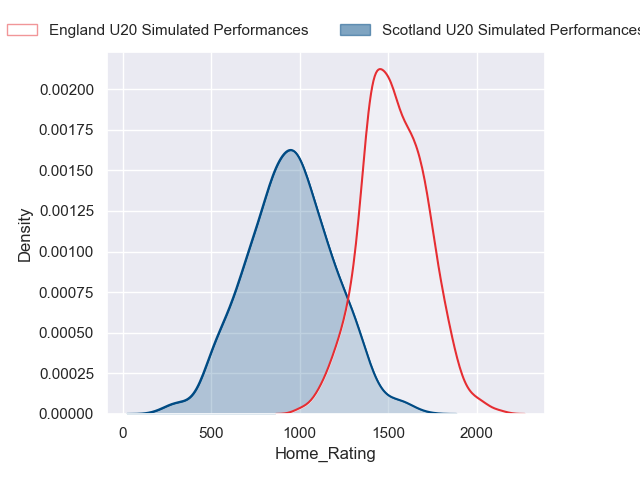
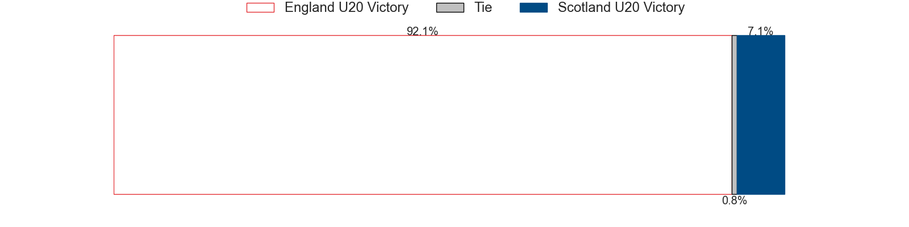
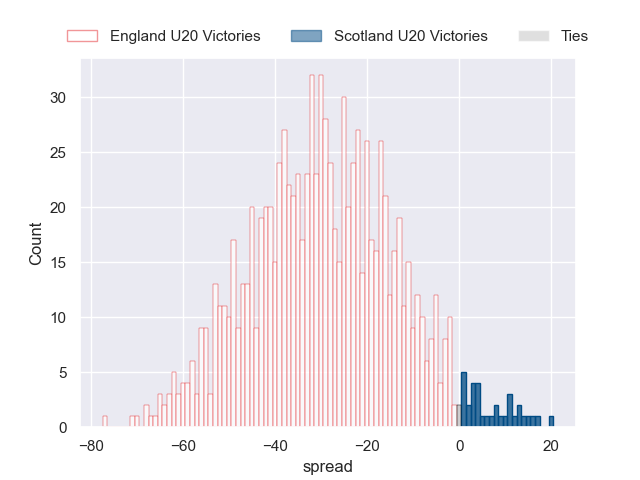

### France U20 V Italy U20 on 2024/02/23

Average Margin: France U20 by 27.8

Average Scoreline: 38-10

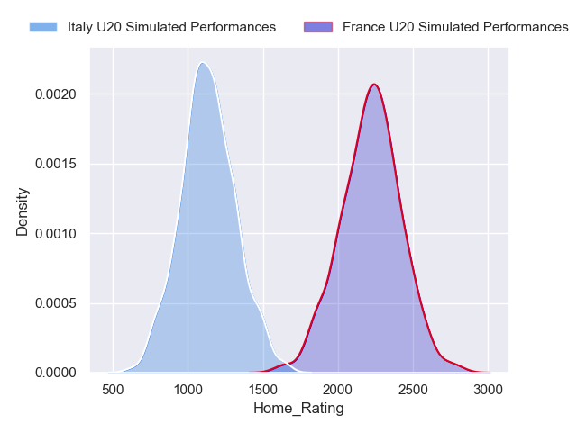
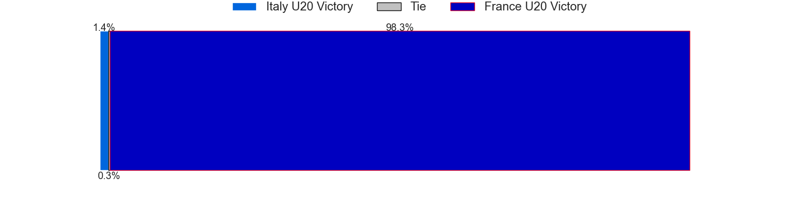
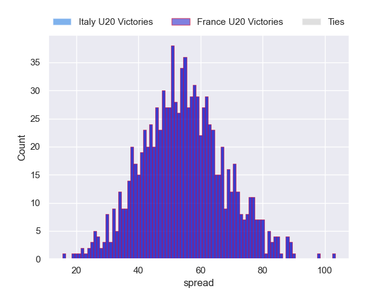

### Ireland U20 V Wales U20 on 2024/02/23

Average Margin: Ireland U20 by 18.9

Average Scoreline: 31-12

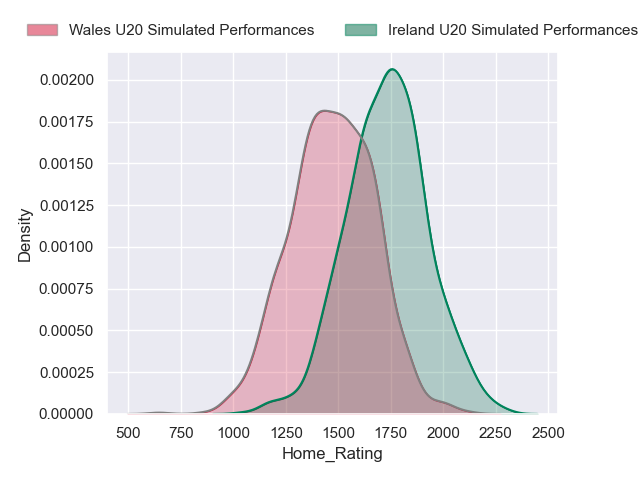
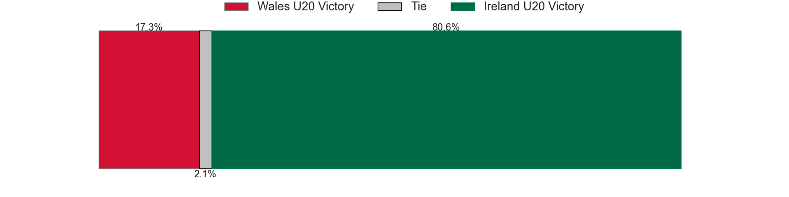
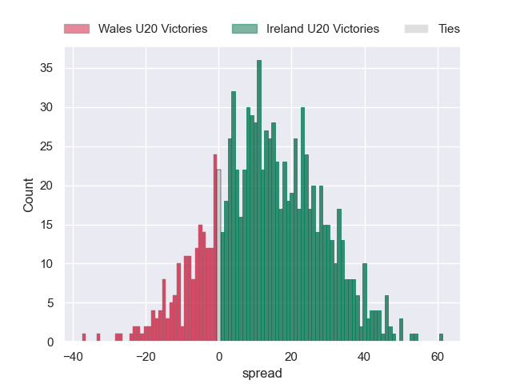

## Week 5

### Wales U20 V France U20 on 2024/03/07

Average Margin: France U20 by 22.9

Average Scoreline: 40-17

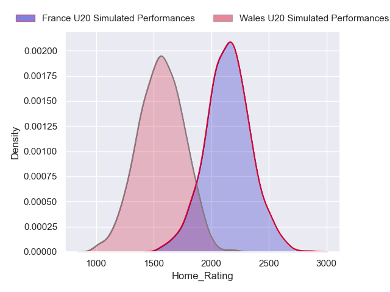
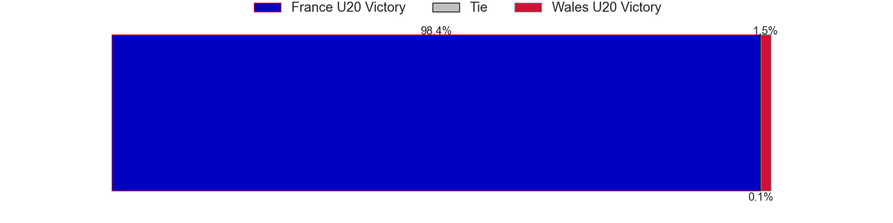
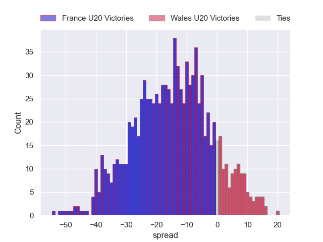

### Italy U20 V Scotland U20 on 2024/03/08

Average Margin: Italy U20 by 10.5

Average Scoreline: 30-20

### England U20 V Ireland U20 on 2024/03/08

Average Margin: England U20 by 7.7

Average Scoreline: 21-14

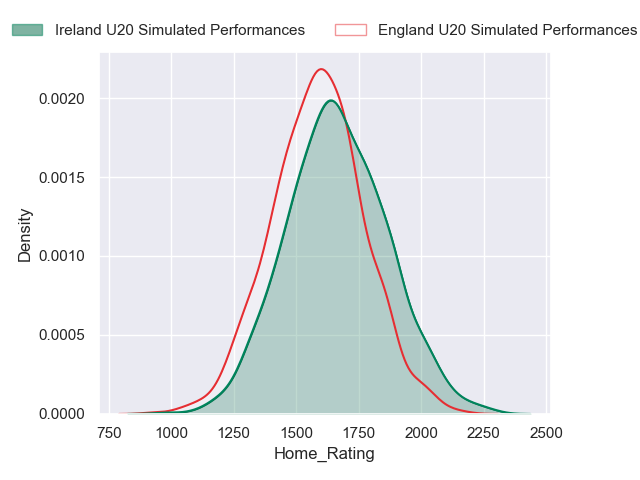

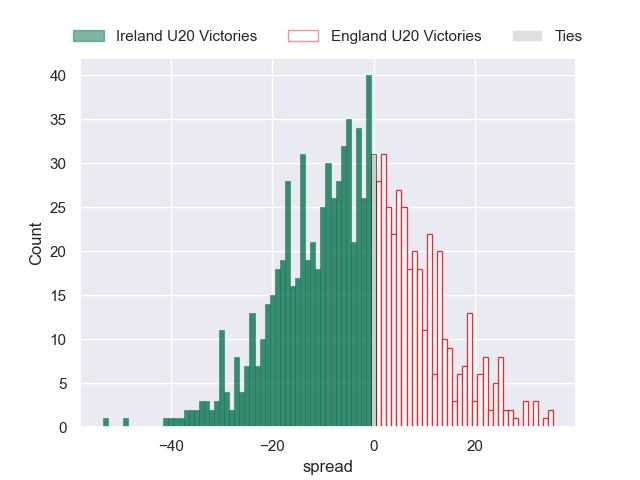

## Week 6

### Ireland U20 V Scotland U20 on 2024/03/15

Average Margin: Ireland U20 by 21.3

Average Scoreline: 36-15

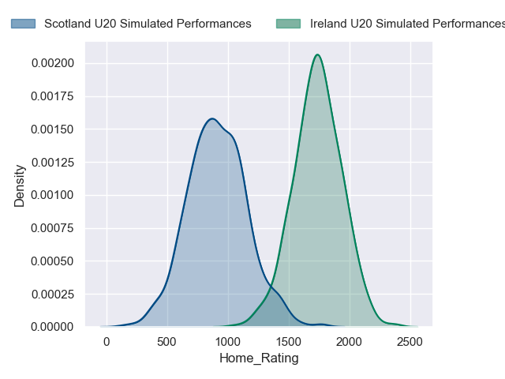

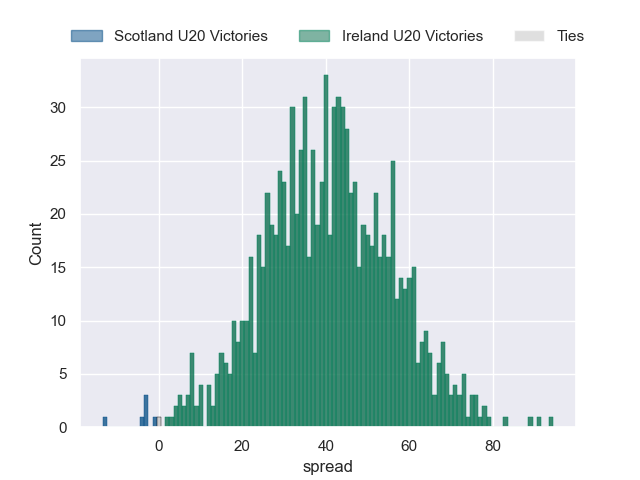

### Wales U20 V Italy U20 on 2024/03/15

Average Margin: Wales U20 by 0.4

Average Scoreline: 27-26

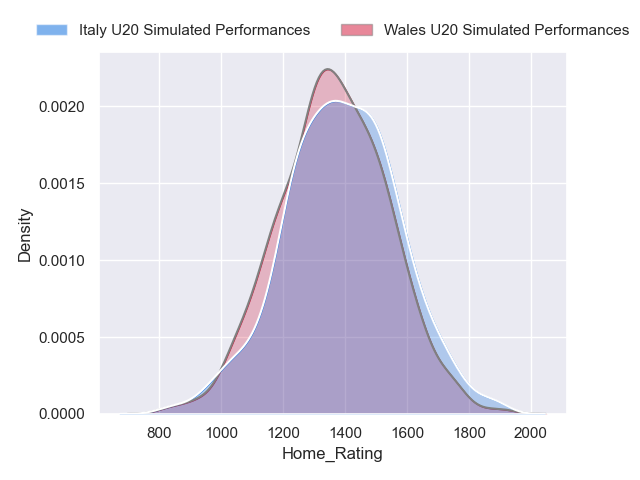
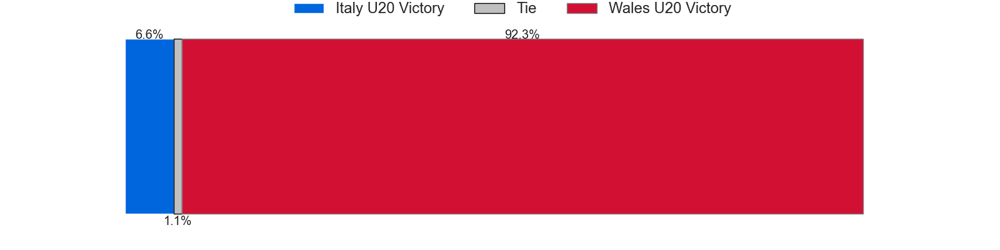
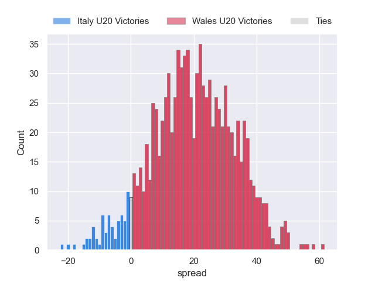

### France U20 V England U20 on 2024/03/15

Average Margin: France U20 by 11.7

Average Scoreline: 28-17

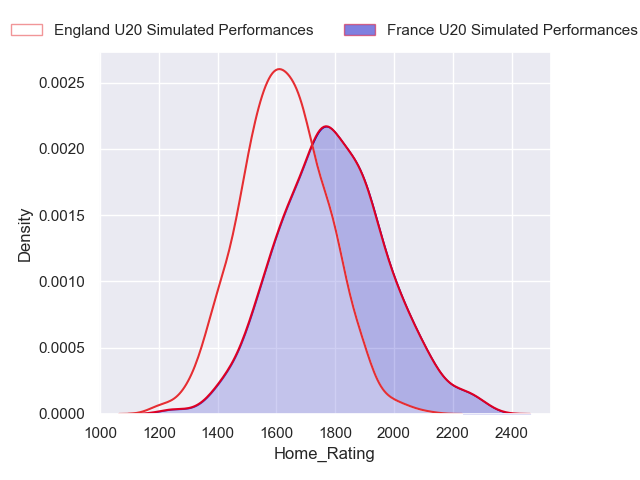
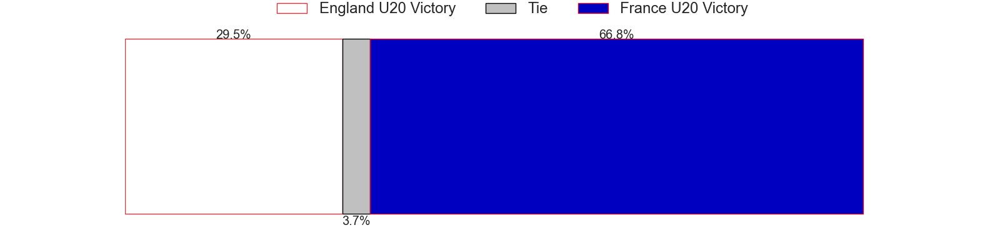
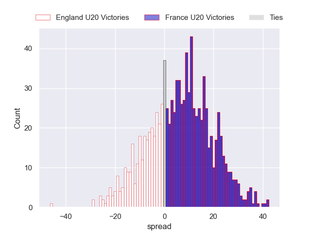

