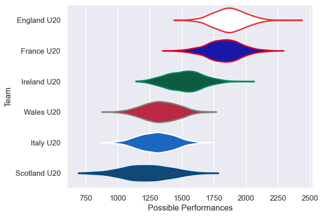
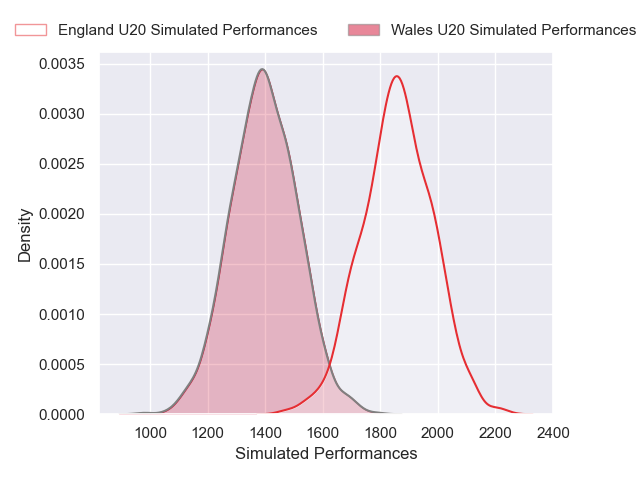
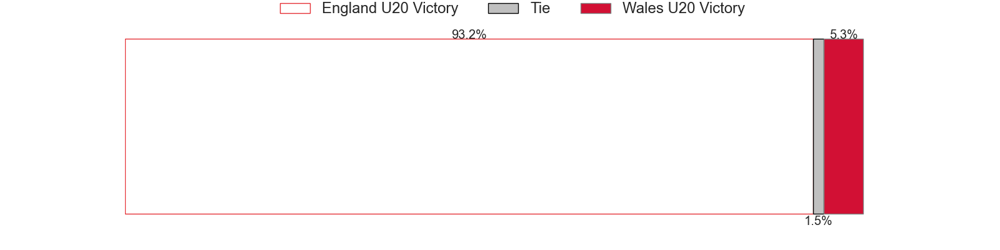
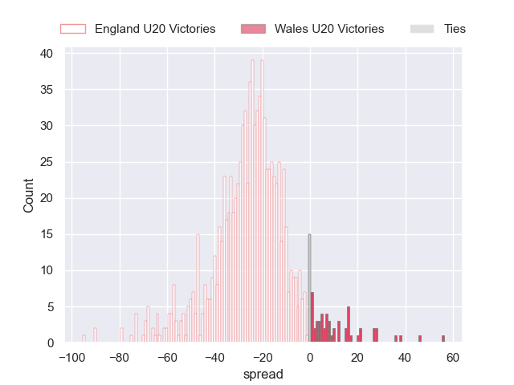
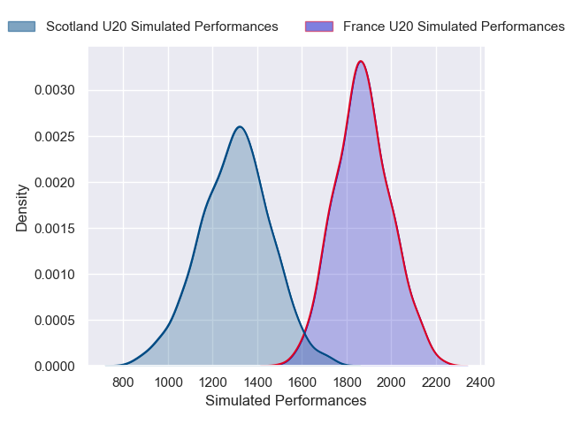
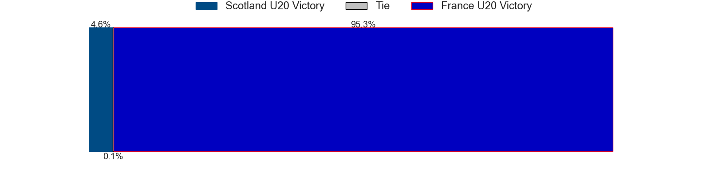
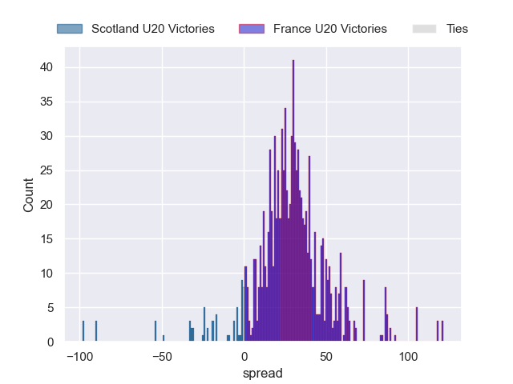
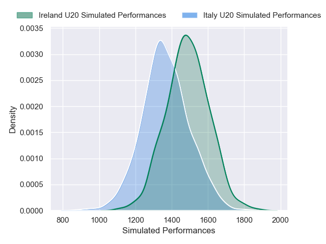
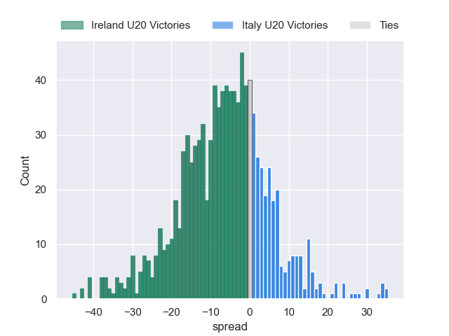

---  
title: "Guinness U20 Six Nations 2025 Status"  
date: 2025-03-14 6:00:00 -0500  
categories: model review projection  
layout: article  
aside:  
    toc: true  
---
# Current Team Rankings

# Standings

## Current Standings

| Club         |   Played |   Wins |   Point Differential |   Losing Bonus Points |   Try Bonus Points |   Competition Points |
|:-------------|---------:|-------:|---------------------:|----------------------:|-------------------:|---------------------:|
| Scotland U20 |        1 |      1 |                   15 |                     0 |                nan |                    4 |
| France U20   |        1 |      1 |                   10 |                     0 |                nan |                    4 |
| England U20  |        1 |      1 |                    9 |                     0 |                nan |                    4 |
| Italy U20    |        1 |      0 |                   -9 |                     0 |                nan |                    0 |
| Ireland U20  |        1 |      0 |                  -10 |                     0 |                nan |                    0 |
| Wales U20    |        1 |      0 |                  -15 |                     0 |                nan |                    0 |

## Projected Remaining Table

| Club         |   Matches Remaining |   Wins |   Point Differential |   Losing Bonus Points |   Try Bonus Points |   Competition Points |
|:-------------|--------------------:|-------:|---------------------:|----------------------:|-------------------:|---------------------:|
| England U20  |                   1 |    0.9 |             23.9058  |                   0   |                1   |                  4.7 |
| France U20   |                   1 |    0.9 |             27.2268  |                   0   |                0.8 |                  4.6 |
| Ireland U20  |                   1 |    0.8 |              6.98888 |                   0.2 |                0.6 |                  3.8 |
| Italy U20    |                   1 |    0.2 |             -6.98888 |                   0.3 |                0.1 |                  1.4 |
| Wales U20    |                   1 |    0.1 |            -23.9058  |                   0.1 |                0.1 |                  0.5 |
| Scotland U20 |                   1 |    0.1 |            -27.2268  |                   0   |                0.1 |                  0.4 |

## Projected Total Table

| Club         |   Total Matches |   Wins |   Point Differential |   Losing Bonus Points |   Try Bonus Points |   Competition Points |
|:-------------|----------------:|-------:|---------------------:|----------------------:|-------------------:|---------------------:|
| England U20  |               2 |    1.9 |             32.9058  |                   0   |                1   |                  8.7 |
| France U20   |               2 |    1.9 |             37.2268  |                   0   |                0.8 |                  8.6 |
| Scotland U20 |               2 |    1.1 |            -12.2268  |                   0   |                0.1 |                  4.4 |
| Ireland U20  |               2 |    0.8 |             -3.01112 |                   0.2 |                0.6 |                  3.8 |
| Italy U20    |               2 |    0.2 |            -15.9889  |                   0.3 |                0.1 |                  1.4 |
| Wales U20    |               2 |    0.1 |            -38.9058  |                   0.1 |                0.1 |                  0.5 |

# Completed Match Review

| Model | Percent Correct Predictions | Spread Error |
| ------ | ------ | ------ |
| Club Level | 66.7% | 17.0 |
| Player Level: Lineup | nan% | nan |
| Player Level: Minutes | nan% | nan |

# Future Predictions

## Week 2

### Wales U20 V England U20 on 2025/03/14

Average Margin: England U20 by 23.9

Average Scoreline: 42-18

### France U20 V Scotland U20 on 2025/03/14

Average Margin: France U20 by 27.2

Average Scoreline: 47-19

### Italy U20 V Ireland U20 on 2025/03/14

Average Margin: Ireland U20 by 7.0

Average Scoreline: 33-26

