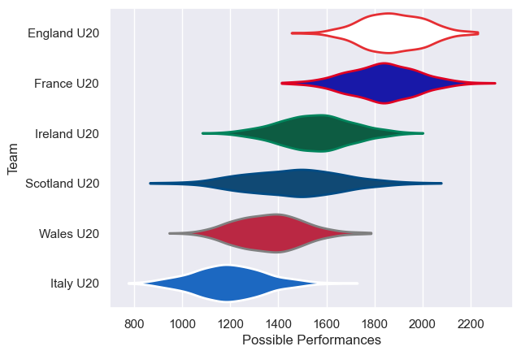

---  
title: "Guinness U20 Six Nations 2025 Status"  
date: 2025-01-27 6:00:00 -0500  
categories: model review projection  
layout: article  
aside:  
    toc: true  
---
# Current Team Rankings

# Standings

## Projected Total Table

| Club         |   Total Matches |   Wins |   Point Differential |   Losing Bonus Points |   Try Bonus Points |   Competition Points |
|:-------------|----------------:|-------:|---------------------:|----------------------:|-------------------:|---------------------:|
| France U20   |               1 |    1   |              28.4332 |                   0   |                0.8 |                  4.7 |
| Scotland U20 |               1 |    0.9 |              17.7232 |                   0.1 |                0.7 |                  4.3 |
| England U20  |               1 |    0.9 |              14.0926 |                   0.1 |                0.6 |                  4.2 |
| Ireland U20  |               1 |    0.1 |             -14.0926 |                   0.2 |                0.2 |                  0.9 |
| Italy U20    |               1 |    0.1 |             -17.7232 |                   0.1 |                0.1 |                  0.7 |
| Wales U20    |               1 |    0   |             -28.4332 |                   0   |                0.2 |                  0.3 |

# Future Predictions

## Week 1

### Ireland U20 V England U20 on 2025/01/30

Average Margin: England U20 by 14.1

Average Scoreline: 39-25

### Scotland U20 V Italy U20 on 2025/01/31

Average Margin: Scotland U20 by 17.7

Average Scoreline: 34-16

### France U20 V Wales U20 on 2025/02/01

Average Margin: France U20 by 28.4

Average Scoreline: 42-13

