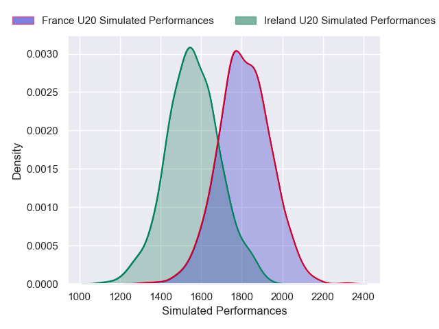
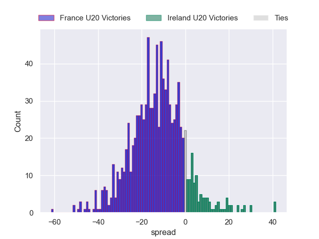
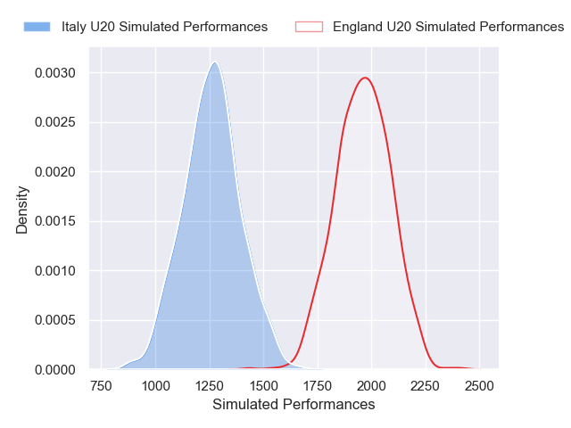
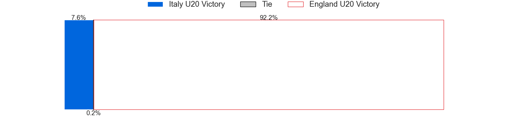
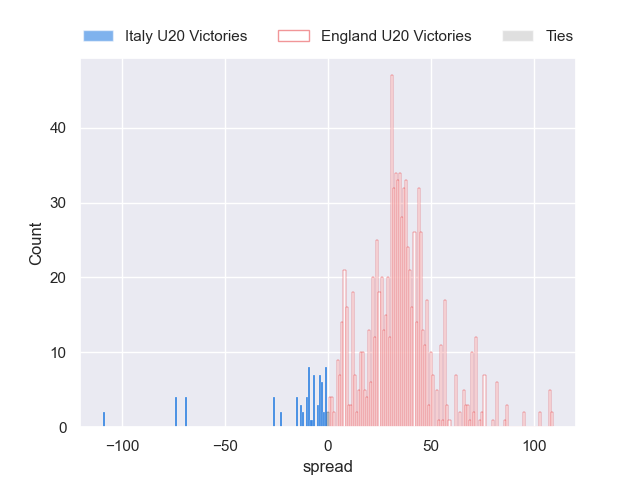
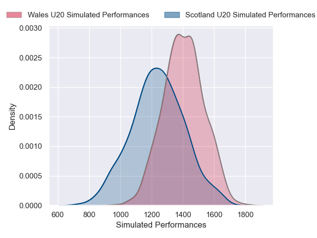
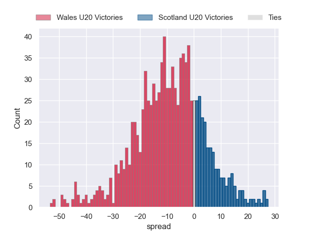

---  
title: "Guinness U20 Six Nations 2025 Status"  
date: 2025-03-07 6:00:00 -0500  
categories: model review projection  
layout: article  
aside:  
    toc: true  
---
# Current Team Rankings

# Standings

## Projected Total Table

| Club         |   Total Matches |   Wins |   Point Differential |   Losing Bonus Points |   Try Bonus Points |   Competition Points |
|:-------------|----------------:|-------:|---------------------:|----------------------:|-------------------:|---------------------:|
| England U20  |               1 |    0.9 |             32.6538  |                   0   |                0.8 |                  4.5 |
| France U20   |               1 |    0.9 |             12.8795  |                   0.1 |                0.6 |                  4.2 |
| Wales U20    |               1 |    0.8 |              9.45802 |                   0.1 |                0.6 |                  3.8 |
| Scotland U20 |               1 |    0.2 |             -9.45802 |                   0.2 |                0.4 |                  1.5 |
| Ireland U20  |               1 |    0.1 |            -12.8795  |                   0.2 |                0.2 |                  0.8 |
| Italy U20    |               1 |    0.1 |            -32.6538  |                   0   |                0.1 |                  0.5 |

# Future Predictions

## Week 1

### Ireland U20 V France U20 on 2025/03/07

Average Margin: France U20 by 12.9

Average Scoreline: 43-30

### England U20 V Italy U20 on 2025/03/07

Average Margin: England U20 by 32.7

Average Scoreline: 44-11

### Scotland U20 V Wales U20 on 2025/03/07

Average Margin: Wales U20 by 9.5

Average Scoreline: 36-26

