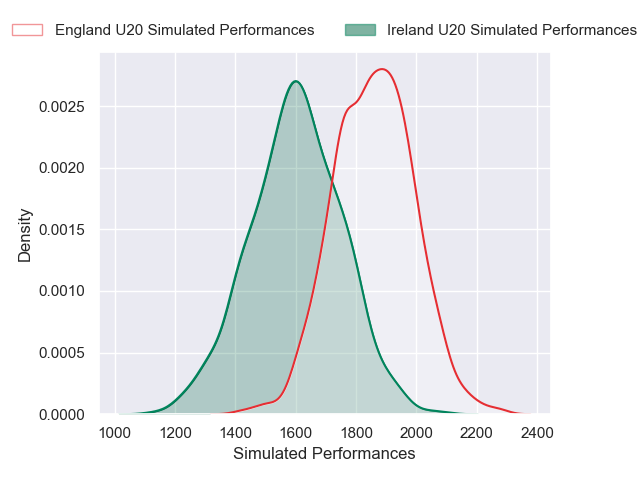
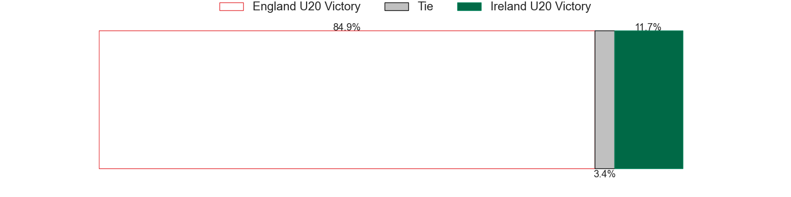
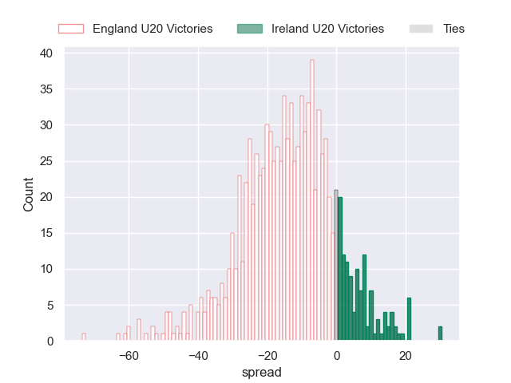

---  
title: "Guinness U20 Six Nations 2025 Status"  
date: 2025-01-30 6:00:00 -0500  
categories: model review projection  
layout: article  
aside:  
    toc: true  
---
# Current Team Rankings

# Standings

## Projected Total Table

| Club         |   Total Matches |   Wins |   Point Differential |   Losing Bonus Points |   Try Bonus Points |   Competition Points |
|:-------------|----------------:|-------:|---------------------:|----------------------:|-------------------:|---------------------:|
| France U20   |               1 |    1   |              28.7652 |                   0   |                0.7 |                  4.5 |
| Scotland U20 |               1 |    0.9 |              18.5652 |                   0   |                0.5 |                  4.2 |
| England U20  |               1 |    0.9 |              13.4131 |                   0.1 |                0.7 |                  4.2 |
| Ireland U20  |               1 |    0.1 |             -13.4131 |                   0.2 |                0.1 |                  0.8 |
| Italy U20    |               1 |    0.1 |             -18.5652 |                   0.1 |                0.2 |                  0.7 |
| Wales U20    |               1 |    0   |             -28.7652 |                   0.1 |                0.2 |                  0.4 |

# Future Predictions

## Week 1

### Ireland U20 V England U20 on 2025/01/30

Average Margin: England U20 by 13.4

Average Scoreline: 30-16

### Scotland U20 V Italy U20 on 2025/01/31

Average Margin: Scotland U20 by 18.6

Average Scoreline: 37-19

### France U20 V Wales U20 on 2025/02/01

Average Margin: France U20 by 28.8

Average Scoreline: 41-13

