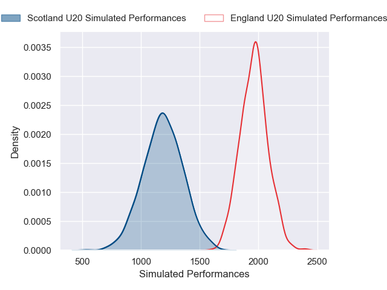
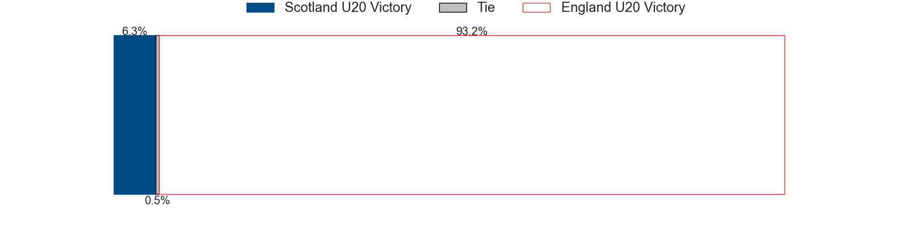
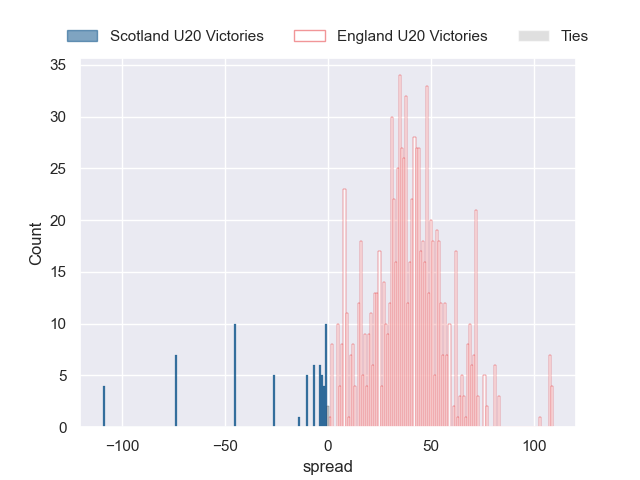
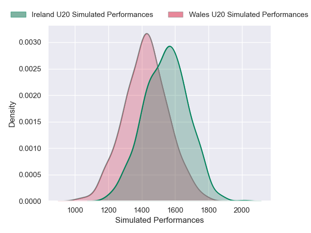
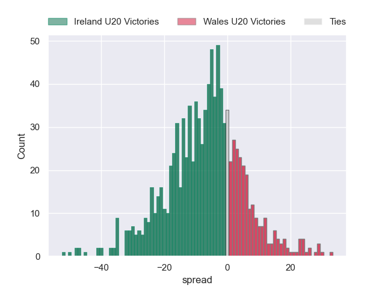
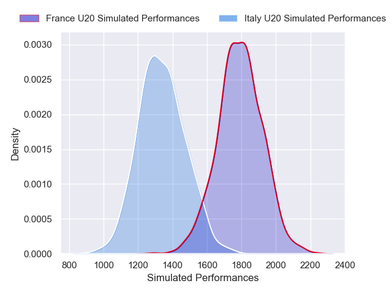
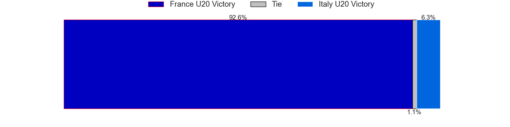
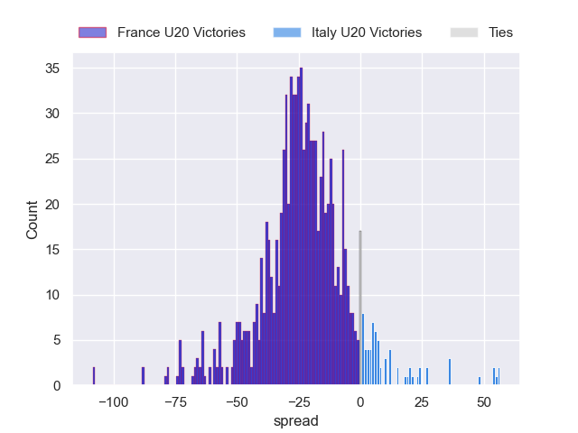

---  
title: "Guinness U20 Six Nations 2025 Status"  
date: 2025-02-20 6:00:00 -0500  
categories: model review projection  
layout: article  
aside:  
    toc: true  
---
# Current Team Rankings

# Standings

## Projected Total Table

| Club         |   Total Matches |   Wins |   Point Differential |   Losing Bonus Points |   Try Bonus Points |   Competition Points |
|:-------------|----------------:|-------:|---------------------:|----------------------:|-------------------:|---------------------:|
| England U20  |               1 |    0.9 |             35.1094  |                   0   |                0.9 |                  4.6 |
| France U20   |               1 |    0.9 |             23.6793  |                   0   |                0.8 |                  4.6 |
| Ireland U20  |               1 |    0.7 |              6.45234 |                   0.2 |                0.6 |                  3.7 |
| Wales U20    |               1 |    0.3 |             -6.45234 |                   0.3 |                0.3 |                  1.7 |
| Scotland U20 |               1 |    0.1 |            -35.1094  |                   0   |                0.2 |                  0.5 |
| Italy U20    |               1 |    0.1 |            -23.6793  |                   0.1 |                0.2 |                  0.4 |

# Future Predictions

## Week 1

### England U20 V Scotland U20 on 2025/02/21

Average Margin: England U20 by 35.1

Average Scoreline: 63-28

### Wales U20 V Ireland U20 on 2025/02/21

Average Margin: Ireland U20 by 6.5

Average Scoreline: 37-30

### Italy U20 V France U20 on 2025/02/22

Average Margin: France U20 by 23.7

Average Scoreline: 57-34

