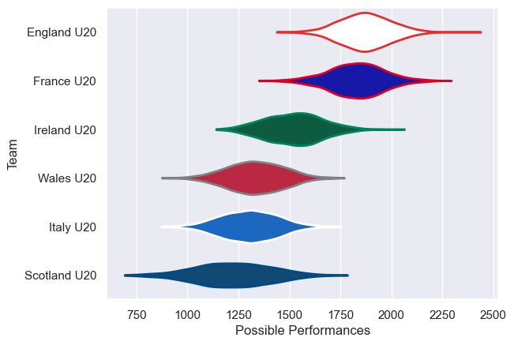
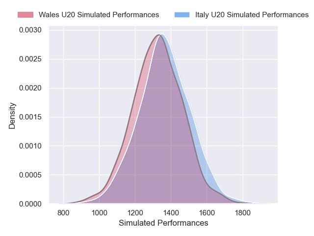
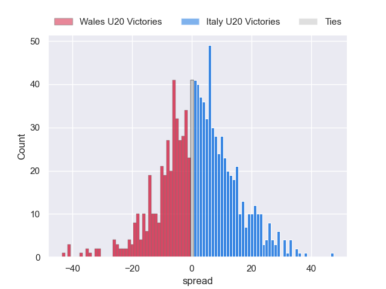
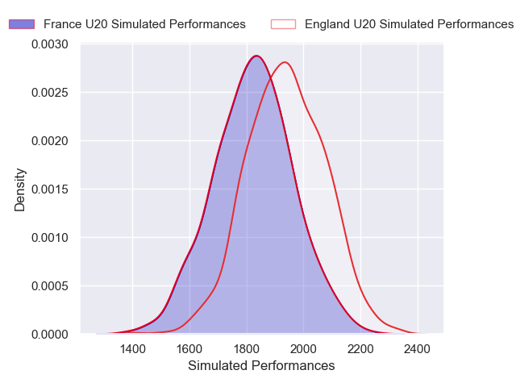
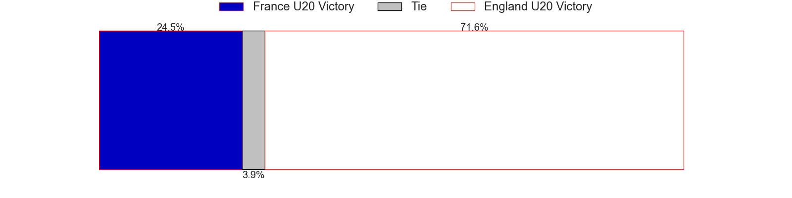
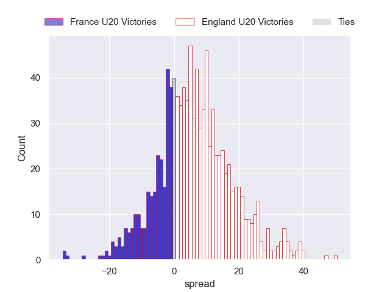
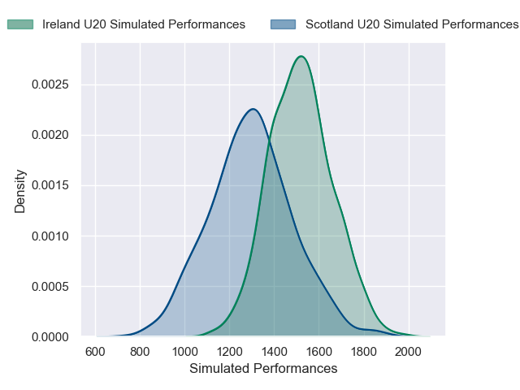
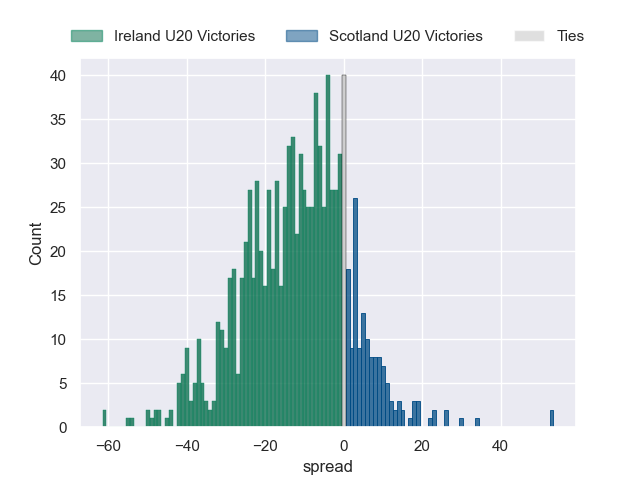

---  
title: "Guinness U20 Six Nations 2025 Status"  
date: 2025-02-03 6:00:00 -0500  
categories: model review projection  
layout: article  
aside:  
    toc: true  
---
# Current Team Rankings

# Standings

## Projected Total Table

| Club         |   Total Matches |   Wins |   Point Differential |   Losing Bonus Points |   Try Bonus Points |   Competition Points |
|:-------------|----------------:|-------:|---------------------:|----------------------:|-------------------:|---------------------:|
| Ireland U20  |               1 |    0.8 |             12.5554  |                   0.1 |                0.6 |                  4   |
| England U20  |               1 |    0.7 |              6.75357 |                   0.2 |                0.5 |                  3.6 |
| Italy U20    |               1 |    0.6 |              1.56282 |                   0.2 |                0.4 |                  2.8 |
| Wales U20    |               1 |    0.4 |             -1.56282 |                   0.3 |                0.4 |                  2.4 |
| France U20   |               1 |    0.3 |             -6.75357 |                   0.3 |                0.2 |                  1.5 |
| Scotland U20 |               1 |    0.2 |            -12.5554  |                   0.2 |                0.2 |                  1.1 |

# Future Predictions

## Week 1

### Italy U20 V Wales U20 on 2025/02/07

Average Margin: Italy U20 by 1.6

Average Scoreline: 30-28

### England U20 V France U20 on 2025/02/07

Average Margin: England U20 by 6.8

Average Scoreline: 28-21

### Scotland U20 V Ireland U20 on 2025/02/08

Average Margin: Ireland U20 by 12.6

Average Scoreline: 34-22

