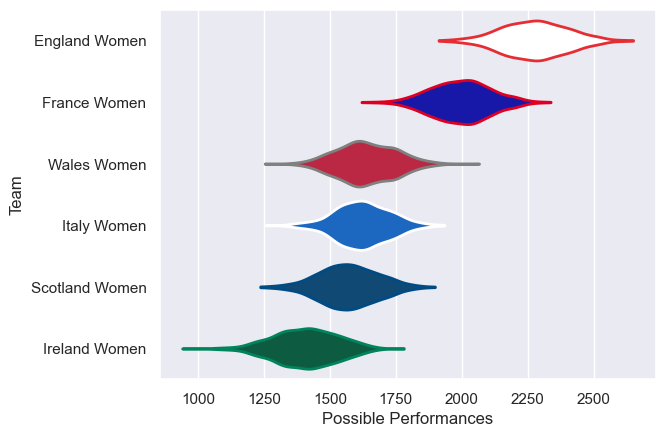
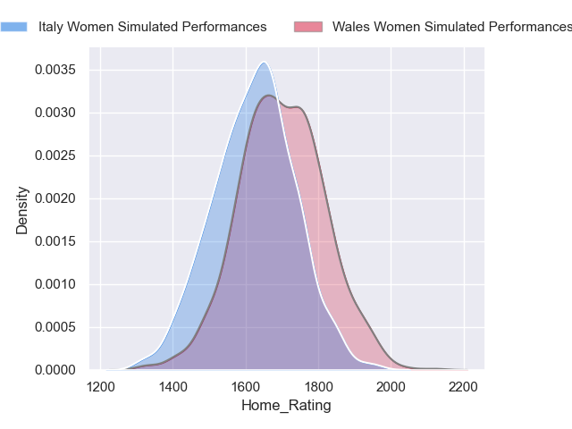
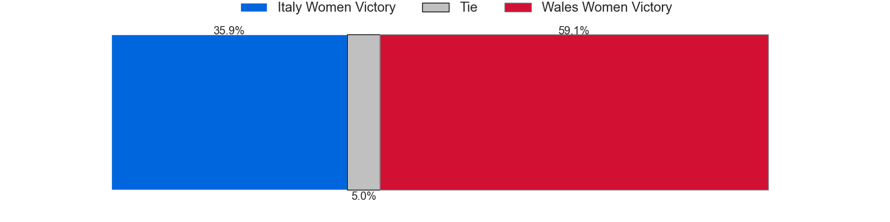
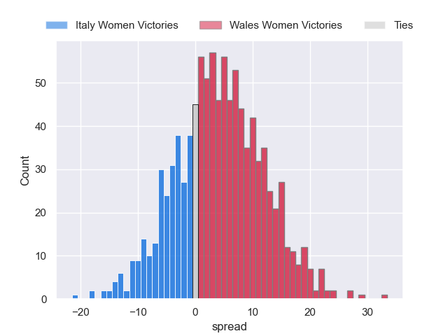
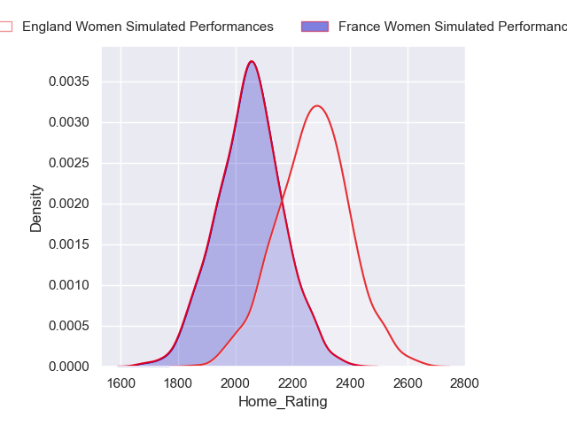
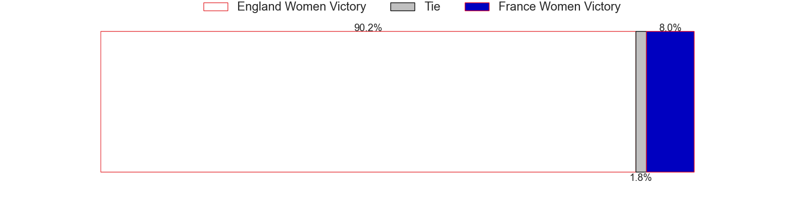
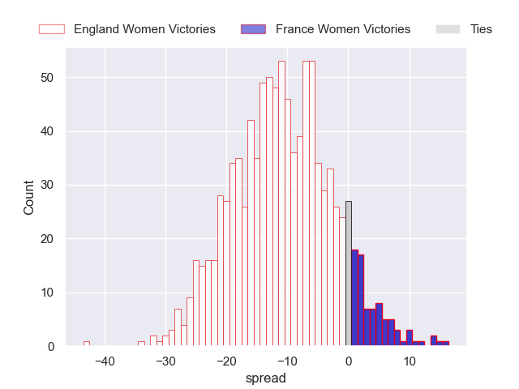
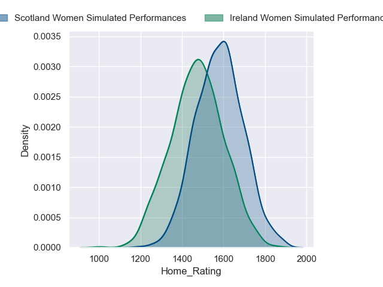
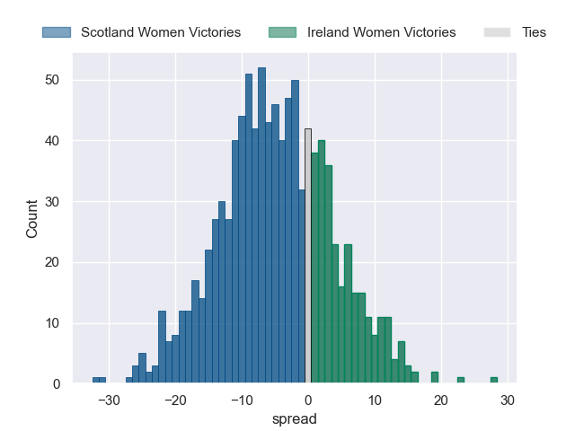

---  
title: "Guinness Women's Six Nations 2024 Status"  
date: 2024-04-22 6:00:00 -0500  
categories: model review projection  
layout: article  
aside:  
    toc: true  
---
# Current Team Rankings

# Standings

## Current Standings

| Club           |   Played |   Wins |   Point Differential |   Losing Bonus Points |   Try Bonus Points |   Competition Points |
|:---------------|---------:|-------:|---------------------:|----------------------:|-------------------:|---------------------:|
| England Women  |        4 |      4 |                  240 |                     0 |                nan |                   16 |
| France Women   |        4 |      4 |                   94 |                     0 |                nan |                   16 |
| Scotland Women |        4 |      3 |                    6 |                     0 |                nan |                   12 |
| Italy Women    |        5 |      1 |                  -79 |                     2 |                nan |                    6 |
| Wales Women    |        3 |      0 |                  -78 |                     1 |                nan |                    1 |
| Ireland Women  |        4 |      0 |                 -183 |                     1 |                nan |                    1 |

## Projected Remaining Table

| Club           |   Matches Remaining |   Wins |   Point Differential |   Losing Bonus Points |   Try Bonus Points |   Competition Points |
|:---------------|--------------------:|-------:|---------------------:|----------------------:|-------------------:|---------------------:|
| Scotland Women |                   1 |    0.9 |             10.5043  |                   0.1 |                0.6 |                  4.3 |
| England Women  |                   1 |    0.9 |             11.2502  |                   0.1 |                0.4 |                  4.1 |
| Wales Women    |                   1 |    0.7 |              4.51232 |                   0.2 |                0.3 |                  3.4 |
| Italy Women    |                   1 |    0.3 |             -4.51232 |                   0.3 |                0.3 |                  1.7 |
| Ireland Women  |                   1 |    0.1 |            -10.5043  |                   0.2 |                0.2 |                  0.8 |
| France Women   |                   1 |    0.1 |            -11.2502  |                   0.2 |                0.2 |                  0.7 |

## Projected Total Table

| Club           |   Total Matches |   Wins |   Point Differential |   Losing Bonus Points |   Try Bonus Points |   Competition Points |
|:---------------|----------------:|-------:|---------------------:|----------------------:|-------------------:|---------------------:|
| England Women  |               5 |    4.9 |             251.25   |                   0.1 |                0.4 |                 20.1 |
| France Women   |               5 |    4.1 |              82.7498 |                   0.2 |                0.2 |                 16.7 |
| Scotland Women |               5 |    3.9 |              16.5043 |                   0.1 |                0.6 |                 16.3 |
| Italy Women    |               6 |    1.3 |             -83.5123 |                   2.3 |                0.3 |                  7.7 |
| Wales Women    |               4 |    0.7 |             -73.4877 |                   1.2 |                0.3 |                  4.4 |
| Ireland Women  |               5 |    0.1 |            -193.504  |                   1.2 |                0.2 |                  1.8 |

# Completed Match Review

| Model | Percent Correct Predictions | Spread Error |
| ------ | ------ | ------ |
| Club Level | 80.0% | 11.8 |
| Player Level: Lineup | nan% | nan |
| Player Level: Minutes | nan% | nan |

# Future Predictions

## Week 6

### Wales Women V Italy Women on 2024/04/27

Average Margin: Wales Women by 4.5

Average Scoreline: 29-24

### France Women V England Women on 2024/04/27

Average Margin: England Women by 11.3

Average Scoreline: 37-26

### Ireland Women V Scotland Women on 2024/04/27

Average Margin: Scotland Women by 10.5

Average Scoreline: 32-21

