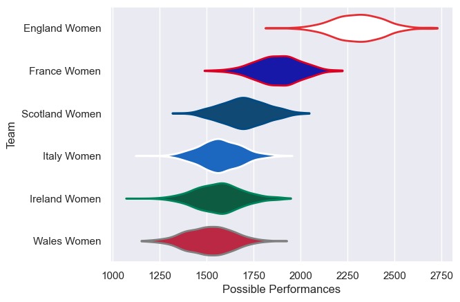
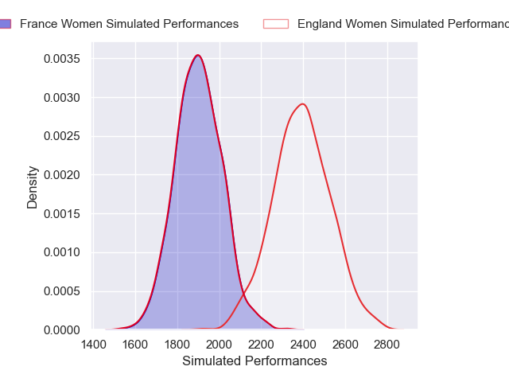
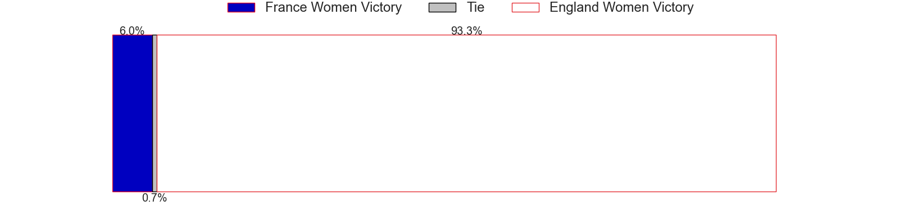
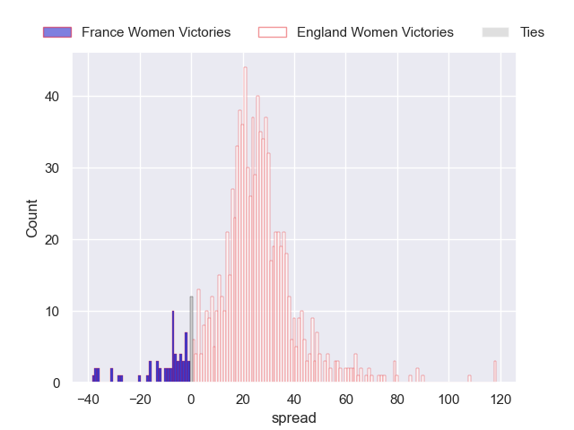
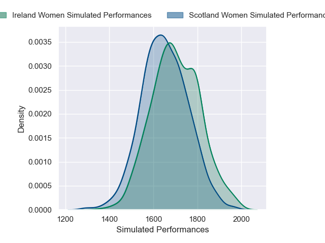
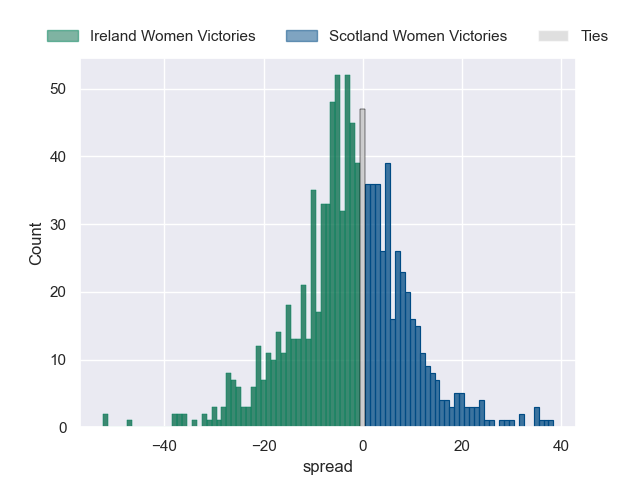
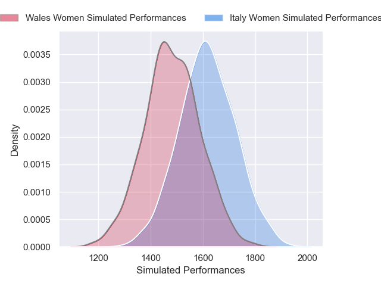
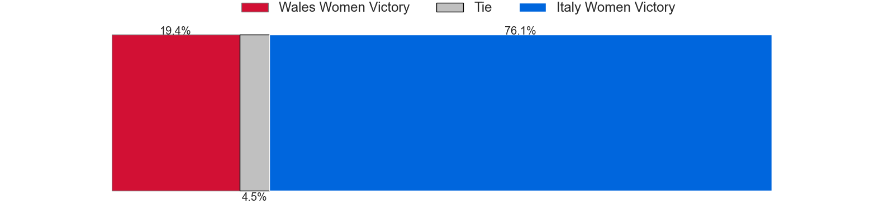
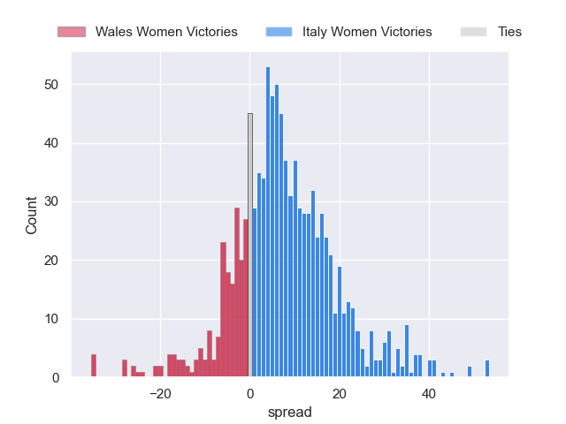

---  
title: "Guinness Women's Six Nations 2025 Status"  
date: 2025-04-25 6:00:00 -0500  
categories: model review projection  
layout: article  
aside:  
    toc: true  
---
# Current Team Rankings

# Standings

## Current Standings

| Club           |   Played |   Wins |   Point Differential |   Losing Bonus Points |   Try Bonus Points |   Competition Points |
|:---------------|---------:|-------:|---------------------:|----------------------:|-------------------:|---------------------:|
| England Women  |        4 |      4 |                  184 |                     0 |                nan |                   16 |
| France Women   |        4 |      4 |                   78 |                     0 |                nan |                   16 |
| Ireland Women  |        4 |      2 |                   12 |                     0 |                nan |                    8 |
| Italy Women    |        4 |      1 |                  -80 |                     0 |                nan |                    4 |
| Scotland Women |        4 |      1 |                  -80 |                     0 |                nan |                    4 |
| Wales Women    |        4 |      0 |                 -114 |                     1 |                nan |                    1 |

## Projected Remaining Table

| Club           |   Matches Remaining |   Wins |   Point Differential |   Losing Bonus Points |   Try Bonus Points |   Competition Points |
|:---------------|--------------------:|-------:|---------------------:|----------------------:|-------------------:|---------------------:|
| England Women  |                   1 |    0.9 |             24.4002  |                   0   |                0.4 |                  4.1 |
| Italy Women    |                   1 |    0.8 |              8.19439 |                   0.1 |                0.4 |                  3.6 |
| Ireland Women  |                   1 |    0.6 |              2.66249 |                   0.2 |                0.4 |                  3.1 |
| Scotland Women |                   1 |    0.4 |             -2.66249 |                   0.3 |                0.2 |                  2   |
| Wales Women    |                   1 |    0.2 |             -8.19439 |                   0.3 |                0.2 |                  1.4 |
| France Women   |                   1 |    0.1 |            -24.4002  |                   0.1 |                0.3 |                  0.6 |

## Projected Total Table

| Club           |   Total Matches |   Wins |   Point Differential |   Losing Bonus Points |   Try Bonus Points |   Competition Points |
|:---------------|----------------:|-------:|---------------------:|----------------------:|-------------------:|---------------------:|
| England Women  |               5 |    4.9 |             208.4    |                   0   |                0.4 |                 20.1 |
| France Women   |               5 |    4.1 |              53.5998 |                   0.1 |                0.3 |                 16.6 |
| Ireland Women  |               5 |    2.6 |              14.6625 |                   0.2 |                0.4 |                 11.1 |
| Italy Women    |               5 |    1.8 |             -71.8056 |                   0.1 |                0.4 |                  7.6 |
| Scotland Women |               5 |    1.4 |             -82.6625 |                   0.3 |                0.2 |                  6   |
| Wales Women    |               5 |    0.2 |            -122.194  |                   1.3 |                0.2 |                  2.4 |

# Completed Match Review

| Model | Percent Correct Predictions | Spread Error |
| ------ | ------ | ------ |
| Club Level | 83.3% | 15.2 |
| Player Level: Lineup | nan% | nan |
| Player Level: Minutes | nan% | nan |

# Future Predictions

## Week 5

### England Women V France Women on 2025/04/26

Average Margin: England Women by 24.4

Average Scoreline: 42-17

### Scotland Women V Ireland Women on 2025/04/26

Average Margin: Ireland Women by 2.7

Average Scoreline: 29-26

### Italy Women V Wales Women on 2025/04/26

Average Margin: Italy Women by 8.2

Average Scoreline: 31-23

