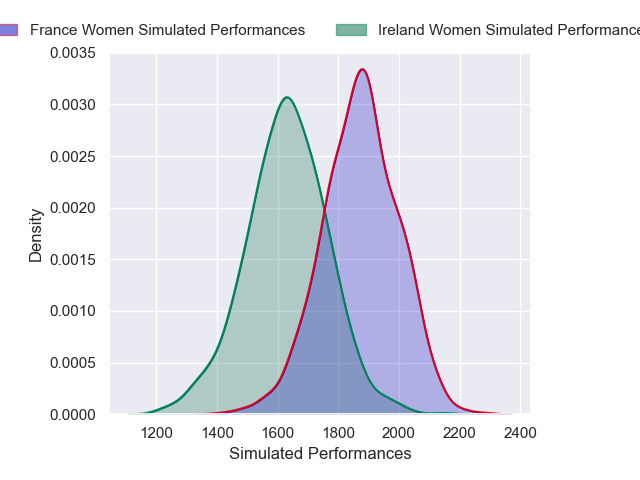
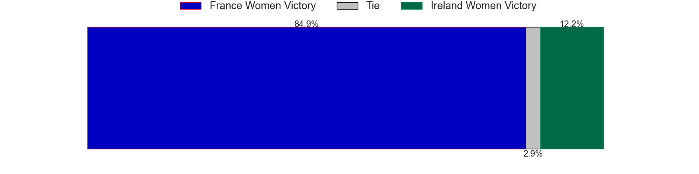
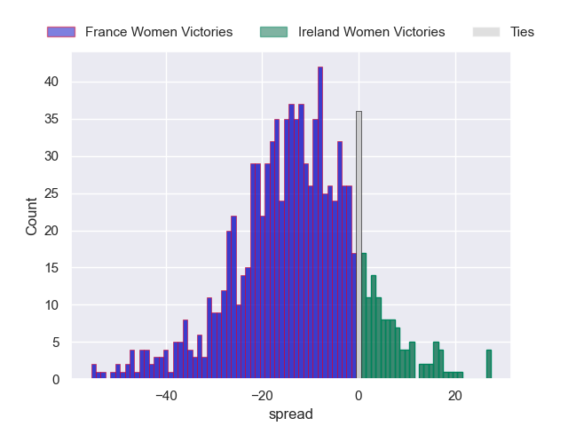
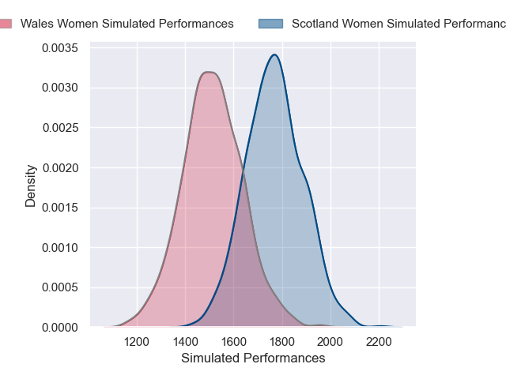
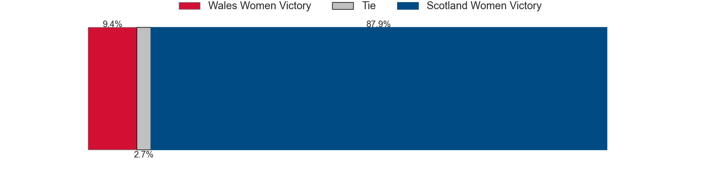
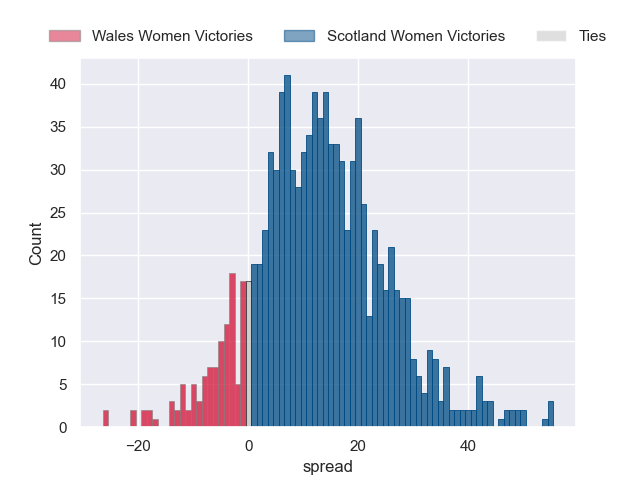
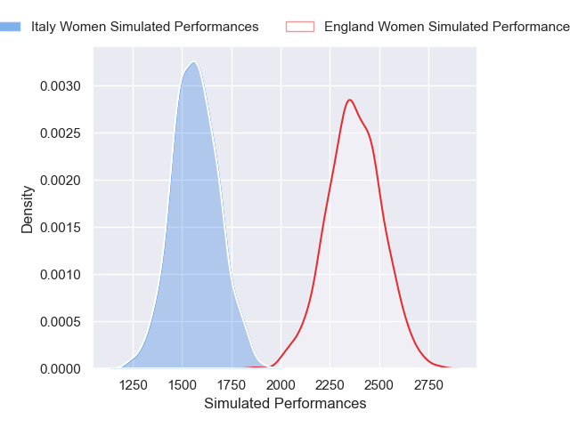
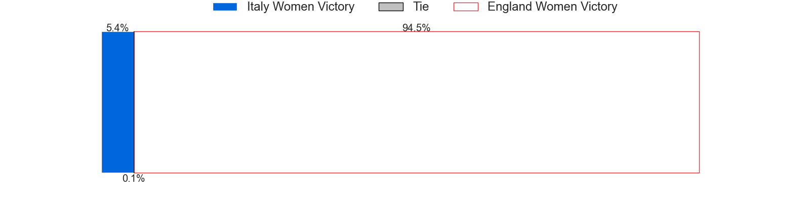
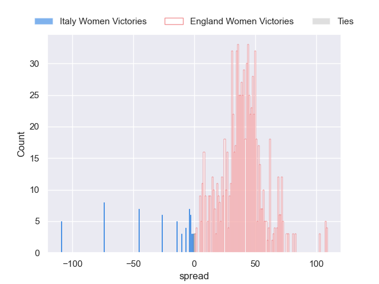

---  
title: "Guinness Women's Six Nations 2025 Status"  
date: 2025-03-17 6:00:00 -0500  
categories: model review projection  
layout: article  
aside:  
    toc: true  
---
# Current Team Rankings

# Standings

## Projected Total Table

| Club           |   Total Matches |   Wins |   Point Differential |   Losing Bonus Points |   Try Bonus Points |   Competition Points |
|:---------------|----------------:|-------:|---------------------:|----------------------:|-------------------:|---------------------:|
| England Women  |               1 |    0.9 |              36.9504 |                   0   |                0.8 |                  4.6 |
| Scotland Women |               1 |    0.9 |              13.4502 |                   0.1 |                0.4 |                  4   |
| France Women   |               1 |    0.9 |              12.898  |                   0.1 |                0.5 |                  4   |
| Ireland Women  |               1 |    0.1 |             -12.898  |                   0.2 |                0.1 |                  0.9 |
| Wales Women    |               1 |    0.1 |             -13.4502 |                   0.2 |                0.1 |                  0.8 |
| Italy Women    |               1 |    0.1 |             -36.9504 |                   0   |                0.3 |                  0.5 |

# Future Predictions

## Week 1

### Ireland Women V France Women on 2025/03/22

Average Margin: France Women by 12.9

Average Scoreline: 36-23

### Scotland Women V Wales Women on 2025/03/22

Average Margin: Scotland Women by 13.5

Average Scoreline: 31-17

### England Women V Italy Women on 2025/03/23

Average Margin: England Women by 37.0

Average Scoreline: 60-23

