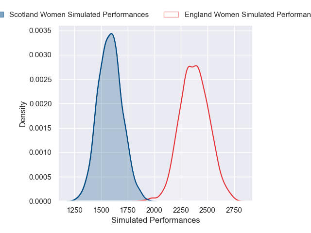
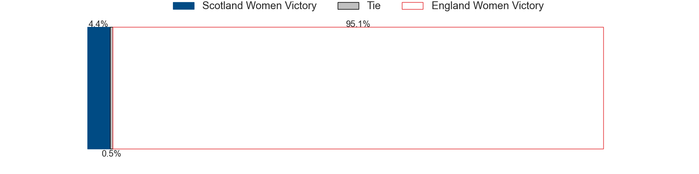
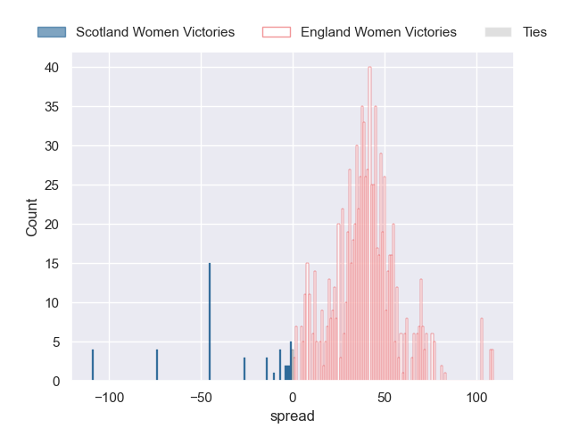
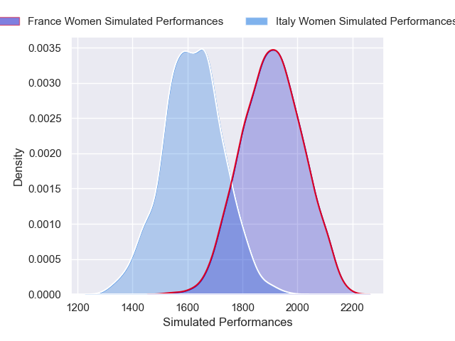
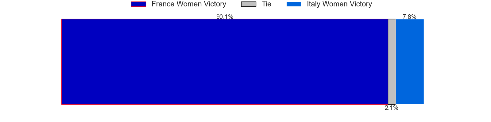
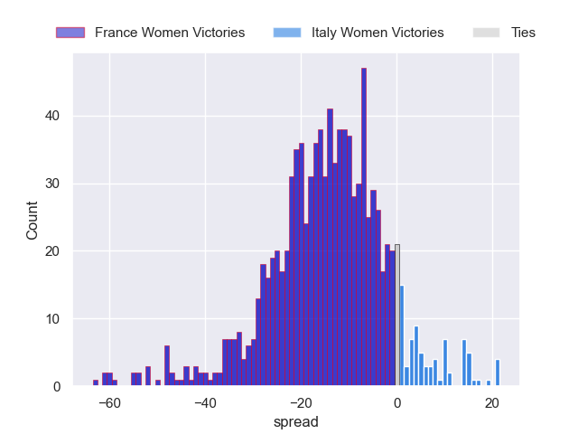
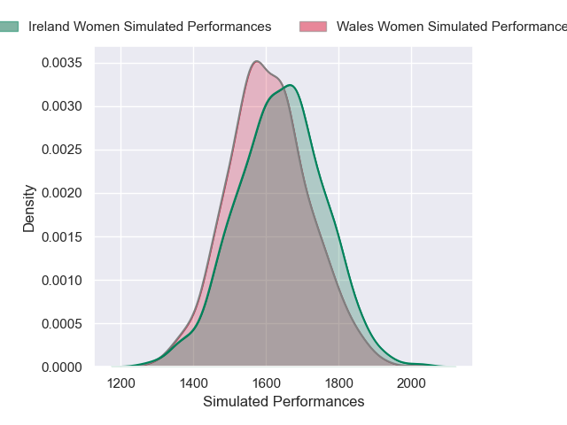
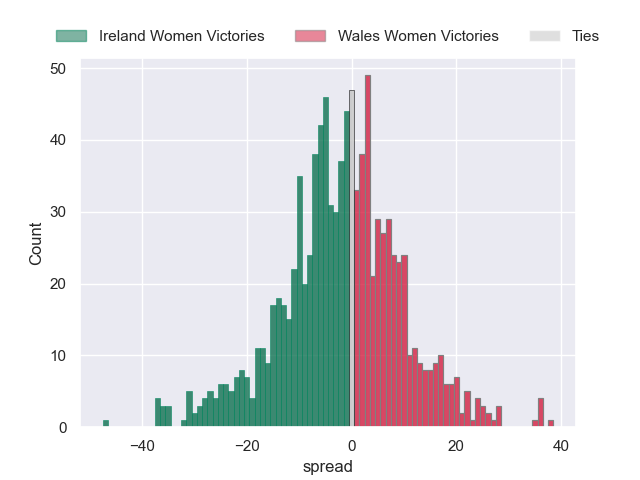

---  
title: "Guinness Women's Six Nations 2025 Status"  
date: 2025-04-18 6:00:00 -0500  
categories: model review projection  
layout: article  
aside:  
    toc: true  
---
# Current Team Rankings

# Standings

## Current Standings

| Club           |   Played |   Wins |   Point Differential |   Losing Bonus Points |   Try Bonus Points |   Competition Points |
|:---------------|---------:|-------:|---------------------:|----------------------:|-------------------:|---------------------:|
| England Women  |        3 |      3 |                  132 |                     0 |                nan |                   12 |
| France Women   |        3 |      3 |                   65 |                     0 |                nan |                   12 |
| Ireland Women  |        3 |      1 |                  -14 |                     0 |                nan |                    4 |
| Scotland Women |        3 |      1 |                  -28 |                     0 |                nan |                    4 |
| Italy Women    |        3 |      1 |                  -67 |                     0 |                nan |                    4 |
| Wales Women    |        3 |      0 |                  -88 |                     1 |                nan |                    1 |

## Projected Remaining Table

| Club           |   Matches Remaining |   Wins |   Point Differential |   Losing Bonus Points |   Try Bonus Points |   Competition Points |
|:---------------|--------------------:|-------:|---------------------:|----------------------:|-------------------:|---------------------:|
| England Women  |                   1 |    0.9 |              37.0798 |                   0   |                0.8 |                  4.7 |
| France Women   |                   1 |    0.9 |              14.2974 |                   0   |                0.7 |                  4.3 |
| Ireland Women  |                   1 |    0.6 |               1.9705 |                   0.2 |                0.4 |                  3   |
| Wales Women    |                   1 |    0.4 |              -1.9705 |                   0.3 |                0.2 |                  2.1 |
| Italy Women    |                   1 |    0.1 |             -14.2974 |                   0.2 |                0.1 |                  0.6 |
| Scotland Women |                   1 |    0.1 |             -37.0798 |                   0   |                0.3 |                  0.6 |

## Projected Total Table

| Club           |   Total Matches |   Wins |   Point Differential |   Losing Bonus Points |   Try Bonus Points |   Competition Points |
|:---------------|----------------:|-------:|---------------------:|----------------------:|-------------------:|---------------------:|
| England Women  |               4 |    3.9 |             169.08   |                   0   |                0.8 |                 16.7 |
| France Women   |               4 |    3.9 |              79.2974 |                   0   |                0.7 |                 16.3 |
| Ireland Women  |               4 |    1.6 |             -12.0295 |                   0.2 |                0.4 |                  7   |
| Scotland Women |               4 |    1.1 |             -65.0798 |                   0   |                0.3 |                  4.6 |
| Italy Women    |               4 |    1.1 |             -81.2974 |                   0.2 |                0.1 |                  4.6 |
| Wales Women    |               4 |    0.4 |             -89.9705 |                   1.3 |                0.2 |                  3.1 |

# Completed Match Review

| Model | Percent Correct Predictions | Spread Error |
| ------ | ------ | ------ |
| Club Level | 77.8% | 15.6 |
| Player Level: Lineup | nan% | nan |
| Player Level: Minutes | nan% | nan |

# Future Predictions

## Week 4

### England Women V Scotland Women on 2025/04/19

Average Margin: England Women by 37.1

Average Scoreline: 51-14

### Italy Women V France Women on 2025/04/19

Average Margin: France Women by 14.3

Average Scoreline: 34-20

### Wales Women V Ireland Women on 2025/04/20

Average Margin: Ireland Women by 2.0

Average Scoreline: 26-24

