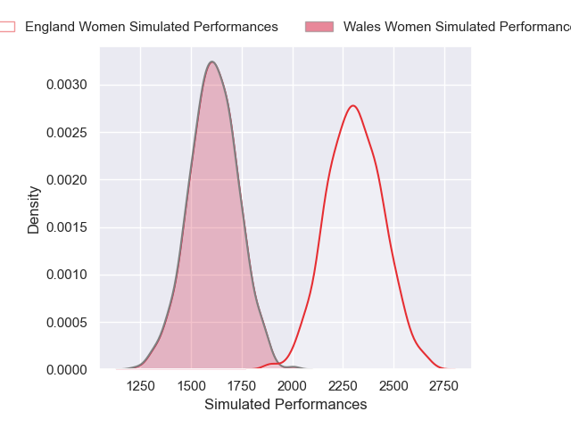
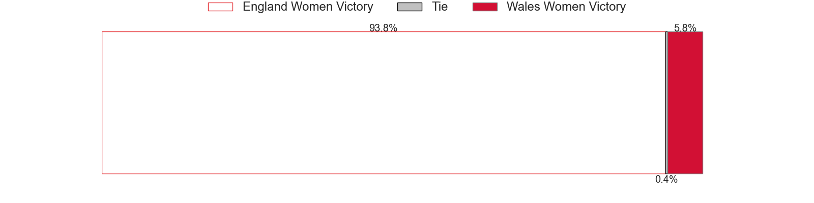
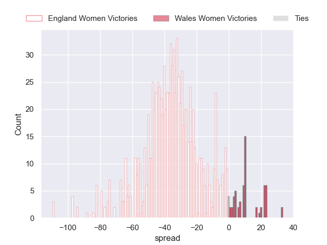
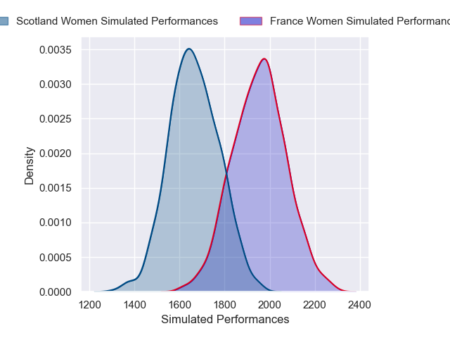
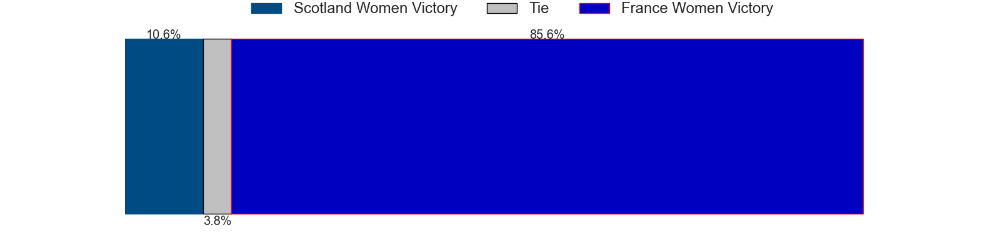
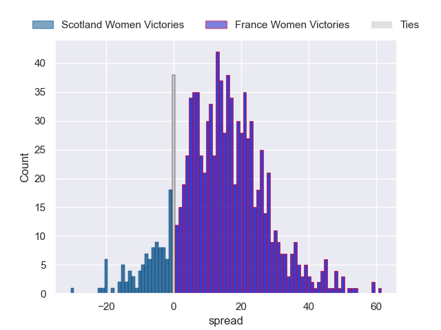

---  
title: "Guinness Women's Six Nations 2025 Status"  
date: 2025-03-28 6:00:00 -0500  
categories: model review projection  
layout: article  
aside:  
    toc: true  
---
# Current Team Rankings

# Standings

## Current Standings

| Club           |   Played |   Wins |   Point Differential |   Losing Bonus Points |   Try Bonus Points |   Competition Points |
|:---------------|---------:|-------:|---------------------:|----------------------:|-------------------:|---------------------:|
| England Women  |        1 |      1 |                   33 |                     0 |                nan |                    4 |
| France Women   |        1 |      1 |                   12 |                     0 |                nan |                    4 |
| Scotland Women |        1 |      1 |                    3 |                     0 |                nan |                    4 |
| Wales Women    |        1 |      0 |                   -3 |                     1 |                nan |                    1 |
| Ireland Women  |        1 |      0 |                  -12 |                     0 |                nan |                    0 |
| Italy Women    |        1 |      0 |                  -33 |                     0 |                nan |                    0 |

## Projected Remaining Table

| Club           |   Matches Remaining |   Wins |   Point Differential |   Losing Bonus Points |   Try Bonus Points |   Competition Points |
|:---------------|--------------------:|-------:|---------------------:|----------------------:|-------------------:|---------------------:|
| England Women  |                   1 |    0.9 |             31.6629  |                   0   |                0.7 |                  4.4 |
| France Women   |                   1 |    0.9 |             14.0724  |                   0.1 |                0.5 |                  4.1 |
| Italy Women    |                   1 |    0.6 |              4.09251 |                   0.2 |                0.3 |                  3.1 |
| Ireland Women  |                   1 |    0.4 |             -4.09251 |                   0.3 |                0.3 |                  2.1 |
| Scotland Women |                   1 |    0.1 |            -14.0724  |                   0.2 |                0.1 |                  0.7 |
| Wales Women    |                   1 |    0.1 |            -31.6629  |                   0   |                0.3 |                  0.6 |

## Projected Total Table

| Club           |   Total Matches |   Wins |   Point Differential |   Losing Bonus Points |   Try Bonus Points |   Competition Points |
|:---------------|----------------:|-------:|---------------------:|----------------------:|-------------------:|---------------------:|
| England Women  |               2 |    1.9 |              64.6629 |                   0   |                0.7 |                  8.4 |
| France Women   |               2 |    1.9 |              26.0724 |                   0.1 |                0.5 |                  8.1 |
| Scotland Women |               2 |    1.1 |             -11.0724 |                   0.2 |                0.1 |                  4.7 |
| Italy Women    |               2 |    0.6 |             -28.9075 |                   0.2 |                0.3 |                  3.1 |
| Ireland Women  |               2 |    0.4 |             -16.0925 |                   0.3 |                0.3 |                  2.1 |
| Wales Women    |               2 |    0.1 |             -34.6629 |                   1   |                0.3 |                  1.6 |

# Completed Match Review

| Model | Percent Correct Predictions | Spread Error |
| ------ | ------ | ------ |
| Club Level | 100.0% | 6.7 |
| Player Level: Lineup | nan% | nan |
| Player Level: Minutes | nan% | nan |

# Future Predictions

## Week 2

### Wales Women V England Women on 2025/03/29

Average Margin: England Women by 31.7

Average Scoreline: 45-13

### France Women V Scotland Women on 2025/03/29

Average Margin: France Women by 14.1

Average Scoreline: 26-12

### Italy Women V Ireland Women on 2025/03/30

Average Margin: Italy Women by 4.1

Average Scoreline: 26-22

