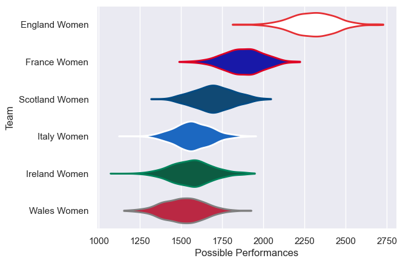
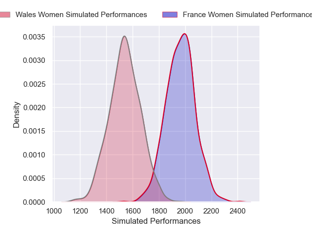
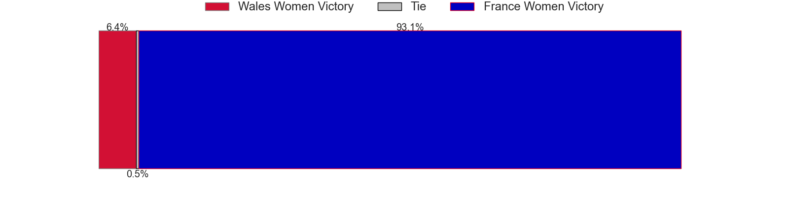
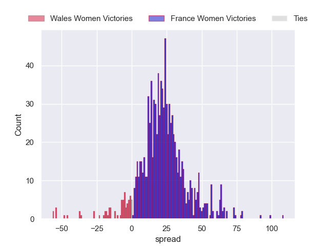
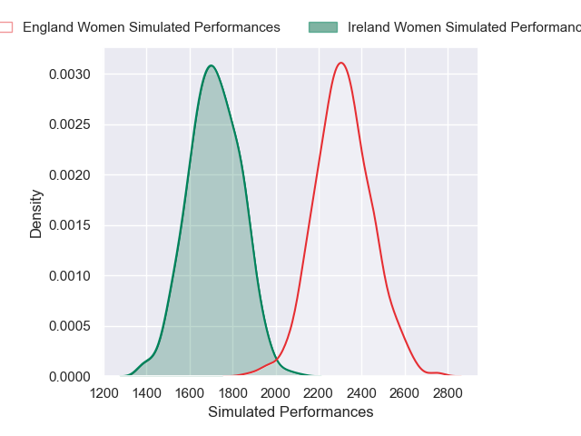
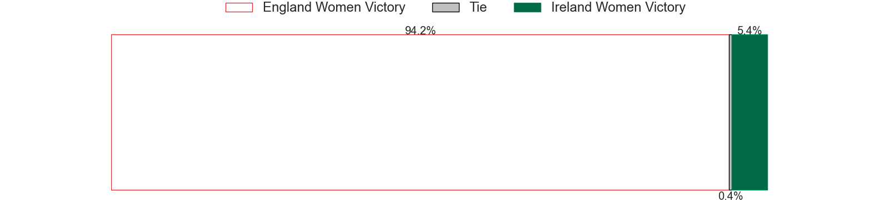
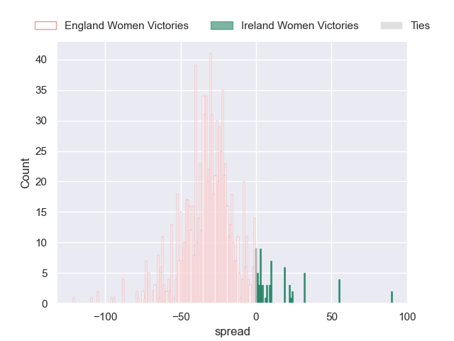
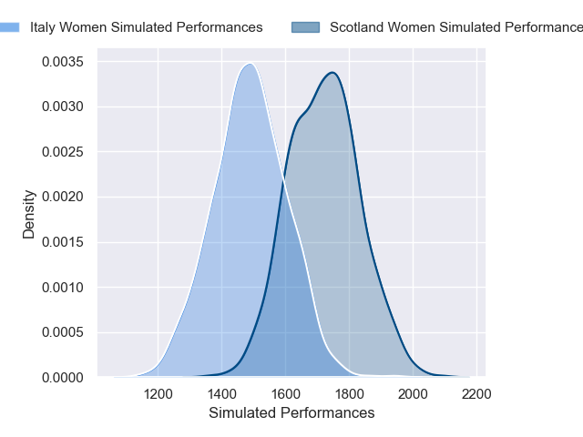
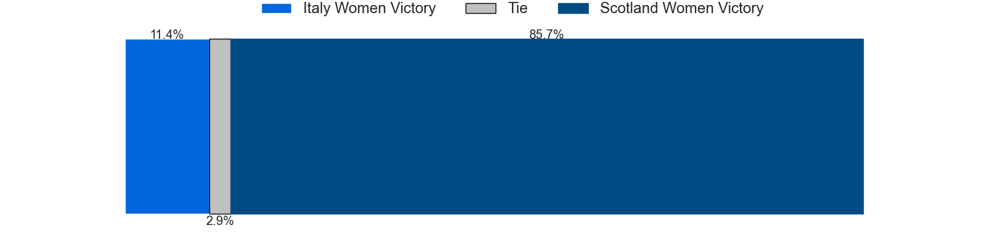
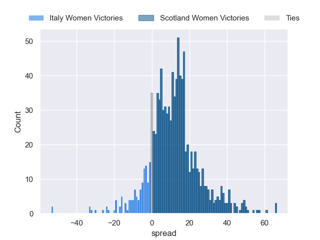

---  
title: "Guinness Women's Six Nations 2025 Status"  
date: 2025-04-07 6:00:00 -0500  
categories: model review projection  
layout: article  
aside:  
    toc: true  
---
# Current Team Rankings

# Standings

## Current Standings

| Club           |   Played |   Wins |   Point Differential |   Losing Bonus Points |   Try Bonus Points |   Competition Points |
|:---------------|---------:|-------:|---------------------:|----------------------:|-------------------:|---------------------:|
| England Women  |        2 |      2 |                   88 |                     0 |                nan |                    8 |
| France Women   |        2 |      2 |                   35 |                     0 |                nan |                    8 |
| Ireland Women  |        2 |      1 |                   30 |                     0 |                nan |                    4 |
| Scotland Women |        2 |      1 |                  -20 |                     0 |                nan |                    4 |
| Wales Women    |        2 |      0 |                  -58 |                     1 |                nan |                    1 |
| Italy Women    |        2 |      0 |                  -75 |                     0 |                nan |                    0 |

## Projected Remaining Table

| Club           |   Matches Remaining |   Wins |   Point Differential |   Losing Bonus Points |   Try Bonus Points |   Competition Points |
|:---------------|--------------------:|-------:|---------------------:|----------------------:|-------------------:|---------------------:|
| England Women  |                   1 |    0.9 |              29.6314 |                   0   |                0.7 |                  4.5 |
| France Women   |                   1 |    0.9 |              22.1147 |                   0   |                0.7 |                  4.4 |
| Scotland Women |                   1 |    0.9 |              11.8508 |                   0.1 |                0.5 |                  4   |
| Italy Women    |                   1 |    0.1 |             -11.8508 |                   0.2 |                0.2 |                  1   |
| Ireland Women  |                   1 |    0.1 |             -29.6314 |                   0.1 |                0.3 |                  0.6 |
| Wales Women    |                   1 |    0.1 |             -22.1147 |                   0.1 |                0.1 |                  0.4 |

## Projected Total Table

| Club           |   Total Matches |   Wins |   Point Differential |   Losing Bonus Points |   Try Bonus Points |   Competition Points |
|:---------------|----------------:|-------:|---------------------:|----------------------:|-------------------:|---------------------:|
| England Women  |               3 |    2.9 |           117.631    |                   0   |                0.7 |                 12.5 |
| France Women   |               3 |    2.9 |            57.1147   |                   0   |                0.7 |                 12.4 |
| Scotland Women |               3 |    1.9 |            -8.14916  |                   0.1 |                0.5 |                  8   |
| Ireland Women  |               3 |    1.1 |             0.368599 |                   0.1 |                0.3 |                  4.6 |
| Wales Women    |               3 |    0.1 |           -80.1147   |                   1.1 |                0.1 |                  1.4 |
| Italy Women    |               3 |    0.1 |           -86.8508   |                   0.2 |                0.2 |                  1   |

# Completed Match Review

| Model | Percent Correct Predictions | Spread Error |
| ------ | ------ | ------ |
| Club Level | 83.3% | 16.1 |
| Player Level: Lineup | nan% | nan |
| Player Level: Minutes | nan% | nan |

# Future Predictions

## Week 3

### France Women V Wales Women on 2025/04/12

Average Margin: France Women by 22.1

Average Scoreline: 38-16

### Ireland Women V England Women on 2025/04/12

Average Margin: England Women by 29.6

Average Scoreline: 40-10

### Scotland Women V Italy Women on 2025/04/13

Average Margin: Scotland Women by 11.9

Average Scoreline: 30-18

