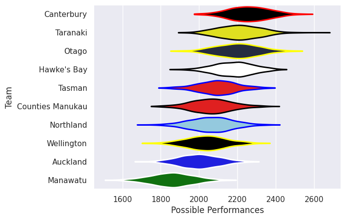
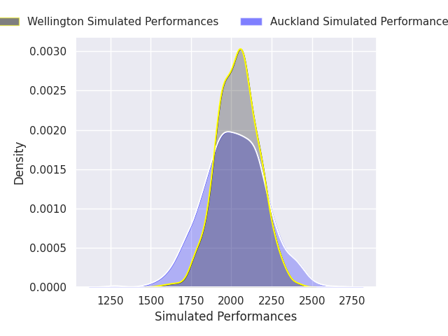
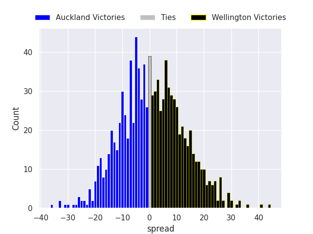
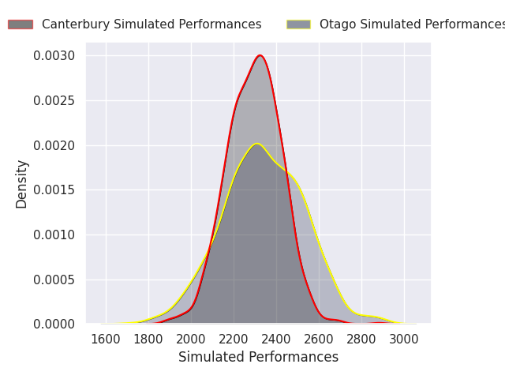
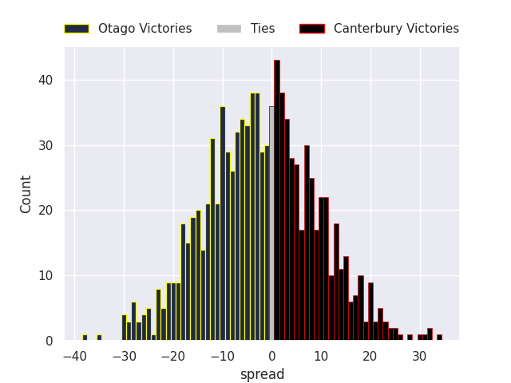

# Team Rankings

# Standings

## Projected Remaining Table

| Club             |   To Play |   Projected Wins |   Projected Differential |   Projected Losing Bonus Points | Projected Try Bonus Points   |   Projected Competition Points |
|:-----------------|----------:|-----------------:|-------------------------:|--------------------------------:|:-----------------------------|-------------------------------:|
| Bay of Plenty    |         2 |            1.553 |                   19.522 |                           0.236 |                              |                          6.542 |
| Hawke's Bay      |         2 |            1.454 |                   16.302 |                           0.289 |                              |                          6.227 |
| Otago            |         2 |            1.459 |                   18.087 |                           0.264 |                              |                          6.176 |
| Canterbury       |         2 |            1.39  |                   18.979 |                           0.251 |                              |                          5.885 |
| Counties Manukau |         2 |            1.256 |                    8.724 |                           0.36  |                              |                          5.506 |
| Taranaki         |         2 |            1.208 |                    8.081 |                           0.351 |                              |                          5.299 |
| Tasman           |         2 |            0.988 |                    0.111 |                           0.271 |                              |                          4.325 |
| Northland        |         2 |            0.995 |                    0.908 |                           0.229 |                              |                          4.269 |
| Wellington       |         2 |            0.866 |                   -3.277 |                           0.427 |                              |                          4.041 |
| Waikato          |         2 |            0.475 |                  -15.923 |                           0.439 |                              |                          2.441 |
| Auckland         |         2 |            0.47  |                  -22.057 |                           0.315 |                              |                          2.289 |
| North Harbour    |         2 |            0.387 |                  -18.75  |                           0.445 |                              |                          2.097 |
| Manawatu         |         1 |            0.108 |                  -14.462 |                           0.155 |                              |                          0.611 |
| Southland        |         1 |            0.076 |                  -16.245 |                           0.15  |                              |                          0.474 |

## Projected Total Table

| Club             |   Played |   Wins |   Point Differential |   Losing Bonus Points | Try Bonus Points   |   Competition Points |
|:-----------------|---------:|-------:|---------------------:|----------------------:|:-------------------|---------------------:|
| Bay of Plenty    |        2 |  1.553 |               19.522 |                 0.236 |                    |                6.542 |
| Hawke's Bay      |        2 |  1.454 |               16.302 |                 0.289 |                    |                6.227 |
| Otago            |        2 |  1.459 |               18.087 |                 0.264 |                    |                6.176 |
| Canterbury       |        2 |  1.39  |               18.979 |                 0.251 |                    |                5.885 |
| Counties Manukau |        2 |  1.256 |                8.724 |                 0.36  |                    |                5.506 |
| Taranaki         |        2 |  1.208 |                8.081 |                 0.351 |                    |                5.299 |
| Tasman           |        2 |  0.988 |                0.111 |                 0.271 |                    |                4.325 |
| Northland        |        2 |  0.995 |                0.908 |                 0.229 |                    |                4.269 |
| Wellington       |        2 |  0.866 |               -3.277 |                 0.427 |                    |                4.041 |
| Waikato          |        2 |  0.475 |              -15.923 |                 0.439 |                    |                2.441 |
| Auckland         |        2 |  0.47  |              -22.057 |                 0.315 |                    |                2.289 |
| North Harbour    |        2 |  0.387 |              -18.75  |                 0.445 |                    |                2.097 |
| Manawatu         |        1 |  0.108 |              -14.462 |                 0.155 |                    |                0.611 |
| Southland        |        1 |  0.076 |              -16.245 |                 0.15  |                    |                0.474 |

# Future Predictions

## Week 1

### Counties Manukau V Taranaki on 2026/07/31

Average Margin: Counties Manukau by 1.9

### Canterbury V Auckland on 2026/08/01

Average Margin: Canterbury by 20.8

### Northland V Manawatu on 2026/08/01

Average Margin: Northland by 14.5

### Wellington V Hawke's Bay on 2026/08/02

Average Margin: Hawke's Bay by 4.5

## Week 2

### Auckland V Wellington on 2026/08/07

Average Margin: Wellington by 1.2

### Hawke's Bay V Tasman on 2026/08/08

Average Margin: Hawke's Bay by 11.8

### Otago V Canterbury on 2026/08/08

Average Margin: Otago by 1.8

