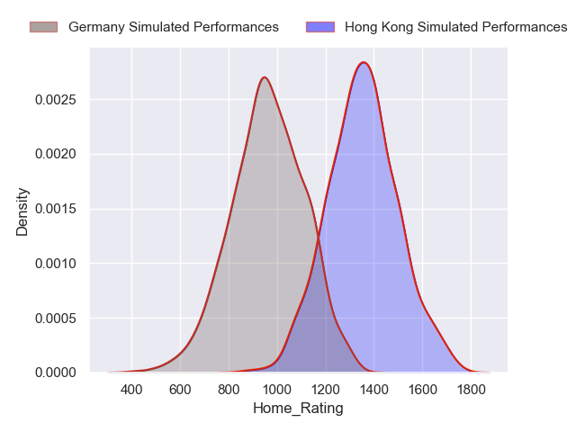
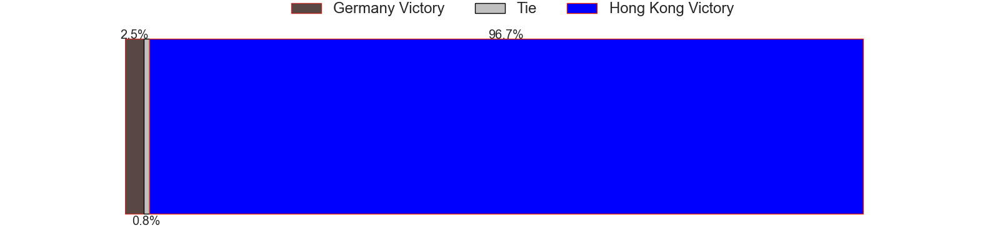
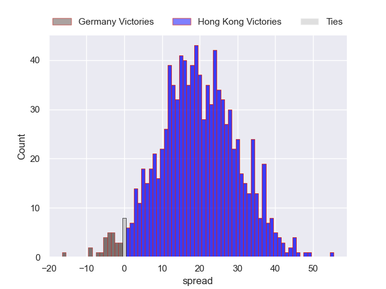

---  
title: "International Match Status"  
date: 2023-11-11 6:00:00 -0500  
categories: model review projection  
layout: article  
aside:  
    toc: true  
---
# Current Team Rankings

# Standings

## Current Standings

| Club                          |   Played |   Wins |   Point Differential |   Losing Bonus Points |   Try Bonus Points |   Competition Points |
|:------------------------------|---------:|-------:|---------------------:|----------------------:|-------------------:|---------------------:|
| USA                           |       36 |      9 |                 -431 |                     6 |                nan |                   44 |
| England                       |       14 |      9 |                  167 |                     2 |                nan |                   40 |
| Ireland                       |       14 |      8 |                  171 |                     4 |                nan |                   36 |
| Wales                         |       12 |      7 |                  -28 |                     1 |                nan |                   29 |
| Scotland                      |        9 |      7 |                   25 |                     0 |                nan |                   28 |
| France                        |        6 |      6 |                   82 |                     0 |                nan |                   24 |
| Canada                        |        9 |      5 |                   -2 |                     2 |                nan |                   22 |
| Fiji                          |        9 |      5 |                  -20 |                     2 |                nan |                   22 |
| New Zealand                   |        5 |      5 |                  222 |                     0 |                nan |                   20 |
| Switzerland                   |        5 |      5 |                  144 |                     0 |                nan |                   20 |
| England Saxons                |        6 |      4 |                   80 |                     1 |                nan |                   19 |
| Tonga                         |        9 |      4 |                  -31 |                     0 |                nan |                   18 |
| South Africa                  |        4 |      4 |                  116 |                     0 |                nan |                   16 |
| Czech Republic                |        5 |      4 |                   97 |                     0 |                nan |                   16 |
| Bulgaria                      |        4 |      4 |                   64 |                     0 |                nan |                   16 |
| Finland                       |        5 |      4 |                   27 |                     0 |                nan |                   16 |
| Samoa                         |        4 |      3 |                   24 |                     0 |                nan |                   14 |
| Italy                         |        7 |      3 |                   15 |                     2 |                nan |                   14 |
| Denmark                       |        5 |      3 |                   26 |                     1 |                nan |                   13 |
| Japan                         |        7 |      3 |                  -36 |                     1 |                nan |                   13 |
| Hong Kong                     |        4 |      3 |                   61 |                     0 |                nan |                   12 |
| Sweden                        |        6 |      3 |                  -57 |                     0 |                nan |                   12 |
| Lithuania                     |        5 |      2 |                   -7 |                     2 |                nan |                   10 |
| Serbia                        |        3 |      2 |                   70 |                     0 |                nan |                    8 |
| Luxembourg                    |        2 |      2 |                   62 |                     0 |                nan |                    8 |
| Ireland A                     |        3 |      2 |                   50 |                     0 |                nan |                    8 |
| Malta                         |        3 |      2 |                   32 |                     0 |                nan |                    8 |
| Moldova                       |        3 |      2 |                   13 |                     0 |                nan |                    8 |
| New Zealand Maoris            |        2 |      2 |                   10 |                     0 |                nan |                    8 |
| Andorra                       |        5 |      2 |                   -3 |                     0 |                nan |                    8 |
| Latvia                        |        4 |      2 |                  -34 |                     0 |                nan |                    8 |
| Ukraine                       |        5 |      2 |                  -36 |                     0 |                nan |                    8 |
| Slovenia                      |        5 |      2 |                  -82 |                     0 |                nan |                    8 |
| Scotland A                    |        2 |      1 |                   31 |                     0 |                nan |                    6 |
| Portugal                      |        3 |      1 |                  -40 |                     0 |                nan |                    6 |
| Uruguay                       |        2 |      1 |                   16 |                     1 |                nan |                    5 |
| Argentina                     |        3 |      1 |                   12 |                     1 |                nan |                    5 |
| Hungary                       |        4 |      1 |                   10 |                     1 |                nan |                    5 |
| Chile                         |        2 |      1 |                    1 |                     1 |                nan |                    5 |
| Croatia                       |        5 |      1 |                  -59 |                     1 |                nan |                    5 |
| Bosnia-Herzegovina            |        4 |      1 |                  -80 |                     1 |                nan |                    5 |
| Botswana                      |        1 |      1 |                  108 |                     0 |                nan |                    4 |
| Chiefs                        |        1 |      1 |                   33 |                     0 |                nan |                    4 |
| Israel                        |        2 |      1 |                   24 |                     0 |                nan |                    4 |
| Cayman Islands                |        1 |      1 |                   21 |                     0 |                nan |                    4 |
| France U21                    |        1 |      1 |                   19 |                     0 |                nan |                    4 |
| New Zealand Barbarians        |        1 |      1 |                   17 |                     0 |                nan |                    4 |
| Trinidad and Tobago           |        1 |      1 |                    8 |                     0 |                nan |                    4 |
| Georgia                       |        2 |      1 |                    4 |                     0 |                nan |                    4 |
| Korea Republic                |        2 |      1 |                    4 |                     0 |                nan |                    4 |
| England U20                   |        2 |      1 |                    1 |                     0 |                nan |                    4 |
| Pacific Islanders             |        6 |      1 |                 -117 |                     0 |                nan |                    4 |
| Australian Barbarians         |        2 |      0 |                   -6 |                     1 |                nan |                    3 |
| Australia                     |        4 |      0 |                  -30 |                     2 |                nan |                    2 |
| Cyprus                        |        1 |      0 |                   -5 |                     1 |                nan |                    1 |
| South Africa A                |        2 |      0 |                  -11 |                     1 |                nan |                    1 |
| Kenya                         |        2 |      0 |                  -58 |                     1 |                nan |                    1 |
| Montenegro                    |        2 |      0 |                  -64 |                     1 |                nan |                    1 |
| Barbados                      |        1 |      0 |                   -8 |                     0 |                nan |                    0 |
| Brumbies                      |        1 |      0 |                  -10 |                     0 |                nan |                    0 |
| New Zealand Maori             |        1 |      0 |                  -17 |                     0 |                nan |                    0 |
| Italy U20                     |        1 |      0 |                  -20 |                     0 |                nan |                    0 |
| Mexico                        |        1 |      0 |                  -21 |                     0 |                nan |                    0 |
| Eastern Province Kings        |        1 |      0 |                  -22 |                     0 |                nan |                    0 |
| Romania                       |        2 |      0 |                  -24 |                     0 |                nan |                    0 |
| South Africa Barbarians North |        1 |      0 |                  -26 |                     0 |                nan |                    0 |
| South Africa Barbarians       |        1 |      0 |                  -28 |                     0 |                nan |                    0 |
| Crusaders                     |        1 |      0 |                  -31 |                     0 |                nan |                    0 |
| Turkey                        |        2 |      0 |                  -35 |                     0 |                nan |                    0 |
| Norway                        |        3 |      0 |                  -51 |                     0 |                nan |                    0 |
| Austria                       |        2 |      0 |                  -56 |                     0 |                nan |                    0 |
| World XV                      |        2 |      0 |                  -70 |                     0 |                nan |                    0 |
| Malaysia                      |        2 |      0 |                 -103 |                     0 |                nan |                    0 |
| Eswatini                      |        1 |      0 |                 -108 |                     0 |                nan |                    0 |

## Projected Remaining Table

| Club                     |   Matches Remaining |   Wins |   Point Differential |   Losing Bonus Points |   Try Bonus Points |   Competition Points |
|:-------------------------|--------------------:|-------:|---------------------:|----------------------:|-------------------:|---------------------:|
| Hong Kong                |                   2 |    1.9 |                 32.8 |                   0.1 |                1.8 |                  9.4 |
| TBC                      |                   2 |    1   |                  0   |                   0.7 |                0.9 |                  5.6 |
| Latvia                   |                   1 |    1   |                 24.7 |                   0   |                1   |                  5   |
| United States of America |                   1 |    1   |                 21   |                   0   |                1   |                  4.9 |
| Spain                    |                   1 |    0.7 |                  3.5 |                   0.2 |                0.6 |                  3.6 |
| Croatia                  |                   1 |    0.5 |                  0.4 |                   0.3 |                0.5 |                  2.9 |
| Ukraine                  |                   1 |    0.5 |                 -0.4 |                   0.3 |                0.5 |                  2.6 |
| Canada                   |                   1 |    0.3 |                 -3.5 |                   0.4 |                0.3 |                  1.8 |
| Germany                  |                   2 |    0.1 |                -32.8 |                   0.2 |                0.2 |                  1   |
| Brazil                   |                   1 |    0   |                -21   |                   0.1 |                0   |                  0.1 |
| Norway                   |                   1 |    0   |                -24.7 |                   0   |                0   |                  0.1 |

## Projected Total Table

| Club                          |   Total Matches |   Wins |   Point Differential |   Losing Bonus Points |   Try Bonus Points |   Competition Points |
|:------------------------------|----------------:|-------:|---------------------:|----------------------:|-------------------:|---------------------:|
| USA                           |              36 |    9   |               -431   |                   6   |                0   |                 44   |
| England                       |              14 |    9   |                167   |                   2   |                0   |                 40   |
| Ireland                       |              14 |    8   |                171   |                   4   |                0   |                 36   |
| Wales                         |              12 |    7   |                -28   |                   1   |                0   |                 29   |
| Scotland                      |               9 |    7   |                 25   |                   0   |                0   |                 28   |
| France                        |               6 |    6   |                 82   |                   0   |                0   |                 24   |
| Canada                        |              10 |    5.3 |                 -5.5 |                   2.4 |                0.3 |                 23.8 |
| Fiji                          |               9 |    5   |                -20   |                   2   |                0   |                 22   |
| Hong Kong                     |               6 |    4.9 |                 93.8 |                   0.1 |                1.8 |                 21.4 |
| New Zealand                   |               5 |    5   |                222   |                   0   |                0   |                 20   |
| Switzerland                   |               5 |    5   |                144   |                   0   |                0   |                 20   |
| England Saxons                |               6 |    4   |                 80   |                   1   |                0   |                 19   |
| Tonga                         |               9 |    4   |                -31   |                   0   |                0   |                 18   |
| South Africa                  |               4 |    4   |                116   |                   0   |                0   |                 16   |
| Czech Republic                |               5 |    4   |                 97   |                   0   |                0   |                 16   |
| Bulgaria                      |               4 |    4   |                 64   |                   0   |                0   |                 16   |
| Finland                       |               5 |    4   |                 27   |                   0   |                0   |                 16   |
| Samoa                         |               4 |    3   |                 24   |                   0   |                0   |                 14   |
| Italy                         |               7 |    3   |                 15   |                   2   |                0   |                 14   |
| Denmark                       |               5 |    3   |                 26   |                   1   |                0   |                 13   |
| Latvia                        |               5 |    3   |                 -9.3 |                   0   |                1   |                 13   |
| Japan                         |               7 |    3   |                -36   |                   1   |                0   |                 13   |
| Sweden                        |               6 |    3   |                -57   |                   0   |                0   |                 12   |
| Ukraine                       |               6 |    2.5 |                -36.4 |                   0.3 |                0.5 |                 10.6 |
| Lithuania                     |               5 |    2   |                 -7   |                   2   |                0   |                 10   |
| Serbia                        |               3 |    2   |                 70   |                   0   |                0   |                  8   |
| Luxembourg                    |               2 |    2   |                 62   |                   0   |                0   |                  8   |
| Ireland A                     |               3 |    2   |                 50   |                   0   |                0   |                  8   |
| Malta                         |               3 |    2   |                 32   |                   0   |                0   |                  8   |
| Moldova                       |               3 |    2   |                 13   |                   0   |                0   |                  8   |
| New Zealand Maoris            |               2 |    2   |                 10   |                   0   |                0   |                  8   |
| Andorra                       |               5 |    2   |                 -3   |                   0   |                0   |                  8   |
| Slovenia                      |               5 |    2   |                -82   |                   0   |                0   |                  8   |
| Croatia                       |               6 |    1.5 |                -58.6 |                   1.3 |                0.5 |                  7.9 |
| Scotland A                    |               2 |    1   |                 31   |                   0   |                0   |                  6   |
| Portugal                      |               3 |    1   |                -40   |                   0   |                0   |                  6   |
| TBC                           |               2 |    1   |                  0   |                   0.7 |                0.9 |                  5.6 |
| Uruguay                       |               2 |    1   |                 16   |                   1   |                0   |                  5   |
| Argentina                     |               3 |    1   |                 12   |                   1   |                0   |                  5   |
| Hungary                       |               4 |    1   |                 10   |                   1   |                0   |                  5   |
| Chile                         |               2 |    1   |                  1   |                   1   |                0   |                  5   |
| Bosnia-Herzegovina            |               4 |    1   |                -80   |                   1   |                0   |                  5   |
| United States of America      |               1 |    1   |                 21   |                   0   |                1   |                  4.9 |
| Botswana                      |               1 |    1   |                108   |                   0   |                0   |                  4   |
| Chiefs                        |               1 |    1   |                 33   |                   0   |                0   |                  4   |
| Israel                        |               2 |    1   |                 24   |                   0   |                0   |                  4   |
| Cayman Islands                |               1 |    1   |                 21   |                   0   |                0   |                  4   |
| France U21                    |               1 |    1   |                 19   |                   0   |                0   |                  4   |
| New Zealand Barbarians        |               1 |    1   |                 17   |                   0   |                0   |                  4   |
| Trinidad and Tobago           |               1 |    1   |                  8   |                   0   |                0   |                  4   |
| Georgia                       |               2 |    1   |                  4   |                   0   |                0   |                  4   |
| Korea Republic                |               2 |    1   |                  4   |                   0   |                0   |                  4   |
| England U20                   |               2 |    1   |                  1   |                   0   |                0   |                  4   |
| Pacific Islanders             |               6 |    1   |               -117   |                   0   |                0   |                  4   |
| Spain                         |               1 |    0.7 |                  3.5 |                   0.2 |                0.6 |                  3.6 |
| Australian Barbarians         |               2 |    0   |                 -6   |                   1   |                0   |                  3   |
| Australia                     |               4 |    0   |                -30   |                   2   |                0   |                  2   |
| Cyprus                        |               1 |    0   |                 -5   |                   1   |                0   |                  1   |
| South Africa A                |               2 |    0   |                -11   |                   1   |                0   |                  1   |
| Germany                       |               2 |    0.1 |                -32.8 |                   0.2 |                0.2 |                  1   |
| Kenya                         |               2 |    0   |                -58   |                   1   |                0   |                  1   |
| Montenegro                    |               2 |    0   |                -64   |                   1   |                0   |                  1   |
| Brazil                        |               1 |    0   |                -21   |                   0.1 |                0   |                  0.1 |
| Norway                        |               4 |    0   |                -75.7 |                   0   |                0   |                  0.1 |
| Barbados                      |               1 |    0   |                 -8   |                   0   |                0   |                  0   |
| Brumbies                      |               1 |    0   |                -10   |                   0   |                0   |                  0   |
| New Zealand Maori             |               1 |    0   |                -17   |                   0   |                0   |                  0   |
| Italy U20                     |               1 |    0   |                -20   |                   0   |                0   |                  0   |
| Mexico                        |               1 |    0   |                -21   |                   0   |                0   |                  0   |
| Eastern Province Kings        |               1 |    0   |                -22   |                   0   |                0   |                  0   |
| Romania                       |               2 |    0   |                -24   |                   0   |                0   |                  0   |
| South Africa Barbarians North |               1 |    0   |                -26   |                   0   |                0   |                  0   |
| South Africa Barbarians       |               1 |    0   |                -28   |                   0   |                0   |                  0   |
| Crusaders                     |               1 |    0   |                -31   |                   0   |                0   |                  0   |
| Turkey                        |               2 |    0   |                -35   |                   0   |                0   |                  0   |
| Austria                       |               2 |    0   |                -56   |                   0   |                0   |                  0   |
| World XV                      |               2 |    0   |                -70   |                   0   |                0   |                  0   |
| Malaysia                      |               2 |    0   |               -103   |                   0   |                0   |                  0   |
| Eswatini                      |               1 |    0   |               -108   |                   0   |                0   |                  0   |

# Completed Match Review

| Model | Percent Correct Predictions | Spread Error |
| ------ | ------ | ------ |
| Club Level | 68.6% | 17.5 |
| Player Level: Lineup | nan% | nan |
| Player Level: Minutes | nan% | nan |

# Future Predictions

## Week 37

### United States of America V Brazil on 2023/11/11

Average Margin: United States of America by 21.5

### Ukraine V Croatia on 2023/11/11

Average Margin: Croatia by 0.3

### Latvia V Norway on 2023/11/11

Average Margin: Latvia by 25.2

### Spain V Canada on 2023/11/11

Average Margin: Spain by 3.7

## Week 38

### Hong Kong V Germany on 2023/11/14

Average Margin: Hong Kong by 16.7

### Hong Kong V Germany on 2023/11/18

Average Margin: Hong Kong by 16.7

