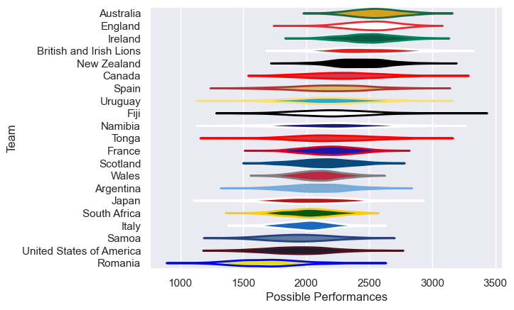

---  
title: "International Test Match 2001"  
date: 2025-07-29 6:00:00 -0500  
categories: model review projection  
layout: article  
aside:  
    toc: true  
---
# Current Team Rankings

# Standings

## Current Standings

| Club                     |   Played |   Wins |   Point Differential |   Losing Bonus Points | Try Bonus Points   |   Competition Points |
|:-------------------------|---------:|-------:|---------------------:|----------------------:|:-------------------|---------------------:|
| England                  |        6 |      6 |                  240 |                     0 |                    |                   24 |
| New Zealand              |        6 |      6 |                  163 |                     0 |                    |                   24 |
| Australia                |        7 |      4 |                   94 |                     2 |                    |                   18 |
| France                   |        6 |      4 |                   57 |                     1 |                    |                   17 |
| Wales                    |        6 |      4 |                  171 |                     0 |                    |                   16 |
| South Africa             |        7 |      4 |                   63 |                     0 |                    |                   16 |
| Argentina                |        5 |      3 |                   -8 |                     1 |                    |                   13 |
| Italy                    |        7 |      3 |                  -11 |                     0 |                    |                   12 |
| Ireland                  |        3 |      2 |                   50 |                     0 |                    |                    8 |
| British and Irish Lions  |        3 |      1 |                  -11 |                     1 |                    |                    5 |
| Scotland                 |        3 |      1 |                  -17 |                     0 |                    |                    4 |
| Samoa                    |        3 |      1 |                  -63 |                     0 |                    |                    4 |
| Uruguay                  |        1 |      0 |                  -11 |                     0 |                    |                    0 |
| Namibia                  |        1 |      0 |                  -25 |                     0 |                    |                    0 |
| Canada                   |        2 |      0 |                  -51 |                     0 |                    |                    0 |
| United States of America |        2 |      0 |                  -52 |                     0 |                    |                    0 |
| Tonga                    |        2 |      0 |                  -67 |                     0 |                    |                    0 |
| Japan                    |        2 |      0 |                  -77 |                     0 |                    |                    0 |
| Spain                    |        1 |      0 |                  -82 |                     0 |                    |                    0 |
| Fiji                     |        2 |      0 |                 -123 |                     0 |                    |                    0 |
| Romania                  |        3 |      0 |                 -240 |                     0 |                    |                    0 |

# Completed Match Review

| Model | Percent Correct Predictions | Spread Error |
| ------ | ------ | ------ |
| Club Level | 61.5% | 26.9 |
| Player Level: Lineup | nan% | nan |
| Player Level: Minutes | nan% | nan |

