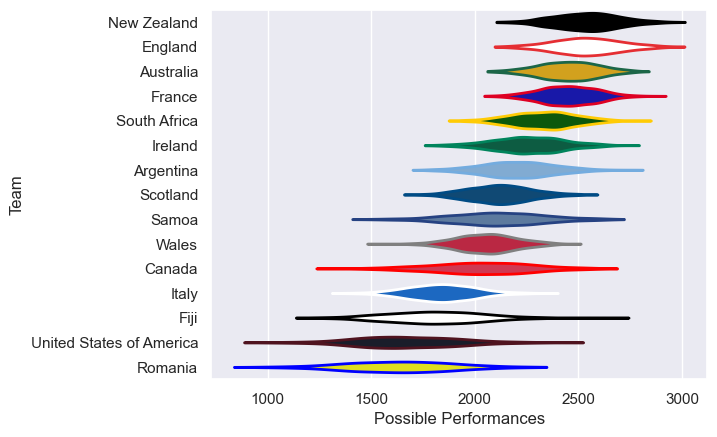

---  
title: "International Test Match 2002"  
date: 2025-07-29 6:00:00 -0500  
categories: model review projection  
layout: article  
aside:  
    toc: true  
---
# Current Team Rankings

# Standings

## Current Standings

| Club                     |   Played |   Wins |   Point Differential |   Losing Bonus Points | Try Bonus Points   |   Competition Points |
|:-------------------------|---------:|-------:|---------------------:|----------------------:|:-------------------|---------------------:|
| New Zealand              |        7 |      5 |                  168 |                     1 |                    |                   23 |
| Scotland                 |        5 |      4 |                   95 |                     1 |                    |                   17 |
| Australia                |        6 |      4 |                   50 |                     1 |                    |                   17 |
| England                  |        4 |      4 |                   62 |                     0 |                    |                   16 |
| South Africa             |        7 |      4 |                    3 |                     0 |                    |                   16 |
| Wales                    |        6 |      3 |                   40 |                     0 |                    |                   12 |
| France                   |        6 |      2 |                   33 |                     2 |                    |                   12 |
| Ireland                  |        5 |      3 |                   24 |                     0 |                    |                   12 |
| Argentina                |        6 |      2 |                  -17 |                     0 |                    |                    8 |
| Canada                   |        3 |      1 |                  -40 |                     0 |                    |                    4 |
| Samoa                    |        1 |      0 |                  -42 |                     0 |                    |                    0 |
| United States of America |        1 |      0 |                  -42 |                     0 |                    |                    0 |
| Romania                  |        2 |      0 |                  -64 |                     0 |                    |                    0 |
| Italy                    |        3 |      0 |                 -115 |                     0 |                    |                    0 |
| Fiji                     |        4 |      0 |                 -155 |                     0 |                    |                    0 |

# Completed Match Review

| Model | Percent Correct Predictions | Spread Error |
| ------ | ------ | ------ |
| Club Level | 90.9% | 10.1 |
| Player Level: Lineup | nan% | nan |
| Player Level: Minutes | nan% | nan |

