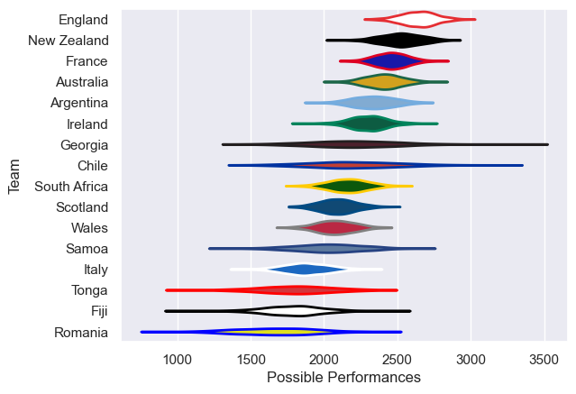

---  
title: "International Test Match 2003 Status"  
date: 2025-07-28 6:00:00 -0500  
categories: model review projection  
layout: article  
aside:  
    toc: true  
---
# Current Team Rankings

# Standings

## Current Standings

| Club         |   Played |   Wins |   Point Differential |   Losing Bonus Points | Try Bonus Points   |   Competition Points |
|:-------------|---------:|-------:|---------------------:|----------------------:|:-------------------|---------------------:|
| Ireland      |        6 |      5 |                  117 |                     0 |                    |                   20 |
| England      |        5 |      4 |                   77 |                     1 |                    |                   17 |
| Argentina    |        4 |      3 |                   23 |                     1 |                    |                   13 |
| South Africa |        3 |      3 |                   14 |                     0 |                    |                   12 |
| France       |        6 |      2 |                    5 |                     2 |                    |                   10 |
| New Zealand  |        3 |      2 |                   58 |                     1 |                    |                    9 |
| Fiji         |        4 |      2 |                    8 |                     1 |                    |                    9 |
| Australia    |        3 |      2 |                   38 |                     0 |                    |                    8 |
| Wales        |        6 |      2 |                  -69 |                     0 |                    |                    8 |
| Scotland     |        5 |      1 |                  -14 |                     1 |                    |                    5 |
| Tonga        |        3 |      1 |                  -23 |                     1 |                    |                    5 |
| Italy        |        3 |      1 |                  -78 |                     0 |                    |                    4 |
| Georgia      |        1 |      0 |                   -9 |                     0 |                    |                    0 |
| Chile        |        1 |      0 |                  -25 |                     0 |                    |                    0 |
| Samoa        |        1 |      0 |                  -28 |                     0 |                    |                    0 |
| Romania      |        2 |      0 |                  -94 |                     0 |                    |                    0 |

# Completed Match Review

| Model | Percent Correct Predictions | Spread Error |
| ------ | ------ | ------ |
| Club Level | 75.0% | 13.0 |
| Player Level: Lineup | nan% | nan |
| Player Level: Minutes | nan% | nan |

