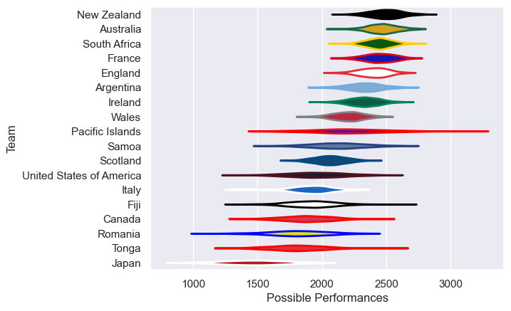

---  
title: "International Test Match 2004 Status"  
date: 2025-07-28 6:00:00 -0500  
categories: model review projection  
layout: article  
aside:  
    toc: true  
---
# Current Team Rankings

# Standings

## Current Standings

| Club                     |   Played |   Wins |   Point Differential |   Losing Bonus Points | Try Bonus Points   |   Competition Points |
|:-------------------------|---------:|-------:|---------------------:|----------------------:|:-------------------|---------------------:|
| South Africa             |        9 |      7 |                  120 |                     1 |                    |                   29 |
| New Zealand              |        7 |      7 |                  195 |                     0 |                    |                   28 |
| Australia                |        8 |      7 |                  112 |                     0 |                    |                   28 |
| Wales                    |        7 |      3 |                  128 |                     3 |                    |                   15 |
| Ireland                  |        5 |      3 |                   33 |                     0 |                    |                   12 |
| France                   |        5 |      3 |                    6 |                     0 |                    |                   12 |
| Italy                    |        4 |      2 |                   13 |                     1 |                    |                    9 |
| England                  |        6 |      2 |                   -9 |                     1 |                    |                    9 |
| Argentina                |        6 |      2 |                  -67 |                     1 |                    |                    9 |
| Scotland                 |        7 |      2 |                   20 |                     0 |                    |                    8 |
| Romania                  |        3 |      2 |                  -43 |                     0 |                    |                    8 |
| Fiji                     |        1 |      1 |                    1 |                     0 |                    |                    4 |
| Tonga                    |        1 |      0 |                   -1 |                     1 |                    |                    1 |
| Samoa                    |        1 |      0 |                  -35 |                     0 |                    |                    0 |
| Pacific Islands          |        3 |      0 |                  -44 |                     0 |                    |                    0 |
| United States of America |        3 |      0 |                  -75 |                     0 |                    |                    0 |
| Canada                   |        3 |      0 |                 -149 |                     0 |                    |                    0 |
| Japan                    |        3 |      0 |                 -205 |                     0 |                    |                    0 |

# Completed Match Review

| Model | Percent Correct Predictions | Spread Error |
| ------ | ------ | ------ |
| Club Level | 78.0% | 19.1 |
| Player Level: Lineup | nan% | nan |
| Player Level: Minutes | nan% | nan |

