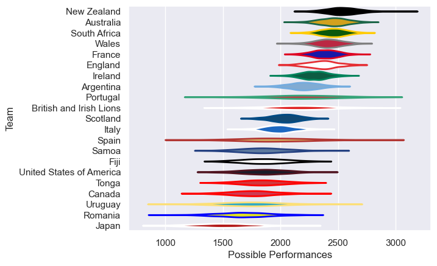

---  
title: "International Test Match 2005"  
date: 2025-07-29 6:00:00 -0500  
categories: model review projection  
layout: article  
aside:  
    toc: true  
---
# Current Team Rankings

# Standings

## Current Standings

| Club                     |   Played |   Wins |   Point Differential |   Losing Bonus Points | Try Bonus Points   |   Competition Points |
|:-------------------------|---------:|-------:|---------------------:|----------------------:|:-------------------|---------------------:|
| New Zealand              |        8 |      8 |                  257 |                     0 |                    |                   32 |
| South Africa             |        8 |      5 |                  155 |                     1 |                    |                   23 |
| Australia                |        9 |      5 |                  120 |                     1 |                    |                   21 |
| France                   |        7 |      4 |                   75 |                     1 |                    |                   19 |
| Wales                    |        6 |      4 |                   79 |                     0 |                    |                   16 |
| Argentina                |        7 |      3 |                    7 |                     1 |                    |                   15 |
| Ireland                  |        5 |      3 |                   38 |                     0 |                    |                   12 |
| Italy                    |        6 |      3 |                  -15 |                     0 |                    |                   12 |
| England                  |        3 |      2 |                   43 |                     1 |                    |                    9 |
| Scotland                 |        4 |      2 |                    4 |                     1 |                    |                    9 |
| Fiji                     |        5 |      2 |                  -90 |                     1 |                    |                    9 |
| Samoa                    |        4 |      1 |                  -95 |                     1 |                    |                    5 |
| Japan                    |        3 |      1 |                  -46 |                     0 |                    |                    4 |
| Romania                  |        3 |      1 |                  -49 |                     0 |                    |                    4 |
| British and Irish Lions  |        4 |      0 |                  -67 |                     0 |                    |                    2 |
| Canada                   |        3 |      0 |                 -103 |                     1 |                    |                    1 |
| Portugal                 |        1 |      0 |                   -9 |                     0 |                    |                    0 |
| Spain                    |        1 |      0 |                  -15 |                     0 |                    |                    0 |
| United States of America |        1 |      0 |                  -74 |                     0 |                    |                    0 |
| Tonga                    |        3 |      0 |                  -91 |                     0 |                    |                    0 |
| Uruguay                  |        1 |      0 |                 -124 |                     0 |                    |                    0 |

# Completed Match Review

| Model | Percent Correct Predictions | Spread Error |
| ------ | ------ | ------ |
| Club Level | 80.4% | 15.9 |
| Player Level: Lineup | nan% | nan |
| Player Level: Minutes | nan% | nan |

