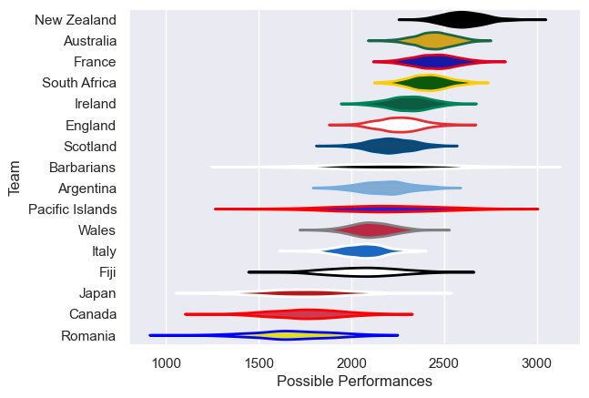

---  
title: "International Test Match 2006"  
date: 2025-07-29 6:00:00 -0500  
categories: model review projection  
layout: article  
aside:  
    toc: true  
---
# Current Team Rankings

# Standings

## Current Standings

| Club            |   Played |   Wins |   Point Differential |   Losing Bonus Points | Try Bonus Points   |   Competition Points |
|:----------------|---------:|-------:|---------------------:|----------------------:|:-------------------|---------------------:|
| New Zealand     |        7 |      7 |                  139 |                     0 |                    |                   28 |
| Australia       |        7 |      5 |                   99 |                     0 |                    |                   22 |
| Argentina       |        6 |      4 |                   27 |                     2 |                    |                   18 |
| South Africa    |        6 |      3 |                   16 |                     1 |                    |                   13 |
| Scotland        |        6 |      3 |                   38 |                     0 |                    |                   12 |
| Ireland         |        6 |      3 |                   33 |                     0 |                    |                   12 |
| France          |        5 |      3 |                    3 |                     0 |                    |                   12 |
| Wales           |        6 |      2 |                   -2 |                     1 |                    |                   11 |
| Italy           |        5 |      2 |                   56 |                     2 |                    |                   10 |
| England         |        7 |      2 |                  -66 |                     1 |                    |                    9 |
| Fiji            |        1 |      1 |                   11 |                     0 |                    |                    4 |
| Japan           |        1 |      0 |                  -46 |                     0 |                    |                    0 |
| Canada          |        2 |      0 |                  -70 |                     0 |                    |                    0 |
| Barbarians      |        2 |      0 |                  -74 |                     0 |                    |                    0 |
| Pacific Islands |        3 |      0 |                  -74 |                     0 |                    |                    0 |
| Romania         |        2 |      0 |                  -90 |                     0 |                    |                    0 |

# Completed Match Review

| Model | Percent Correct Predictions | Spread Error |
| ------ | ------ | ------ |
| Club Level | 86.1% | 14.9 |
| Player Level: Lineup | nan% | nan |
| Player Level: Minutes | nan% | nan |

