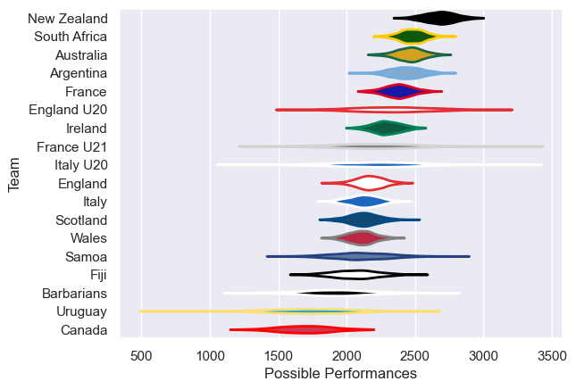

---  
title: "International Test Match 2007 Status"  
date: 2025-07-28 6:00:00 -0500  
categories: model review projection  
layout: article  
aside:  
    toc: true  
---
# Current Team Rankings

# Standings

## Current Standings

| Club         |   Played |   Wins |   Point Differential |   Losing Bonus Points | Try Bonus Points   |   Competition Points |
|:-------------|---------:|-------:|---------------------:|----------------------:|:-------------------|---------------------:|
| South Africa |        6 |      5 |                  137 |                     0 |                    |                   20 |
| Argentina    |        4 |      3 |                   29 |                     1 |                    |                   13 |
| New Zealand  |        3 |      3 |                  133 |                     0 |                    |                   12 |
| Australia    |        3 |      3 |                   86 |                     0 |                    |                   12 |
| France       |        5 |      3 |                  -36 |                     0 |                    |                   12 |
| Italy        |        3 |      1 |                    3 |                     1 |                    |                    5 |
| Ireland      |        4 |      1 |                  -25 |                     1 |                    |                    5 |
| England      |        5 |      1 |                  -43 |                     1 |                    |                    5 |
| Wales        |        6 |      1 |                 -136 |                     1 |                    |                    5 |
| France U21   |        1 |      1 |                   19 |                     0 |                    |                    4 |
| Barbarians   |        1 |      1 |                   17 |                     0 |                    |                    4 |
| England U20  |        2 |      1 |                    1 |                     0 |                    |                    4 |
| Scotland     |        2 |      1 |                  -14 |                     0 |                    |                    4 |
| Italy U20    |        1 |      0 |                  -20 |                     0 |                    |                    0 |
| Uruguay      |        1 |      0 |                  -24 |                     0 |                    |                    0 |
| Samoa        |        1 |      0 |                  -27 |                     0 |                    |                    0 |
| Fiji         |        1 |      0 |                  -49 |                     0 |                    |                    0 |
| Canada       |        1 |      0 |                  -51 |                     0 |                    |                    0 |

# Completed Match Review

| Model | Percent Correct Predictions | Spread Error |
| ------ | ------ | ------ |
| Club Level | 84.0% | 16.9 |
| Player Level: Lineup | nan% | nan |
| Player Level: Minutes | nan% | nan |

