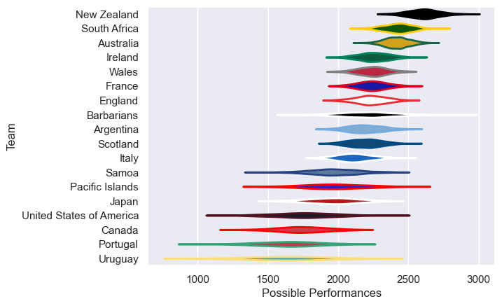

---  
title: "International Test Match 2008"  
date: 2025-07-29 6:00:00 -0500  
categories: model review projection  
layout: article  
aside:  
    toc: true  
---
# Current Team Rankings

# Standings

## Current Standings

| Club                     |   Played |   Wins |   Point Differential |   Losing Bonus Points | Try Bonus Points   |   Competition Points |
|:-------------------------|---------:|-------:|---------------------:|----------------------:|:-------------------|---------------------:|
| Australia                |       10 |      7 |                   90 |                     1 |                    |                   33 |
| New Zealand              |        8 |      8 |                  237 |                     0 |                    |                   32 |
| South Africa             |        7 |      7 |                  167 |                     0 |                    |                   28 |
| Ireland                  |        6 |      3 |                   59 |                     1 |                    |                   13 |
| Scotland                 |        5 |      2 |                   17 |                     2 |                    |                   10 |
| Argentina                |        7 |      2 |                  -73 |                     2 |                    |                   10 |
| France                   |        5 |      2 |                  -25 |                     1 |                    |                    9 |
| Wales                    |        6 |      2 |                  -43 |                     1 |                    |                    9 |
| Japan                    |        2 |      2 |                   25 |                     0 |                    |                    8 |
| England                  |        7 |      2 |                  -96 |                     0 |                    |                    8 |
| United States of America |        3 |      1 |                    9 |                     0 |                    |                    4 |
| Pacific Islands          |        3 |      1 |                  -43 |                     0 |                    |                    4 |
| Italy                    |        5 |      1 |                  -51 |                     0 |                    |                    4 |
| Canada                   |        4 |      1 |                 -109 |                     0 |                    |                    4 |
| Barbarians               |        3 |      0 |                  -35 |                     2 |                    |                    2 |
| Portugal                 |        1 |      0 |                   -8 |                     0 |                    |                    0 |
| Uruguay                  |        1 |      0 |                  -34 |                     0 |                    |                    0 |
| Samoa                    |        1 |      0 |                  -87 |                     0 |                    |                    0 |

# Completed Match Review

| Model | Percent Correct Predictions | Spread Error |
| ------ | ------ | ------ |
| Club Level | 81.0% | 12.5 |
| Player Level: Lineup | nan% | nan |
| Player Level: Minutes | nan% | nan |

