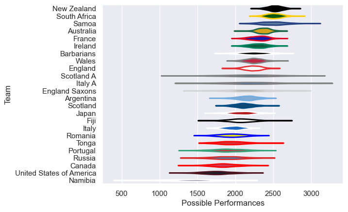

---  
title: "International Test Match 2009 Status"  
date: 2025-07-28 6:00:00 -0500  
categories: model review projection  
layout: article  
aside:  
    toc: true  
---
# Current Team Rankings

# Standings

## Current Standings

| Club                     |   Played |   Wins |   Point Differential |   Losing Bonus Points | Try Bonus Points   |   Competition Points |
|:-------------------------|---------:|-------:|---------------------:|----------------------:|:-------------------|---------------------:|
| Australia                |       10 |      6 |                  138 |                     1 |                    |                   31 |
| New Zealand              |        8 |      6 |                   74 |                     2 |                    |                   26 |
| Ireland                  |        5 |      4 |                   76 |                     0 |                    |                   18 |
| Wales                    |        6 |      4 |                   35 |                     1 |                    |                   17 |
| France                   |        6 |      3 |                    3 |                     1 |                    |                   13 |
| England                  |        6 |      2 |                   -2 |                     2 |                    |                   10 |
| Scotland                 |        3 |      2 |                   11 |                     1 |                    |                    9 |
| Argentina                |        5 |      2 |                  -41 |                     1 |                    |                    9 |
| Japan                    |        2 |      2 |                   59 |                     0 |                    |                    8 |
| Barbarians               |        3 |      2 |                  -34 |                     0 |                    |                    8 |
| South Africa             |        3 |      1 |                   13 |                     2 |                    |                    6 |
| England Saxons           |        1 |      1 |                   66 |                     0 |                    |                    4 |
| Scotland A               |        1 |      1 |                   31 |                     0 |                    |                    4 |
| Italy A                  |        1 |      1 |                   11 |                     0 |                    |                    4 |
| Namibia                  |        1 |      1 |                    3 |                     0 |                    |                    4 |
| Tonga                    |        2 |      1 |                  -26 |                     0 |                    |                    4 |
| Fiji                     |        3 |      1 |                  -37 |                     0 |                    |                    4 |
| Canada                   |        5 |      1 |                  -71 |                     0 |                    |                    4 |
| Italy                    |        6 |      1 |                  -87 |                     0 |                    |                    4 |
| Portugal                 |        3 |      0 |                  -74 |                     2 |                    |                    2 |
| Samoa                    |        3 |      0 |                  -60 |                     1 |                    |                    1 |
| Russia                   |        1 |      0 |                  -16 |                     0 |                    |                    0 |
| Romania                  |        2 |      0 |                  -22 |                     0 |                    |                    0 |
| United States of America |        2 |      0 |                  -50 |                     0 |                    |                    0 |

# Completed Match Review

| Model | Percent Correct Predictions | Spread Error |
| ------ | ------ | ------ |
| Club Level | 68.2% | 13.0 |
| Player Level: Lineup | nan% | nan |
| Player Level: Minutes | nan% | nan |

