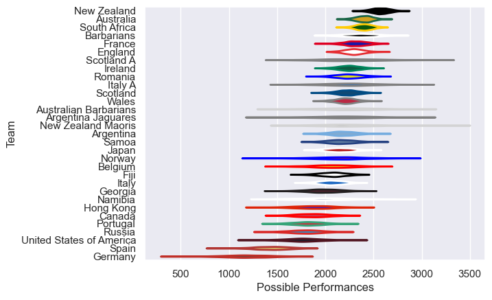

---  
title: "International Test Match 2010"  
date: 2025-07-29 6:00:00 -0500  
categories: model review projection  
layout: article  
aside:  
    toc: true  
---
# Current Team Rankings

# Standings

## Current Standings

| Club                     |   Played |   Wins |   Point Differential |   Losing Bonus Points | Try Bonus Points   |   Competition Points |
|:-------------------------|---------:|-------:|---------------------:|----------------------:|:-------------------|---------------------:|
| South Africa             |        9 |      7 |                   94 |                     2 |                    |                   30 |
| New Zealand              |        8 |      7 |                  176 |                     1 |                    |                   29 |
| Australia                |        9 |      7 |                  117 |                     1 |                    |                   29 |
| England                  |       10 |      5 |                    9 |                     1 |                    |                   23 |
| Scotland                 |        5 |      4 |                  -27 |                     0 |                    |                   16 |
| Canada                   |        4 |      3 |                   65 |                     1 |                    |                   13 |
| Ireland                  |        8 |      2 |                  -46 |                     4 |                    |                   12 |
| Argentina                |        6 |      2 |                   -4 |                     2 |                    |                   10 |
| Romania                  |        2 |      2 |                   21 |                     0 |                    |                    8 |
| New Zealand Maoris       |        2 |      2 |                   10 |                     0 |                    |                    8 |
| Barbarians               |        3 |      2 |                    3 |                     0 |                    |                    8 |
| Georgia                  |        3 |      2 |                   -9 |                     0 |                    |                    8 |
| France                   |        5 |      2 |                  -68 |                     0 |                    |                    8 |
| Portugal                 |        3 |      1 |                    4 |                     2 |                    |                    6 |
| Japan                    |        2 |      1 |                   69 |                     1 |                    |                    5 |
| Italy A                  |        2 |      1 |                   13 |                     1 |                    |                    5 |
| United States of America |        2 |      1 |                    3 |                     1 |                    |                    5 |
| Samoa                    |        4 |      1 |                  -23 |                     1 |                    |                    5 |
| Italy                    |        5 |      1 |                  -76 |                     1 |                    |                    5 |
| Germany                  |        1 |      1 |                   34 |                     0 |                    |                    4 |
| Hong Kong                |        2 |      1 |                    8 |                     0 |                    |                    4 |
| Namibia                  |        3 |      1 |                  -22 |                     0 |                    |                    4 |
| Spain                    |        2 |      1 |                  -25 |                     0 |                    |                    4 |
| Wales                    |        7 |      0 |                  -80 |                     2 |                    |                    4 |
| Australian Barbarians    |        2 |      0 |                   -6 |                     1 |                    |                    3 |
| Fiji                     |        4 |      0 |                  -76 |                     0 |                    |                    2 |
| Scotland A               |        1 |      0 |                   -3 |                     1 |                    |                    1 |
| Argentina Jaguares       |        1 |      0 |                  -16 |                     0 |                    |                    0 |
| Belgium                  |        1 |      0 |                  -31 |                     0 |                    |                    0 |
| Norway                   |        1 |      0 |                  -42 |                     0 |                    |                    0 |
| Russia                   |        1 |      0 |                  -72 |                     0 |                    |                    0 |

# Completed Match Review

| Model | Percent Correct Predictions | Spread Error |
| ------ | ------ | ------ |
| Club Level | 61.0% | 13.8 |
| Player Level: Lineup | nan% | nan |
| Player Level: Minutes | nan% | nan |

