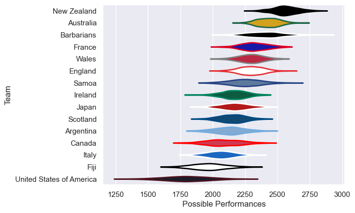

---  
title: "International Test Match 2011"  
date: 2025-07-29 6:00:00 -0500  
categories: model review projection  
layout: article  
aside:  
    toc: true  
---
# Current Team Rankings

# Standings

## Current Standings

| Club                     |   Played |   Wins |   Point Differential |   Losing Bonus Points | Try Bonus Points   |   Competition Points |
|:-------------------------|---------:|-------:|---------------------:|----------------------:|:-------------------|---------------------:|
| Wales                    |        5 |      2 |                   12 |                     3 |                    |                   11 |
| England                  |        4 |      2 |                   -1 |                     1 |                    |                    9 |
| Australia                |        3 |      2 |                   46 |                     0 |                    |                    8 |
| Scotland                 |        2 |      2 |                   15 |                     0 |                    |                    8 |
| France                   |        2 |      2 |                   11 |                     0 |                    |                    8 |
| Barbarians               |        3 |      2 |                  -40 |                     0 |                    |                    8 |
| New Zealand              |        1 |      1 |                   46 |                     0 |                    |                    4 |
| Canada                   |        1 |      1 |                   20 |                     0 |                    |                    4 |
| Samoa                    |        1 |      1 |                    9 |                     0 |                    |                    4 |
| Italy                    |        2 |      1 |                   -4 |                     0 |                    |                    4 |
| Ireland                  |        4 |      0 |                  -26 |                     3 |                    |                    3 |
| Japan                    |        1 |      0 |                   -7 |                     1 |                    |                    1 |
| Argentina                |        1 |      0 |                  -15 |                     0 |                    |                    0 |
| United States of America |        1 |      0 |                  -20 |                     0 |                    |                    0 |
| Fiji                     |        1 |      0 |                  -46 |                     0 |                    |                    0 |

# Completed Match Review

| Model | Percent Correct Predictions | Spread Error |
| ------ | ------ | ------ |
| Club Level | 56.2% | 12.1 |
| Player Level: Lineup | nan% | nan |
| Player Level: Minutes | nan% | nan |

