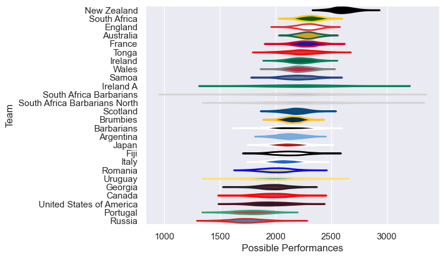

---  
title: "International Test Match 2012 Status"  
date: 2025-07-28 6:00:00 -0500  
categories: model review projection  
layout: article  
aside:  
    toc: true  
---
# Current Team Rankings

# Standings

## Current Standings

| Club                          |   Played |   Wins |   Point Differential |   Losing Bonus Points | Try Bonus Points   |   Competition Points |
|:------------------------------|---------:|-------:|---------------------:|----------------------:|:-------------------|---------------------:|
| Australia                     |        9 |      6 |                   -8 |                     1 |                    |                   27 |
| New Zealand                   |        8 |      6 |                  162 |                     0 |                    |                   26 |
| England                       |       10 |      5 |                  123 |                     3 |                    |                   25 |
| South Africa                  |        6 |      5 |                   30 |                     0 |                    |                   22 |
| France                        |        5 |      4 |                   88 |                     1 |                    |                   17 |
| United States of America      |        6 |      3 |                   29 |                     1 |                    |                   13 |
| Italy                         |        6 |      3 |                  -16 |                     1 |                    |                   13 |
| Scotland                      |        6 |      3 |                  -30 |                     1 |                    |                   13 |
| Canada                        |        5 |      3 |                   15 |                     0 |                    |                   12 |
| Wales                         |        9 |      2 |                  -38 |                     4 |                    |                   12 |
| Argentina                     |        6 |      3 |                  -46 |                     0 |                    |                   12 |
| Samoa                         |        4 |      2 |                   28 |                     1 |                    |                    9 |
| Tonga                         |        3 |      2 |                   10 |                     1 |                    |                    9 |
| Japan                         |        2 |      2 |                   14 |                     0 |                    |                    8 |
| Ireland                       |        6 |      1 |                  -78 |                     3 |                    |                    7 |
| Ireland A                     |        1 |      1 |                   53 |                     0 |                    |                    4 |
| Portugal                      |        1 |      1 |                    7 |                     0 |                    |                    4 |
| Barbarians                    |        3 |      1 |                  -39 |                     0 |                    |                    4 |
| Uruguay                       |        1 |      0 |                   -7 |                     1 |                    |                    1 |
| Georgia                       |        3 |      0 |                  -38 |                     1 |                    |                    1 |
| Brumbies                      |        1 |      0 |                  -10 |                     0 |                    |                    0 |
| South Africa Barbarians North |        1 |      0 |                  -26 |                     0 |                    |                    0 |
| South Africa Barbarians       |        1 |      0 |                  -28 |                     0 |                    |                    0 |
| Romania                       |        2 |      0 |                  -42 |                     0 |                    |                    0 |
| Russia                        |        2 |      0 |                  -46 |                     0 |                    |                    0 |
| Fiji                          |        3 |      0 |                 -107 |                     0 |                    |                    0 |

# Completed Match Review

| Model | Percent Correct Predictions | Spread Error |
| ------ | ------ | ------ |
| Club Level | 62.5% | 14.5 |
| Player Level: Lineup | nan% | nan |
| Player Level: Minutes | nan% | nan |

