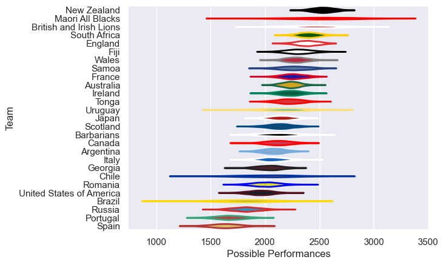

---  
title: "International Test Match 2013 Status"  
date: 2025-07-28 6:00:00 -0500  
categories: model review projection  
layout: article  
aside:  
    toc: true  
---
# Current Team Rankings

# Standings

## Current Standings

| Club                     |   Played |   Wins |   Point Differential |   Losing Bonus Points | Try Bonus Points   |   Competition Points |
|:-------------------------|---------:|-------:|---------------------:|----------------------:|:-------------------|---------------------:|
| New Zealand              |        8 |      8 |                  128 |                     0 |                    |                   32 |
| South Africa             |        6 |      6 |                  126 |                     0 |                    |                   24 |
| Fiji                     |        8 |      5 |                   62 |                     2 |                    |                   22 |
| Australia                |        9 |      5 |                   16 |                     2 |                    |                   22 |
| Japan                    |       10 |      5 |                   -5 |                     1 |                    |                   21 |
| England                  |        6 |      5 |                  100 |                     0 |                    |                   20 |
| Canada                   |        9 |      4 |                    3 |                     3 |                    |                   19 |
| Ireland                  |        5 |      3 |                   41 |                     1 |                    |                   13 |
| Wales                    |        6 |      3 |                   20 |                     1 |                    |                   13 |
| United States of America |        8 |      2 |                  -49 |                     2 |                    |                   10 |
| British and Irish Lions  |        3 |      2 |                   26 |                     1 |                    |                    9 |
| Georgia                  |        4 |      2 |                   -8 |                     1 |                    |                    9 |
| Samoa                    |        5 |      2 |                  -26 |                     1 |                    |                    9 |
| Tonga                    |        7 |      2 |                  -34 |                     1 |                    |                    9 |
| Italy                    |        7 |      1 |                  -92 |                     1 |                    |                    9 |
| Maori All Blacks         |        2 |      2 |                   35 |                     0 |                    |                    8 |
| Romania                  |        3 |      2 |                  -17 |                     0 |                    |                    8 |
| Argentina                |        6 |      2 |                  -91 |                     0 |                    |                    8 |
| Spain                    |        3 |      1 |                  -11 |                     1 |                    |                    5 |
| Scotland                 |        5 |      1 |                  -32 |                     1 |                    |                    5 |
| France                   |        6 |      1 |                  -51 |                     1 |                    |                    5 |
| Portugal                 |        3 |      1 |                    1 |                     0 |                    |                    4 |
| Uruguay                  |        1 |      1 |                    1 |                     0 |                    |                    4 |
| Barbarians               |        2 |      1 |                   -4 |                     0 |                    |                    4 |
| Chile                    |        1 |      0 |                  -23 |                     0 |                    |                    0 |
| Russia                   |        2 |      0 |                  -48 |                     0 |                    |                    0 |
| Brazil                   |        1 |      0 |                  -68 |                     0 |                    |                    0 |

# Completed Match Review

| Model | Percent Correct Predictions | Spread Error |
| ------ | ------ | ------ |
| Club Level | 71.4% | 14.5 |
| Player Level: Lineup | nan% | nan |
| Player Level: Minutes | nan% | nan |

