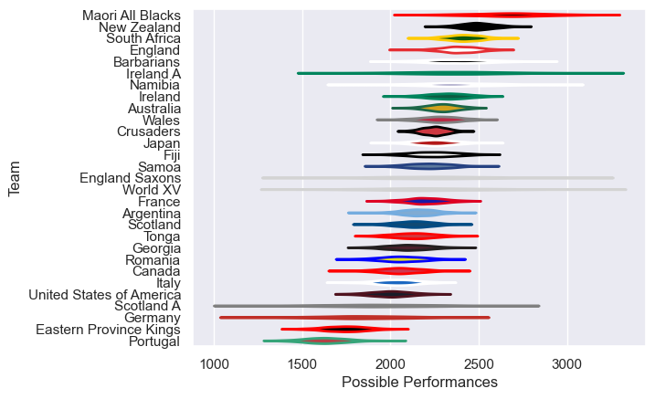

---  
title: "International Test Match 2014"  
date: 2025-07-29 6:00:00 -0500  
categories: model review projection  
layout: article  
aside:  
    toc: true  
---
# Current Team Rankings

# Standings

## Current Standings

| Club                     |   Played |   Wins |   Point Differential |   Losing Bonus Points | Try Bonus Points   |   Competition Points |
|:-------------------------|---------:|-------:|---------------------:|----------------------:|:-------------------|---------------------:|
| New Zealand              |        8 |      8 |                  127 |                     0 |                    |                   32 |
| South Africa             |        8 |      6 |                  105 |                     1 |                    |                   25 |
| Australia                |        9 |      5 |                   52 |                     3 |                    |                   23 |
| Ireland                  |        5 |      5 |                   77 |                     0 |                    |                   20 |
| Scotland                 |        7 |      5 |                    0 |                     0 |                    |                   20 |
| Japan                    |        7 |      4 |                  -18 |                     1 |                    |                   17 |
| England                  |        9 |      3 |                   14 |                     4 |                    |                   16 |
| Fiji                     |        6 |      3 |                   11 |                     2 |                    |                   14 |
| Wales                    |        7 |      3 |                  -14 |                     2 |                    |                   14 |
| Samoa                    |        7 |      3 |                  -18 |                     0 |                    |                   14 |
| Tonga                    |        5 |      2 |                  -11 |                     0 |                    |                   10 |
| Argentina                |        6 |      2 |                  -23 |                     2 |                    |                   10 |
| France                   |        6 |      2 |                  -36 |                     2 |                    |                   10 |
| United States of America |        7 |      2 |                 -115 |                     1 |                    |                    9 |
| Maori All Blacks         |        2 |      2 |                   42 |                     0 |                    |                    8 |
| Canada                   |        5 |      1 |                  -20 |                     2 |                    |                    6 |
| Italy                    |        6 |      1 |                  -37 |                     2 |                    |                    6 |
| Namibia                  |        3 |      1 |                   25 |                     1 |                    |                    5 |
| Barbarians               |        2 |      1 |                    6 |                     1 |                    |                    5 |
| Romania                  |        3 |      1 |                   -6 |                     1 |                    |                    5 |
| Portugal                 |        1 |      1 |                    9 |                     0 |                    |                    4 |
| Ireland A                |        1 |      1 |                    6 |                     0 |                    |                    4 |
| Georgia                  |        3 |      1 |                  -45 |                     0 |                    |                    4 |
| England Saxons           |        2 |      0 |                   -6 |                     1 |                    |                    3 |
| Scotland A               |        1 |      0 |                    0 |                     0 |                    |                    2 |
| Eastern Province Kings   |        1 |      0 |                  -22 |                     0 |                    |                    0 |
| Crusaders                |        1 |      0 |                  -31 |                     0 |                    |                    0 |
| World XV                 |        1 |      0 |                  -34 |                     0 |                    |                    0 |
| Germany                  |        1 |      0 |                  -38 |                     0 |                    |                    0 |

# Completed Match Review

| Model | Percent Correct Predictions | Spread Error |
| ------ | ------ | ------ |
| Club Level | 70.8% | 11.9 |
| Player Level: Lineup | nan% | nan |
| Player Level: Minutes | nan% | nan |

