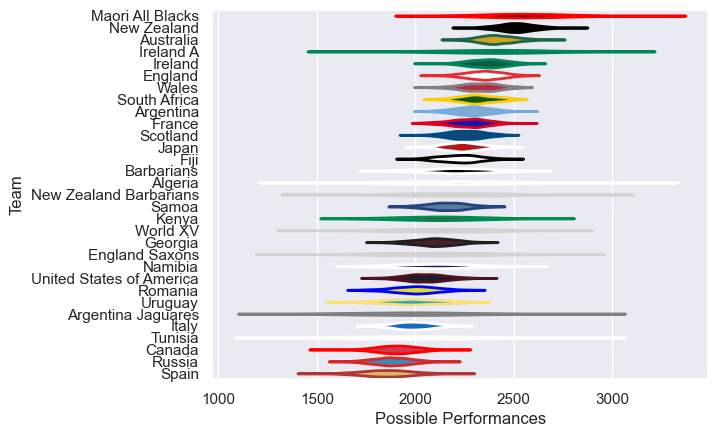

---  
title: "International Test Match 2015"  
date: 2025-07-29 6:00:00 -0500  
categories: model review projection  
layout: article  
aside:  
    toc: true  
---
# Current Team Rankings

# Standings

## Current Standings

| Club                     |   Played |   Wins |   Point Differential |   Losing Bonus Points | Try Bonus Points   |   Competition Points |
|:-------------------------|---------:|-------:|---------------------:|----------------------:|:-------------------|---------------------:|
| England                  |        4 |      3 |                   69 |                     1 |                    |                   13 |
| Japan                    |        3 |      3 |                   65 |                     0 |                    |                   12 |
| Scotland                 |        4 |      2 |                   36 |                     2 |                    |                   10 |
| Ireland                  |        5 |      2 |                    5 |                     2 |                    |                   10 |
| France                   |        3 |      2 |                    3 |                     1 |                    |                    9 |
| Namibia                  |        2 |      2 |                   60 |                     0 |                    |                    8 |
| South Africa             |        2 |      2 |                   50 |                     0 |                    |                    8 |
| New Zealand              |        2 |      2 |                   37 |                     0 |                    |                    8 |
| Wales                    |        3 |      2 |                   -4 |                     0 |                    |                    8 |
| Fiji                     |        2 |      1 |                   28 |                     1 |                    |                    5 |
| Argentina                |        3 |      1 |                    0 |                     1 |                    |                    5 |
| Romania                  |        1 |      1 |                   23 |                     0 |                    |                    4 |
| New Zealand Barbarians   |        1 |      1 |                   17 |                     0 |                    |                    4 |
| Algeria                  |        1 |      1 |                   10 |                     0 |                    |                    4 |
| Australia                |        2 |      1 |                    9 |                     0 |                    |                    4 |
| England Saxons           |        1 |      1 |                    9 |                     0 |                    |                    4 |
| Kenya                    |        1 |      1 |                    9 |                     0 |                    |                    4 |
| Argentina Jaguares       |        2 |      1 |                  -14 |                     0 |                    |                    4 |
| Maori All Blacks         |        2 |      1 |                  -16 |                     0 |                    |                    4 |
| United States of America |        2 |      1 |                  -19 |                     0 |                    |                    4 |
| Canada                   |        3 |      1 |                  -46 |                     0 |                    |                    4 |
| Uruguay                  |        3 |      1 |                  -58 |                     0 |                    |                    4 |
| Barbarians               |        3 |      1 |                  -78 |                     0 |                    |                    4 |
| Georgia                  |        2 |      0 |                   -4 |                     2 |                    |                    2 |
| Italy                    |        3 |      0 |                  -49 |                     2 |                    |                    2 |
| Ireland A                |        1 |      0 |                   -9 |                     0 |                    |                    0 |
| Samoa                    |        1 |      0 |                   -9 |                     0 |                    |                    0 |
| Tunisia                  |        1 |      0 |                  -10 |                     0 |                    |                    0 |
| Spain                    |        2 |      0 |                  -18 |                     0 |                    |                    0 |
| World XV                 |        1 |      0 |                  -36 |                     0 |                    |                    0 |
| Russia                   |        2 |      0 |                  -60 |                     0 |                    |                    0 |

# Completed Match Review

| Model | Percent Correct Predictions | Spread Error |
| ------ | ------ | ------ |
| Club Level | 76.5% | 15.4 |
| Player Level: Lineup | nan% | nan |
| Player Level: Minutes | nan% | nan |

