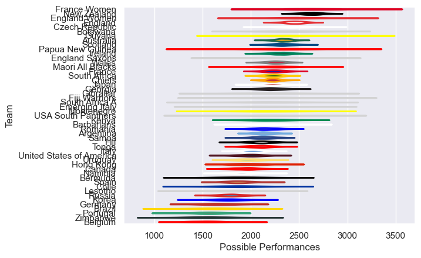

---  
title: "International Test Match 2016 Status"  
date: 2025-07-28 6:00:00 -0500  
categories: model review projection  
layout: article  
aside:  
    toc: true  
---
# Current Team Rankings

# Standings

## Current Standings

| Club                     |   Played |   Wins |   Point Differential |   Losing Bonus Points |   Try Bonus Points |   Competition Points |
|:-------------------------|---------:|-------:|---------------------:|----------------------:|-------------------:|---------------------:|
| England                  |        8 |      8 |                  133 |                     0 |                  5 |                   37 |
| New Zealand              |        8 |      7 |                  163 |                     0 |                  6 |                   34 |
| Romania                  |        6 |      6 |                  108 |                     0 |                    |                   24 |
| Ireland                  |        7 |      4 |                   27 |                     2 |                  2 |                   20 |
| Scotland                 |        5 |      4 |                   47 |                     1 |                  1 |                   18 |
| Argentina                |        9 |      4 |                   28 |                     2 |                    |                   18 |
| Australia                |        9 |      3 |                  -50 |                     2 |                  3 |                   17 |
| Georgia                  |        6 |      3 |                  -15 |                     1 |                    |                   15 |
| Italy                    |        6 |      3 |                  -58 |                     2 |                    |                   14 |
| Tonga                    |        4 |      3 |                   17 |                     1 |                    |                   13 |
| South Africa             |        7 |      2 |                  -26 |                     2 |                  1 |                   13 |
| Germany                  |        3 |      3 |                   35 |                     0 |                    |                   12 |
| Russia                   |        5 |      3 |                   11 |                     0 |                    |                   12 |
| Wales                    |        9 |      3 |                 -122 |                     0 |                    |                   12 |
| France                   |        5 |      2 |                   53 |                     2 |                  1 |                   11 |
| Japan                    |        7 |      2 |                  -58 |                     2 |                  1 |                   11 |
| Barbarians               |        3 |      2 |                  104 |                     0 |                    |                   10 |
| Kenya                    |        2 |      2 |                   25 |                     0 |                    |                    8 |
| Hong Kong                |        4 |      2 |                   18 |                     0 |                    |                    8 |
| England Saxons           |        2 |      2 |                   11 |                     0 |                    |                    8 |
| Portugal                 |        2 |      2 |                    9 |                     0 |                    |                    8 |
| Canada                   |        6 |      1 |                  -19 |                     4 |                    |                    8 |
| Samoa                    |        4 |      1 |                  -46 |                     1 |                    |                    7 |
| United States of America |        5 |      1 |                  -42 |                     2 |                    |                    6 |
| Uruguay                  |        7 |      1 |                  -86 |                     2 |                    |                    6 |
| Chile                    |        2 |      1 |                   16 |                     1 |                    |                    5 |
| Zimbabwe                 |        3 |      1 |                    0 |                     1 |                    |                    5 |
| Spain                    |        5 |      1 |                  -52 |                     1 |                    |                    5 |
| Gibraltar                |        1 |      1 |                   48 |                     0 |                    |                    4 |
| Maori All Blacks         |        1 |      1 |                   47 |                     0 |                    |                    4 |
| Botswana                 |        1 |      1 |                   36 |                     0 |                    |                    4 |
| Chiefs                   |        1 |      1 |                   33 |                     0 |                    |                    4 |
| USA South Panthers       |        1 |      1 |                   33 |                     0 |                    |                    4 |
| Fiji Warriors            |        1 |      1 |                   14 |                     0 |                    |                    4 |
| Emerging Italy           |        1 |      1 |                    2 |                     0 |                    |                    4 |
| Namibia                  |        2 |      1 |                  -10 |                     0 |                    |                    4 |
| Korea                    |        2 |      1 |                  -16 |                     0 |                    |                    4 |
| Fiji                     |        4 |      1 |                  -74 |                     0 |                    |                    4 |
| Brazil                   |        4 |      0 |                  -37 |                     2 |                    |                    2 |
| Belgium                  |        1 |      0 |                   -5 |                     1 |                    |                    1 |
| South Africa A           |        2 |      0 |                  -11 |                     1 |                    |                    1 |
| Bermuda                  |        1 |      0 |                  -33 |                     0 |                    |                    0 |
| Lesotho                  |        1 |      0 |                  -36 |                     0 |                    |                    0 |
| Montenegro               |        1 |      0 |                  -48 |                     0 |                    |                    0 |
| Czech Republic           |        1 |      0 |                  -71 |                     0 |                    |                    0 |
| Papua New Guinea         |        3 |      0 |                 -103 |                     0 |                    |                    0 |

## Projected Remaining Table

| Club          |   To Play |   Projected Wins |   Projected Differential |   Projected Losing Bonus Points | Projected Try Bonus Points   |   Projected Competition Points |
|:--------------|----------:|-----------------:|-------------------------:|--------------------------------:|:-----------------------------|-------------------------------:|
| Guyana        |         1 |             0.79 |                    23.2  |                            0.1  |                              |                           3.28 |
| England Women |         1 |             0.58 |                     2.21 |                            0.17 |                              |                           2.57 |
| France Women  |         1 |             0.38 |                    -2.21 |                            0.18 |                              |                           1.78 |
| Brazil        |         1 |             0.2  |                   -23.2  |                            0.14 |                              |                           0.96 |

## Projected Total Table

| Club                     |   Played |   Wins |   Point Differential |   Losing Bonus Points |   Try Bonus Points |   Competition Points |
|:-------------------------|---------:|-------:|---------------------:|----------------------:|-------------------:|---------------------:|
| England                  |        8 |   8    |               133    |                  0    |                  5 |                37    |
| New Zealand              |        8 |   7    |               163    |                  0    |                  6 |                34    |
| Romania                  |        6 |   6    |               108    |                  0    |                    |                24    |
| Ireland                  |        7 |   4    |                27    |                  2    |                  2 |                20    |
| Scotland                 |        5 |   4    |                47    |                  1    |                  1 |                18    |
| Argentina                |        9 |   4    |                28    |                  2    |                    |                18    |
| Australia                |        9 |   3    |               -50    |                  2    |                  3 |                17    |
| Georgia                  |        6 |   3    |               -15    |                  1    |                    |                15    |
| Italy                    |        6 |   3    |               -58    |                  2    |                    |                14    |
| Tonga                    |        4 |   3    |                17    |                  1    |                    |                13    |
| South Africa             |        7 |   2    |               -26    |                  2    |                  1 |                13    |
| Germany                  |        3 |   3    |                35    |                  0    |                    |                12    |
| Russia                   |        5 |   3    |                11    |                  0    |                    |                12    |
| Wales                    |        9 |   3    |              -122    |                  0    |                    |                12    |
| France                   |        5 |   2    |                53    |                  2    |                  1 |                11    |
| Japan                    |        7 |   2    |               -58    |                  2    |                  1 |                11    |
| Barbarians               |        3 |   2    |               104    |                  0    |                    |                10    |
| Kenya                    |        2 |   2    |                25    |                  0    |                    |                 8    |
| Hong Kong                |        4 |   2    |                18    |                  0    |                    |                 8    |
| England Saxons           |        2 |   2    |                11    |                  0    |                    |                 8    |
| Portugal                 |        2 |   2    |                 9    |                  0    |                    |                 8    |
| Canada                   |        6 |   1    |               -19    |                  4    |                    |                 8    |
| Samoa                    |        4 |   1    |               -46    |                  1    |                    |                 7    |
| United States of America |        5 |   1    |               -42    |                  2    |                    |                 6    |
| Uruguay                  |        7 |   1    |               -86    |                  2    |                    |                 6    |
| Chile                    |        2 |   1    |                16    |                  1    |                    |                 5    |
| Zimbabwe                 |        3 |   1    |                 0    |                  1    |                    |                 5    |
| Spain                    |        5 |   1    |               -52    |                  1    |                    |                 5    |
| Gibraltar                |        1 |   1    |                48    |                  0    |                    |                 4    |
| Maori All Blacks         |        1 |   1    |                47    |                  0    |                    |                 4    |
| Botswana                 |        1 |   1    |                36    |                  0    |                    |                 4    |
| Chiefs                   |        1 |   1    |                33    |                  0    |                    |                 4    |
| USA South Panthers       |        1 |   1    |                33    |                  0    |                    |                 4    |
| Fiji Warriors            |        1 |   1    |                14    |                  0    |                    |                 4    |
| Emerging Italy           |        1 |   1    |                 2    |                  0    |                    |                 4    |
| Namibia                  |        2 |   1    |               -10    |                  0    |                    |                 4    |
| Korea                    |        2 |   1    |               -16    |                  0    |                    |                 4    |
| Fiji                     |        4 |   1    |               -74    |                  0    |                    |                 4    |
| Guyana                   |        1 |   0.79 |                23.2  |                  0.1  |                    |                 3.28 |
| Brazil                   |        5 |   0.2  |               -60.2  |                  2.14 |                    |                 2.96 |
| England Women            |        1 |   0.58 |                 2.21 |                  0.17 |                    |                 2.57 |
| France Women             |        1 |   0.38 |                -2.21 |                  0.18 |                    |                 1.78 |
| Belgium                  |        1 |   0    |                -5    |                  1    |                    |                 1    |
| South Africa A           |        2 |   0    |               -11    |                  1    |                    |                 1    |
| Bermuda                  |        1 |   0    |               -33    |                  0    |                    |                 0    |
| Lesotho                  |        1 |   0    |               -36    |                  0    |                    |                 0    |
| Montenegro               |        1 |   0    |               -48    |                  0    |                    |                 0    |
| Czech Republic           |        1 |   0    |               -71    |                  0    |                    |                 0    |
| Papua New Guinea         |        3 |   0    |              -103    |                  0    |                    |                 0    |

# Completed Match Review

| Model | Percent Correct Predictions | Spread Error |
| ------ | ------ | ------ |
| Club Level | 60.6% | 15.8 |
| Player Level: Lineup | nan% | nan |
| Player Level: Minutes | nan% | nan |

# Future Predictions

## Week 10

### Brazil V Guyana on 2016/06/25

Average Margin: Guyana by 21.7

## Week 11

### England Women V France Women on 2016/11/09

Average Margin: England Women by 1.5

