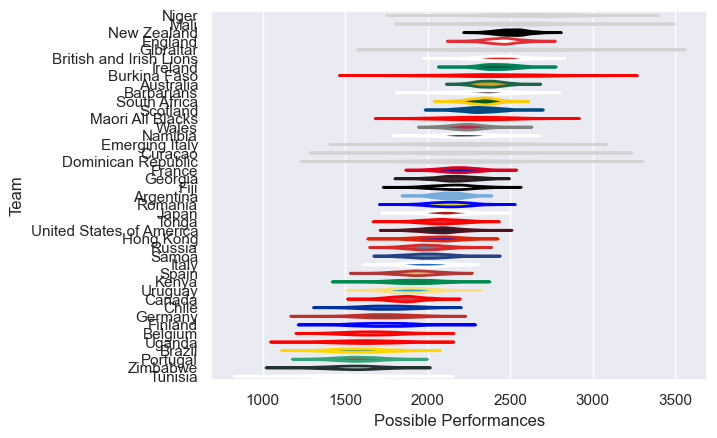

---  
title: "International Test Match 2017"  
date: 2025-07-29 6:00:00 -0500  
categories: model review projection  
layout: article  
aside:  
    toc: true  
---
# Current Team Rankings

# Standings

## Current Standings

| Club                     |   Played |   Wins |   Point Differential |   Losing Bonus Points |   Try Bonus Points |   Competition Points |
|:-------------------------|---------:|-------:|---------------------:|----------------------:|-------------------:|---------------------:|
| Argentina                |       14 |      8 |                  198 |                     2 |                  2 |                   38 |
| New Zealand              |       10 |      7 |                  139 |                     2 |                  4 |                   36 |
| Uruguay                  |       10 |      8 |                   38 |                     1 |                  1 |                   34 |
| United States of America |       11 |      6 |                  143 |                     2 |                  1 |                   31 |
| Ireland                  |        6 |      6 |                  133 |                     0 |                  4 |                   28 |
| England                  |        6 |      6 |                   99 |                     0 |                  4 |                   28 |
| Australia                |        8 |      5 |                   24 |                     1 |                  5 |                   26 |
| South Africa             |        7 |      5 |                   61 |                     1 |                  3 |                   24 |
| Russia                   |        6 |      5 |                   74 |                     1 |                    |                   21 |
| Scotland                 |        6 |      4 |                   51 |                     2 |                  3 |                   21 |
| Brazil                   |       11 |      4 |                 -180 |                     0 |                    |                   20 |
| Namibia                  |        8 |      4 |                   47 |                     2 |                  1 |                   19 |
| Georgia                  |        6 |      4 |                   27 |                     1 |                    |                   17 |
| Wales                    |        6 |      4 |                    6 |                     0 |                    |                   16 |
| Hong Kong                |        5 |      3 |                   23 |                     1 |                    |                   15 |
| Fiji                     |        6 |      3 |                   13 |                     1 |                  1 |                   14 |
| Kenya                    |        9 |      2 |                   48 |                     1 |                    |                   13 |
| Canada                   |       13 |      2 |                 -184 |                     2 |                    |                   12 |
| Japan                    |        6 |      2 |                  -38 |                     0 |                  1 |                   11 |
| Romania                  |        4 |      2 |                    3 |                     1 |                    |                    9 |
| Chile                    |        9 |      2 |                 -145 |                     1 |                    |                    9 |
| Spain                    |        5 |      2 |                  -11 |                     0 |                    |                    8 |
| Germany                  |        4 |      2 |                  -17 |                     0 |                    |                    8 |
| Uganda                   |        3 |      1 |                   37 |                     0 |                    |                    6 |
| Burkina Faso             |        2 |      1 |                    6 |                     0 |                    |                    6 |
| British and Irish Lions  |        3 |      1 |                  -12 |                     0 |                    |                    6 |
| Belgium                  |        2 |      1 |                    7 |                     1 |                    |                    5 |
| Mali                     |        2 |      1 |                    7 |                     1 |                    |                    5 |
| Italy                    |        6 |      1 |                  -73 |                     1 |                    |                    5 |
| Maori All Blacks         |        1 |      1 |                   42 |                     0 |                    |                    4 |
| Dominican Republic       |        1 |      1 |                   24 |                     0 |                    |                    4 |
| Gibraltar                |        1 |      1 |                    5 |                     0 |                    |                    4 |
| Tonga                    |        3 |      1 |                  -46 |                     0 |                    |                    4 |
| France                   |        7 |      0 |                  -94 |                     2 |                    |                    4 |
| Samoa                    |        5 |      0 |                 -124 |                     3 |                  1 |                    4 |
| Niger                    |        2 |      0 |                  -13 |                     0 |                    |                    2 |
| Finland                  |        1 |      0 |                   -5 |                     1 |                    |                    1 |
| Portugal                 |        2 |      0 |                  -15 |                     1 |                    |                    1 |
| Zimbabwe                 |        2 |      0 |                  -24 |                     1 |                    |                    1 |
| Emerging Italy           |        3 |      0 |                  -30 |                     1 |                    |                    1 |
| Barbarians               |        2 |      0 |                  -23 |                     0 |                    |                    0 |
| Curacao                  |        1 |      0 |                  -24 |                     0 |                    |                    0 |
| Tunisia                  |        3 |      0 |                 -197 |                     0 |                    |                    0 |

## Projected Remaining Table

| Club   |   To Play |   Projected Wins |   Projected Differential |   Projected Losing Bonus Points | Projected Try Bonus Points   |   Projected Competition Points |
|:-------|----------:|-----------------:|-------------------------:|--------------------------------:|:-----------------------------|-------------------------------:|
| Brazil |         1 |            0.611 |                    4.747 |                           0.182 |                              |                          2.706 |
| Chile  |         1 |            0.349 |                   -4.747 |                           0.219 |                              |                          1.695 |

## Projected Total Table

| Club                     |   Played |   Wins |   Point Differential |   Losing Bonus Points |   Try Bonus Points |   Competition Points |
|:-------------------------|---------:|-------:|---------------------:|----------------------:|-------------------:|---------------------:|
| Argentina                |       14 |  8     |              198     |                 2     |                  2 |               38     |
| New Zealand              |       10 |  7     |              139     |                 2     |                  4 |               36     |
| Uruguay                  |       10 |  8     |               38     |                 1     |                  1 |               34     |
| United States of America |       11 |  6     |              143     |                 2     |                  1 |               31     |
| Ireland                  |        6 |  6     |              133     |                 0     |                  4 |               28     |
| England                  |        6 |  6     |               99     |                 0     |                  4 |               28     |
| Australia                |        8 |  5     |               24     |                 1     |                  5 |               26     |
| South Africa             |        7 |  5     |               61     |                 1     |                  3 |               24     |
| Brazil                   |       12 |  4.611 |             -175.253 |                 0.182 |                    |               22.706 |
| Russia                   |        6 |  5     |               74     |                 1     |                    |               21     |
| Scotland                 |        6 |  4     |               51     |                 2     |                  3 |               21     |
| Namibia                  |        8 |  4     |               47     |                 2     |                  1 |               19     |
| Georgia                  |        6 |  4     |               27     |                 1     |                    |               17     |
| Wales                    |        6 |  4     |                6     |                 0     |                    |               16     |
| Hong Kong                |        5 |  3     |               23     |                 1     |                    |               15     |
| Fiji                     |        6 |  3     |               13     |                 1     |                  1 |               14     |
| Kenya                    |        9 |  2     |               48     |                 1     |                    |               13     |
| Canada                   |       13 |  2     |             -184     |                 2     |                    |               12     |
| Japan                    |        6 |  2     |              -38     |                 0     |                  1 |               11     |
| Chile                    |       10 |  2.349 |             -149.747 |                 1.219 |                    |               10.695 |
| Romania                  |        4 |  2     |                3     |                 1     |                    |                9     |
| Spain                    |        5 |  2     |              -11     |                 0     |                    |                8     |
| Germany                  |        4 |  2     |              -17     |                 0     |                    |                8     |
| Uganda                   |        3 |  1     |               37     |                 0     |                    |                6     |
| Burkina Faso             |        2 |  1     |                6     |                 0     |                    |                6     |
| British and Irish Lions  |        3 |  1     |              -12     |                 0     |                    |                6     |
| Belgium                  |        2 |  1     |                7     |                 1     |                    |                5     |
| Mali                     |        2 |  1     |                7     |                 1     |                    |                5     |
| Italy                    |        6 |  1     |              -73     |                 1     |                    |                5     |
| Maori All Blacks         |        1 |  1     |               42     |                 0     |                    |                4     |
| Dominican Republic       |        1 |  1     |               24     |                 0     |                    |                4     |
| Gibraltar                |        1 |  1     |                5     |                 0     |                    |                4     |
| Tonga                    |        3 |  1     |              -46     |                 0     |                    |                4     |
| France                   |        7 |  0     |              -94     |                 2     |                    |                4     |
| Samoa                    |        5 |  0     |             -124     |                 3     |                  1 |                4     |
| Niger                    |        2 |  0     |              -13     |                 0     |                    |                2     |
| Finland                  |        1 |  0     |               -5     |                 1     |                    |                1     |
| Portugal                 |        2 |  0     |              -15     |                 1     |                    |                1     |
| Zimbabwe                 |        2 |  0     |              -24     |                 1     |                    |                1     |
| Emerging Italy           |        3 |  0     |              -30     |                 1     |                    |                1     |
| Barbarians               |        2 |  0     |              -23     |                 0     |                    |                0     |
| Curacao                  |        1 |  0     |              -24     |                 0     |                    |                0     |
| Tunisia                  |        3 |  0     |             -197     |                 0     |                    |                0     |

# Completed Match Review

| Model | Percent Correct Predictions | Spread Error |
| ------ | ------ | ------ |
| Club Level | 67.0% | 15.8 |
| Player Level: Lineup | nan% | nan |
| Player Level: Minutes | nan% | nan |

# Future Predictions

## Week 15

### Brazil V Chile on 2017/06/17

Average Margin: Brazil by 4.7

