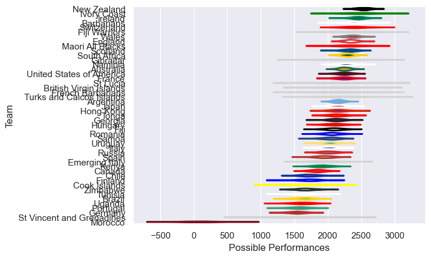

---  
title: "International Test Match 2018 Status"  
date: 2025-07-28 6:00:00 -0500  
categories: model review projection  
layout: article  
aside:  
    toc: true  
---
# Current Team Rankings

# Standings

## Current Standings

| Club                      |   Played |   Wins |   Point Differential |   Losing Bonus Points |   Try Bonus Points |   Competition Points |
|:--------------------------|---------:|-------:|---------------------:|----------------------:|-------------------:|---------------------:|
| United States of America  |       12 |     10 |                  149 |                     0 |                  2 |                   42 |
| New Zealand               |        8 |      7 |                  201 |                     1 |                  6 |                   35 |
| Uruguay                   |       10 |      8 |                   48 |                     0 |                    |                   32 |
| Wales                     |        7 |      7 |                  106 |                     0 |                  1 |                   29 |
| Ireland                   |        7 |      6 |                  108 |                     0 |                  1 |                   25 |
| Namibia                   |        8 |      6 |                  236 |                     0 |                    |                   24 |
| England                   |        8 |      4 |                   22 |                     2 |                  4 |                   22 |
| Scotland                  |        7 |      4 |                   91 |                     2 |                  3 |                   21 |
| Canada                    |       12 |      5 |                   -2 |                     1 |                    |                   21 |
| Argentina                 |       13 |      4 |                    0 |                     4 |                    |                   20 |
| South Africa              |        8 |      4 |                   -4 |                     2 |                  1 |                   19 |
| Georgia                   |        7 |      4 |                  -40 |                     0 |                  1 |                   17 |
| Fiji                      |        7 |      3 |                  -14 |                     0 |                    |                   16 |
| Kenya                     |        8 |      4 |                  -37 |                     0 |                    |                   16 |
| Japan                     |        6 |      3 |                  -11 |                     1 |                  2 |                   15 |
| Samoa                     |        7 |      3 |                   62 |                     2 |                    |                   14 |
| Maori All Blacks          |        3 |      3 |                  142 |                     0 |                  1 |                   13 |
| Hong Kong                 |        5 |      3 |                   65 |                     0 |                    |                   12 |
| Australia                 |        7 |      2 |                  -20 |                     3 |                  1 |                   12 |
| Russia                    |        4 |      2 |                   -4 |                     1 |                  1 |                   10 |
| Barbarians                |        2 |      2 |                   21 |                     0 |                  1 |                    9 |
| Tonga                     |        5 |      2 |                  -44 |                     1 |                    |                    9 |
| Gibraltar                 |        2 |      2 |                   31 |                     0 |                    |                    8 |
| Uganda                    |        5 |      2 |                  -12 |                     0 |                    |                    8 |
| Germany                   |        5 |      2 |                  -30 |                     0 |                    |                    8 |
| Italy                     |        6 |      2 |                 -132 |                     0 |                    |                    8 |
| Tunisia                   |        5 |      2 |                 -213 |                     0 |                    |                    8 |
| Zimbabwe                  |        5 |      1 |                  -23 |                     1 |                    |                    7 |
| France                    |        6 |      1 |                  -84 |                     2 |                    |                    6 |
| Romania                   |        3 |      1 |                   -3 |                     1 |                    |                    5 |
| Turks and Caicos Islands  |        1 |      1 |                   51 |                     0 |                    |                    4 |
| Spain                     |        2 |      1 |                    3 |                     0 |                    |                    4 |
| St Vincent and Grenadines |        1 |      1 |                    3 |                     0 |                    |                    4 |
| Switzerland               |        1 |      1 |                    3 |                     0 |                    |                    4 |
| Brazil                    |        6 |      1 |                 -126 |                     0 |                    |                    4 |
| Morocco                   |        5 |      0 |                 -101 |                     1 |                    |                    3 |
| French Barbarians         |        1 |      0 |                   -1 |                     1 |                    |                    1 |
| Ivory Coast               |        1 |      0 |                   -3 |                     1 |                    |                    1 |
| St Lucia                  |        1 |      0 |                   -3 |                     1 |                    |                    1 |
| Emerging Italy            |        1 |      0 |                   -4 |                     1 |                    |                    1 |
| Portugal                  |        2 |      0 |                  -36 |                     1 |                    |                    1 |
| Chile                     |        6 |      0 |                 -220 |                     1 |                    |                    1 |
| Finland                   |        1 |      0 |                  -12 |                     0 |                    |                    0 |
| Fiji Warriors             |        1 |      0 |                  -19 |                     0 |                    |                    0 |
| Hungary                   |        1 |      0 |                  -19 |                     0 |                    |                    0 |
| British Virgin Islands    |        1 |      0 |                  -51 |                     0 |                    |                    0 |
| Cook Islands              |        2 |      0 |                  -74 |                     0 |                    |                    0 |

# Completed Match Review

| Model | Percent Correct Predictions | Spread Error |
| ------ | ------ | ------ |
| Club Level | 73.0% | 19.5 |
| Player Level: Lineup | nan% | nan |
| Player Level: Minutes | nan% | nan |

