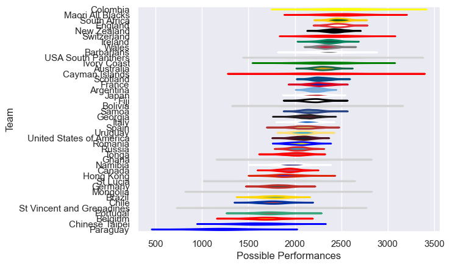

---  
title: "International Test Match 2019 Status"  
date: 2025-07-28 6:00:00 -0500  
categories: model review projection  
layout: article  
aside:  
    toc: true  
---
# Current Team Rankings

# Standings

## Current Standings

| Club                      |   Played |   Wins |   Point Differential |   Losing Bonus Points |   Try Bonus Points |   Competition Points |
|:--------------------------|---------:|-------:|---------------------:|----------------------:|-------------------:|---------------------:|
| Uruguay                   |       12 |      9 |                   94 |                     1 |                    |                   37 |
| Argentina                 |       11 |      8 |                  313 |                     1 |                    |                   33 |
| England                   |        5 |      4 |                   94 |                     1 |                  2 |                   19 |
| United States of America  |        6 |      4 |                   40 |                     1 |                    |                   17 |
| Spain                     |        4 |      4 |                   55 |                     0 |                    |                   16 |
| Brazil                    |       10 |      3 |                 -133 |                     3 |                    |                   15 |
| Scotland                  |        4 |      3 |                   35 |                     0 |                  2 |                   14 |
| Fiji                      |        4 |      3 |                   20 |                     0 |                  2 |                   14 |
| Ireland                   |        4 |      3 |                   -9 |                     0 |                  1 |                   13 |
| France                    |        3 |      2 |                   54 |                     1 |                  2 |                   11 |
| New Zealand               |        2 |      2 |                  121 |                     0 |                  1 |                    9 |
| South Africa              |        2 |      2 |                   40 |                     0 |                  1 |                    9 |
| Portugal                  |        3 |      2 |                    8 |                     1 |                    |                    9 |
| Wales                     |        5 |      2 |                  -11 |                     1 |                    |                    9 |
| Romania                   |        2 |      2 |                   17 |                     0 |                    |                    8 |
| Russia                    |        4 |      2 |                  -64 |                     0 |                    |                    8 |
| Chile                     |       11 |      1 |                 -258 |                     4 |                    |                    8 |
| Canada                    |        6 |      1 |                   19 |                     3 |                    |                    7 |
| Ivory Coast               |        2 |      1 |                    1 |                     0 |                    |                    6 |
| Barbarians                |        4 |      1 |                    5 |                     1 |                    |                    5 |
| Maori All Blacks          |        2 |      1 |                   -8 |                     0 |                  1 |                    5 |
| Italy                     |        4 |      1 |                  -14 |                     0 |                  1 |                    5 |
| Australia                 |        2 |      1 |                  -17 |                     0 |                  1 |                    5 |
| Paraguay                  |        3 |      1 |                   36 |                     0 |                    |                    4 |
| St Lucia                  |        1 |      1 |                   27 |                     0 |                    |                    4 |
| USA South Panthers        |        1 |      1 |                   18 |                     0 |                    |                    4 |
| Mongolia                  |        1 |      1 |                    2 |                     0 |                    |                    4 |
| Hong Kong                 |        2 |      1 |                   -3 |                     0 |                    |                    4 |
| Namibia                   |        3 |      1 |                  -32 |                     0 |                    |                    4 |
| Colombia                  |        3 |      1 |                  -60 |                     0 |                    |                    4 |
| Switzerland               |        1 |      0 |                    0 |                     0 |                    |                    2 |
| Ghana                     |        1 |      0 |                   -1 |                     1 |                    |                    1 |
| Chinese Taipei            |        1 |      0 |                   -2 |                     1 |                    |                    1 |
| Germany                   |        1 |      0 |                   -5 |                     1 |                    |                    1 |
| Cayman Islands            |        1 |      0 |                  -18 |                     0 |                    |                    0 |
| Belgium                   |        1 |      0 |                  -19 |                     0 |                    |                    0 |
| Samoa                     |        1 |      0 |                  -19 |                     0 |                    |                    0 |
| St Vincent and Grenadines |        1 |      0 |                  -27 |                     0 |                    |                    0 |
| Japan                     |        1 |      0 |                  -34 |                     0 |                    |                    0 |
| Georgia                   |        2 |      0 |                  -61 |                     0 |                    |                    0 |
| Tonga                     |        2 |      0 |                  -95 |                     0 |                    |                    0 |
| Bolivia                   |        1 |      0 |                 -109 |                     0 |                    |                    0 |

## Projected Remaining Table

| Club    |   To Play |   Projected Wins |   Projected Differential |   Projected Losing Bonus Points | Projected Try Bonus Points   |   Projected Competition Points |
|:--------|----------:|-----------------:|-------------------------:|--------------------------------:|:-----------------------------|-------------------------------:|
| Georgia |         1 |             0.62 |                     2.89 |                            0.15 |                              |                           2.71 |
| Russia  |         1 |             0.34 |                    -2.89 |                            0.26 |                              |                           1.7  |

## Projected Total Table

| Club                      |   Played |   Wins |   Point Differential |   Losing Bonus Points |   Try Bonus Points |   Competition Points |
|:--------------------------|---------:|-------:|---------------------:|----------------------:|-------------------:|---------------------:|
| Uruguay                   |       12 |   9    |                94    |                  1    |                    |                37    |
| Argentina                 |       11 |   8    |               313    |                  1    |                    |                33    |
| England                   |        5 |   4    |                94    |                  1    |                  2 |                19    |
| United States of America  |        6 |   4    |                40    |                  1    |                    |                17    |
| Spain                     |        4 |   4    |                55    |                  0    |                    |                16    |
| Brazil                    |       10 |   3    |              -133    |                  3    |                    |                15    |
| Scotland                  |        4 |   3    |                35    |                  0    |                  2 |                14    |
| Fiji                      |        4 |   3    |                20    |                  0    |                  2 |                14    |
| Ireland                   |        4 |   3    |                -9    |                  0    |                  1 |                13    |
| France                    |        3 |   2    |                54    |                  1    |                  2 |                11    |
| Russia                    |        5 |   2.34 |               -66.89 |                  0.26 |                    |                 9.7  |
| New Zealand               |        2 |   2    |               121    |                  0    |                  1 |                 9    |
| South Africa              |        2 |   2    |                40    |                  0    |                  1 |                 9    |
| Portugal                  |        3 |   2    |                 8    |                  1    |                    |                 9    |
| Wales                     |        5 |   2    |               -11    |                  1    |                    |                 9    |
| Romania                   |        2 |   2    |                17    |                  0    |                    |                 8    |
| Chile                     |       11 |   1    |              -258    |                  4    |                    |                 8    |
| Canada                    |        6 |   1    |                19    |                  3    |                    |                 7    |
| Ivory Coast               |        2 |   1    |                 1    |                  0    |                    |                 6    |
| Barbarians                |        4 |   1    |                 5    |                  1    |                    |                 5    |
| Maori All Blacks          |        2 |   1    |                -8    |                  0    |                  1 |                 5    |
| Italy                     |        4 |   1    |               -14    |                  0    |                  1 |                 5    |
| Australia                 |        2 |   1    |               -17    |                  0    |                  1 |                 5    |
| Paraguay                  |        3 |   1    |                36    |                  0    |                    |                 4    |
| St Lucia                  |        1 |   1    |                27    |                  0    |                    |                 4    |
| USA South Panthers        |        1 |   1    |                18    |                  0    |                    |                 4    |
| Mongolia                  |        1 |   1    |                 2    |                  0    |                    |                 4    |
| Hong Kong                 |        2 |   1    |                -3    |                  0    |                    |                 4    |
| Namibia                   |        3 |   1    |               -32    |                  0    |                    |                 4    |
| Colombia                  |        3 |   1    |               -60    |                  0    |                    |                 4    |
| Georgia                   |        3 |   0.62 |               -58.11 |                  0.15 |                    |                 2.71 |
| Switzerland               |        1 |   0    |                 0    |                  0    |                    |                 2    |
| Ghana                     |        1 |   0    |                -1    |                  1    |                    |                 1    |
| Chinese Taipei            |        1 |   0    |                -2    |                  1    |                    |                 1    |
| Germany                   |        1 |   0    |                -5    |                  1    |                    |                 1    |
| Cayman Islands            |        1 |   0    |               -18    |                  0    |                    |                 0    |
| Belgium                   |        1 |   0    |               -19    |                  0    |                    |                 0    |
| Samoa                     |        1 |   0    |               -19    |                  0    |                    |                 0    |
| St Vincent and Grenadines |        1 |   0    |               -27    |                  0    |                    |                 0    |
| Japan                     |        1 |   0    |               -34    |                  0    |                    |                 0    |
| Tonga                     |        2 |   0    |               -95    |                  0    |                    |                 0    |
| Bolivia                   |        1 |   0    |              -109    |                  0    |                    |                 0    |

# Completed Match Review

| Model | Percent Correct Predictions | Spread Error |
| ------ | ------ | ------ |
| Club Level | 68.9% | 20.0 |
| Player Level: Lineup | nan% | nan |
| Player Level: Minutes | nan% | nan |

# Future Predictions

## Week 13

### Georgia V Russia on 2019/08/27

Average Margin: Georgia by 5.2

