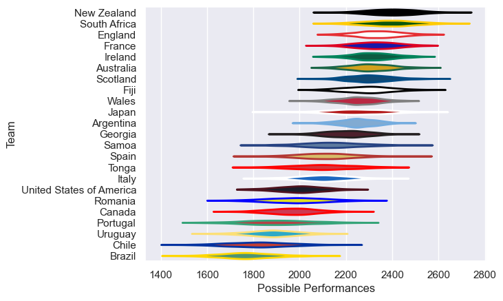

---  
title: "International Test Match 2020 Status"  
date: 2025-07-28 6:00:00 -0500  
categories: model review projection  
layout: article  
aside:  
    toc: true  
---
# Current Team Rankings

# Standings

## Current Standings

| Club                     |   Played |   Wins |   Point Differential |   Losing Bonus Points |   Try Bonus Points |   Competition Points |
|:-------------------------|---------:|-------:|---------------------:|----------------------:|-------------------:|---------------------:|
| England                  |       10 |      4 |                   65 |                     0 |                    |                   28 |
| France                   |        9 |      3 |                   52 |                     1 |                  1 |                   24 |
| Ireland                  |        9 |      3 |                   40 |                     0 |                    |                   22 |
| Scotland                 |       10 |      2 |                   30 |                     1 |                  1 |                   22 |
| Wales                    |       11 |      2 |                  -13 |                     0 |                    |                   20 |
| New Zealand              |        8 |      1 |                   20 |                     0 |                    |                   18 |
| Australia                |        8 |      0 |                  -20 |                     0 |                  1 |                   15 |
| South Africa             |        7 |      0 |                    0 |                     0 |                    |                   14 |
| Argentina                |        6 |      0 |                    0 |                     0 |                    |                   12 |
| Portugal                 |        2 |      2 |                   40 |                     0 |                    |                    8 |
| Fiji                     |        3 |      1 |                   14 |                     0 |                    |                    8 |
| Japan                    |        4 |      0 |                    0 |                     0 |                    |                    8 |
| Italy                    |        7 |      0 |                  -62 |                     0 |                    |                    8 |
| Spain                    |        2 |      1 |                    3 |                     0 |                    |                    4 |
| Uruguay                  |        2 |      1 |                   -3 |                     0 |                    |                    4 |
| Georgia                  |        7 |      0 |                 -126 |                     0 |                    |                    4 |
| Canada                   |        1 |      0 |                    0 |                     0 |                    |                    2 |
| Tonga                    |        1 |      0 |                    0 |                     0 |                    |                    2 |
| United States of America |        1 |      0 |                    0 |                     0 |                    |                    2 |
| Brazil                   |        2 |      0 |                  -40 |                     0 |                    |                    0 |

## Projected Remaining Table

| Club                     |   To Play |   Projected Wins |   Projected Differential |   Projected Losing Bonus Points | Projected Try Bonus Points   |   Projected Competition Points |
|:-------------------------|----------:|-----------------:|-------------------------:|--------------------------------:|:-----------------------------|-------------------------------:|
| Uruguay                  |         8 |             3.87 |                     7.77 |                            1.68 |                              |                          17.52 |
| Argentina                |         5 |             3.66 |                    46.63 |                            0.71 |                              |                          15.65 |
| United States of America |         6 |             3.09 |                     5.92 |                            1.06 |                              |                          13.96 |
| Canada                   |         6 |             2.77 |                    -0.78 |                            1.24 |                              |                          12.68 |
| Fiji                     |         5 |             2.26 |                    -1.24 |                            1.12 |                              |                          10.56 |
| Chile                    |         5 |             1.59 |                   -38.06 |                            0.94 |                              |                           7.5  |
| Brazil                   |         5 |             1.48 |                   -37.16 |                            1.13 |                              |                           7.35 |
| Italy                    |         3 |             1.57 |                     5.11 |                            0.62 |                              |                           7.3  |
| Romania                  |         2 |             1.05 |                     1.45 |                            0.35 |                              |                           4.69 |
| Scotland                 |         1 |             0.74 |                     5.85 |                            0.14 |                              |                           3.12 |
| France                   |         1 |             0.68 |                     5.68 |                            0.2  |                              |                           2.96 |
| Samoa                    |         1 |             0.66 |                     4.65 |                            0.2  |                              |                           2.9  |
| Tonga                    |         1 |             0.53 |                     2.53 |                            0.24 |                              |                           2.46 |
| Wales                    |         1 |             0.51 |                    -0.12 |                            0.19 |                              |                           2.37 |
| Australia                |         1 |             0.46 |                     0.75 |                            0.24 |                              |                           2.24 |
| Japan                    |         1 |             0.42 |                     0.12 |                            0.27 |                              |                           2.09 |
| Georgia                  |         1 |             0.44 |                    -0.78 |                            0.22 |                              |                           2.08 |
| Portugal                 |         1 |             0.27 |                    -8.32 |                            0.21 |                              |                           1.33 |

## Projected Total Table

| Club                     |   Played |   Wins |   Point Differential |   Losing Bonus Points |   Try Bonus Points |   Competition Points |
|:-------------------------|---------:|-------:|---------------------:|----------------------:|-------------------:|---------------------:|
| England                  |       10 |   4    |                65    |                  0    |                    |                28    |
| Argentina                |       11 |   3.66 |                46.63 |                  0.71 |                    |                27.65 |
| France                   |       10 |   3.68 |                57.68 |                  1.2  |                  1 |                26.96 |
| Scotland                 |       11 |   2.74 |                35.85 |                  1.14 |                  1 |                25.12 |
| Wales                    |       12 |   2.51 |               -13.12 |                  0.19 |                    |                22.37 |
| Ireland                  |        9 |   3    |                40    |                  0    |                    |                22    |
| Uruguay                  |       10 |   4.87 |                 4.77 |                  1.68 |                    |                21.52 |
| Fiji                     |        8 |   3.26 |                12.76 |                  1.12 |                    |                18.56 |
| New Zealand              |        8 |   1    |                20    |                  0    |                    |                18    |
| Australia                |        9 |   0.46 |               -19.25 |                  0.24 |                  1 |                17.24 |
| United States of America |        7 |   3.09 |                 5.92 |                  1.06 |                    |                15.96 |
| Italy                    |       10 |   1.57 |               -56.89 |                  0.62 |                    |                15.3  |
| Canada                   |        7 |   2.77 |                -0.78 |                  1.24 |                    |                14.68 |
| South Africa             |        7 |   0    |                 0    |                  0    |                    |                14    |
| Japan                    |        5 |   0.42 |                 0.12 |                  0.27 |                    |                10.09 |
| Portugal                 |        3 |   2.27 |                31.68 |                  0.21 |                    |                 9.33 |
| Chile                    |        5 |   1.59 |               -38.06 |                  0.94 |                    |                 7.5  |
| Brazil                   |        7 |   1.48 |               -77.16 |                  1.13 |                    |                 7.35 |
| Georgia                  |        8 |   0.44 |              -126.78 |                  0.22 |                    |                 6.08 |
| Romania                  |        2 |   1.05 |                 1.45 |                  0.35 |                    |                 4.69 |
| Tonga                    |        2 |   0.53 |                 2.53 |                  0.24 |                    |                 4.46 |
| Spain                    |        2 |   1    |                 3    |                  0    |                    |                 4    |
| Samoa                    |        1 |   0.66 |                 4.65 |                  0.2  |                    |                 2.9  |

# Completed Match Review

| Model | Percent Correct Predictions | Spread Error |
| ------ | ------ | ------ |
| Club Level | 50.0% | 8.2 |
| Player Level: Lineup | nan% | nan |
| Player Level: Minutes | nan% | nan |

# Future Predictions

## Week 12

### Japan V Wales on 2020/06/27

Average Margin: Wales by 0.0

## Week 13

### Uruguay V Brazil on 2020/08/15

Average Margin: Uruguay by 12.4

### United States of America V Canada on 2020/08/15

Average Margin: United States of America by 3.5

### Argentina V Chile on 2020/08/15

Average Margin: Argentina by 16.0

## Week 14

### United States of America V Chile on 2020/08/22

Average Margin: United States of America by 10.6

### Canada V Brazil on 2020/08/22

Average Margin: Canada by 7.9

### Uruguay V Argentina on 2020/08/22

Average Margin: Argentina by 0.7

## Week 15

### Brazil V Argentina on 2020/08/29

Average Margin: Argentina by 8.2

### United States of America V Uruguay on 2020/08/29

Average Margin: United States of America by 1.3

### Canada V Chile on 2020/08/29

Average Margin: Canada by 7.7

## Week 16

### Brazil V United States of America on 2020/09/05

Average Margin: United States of America by 0.5

### Argentina V Canada on 2020/09/05

Average Margin: Argentina by 9.5

### Chile V Uruguay on 2020/09/05

Average Margin: Uruguay by 4.6

## Week 17

### Chile V Brazil on 2020/09/12

Average Margin: Chile by 0.2

### Uruguay V Canada on 2020/09/12

Average Margin: Uruguay by 6.6

### Argentina V United States of America on 2020/09/12

Average Margin: Argentina by 7.3

## Week 18

### Canada V United States of America on 2020/10/30

Average Margin: Canada by 0.7

## Week 19

### Portugal V Fiji on 2020/11/06

Average Margin: Fiji by 8.0

### Romania V Uruguay on 2020/11/07

Average Margin: Romania by 5.5

## Week 20

### Italy V Uruguay on 2020/11/14

Average Margin: Italy by 7.0

### France V Fiji on 2020/11/15

Average Margin: France by 5.7

## Week 21

### Romania V Tonga on 2020/11/19

Average Margin: Tonga by 0.9

### Georgia V Fiji on 2020/11/19

Average Margin: Georgia by 0.7

### Italy V Australia on 2020/11/21

Average Margin: Australia by 1.0

### Uruguay V Samoa on 2020/11/21

Average Margin: Samoa by 4.1

### Italy V Fiji on 2020/11/21

Average Margin: Fiji by 2.8

## Week 22

### Scotland V Fiji on 2020/11/28

Average Margin: Scotland by 7.3

