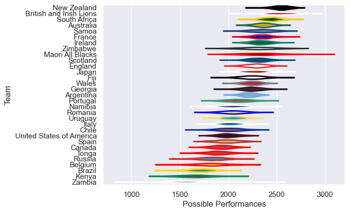

---  
title: "International Test Match 2021"  
date: 2025-07-29 6:00:00 -0500  
categories: model review projection  
layout: article  
aside:  
    toc: true  
---
# Current Team Rankings

# Standings

## Current Standings

| Club                     |   Played |   Wins |   Point Differential |   Losing Bonus Points |   Try Bonus Points |   Competition Points |
|:-------------------------|---------:|-------:|---------------------:|----------------------:|-------------------:|---------------------:|
| New Zealand              |        9 |      7 |                  333 |                     0 |                  7 |                   35 |
| Ireland                  |        6 |      5 |                  179 |                     0 |                  4 |                   26 |
| England                  |        5 |      5 |                  154 |                     0 |                  2 |                   22 |
| France                   |        5 |      4 |                   50 |                     1 |                  2 |                   19 |
| Scotland                 |        6 |      3 |                   42 |                     0 |                  2 |                   18 |
| South Africa             |        6 |      3 |                   45 |                     2 |                  1 |                   17 |
| Wales                    |        7 |      3 |                    7 |                     1 |                  2 |                   17 |
| Argentina                |        6 |      3 |                   -5 |                     0 |                  1 |                   15 |
| Uruguay                  |        6 |      3 |                   22 |                     2 |                    |                   14 |
| Chile                    |        4 |      3 |                   21 |                     1 |                  1 |                   14 |
| Australia                |        7 |      2 |                  -19 |                     3 |                  2 |                   13 |
| Romania                  |        4 |      2 |                   20 |                     1 |                    |                   11 |
| Namibia                  |        2 |      2 |                   67 |                     0 |                  2 |                   10 |
| United States of America |        8 |      2 |                 -172 |                     0 |                    |                   10 |
| Maori All Blacks         |        2 |      2 |                   42 |                     0 |                  1 |                    9 |
| Canada                   |        6 |      2 |                 -100 |                     1 |                    |                    9 |
| Zimbabwe                 |        3 |      2 |                   24 |                     0 |                    |                    8 |
| British and Irish Lions  |        2 |      2 |                   23 |                     0 |                    |                    8 |
| Samoa                    |        4 |      2 |                    9 |                     0 |                    |                    8 |
| Fiji                     |        5 |      1 |                  -66 |                     0 |                  1 |                    7 |
| Georgia                  |        5 |      0 |                  -57 |                     0 |                    |                    6 |
| Japan                    |        6 |      1 |                  -86 |                     0 |                  2 |                    6 |
| Kenya                    |        2 |      1 |                  -30 |                     0 |                  1 |                    5 |
| Portugal                 |        2 |      1 |                  -10 |                     0 |                    |                    4 |
| Italy                    |        3 |      1 |                  -52 |                     0 |                    |                    4 |
| Russia                   |        2 |      0 |                  -16 |                     1 |                  1 |                    2 |
| Brazil                   |        4 |      0 |                  -41 |                     2 |                    |                    2 |
| Belgium                  |        1 |      0 |                  -24 |                     0 |                    |                    0 |
| Spain                    |        1 |      0 |                  -30 |                     0 |                    |                    0 |
| Zambia                   |        1 |      0 |                  -53 |                     0 |                    |                    0 |
| Tonga                    |        6 |      0 |                 -277 |                     0 |                    |                    0 |

## Projected Remaining Table

| Club        |   To Play |   Projected Wins |   Projected Differential |   Projected Losing Bonus Points | Projected Try Bonus Points   |   Projected Competition Points |
|:------------|----------:|-----------------:|-------------------------:|--------------------------------:|:-----------------------------|-------------------------------:|
| Uruguay     |         4 |            1.442 |                  -14.27  |                           0.922 |                              |                          7.018 |
| New Zealand |         2 |            1.501 |                   25.291 |                           0.23  |                              |                          6.358 |
| Wales       |         1 |            0.714 |                    7.277 |                           0.135 |                              |                          3.061 |
| Argentina   |         1 |            0.678 |                    5.589 |                           0.145 |                              |                          2.965 |
| Samoa       |         1 |            0.662 |                    6.489 |                           0.177 |                              |                          2.885 |
| Romania     |         1 |            0.564 |                    2.722 |                           0.217 |                              |                          2.559 |
| Italy       |         2 |            0.437 |                  -25.291 |                           0.288 |                              |                          2.16  |
| Tonga       |         1 |            0.438 |                   -1.318 |                           0.243 |                              |                          2.059 |
| Spain       |         1 |            0.308 |                   -6.489 |                           0.204 |                              |                          1.496 |

## Projected Total Table

| Club                     |   Played |   Wins |   Point Differential |   Losing Bonus Points |   Try Bonus Points |   Competition Points |
|:-------------------------|---------:|-------:|---------------------:|----------------------:|-------------------:|---------------------:|
| New Zealand              |       11 |  8.501 |              358.291 |                 0.23  |                  7 |               41.358 |
| Ireland                  |        6 |  5     |              179     |                 0     |                  4 |               26     |
| England                  |        5 |  5     |              154     |                 0     |                  2 |               22     |
| Uruguay                  |       10 |  4.442 |                7.73  |                 2.922 |                    |               21.018 |
| Wales                    |        8 |  3.714 |               14.277 |                 1.135 |                  2 |               20.061 |
| France                   |        5 |  4     |               50     |                 1     |                  2 |               19     |
| Scotland                 |        6 |  3     |               42     |                 0     |                  2 |               18     |
| Argentina                |        7 |  3.678 |                0.589 |                 0.145 |                  1 |               17.965 |
| South Africa             |        6 |  3     |               45     |                 2     |                  1 |               17     |
| Chile                    |        4 |  3     |               21     |                 1     |                  1 |               14     |
| Romania                  |        5 |  2.564 |               22.722 |                 1.217 |                    |               13.559 |
| Australia                |        7 |  2     |              -19     |                 3     |                  2 |               13     |
| Samoa                    |        5 |  2.662 |               15.489 |                 0.177 |                    |               10.885 |
| Namibia                  |        2 |  2     |               67     |                 0     |                  2 |               10     |
| United States of America |        8 |  2     |             -172     |                 0     |                    |               10     |
| Maori All Blacks         |        2 |  2     |               42     |                 0     |                  1 |                9     |
| Canada                   |        6 |  2     |             -100     |                 1     |                    |                9     |
| Zimbabwe                 |        3 |  2     |               24     |                 0     |                    |                8     |
| British and Irish Lions  |        2 |  2     |               23     |                 0     |                    |                8     |
| Fiji                     |        5 |  1     |              -66     |                 0     |                  1 |                7     |
| Italy                    |        5 |  1.437 |              -77.291 |                 0.288 |                    |                6.16  |
| Georgia                  |        5 |  0     |              -57     |                 0     |                    |                6     |
| Japan                    |        6 |  1     |              -86     |                 0     |                  2 |                6     |
| Kenya                    |        2 |  1     |              -30     |                 0     |                  1 |                5     |
| Portugal                 |        2 |  1     |              -10     |                 0     |                    |                4     |
| Tonga                    |        7 |  0.438 |             -278.318 |                 0.243 |                    |                2.059 |
| Russia                   |        2 |  0     |              -16     |                 1     |                  1 |                2     |
| Brazil                   |        4 |  0     |              -41     |                 2     |                    |                2     |
| Spain                    |        2 |  0.308 |              -36.489 |                 0.204 |                    |                1.496 |
| Belgium                  |        1 |  0     |              -24     |                 0     |                    |                0     |
| Zambia                   |        1 |  0     |              -53     |                 0     |                    |                0     |

# Completed Match Review

| Model | Percent Correct Predictions | Spread Error |
| ------ | ------ | ------ |
| Club Level | 80.0% | 15.5 |
| Player Level: Lineup | nan% | nan |
| Player Level: Minutes | nan% | nan |

# Future Predictions

## Week 10

### Uruguay V Wales on 2021/06/26

Average Margin: Wales by 7.3

## Week 11

### New Zealand V Italy on 2021/07/03

Average Margin: New Zealand by 12.6

## Week 12

### New Zealand V Italy on 2021/07/10

Average Margin: New Zealand by 12.7

### Uruguay V Argentina on 2021/07/11

Average Margin: Argentina by 5.6

## Week 13

### Romania V Uruguay on 2021/11/13

Average Margin: Romania by 2.7

## Week 14

### Tonga V Uruguay on 2021/11/20

Average Margin: Uruguay by 1.3

### Spain V Samoa on 2021/11/20

Average Margin: Samoa by 6.5

