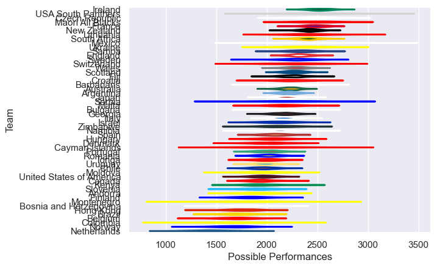

---  
title: "International Test Match 2022 Status"  
date: 2025-07-28 6:00:00 -0500  
categories: model review projection  
layout: article  
aside:  
    toc: true  
---
# Current Team Rankings

# Standings

## Current Standings

| Club                     |   Played |   Wins |   Point Differential |   Losing Bonus Points |   Try Bonus Points |   Competition Points |
|:-------------------------|---------:|-------:|---------------------:|----------------------:|-------------------:|---------------------:|
| Italy                    |        8 |      6 |                   88 |                     0 |                  5 |                   29 |
| Ireland                  |        8 |      6 |                   13 |                     0 |                  3 |                   27 |
| Argentina                |        8 |      5 |                  -18 |                     1 |                  3 |                   24 |
| Scotland                 |        8 |      4 |                   82 |                     2 |                  5 |                   23 |
| New Zealand              |        7 |      4 |                   49 |                     0 |                  4 |                   22 |
| France                   |        5 |      5 |                   47 |                     0 |                  2 |                   22 |
| South Africa             |        7 |      4 |                   67 |                     3 |                  1 |                   20 |
| Tonga                    |        4 |      4 |                  109 |                     0 |                  3 |                   19 |
| Georgia                  |        6 |      4 |                   28 |                     2 |                  1 |                   19 |
| Australia                |        8 |      3 |                   -9 |                     4 |                  2 |                   18 |
| England                  |        8 |      3 |                    3 |                     2 |                  1 |                   17 |
| United States of America |        5 |      3 |                   95 |                     1 |                  1 |                   16 |
| Portugal                 |        6 |      2 |                   80 |                     1 |                  2 |                   13 |
| Canada                   |        4 |      2 |                   28 |                     1 |                  4 |                   13 |
| Japan                    |        7 |      2 |                  -33 |                     2 |                  3 |                   13 |
| Wales                    |        7 |      2 |                  -49 |                     3 |                  1 |                   12 |
| Chile                    |        6 |      2 |                  -66 |                     2 |                  2 |                   12 |
| Spain                    |        3 |      2 |                    8 |                     0 |                  2 |                   10 |
| Romania                  |        6 |      2 |                  -50 |                     2 |                    |                   10 |
| Uruguay                  |        7 |      2 |                  -92 |                     0 |                  1 |                    9 |
| Switzerland              |        2 |      2 |                   96 |                     0 |                    |                    8 |
| Czech Republic           |        2 |      2 |                   46 |                     0 |                    |                    8 |
| Finland                  |        2 |      2 |                   44 |                     0 |                    |                    8 |
| Bulgaria                 |        2 |      2 |                   28 |                     0 |                    |                    8 |
| Samoa                    |        3 |      2 |                   -9 |                     0 |                    |                    8 |
| Maori All Blacks         |        2 |      1 |                    9 |                     1 |                  2 |                    7 |
| Zimbabwe                 |        1 |      1 |                   23 |                     0 |                  1 |                    5 |
| Namibia                  |        3 |      1 |                  -35 |                     0 |                  1 |                    5 |
| Serbia                   |        1 |      1 |                   62 |                     0 |                    |                    4 |
| Barbarians               |        1 |      1 |                   31 |                     0 |                    |                    4 |
| Malta                    |        2 |      1 |                   27 |                     0 |                    |                    4 |
| Cayman Islands           |        1 |      1 |                   21 |                     0 |                    |                    4 |
| Bosnia and Herzegovina   |        1 |      1 |                    2 |                     0 |                    |                    4 |
| USA South Panthers       |        1 |      1 |                    1 |                     0 |                    |                    4 |
| Denmark                  |        2 |      1 |                  -10 |                     0 |                    |                    4 |
| Ukraine                  |        2 |      1 |                  -14 |                     0 |                    |                    4 |
| Lithuania                |        2 |      1 |                  -20 |                     0 |                    |                    4 |
| Sweden                   |        2 |      1 |                  -37 |                     0 |                    |                    4 |
| Hong Kong                |        4 |      1 |                  -88 |                     0 |                    |                    4 |
| Colombia                 |        1 |      0 |                   -1 |                     1 |                    |                    1 |
| Croatia                  |        2 |      0 |                  -25 |                     1 |                    |                    1 |
| Montenegro               |        2 |      0 |                  -64 |                     1 |                    |                    1 |
| Kenya                    |        3 |      0 |                 -143 |                     1 |                    |                    1 |
| Brazil                   |        1 |      0 |                   -9 |                     0 |                    |                    0 |
| Andorra                  |        1 |      0 |                  -15 |                     0 |                    |                    0 |
| Israel                   |        1 |      0 |                  -19 |                     0 |                    |                    0 |
| Norway                   |        1 |      0 |                  -19 |                     0 |                    |                    0 |
| Hungary                  |        1 |      0 |                  -20 |                     0 |                    |                    0 |
| Mexico                   |        1 |      0 |                  -21 |                     0 |                    |                    0 |
| Moldova                  |        1 |      0 |                  -26 |                     0 |                    |                    0 |
| Fiji                     |        2 |      0 |                  -34 |                     0 |                    |                    0 |
| Slovenia                 |        1 |      0 |                  -36 |                     0 |                    |                    0 |
| Belgium                  |        1 |      0 |                  -45 |                     0 |                    |                    0 |
| Netherlands              |        3 |      0 |                  -80 |                     0 |                    |                    0 |

## Projected Remaining Table

| Club      |   To Play |   Projected Wins |   Projected Differential |   Projected Losing Bonus Points | Projected Try Bonus Points   |   Projected Competition Points |
|:----------|----------:|-----------------:|-------------------------:|--------------------------------:|:-----------------------------|-------------------------------:|
| Japan     |         1 |             0.73 |                     6.47 |                            0.12 |                              |                           3.12 |
| Argentina |         1 |             0.23 |                    -6.47 |                            0.27 |                              |                           1.27 |

## Projected Total Table

| Club                     |   Played |   Wins |   Point Differential |   Losing Bonus Points |   Try Bonus Points |   Competition Points |
|:-------------------------|---------:|-------:|---------------------:|----------------------:|-------------------:|---------------------:|
| Italy                    |        8 |   6    |                88    |                  0    |                  5 |                29    |
| Ireland                  |        8 |   6    |                13    |                  0    |                  3 |                27    |
| Argentina                |        9 |   5.23 |               -24.47 |                  1.27 |                  3 |                25.27 |
| Scotland                 |        8 |   4    |                82    |                  2    |                  5 |                23    |
| New Zealand              |        7 |   4    |                49    |                  0    |                  4 |                22    |
| France                   |        5 |   5    |                47    |                  0    |                  2 |                22    |
| South Africa             |        7 |   4    |                67    |                  3    |                  1 |                20    |
| Tonga                    |        4 |   4    |               109    |                  0    |                  3 |                19    |
| Georgia                  |        6 |   4    |                28    |                  2    |                  1 |                19    |
| Australia                |        8 |   3    |                -9    |                  4    |                  2 |                18    |
| England                  |        8 |   3    |                 3    |                  2    |                  1 |                17    |
| Japan                    |        8 |   2.73 |               -26.53 |                  2.12 |                  3 |                16.12 |
| United States of America |        5 |   3    |                95    |                  1    |                  1 |                16    |
| Portugal                 |        6 |   2    |                80    |                  1    |                  2 |                13    |
| Canada                   |        4 |   2    |                28    |                  1    |                  4 |                13    |
| Wales                    |        7 |   2    |               -49    |                  3    |                  1 |                12    |
| Chile                    |        6 |   2    |               -66    |                  2    |                  2 |                12    |
| Spain                    |        3 |   2    |                 8    |                  0    |                  2 |                10    |
| Romania                  |        6 |   2    |               -50    |                  2    |                    |                10    |
| Uruguay                  |        7 |   2    |               -92    |                  0    |                  1 |                 9    |
| Switzerland              |        2 |   2    |                96    |                  0    |                    |                 8    |
| Czech Republic           |        2 |   2    |                46    |                  0    |                    |                 8    |
| Finland                  |        2 |   2    |                44    |                  0    |                    |                 8    |
| Bulgaria                 |        2 |   2    |                28    |                  0    |                    |                 8    |
| Samoa                    |        3 |   2    |                -9    |                  0    |                    |                 8    |
| Maori All Blacks         |        2 |   1    |                 9    |                  1    |                  2 |                 7    |
| Zimbabwe                 |        1 |   1    |                23    |                  0    |                  1 |                 5    |
| Namibia                  |        3 |   1    |               -35    |                  0    |                  1 |                 5    |
| Serbia                   |        1 |   1    |                62    |                  0    |                    |                 4    |
| Barbarians               |        1 |   1    |                31    |                  0    |                    |                 4    |
| Malta                    |        2 |   1    |                27    |                  0    |                    |                 4    |
| Cayman Islands           |        1 |   1    |                21    |                  0    |                    |                 4    |
| Bosnia and Herzegovina   |        1 |   1    |                 2    |                  0    |                    |                 4    |
| USA South Panthers       |        1 |   1    |                 1    |                  0    |                    |                 4    |
| Denmark                  |        2 |   1    |               -10    |                  0    |                    |                 4    |
| Ukraine                  |        2 |   1    |               -14    |                  0    |                    |                 4    |
| Lithuania                |        2 |   1    |               -20    |                  0    |                    |                 4    |
| Sweden                   |        2 |   1    |               -37    |                  0    |                    |                 4    |
| Hong Kong                |        4 |   1    |               -88    |                  0    |                    |                 4    |
| Colombia                 |        1 |   0    |                -1    |                  1    |                    |                 1    |
| Croatia                  |        2 |   0    |               -25    |                  1    |                    |                 1    |
| Montenegro               |        2 |   0    |               -64    |                  1    |                    |                 1    |
| Kenya                    |        3 |   0    |              -143    |                  1    |                    |                 1    |
| Brazil                   |        1 |   0    |                -9    |                  0    |                    |                 0    |
| Andorra                  |        1 |   0    |               -15    |                  0    |                    |                 0    |
| Israel                   |        1 |   0    |               -19    |                  0    |                    |                 0    |
| Norway                   |        1 |   0    |               -19    |                  0    |                    |                 0    |
| Hungary                  |        1 |   0    |               -20    |                  0    |                    |                 0    |
| Mexico                   |        1 |   0    |               -21    |                  0    |                    |                 0    |
| Moldova                  |        1 |   0    |               -26    |                  0    |                    |                 0    |
| Fiji                     |        2 |   0    |               -34    |                  0    |                    |                 0    |
| Slovenia                 |        1 |   0    |               -36    |                  0    |                    |                 0    |
| Belgium                  |        1 |   0    |               -45    |                  0    |                    |                 0    |
| Netherlands              |        3 |   0    |               -80    |                  0    |                    |                 0    |

# Completed Match Review

| Model | Percent Correct Predictions | Spread Error |
| ------ | ------ | ------ |
| Club Level | 61.2% | 15.5 |
| Player Level: Lineup | nan% | nan |
| Player Level: Minutes | nan% | nan |

# Future Predictions

## Week 9

### Japan V Argentina on 2022/10/24

Average Margin: Japan by 3.1

