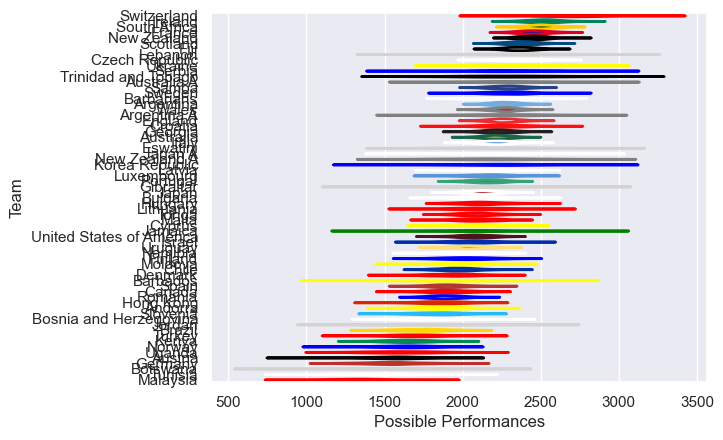

---  
title: "International Test Match 2023"  
date: 2025-07-29 6:00:00 -0500  
categories: model review projection  
layout: article  
aside:  
    toc: true  
---
# Current Team Rankings

# Standings

## Current Standings

| Club                     |   Played |   Wins |   Point Differential |   Losing Bonus Points |   Try Bonus Points |   Competition Points |
|:-------------------------|---------:|-------:|---------------------:|----------------------:|-------------------:|---------------------:|
| Scotland                 |        4 |      3 |                   40 |                     1 |                  2 |                   15 |
| South Africa             |        3 |      3 |                   75 |                     0 |                  2 |                   14 |
| France                   |        4 |      3 |                   40 |                     1 |                  1 |                   14 |
| Ireland                  |        3 |      3 |                   39 |                     0 |                  2 |                   14 |
| Uruguay                  |        3 |      3 |                   29 |                     0 |                  2 |                   14 |
| Tonga                    |        5 |      3 |                   14 |                     0 |                  2 |                   14 |
| United States of America |        5 |      3 |                   48 |                     0 |                  1 |                   13 |
| Hong Kong                |        3 |      3 |                  118 |                     0 |                    |                   12 |
| Fiji                     |        4 |      3 |                   21 |                     0 |                    |                   12 |
| Argentina A              |        4 |      3 |                   16 |                     0 |                    |                   12 |
| Latvia                   |        5 |      3 |                   11 |                     0 |                    |                   12 |
| Italy                    |        4 |      2 |                   43 |                     0 |                  2 |                   10 |
| Georgia                  |        3 |      2 |                   38 |                     0 |                  1 |                    9 |
| Denmark                  |        3 |      2 |                   36 |                     1 |                    |                    9 |
| Samoa                    |        4 |      2 |                   21 |                     1 |                    |                    9 |
| Wales                    |        4 |      2 |                   -4 |                     1 |                    |                    9 |
| Luxembourg               |        2 |      2 |                   62 |                     0 |                    |                    8 |
| New Zealand A            |        2 |      2 |                   46 |                     0 |                    |                    8 |
| Moldova                  |        2 |      2 |                   39 |                     0 |                    |                    8 |
| Switzerland              |        2 |      2 |                   37 |                     0 |                    |                    8 |
| Bulgaria                 |        2 |      2 |                   36 |                     0 |                    |                    8 |
| Andorra                  |        4 |      2 |                   12 |                     0 |                    |                    8 |
| Finland                  |        3 |      2 |                  -17 |                     0 |                    |                    8 |
| Slovenia                 |        4 |      2 |                  -46 |                     0 |                    |                    8 |
| Namibia                  |        3 |      1 |                  -13 |                     1 |                  1 |                    6 |
| Argentina                |        2 |      1 |                   48 |                     0 |                  1 |                    5 |
| Hungary                  |        3 |      1 |                   30 |                     1 |                    |                    5 |
| Portugal                 |        2 |      1 |                   13 |                     0 |                  1 |                    5 |
| Australia A              |        2 |      1 |                    7 |                     1 |                    |                    5 |
| Uganda                   |        2 |      1 |                   -1 |                     1 |                    |                    5 |
| Botswana                 |        1 |      1 |                  108 |                     0 |                    |                    4 |
| Israel                   |        1 |      1 |                   43 |                     0 |                    |                    4 |
| Czech Republic           |        1 |      1 |                   36 |                     0 |                    |                    4 |
| Lebanon                  |        2 |      1 |                   14 |                     0 |                    |                    4 |
| Serbia                   |        2 |      1 |                    8 |                     0 |                    |                    4 |
| Trinidad and Tobago      |        1 |      1 |                    8 |                     0 |                    |                    4 |
| Kenya                    |        1 |      1 |                    7 |                     0 |                    |                    4 |
| Malta                    |        1 |      1 |                    5 |                     0 |                    |                    4 |
| Korea Republic           |        2 |      1 |                    4 |                     0 |                    |                    4 |
| Ukraine                  |        2 |      1 |                   -4 |                     0 |                    |                    4 |
| Croatia                  |        2 |      1 |                   -8 |                     0 |                    |                    4 |
| Jordan                   |        2 |      1 |                  -14 |                     0 |                    |                    4 |
| Sweden                   |        2 |      1 |                  -20 |                     0 |                    |                    4 |
| New Zealand              |        2 |      1 |                  -25 |                     0 |                    |                    4 |
| Chile                    |        4 |      0 |                  -32 |                     3 |                  1 |                    4 |
| England                  |        4 |      1 |                  -36 |                     0 |                    |                    4 |
| Canada                   |        4 |      1 |                  -46 |                     0 |                    |                    4 |
| Spain                    |        3 |      1 |                  -67 |                     0 |                    |                    4 |
| Lithuania                |        2 |      0 |                   -5 |                     2 |                    |                    2 |
| Cyprus                   |        1 |      0 |                   -5 |                     1 |                    |                    1 |
| Tunisia                  |        1 |      0 |                   -6 |                     1 |                    |                    1 |
| Australia                |        2 |      0 |                  -27 |                     1 |                    |                    1 |
| Bosnia and Herzegovina   |        3 |      0 |                  -82 |                     1 |                    |                    1 |
| Barbados                 |        1 |      0 |                   -8 |                     0 |                    |                    0 |
| Germany                  |        1 |      0 |                  -19 |                     0 |                    |                    0 |
| Japan A                  |        1 |      0 |                  -32 |                     0 |                    |                    0 |
| Japan                    |        2 |      0 |                  -35 |                     0 |                    |                    0 |
| Turkey                   |        2 |      0 |                  -35 |                     0 |                    |                    0 |
| Barbarians               |        2 |      0 |                  -37 |                     0 |                    |                    0 |
| Austria                  |        2 |      0 |                  -56 |                     0 |                    |                    0 |
| Brazil                   |        2 |      0 |                  -70 |                     0 |                    |                    0 |
| Norway                   |        3 |      0 |                  -77 |                     0 |                    |                    0 |
| Malaysia                 |        2 |      0 |                 -103 |                     0 |                    |                    0 |
| Eswatini                 |        1 |      0 |                 -108 |                     0 |                    |                    0 |
| Romania                  |        3 |      0 |                 -114 |                     0 |                    |                    0 |

## Projected Remaining Table

| Club      |   To Play |   Projected Wins |   Projected Differential |   Projected Losing Bonus Points | Projected Try Bonus Points   |   Projected Competition Points |
|:----------|----------:|-----------------:|-------------------------:|--------------------------------:|:-----------------------------|-------------------------------:|
| Gibraltar |         1 |            0.537 |                    3.926 |                           0.164 |                              |                           2.37 |
| Jamaica   |         1 |            0.434 |                   -3.926 |                           0.146 |                              |                           1.94 |

## Projected Total Table

| Club                     |   Played |   Wins |   Point Differential |   Losing Bonus Points |   Try Bonus Points |   Competition Points |
|:-------------------------|---------:|-------:|---------------------:|----------------------:|-------------------:|---------------------:|
| Scotland                 |        4 |  3     |               40     |                 1     |                  2 |                15    |
| South Africa             |        3 |  3     |               75     |                 0     |                  2 |                14    |
| France                   |        4 |  3     |               40     |                 1     |                  1 |                14    |
| Ireland                  |        3 |  3     |               39     |                 0     |                  2 |                14    |
| Uruguay                  |        3 |  3     |               29     |                 0     |                  2 |                14    |
| Tonga                    |        5 |  3     |               14     |                 0     |                  2 |                14    |
| United States of America |        5 |  3     |               48     |                 0     |                  1 |                13    |
| Hong Kong                |        3 |  3     |              118     |                 0     |                    |                12    |
| Fiji                     |        4 |  3     |               21     |                 0     |                    |                12    |
| Argentina A              |        4 |  3     |               16     |                 0     |                    |                12    |
| Latvia                   |        5 |  3     |               11     |                 0     |                    |                12    |
| Italy                    |        4 |  2     |               43     |                 0     |                  2 |                10    |
| Georgia                  |        3 |  2     |               38     |                 0     |                  1 |                 9    |
| Denmark                  |        3 |  2     |               36     |                 1     |                    |                 9    |
| Samoa                    |        4 |  2     |               21     |                 1     |                    |                 9    |
| Wales                    |        4 |  2     |               -4     |                 1     |                    |                 9    |
| Luxembourg               |        2 |  2     |               62     |                 0     |                    |                 8    |
| New Zealand A            |        2 |  2     |               46     |                 0     |                    |                 8    |
| Moldova                  |        2 |  2     |               39     |                 0     |                    |                 8    |
| Switzerland              |        2 |  2     |               37     |                 0     |                    |                 8    |
| Bulgaria                 |        2 |  2     |               36     |                 0     |                    |                 8    |
| Andorra                  |        4 |  2     |               12     |                 0     |                    |                 8    |
| Finland                  |        3 |  2     |              -17     |                 0     |                    |                 8    |
| Slovenia                 |        4 |  2     |              -46     |                 0     |                    |                 8    |
| Namibia                  |        3 |  1     |              -13     |                 1     |                  1 |                 6    |
| Argentina                |        2 |  1     |               48     |                 0     |                  1 |                 5    |
| Hungary                  |        3 |  1     |               30     |                 1     |                    |                 5    |
| Portugal                 |        2 |  1     |               13     |                 0     |                  1 |                 5    |
| Australia A              |        2 |  1     |                7     |                 1     |                    |                 5    |
| Uganda                   |        2 |  1     |               -1     |                 1     |                    |                 5    |
| Botswana                 |        1 |  1     |              108     |                 0     |                    |                 4    |
| Israel                   |        1 |  1     |               43     |                 0     |                    |                 4    |
| Czech Republic           |        1 |  1     |               36     |                 0     |                    |                 4    |
| Lebanon                  |        2 |  1     |               14     |                 0     |                    |                 4    |
| Serbia                   |        2 |  1     |                8     |                 0     |                    |                 4    |
| Trinidad and Tobago      |        1 |  1     |                8     |                 0     |                    |                 4    |
| Kenya                    |        1 |  1     |                7     |                 0     |                    |                 4    |
| Malta                    |        1 |  1     |                5     |                 0     |                    |                 4    |
| Korea Republic           |        2 |  1     |                4     |                 0     |                    |                 4    |
| Ukraine                  |        2 |  1     |               -4     |                 0     |                    |                 4    |
| Croatia                  |        2 |  1     |               -8     |                 0     |                    |                 4    |
| Jordan                   |        2 |  1     |              -14     |                 0     |                    |                 4    |
| Sweden                   |        2 |  1     |              -20     |                 0     |                    |                 4    |
| New Zealand              |        2 |  1     |              -25     |                 0     |                    |                 4    |
| Chile                    |        4 |  0     |              -32     |                 3     |                  1 |                 4    |
| England                  |        4 |  1     |              -36     |                 0     |                    |                 4    |
| Canada                   |        4 |  1     |              -46     |                 0     |                    |                 4    |
| Spain                    |        3 |  1     |              -67     |                 0     |                    |                 4    |
| Gibraltar                |        1 |  0.537 |                3.926 |                 0.164 |                    |                 2.37 |
| Lithuania                |        2 |  0     |               -5     |                 2     |                    |                 2    |
| Jamaica                  |        1 |  0.434 |               -3.926 |                 0.146 |                    |                 1.94 |
| Cyprus                   |        1 |  0     |               -5     |                 1     |                    |                 1    |
| Tunisia                  |        1 |  0     |               -6     |                 1     |                    |                 1    |
| Australia                |        2 |  0     |              -27     |                 1     |                    |                 1    |
| Bosnia and Herzegovina   |        3 |  0     |              -82     |                 1     |                    |                 1    |
| Barbados                 |        1 |  0     |               -8     |                 0     |                    |                 0    |
| Germany                  |        1 |  0     |              -19     |                 0     |                    |                 0    |
| Japan A                  |        1 |  0     |              -32     |                 0     |                    |                 0    |
| Japan                    |        2 |  0     |              -35     |                 0     |                    |                 0    |
| Turkey                   |        2 |  0     |              -35     |                 0     |                    |                 0    |
| Barbarians               |        2 |  0     |              -37     |                 0     |                    |                 0    |
| Austria                  |        2 |  0     |              -56     |                 0     |                    |                 0    |
| Brazil                   |        2 |  0     |              -70     |                 0     |                    |                 0    |
| Norway                   |        3 |  0     |              -77     |                 0     |                    |                 0    |
| Malaysia                 |        2 |  0     |             -103     |                 0     |                    |                 0    |
| Eswatini                 |        1 |  0     |             -108     |                 0     |                    |                 0    |
| Romania                  |        3 |  0     |             -114     |                 0     |                    |                 0    |

# Completed Match Review

| Model | Percent Correct Predictions | Spread Error |
| ------ | ------ | ------ |
| Club Level | 75.9% | 18.0 |
| Player Level: Lineup | nan% | nan |
| Player Level: Minutes | nan% | nan |

# Future Predictions

## Week 6

### Gibraltar V Jamaica on 2023/03/24

Average Margin: Gibraltar by 3.9

