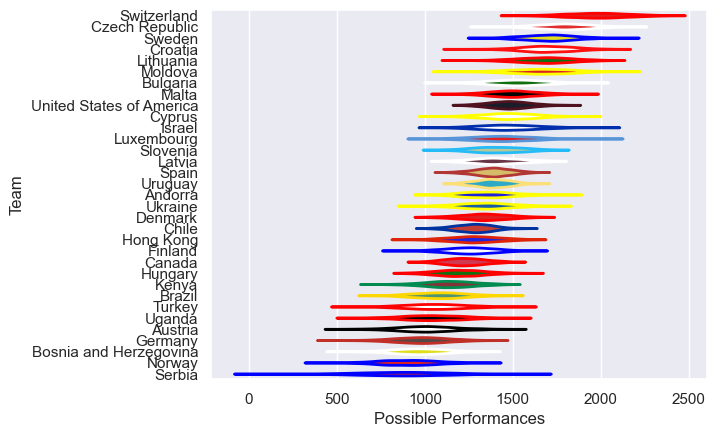

---  
title: "International Test Match 2023 Status"  
date: 2023-11-27 6:00:00 -0500  
categories: model review projection  
layout: article  
aside:  
    toc: true  
---
# Current Team Rankings

# Standings

## Current Standings

| Club                     |   Played |   Wins |   Point Differential |   Losing Bonus Points |   Try Bonus Points |   Competition Points |
|:-------------------------|---------:|-------:|---------------------:|----------------------:|-------------------:|---------------------:|
| Hong Kong                |        4 |      4 |                  148 |                     0 |                nan |                   16 |
| Latvia                   |        5 |      3 |                   11 |                     0 |                nan |                   12 |
| Denmark                  |        3 |      2 |                   36 |                     1 |                nan |                    9 |
| Uganda                   |        3 |      2 |                    5 |                     1 |                nan |                    9 |
| United States of America |        2 |      2 |                   75 |                     0 |                nan |                    8 |
| Luxembourg               |        2 |      2 |                   62 |                     0 |                nan |                    8 |
| Czech Republic           |        2 |      2 |                   46 |                     0 |                nan |                    8 |
| Moldova                  |        2 |      2 |                   39 |                     0 |                nan |                    8 |
| Switzerland              |        2 |      2 |                   37 |                     0 |                nan |                    8 |
| Bulgaria                 |        2 |      2 |                   36 |                     0 |                nan |                    8 |
| Andorra                  |        4 |      2 |                   12 |                     0 |                nan |                    8 |
| Finland                  |        3 |      2 |                  -17 |                     0 |                nan |                    8 |
| Slovenia                 |        4 |      2 |                  -46 |                     0 |                nan |                    8 |
| Hungary                  |        3 |      1 |                   30 |                     1 |                nan |                    5 |
| Botswana                 |        1 |      1 |                  108 |                     0 |                nan |                    4 |
| Israel                   |        1 |      1 |                   43 |                     0 |                nan |                    4 |
| Lebanon                  |        2 |      1 |                   14 |                     0 |                nan |                    4 |
| Trinidad and Tobago      |        1 |      1 |                    8 |                     0 |                nan |                    4 |
| Serbia                   |        2 |      1 |                    8 |                     0 |                nan |                    4 |
| Kenya                    |        1 |      1 |                    7 |                     0 |                nan |                    4 |
| Malta                    |        1 |      1 |                    5 |                     0 |                nan |                    4 |
| Korea Republic           |        2 |      1 |                    4 |                     0 |                nan |                    4 |
| Canada                   |        2 |      1 |                    3 |                     0 |                nan |                    4 |
| Uruguay                  |        1 |      1 |                    1 |                     0 |                nan |                    4 |
| Ukraine                  |        2 |      1 |                   -4 |                     0 |                nan |                    4 |
| Spain                    |        2 |      1 |                   -8 |                     0 |                nan |                    4 |
| Croatia                  |        2 |      1 |                   -8 |                     0 |                nan |                    4 |
| Jordan                   |        2 |      1 |                  -14 |                     0 |                nan |                    4 |
| Sweden                   |        2 |      1 |                  -20 |                     0 |                nan |                    4 |
| Tunisia                  |        2 |      0 |                  -12 |                     2 |                nan |                    2 |
| Lithuania                |        3 |      0 |                  -15 |                     2 |                nan |                    2 |
| Chile                    |        1 |      0 |                   -1 |                     1 |                nan |                    1 |
| Cyprus                   |        1 |      0 |                   -5 |                     1 |                nan |                    1 |
| Bosnia and Herzegovina   |        3 |      0 |                  -82 |                     1 |                nan |                    1 |
| Barbados                 |        1 |      0 |                   -8 |                     0 |                nan |                    0 |
| Turkey                   |        2 |      0 |                  -35 |                     0 |                nan |                    0 |
| Germany                  |        2 |      0 |                  -49 |                     0 |                nan |                    0 |
| Austria                  |        2 |      0 |                  -56 |                     0 |                nan |                    0 |
| Brazil                   |        2 |      0 |                  -70 |                     0 |                nan |                    0 |
| Norway                   |        3 |      0 |                  -77 |                     0 |                nan |                    0 |
| Malaysia                 |        2 |      0 |                 -103 |                     0 |                nan |                    0 |
| Eswatini                 |        1 |      0 |                 -108 |                     0 |                nan |                    0 |

## Projected Remaining Table

| Club    |   Matches Remaining |   Wins |   Point Differential |   Losing Bonus Points |   Try Bonus Points |   Competition Points |
|:--------|--------------------:|-------:|---------------------:|----------------------:|-------------------:|---------------------:|
| Uganda  |                   1 |    0.8 |               8.8821 |                   0.1 |                0.7 |                  4   |
| Tunisia |                   1 |    0.2 |              -8.8821 |                   0.2 |                0.2 |                  1.3 |

## Projected Total Table

| Club                     |   Total Matches |   Wins |   Point Differential |   Losing Bonus Points |   Try Bonus Points |   Competition Points |
|:-------------------------|----------------:|-------:|---------------------:|----------------------:|-------------------:|---------------------:|
| Hong Kong                |               4 |    4   |             148      |                   0   |                0   |                 16   |
| Uganda                   |               4 |    2.8 |              13.8821 |                   1.1 |                0.7 |                 13   |
| Latvia                   |               5 |    3   |              11      |                   0   |                0   |                 12   |
| Denmark                  |               3 |    2   |              36      |                   1   |                0   |                  9   |
| United States of America |               2 |    2   |              75      |                   0   |                0   |                  8   |
| Luxembourg               |               2 |    2   |              62      |                   0   |                0   |                  8   |
| Czech Republic           |               2 |    2   |              46      |                   0   |                0   |                  8   |
| Moldova                  |               2 |    2   |              39      |                   0   |                0   |                  8   |
| Switzerland              |               2 |    2   |              37      |                   0   |                0   |                  8   |
| Bulgaria                 |               2 |    2   |              36      |                   0   |                0   |                  8   |
| Andorra                  |               4 |    2   |              12      |                   0   |                0   |                  8   |
| Finland                  |               3 |    2   |             -17      |                   0   |                0   |                  8   |
| Slovenia                 |               4 |    2   |             -46      |                   0   |                0   |                  8   |
| Hungary                  |               3 |    1   |              30      |                   1   |                0   |                  5   |
| Botswana                 |               1 |    1   |             108      |                   0   |                0   |                  4   |
| Israel                   |               1 |    1   |              43      |                   0   |                0   |                  4   |
| Lebanon                  |               2 |    1   |              14      |                   0   |                0   |                  4   |
| Serbia                   |               2 |    1   |               8      |                   0   |                0   |                  4   |
| Trinidad and Tobago      |               1 |    1   |               8      |                   0   |                0   |                  4   |
| Kenya                    |               1 |    1   |               7      |                   0   |                0   |                  4   |
| Malta                    |               1 |    1   |               5      |                   0   |                0   |                  4   |
| Korea Republic           |               2 |    1   |               4      |                   0   |                0   |                  4   |
| Canada                   |               2 |    1   |               3      |                   0   |                0   |                  4   |
| Uruguay                  |               1 |    1   |               1      |                   0   |                0   |                  4   |
| Ukraine                  |               2 |    1   |              -4      |                   0   |                0   |                  4   |
| Croatia                  |               2 |    1   |              -8      |                   0   |                0   |                  4   |
| Spain                    |               2 |    1   |              -8      |                   0   |                0   |                  4   |
| Jordan                   |               2 |    1   |             -14      |                   0   |                0   |                  4   |
| Sweden                   |               2 |    1   |             -20      |                   0   |                0   |                  4   |
| Tunisia                  |               3 |    0.2 |             -20.8821 |                   2.2 |                0.2 |                  3.3 |
| Lithuania                |               3 |    0   |             -15      |                   2   |                0   |                  2   |
| Chile                    |               1 |    0   |              -1      |                   1   |                0   |                  1   |
| Cyprus                   |               1 |    0   |              -5      |                   1   |                0   |                  1   |
| Bosnia and Herzegovina   |               3 |    0   |             -82      |                   1   |                0   |                  1   |
| Barbados                 |               1 |    0   |              -8      |                   0   |                0   |                  0   |
| Turkey                   |               2 |    0   |             -35      |                   0   |                0   |                  0   |
| Germany                  |               2 |    0   |             -49      |                   0   |                0   |                  0   |
| Austria                  |               2 |    0   |             -56      |                   0   |                0   |                  0   |
| Brazil                   |               2 |    0   |             -70      |                   0   |                0   |                  0   |
| Norway                   |               3 |    0   |             -77      |                   0   |                0   |                  0   |
| Malaysia                 |               2 |    0   |            -103      |                   0   |                0   |                  0   |
| Eswatini                 |               1 |    0   |            -108      |                   0   |                0   |                  0   |

# Completed Match Review

| Model | Percent Correct Predictions | Spread Error |
| ------ | ------ | ------ |
| Club Level | 77.8% | 20.2 |
| Player Level: Lineup | nan% | nan |
| Player Level: Minutes | nan% | nan |

# Future Predictions

## Week 6

### Tunisia V Uganda on 2023/11/27

Average Margin: Uganda by 8.9

