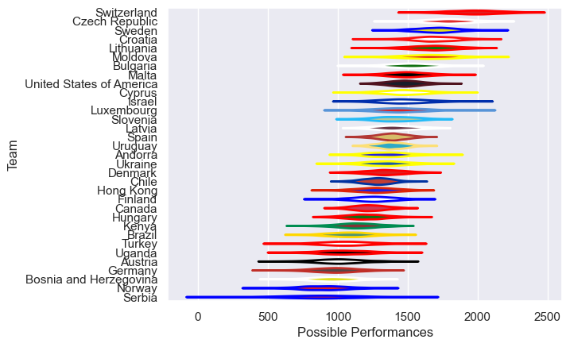
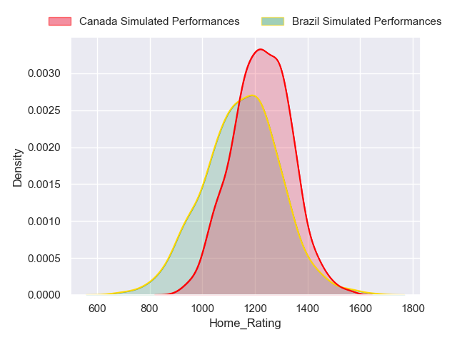
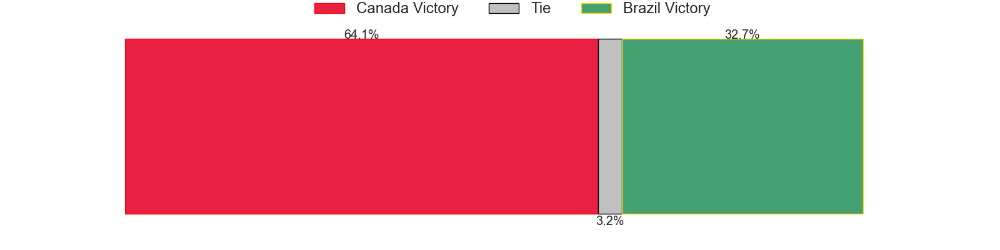
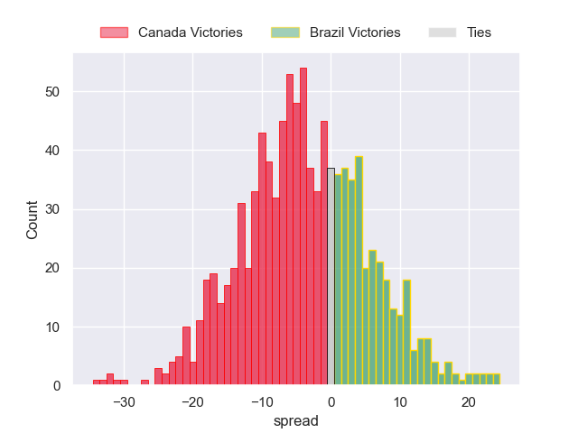
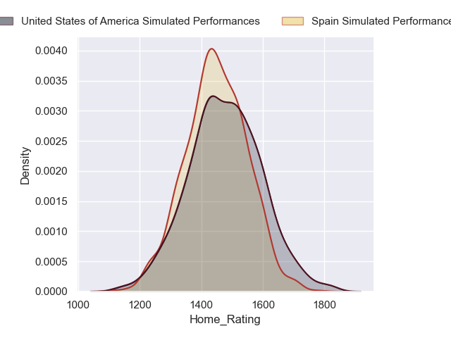
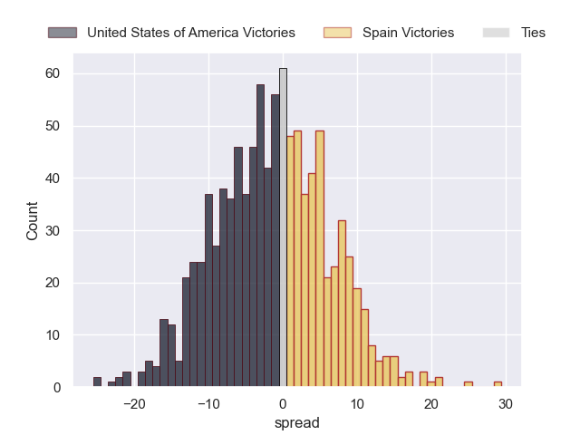
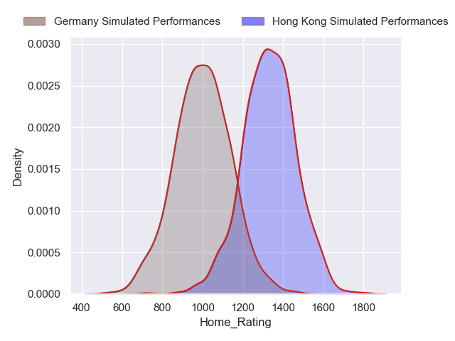
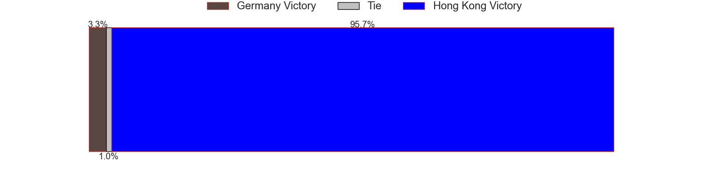
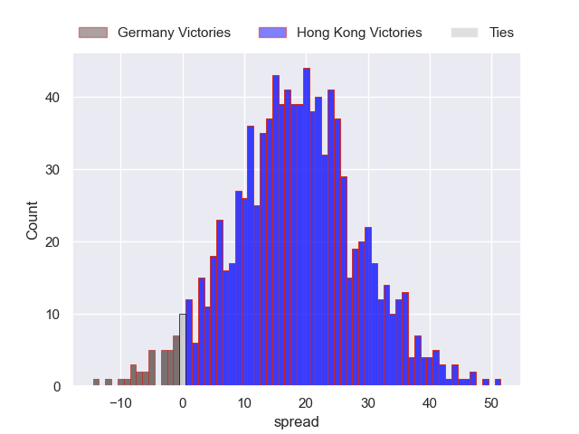

---  
title: "International Test Match 2023 Status"  
date: 2023-11-15 6:00:00 -0500  
categories: model review projection  
layout: article  
aside:  
    toc: true  
---
# Current Team Rankings

# Standings

## Current Standings

| Club                     |   Played |   Wins |   Point Differential |   Losing Bonus Points |   Try Bonus Points |   Competition Points |
|:-------------------------|---------:|-------:|---------------------:|----------------------:|-------------------:|---------------------:|
| Latvia                   |        6 |      4 |                   56 |                     0 |                nan |                   16 |
| Hong Kong                |        3 |      3 |                  112 |                     0 |                nan |                   12 |
| Denmark                  |        3 |      2 |                   36 |                     1 |                nan |                    9 |
| United States of America |        2 |      2 |                   90 |                     0 |                nan |                    8 |
| Luxembourg               |        2 |      2 |                   62 |                     0 |                nan |                    8 |
| Spain                    |        2 |      2 |                   44 |                     0 |                nan |                    8 |
| Moldova                  |        2 |      2 |                   39 |                     0 |                nan |                    8 |
| Switzerland              |        2 |      2 |                   37 |                     0 |                nan |                    8 |
| Bulgaria                 |        2 |      2 |                   36 |                     0 |                nan |                    8 |
| Andorra                  |        4 |      2 |                   12 |                     0 |                nan |                    8 |
| Finland                  |        3 |      2 |                  -17 |                     0 |                nan |                    8 |
| Slovenia                 |        4 |      2 |                  -46 |                     0 |                nan |                    8 |
| Hungary                  |        3 |      1 |                   30 |                     1 |                nan |                    5 |
| Botswana                 |        1 |      1 |                  108 |                     0 |                nan |                    4 |
| Israel                   |        1 |      1 |                   43 |                     0 |                nan |                    4 |
| Czech Republic           |        1 |      1 |                   36 |                     0 |                nan |                    4 |
| Lebanon                  |        2 |      1 |                   14 |                     0 |                nan |                    4 |
| Trinidad and Tobago      |        1 |      1 |                    8 |                     0 |                nan |                    4 |
| Serbia                   |        2 |      1 |                    8 |                     0 |                nan |                    4 |
| Kenya                    |        1 |      1 |                    7 |                     0 |                nan |                    4 |
| Malta                    |        1 |      1 |                    5 |                     0 |                nan |                    4 |
| Korea Republic           |        2 |      1 |                    4 |                     0 |                nan |                    4 |
| Uruguay                  |        1 |      1 |                    1 |                     0 |                nan |                    4 |
| Ukraine                  |        2 |      1 |                   -4 |                     0 |                nan |                    4 |
| Croatia                  |        2 |      1 |                   -8 |                     0 |                nan |                    4 |
| Jordan                   |        2 |      1 |                  -14 |                     0 |                nan |                    4 |
| Sweden                   |        2 |      1 |                  -20 |                     0 |                nan |                    4 |
| Lithuania                |        2 |      0 |                   -5 |                     2 |                nan |                    2 |
| Chile                    |        1 |      0 |                   -1 |                     1 |                nan |                    1 |
| Cyprus                   |        1 |      0 |                   -5 |                     1 |                nan |                    1 |
| Uganda                   |        1 |      0 |                   -7 |                     1 |                nan |                    1 |
| Bosnia and Herzegovina   |        3 |      0 |                  -82 |                     1 |                nan |                    1 |
| Barbados                 |        1 |      0 |                   -8 |                     0 |                nan |                    0 |
| Germany                  |        1 |      0 |                  -13 |                     0 |                nan |                    0 |
| Turkey                   |        2 |      0 |                  -35 |                     0 |                nan |                    0 |
| Canada                   |        2 |      0 |                  -44 |                     0 |                nan |                    0 |
| Austria                  |        2 |      0 |                  -56 |                     0 |                nan |                    0 |
| Brazil                   |        2 |      0 |                  -90 |                     0 |                nan |                    0 |
| Malaysia                 |        2 |      0 |                 -103 |                     0 |                nan |                    0 |
| Eswatini                 |        1 |      0 |                 -108 |                     0 |                nan |                    0 |
| Norway                   |        4 |      0 |                 -122 |                     0 |                nan |                    0 |

## Projected Remaining Table

| Club                     |   Matches Remaining |   Wins |   Point Differential |   Losing Bonus Points |   Try Bonus Points |   Competition Points |
|:-------------------------|--------------------:|-------:|---------------------:|----------------------:|-------------------:|---------------------:|
| TBC                      |                   2 |    1   |                  0   |                   0.4 |                1   |                  5.4 |
| Hong Kong                |                   1 |    1   |                 17.8 |                   0   |                1   |                  4.8 |
| Canada                   |                   1 |    0.7 |                  3.6 |                   0.2 |                0.6 |                  3.5 |
| United States of America |                   1 |    0.6 |                  1.4 |                   0.3 |                0.5 |                  3.1 |
| Spain                    |                   1 |    0.4 |                 -1.4 |                   0.3 |                0.4 |                  2.4 |
| Brazil                   |                   1 |    0.3 |                 -3.6 |                   0.3 |                0.3 |                  2   |
| Germany                  |                   1 |    0   |                -17.8 |                   0.1 |                0.1 |                  0.3 |

## Projected Total Table

| Club                     |   Total Matches |   Wins |   Point Differential |   Losing Bonus Points |   Try Bonus Points |   Competition Points |
|:-------------------------|----------------:|-------:|---------------------:|----------------------:|-------------------:|---------------------:|
| Hong Kong                |               4 |    4   |                129.8 |                   0   |                1   |                 16.8 |
| Latvia                   |               6 |    4   |                 56   |                   0   |                0   |                 16   |
| United States of America |               3 |    2.6 |                 91.4 |                   0.3 |                0.5 |                 11.1 |
| Spain                    |               3 |    2.4 |                 42.6 |                   0.3 |                0.4 |                 10.4 |
| Denmark                  |               3 |    2   |                 36   |                   1   |                0   |                  9   |
| Luxembourg               |               2 |    2   |                 62   |                   0   |                0   |                  8   |
| Moldova                  |               2 |    2   |                 39   |                   0   |                0   |                  8   |
| Switzerland              |               2 |    2   |                 37   |                   0   |                0   |                  8   |
| Bulgaria                 |               2 |    2   |                 36   |                   0   |                0   |                  8   |
| Andorra                  |               4 |    2   |                 12   |                   0   |                0   |                  8   |
| Finland                  |               3 |    2   |                -17   |                   0   |                0   |                  8   |
| Slovenia                 |               4 |    2   |                -46   |                   0   |                0   |                  8   |
| TBC                      |               2 |    1   |                  0   |                   0.4 |                1   |                  5.4 |
| Hungary                  |               3 |    1   |                 30   |                   1   |                0   |                  5   |
| Botswana                 |               1 |    1   |                108   |                   0   |                0   |                  4   |
| Israel                   |               1 |    1   |                 43   |                   0   |                0   |                  4   |
| Czech Republic           |               1 |    1   |                 36   |                   0   |                0   |                  4   |
| Lebanon                  |               2 |    1   |                 14   |                   0   |                0   |                  4   |
| Serbia                   |               2 |    1   |                  8   |                   0   |                0   |                  4   |
| Trinidad and Tobago      |               1 |    1   |                  8   |                   0   |                0   |                  4   |
| Kenya                    |               1 |    1   |                  7   |                   0   |                0   |                  4   |
| Malta                    |               1 |    1   |                  5   |                   0   |                0   |                  4   |
| Korea Republic           |               2 |    1   |                  4   |                   0   |                0   |                  4   |
| Uruguay                  |               1 |    1   |                  1   |                   0   |                0   |                  4   |
| Ukraine                  |               2 |    1   |                 -4   |                   0   |                0   |                  4   |
| Croatia                  |               2 |    1   |                 -8   |                   0   |                0   |                  4   |
| Jordan                   |               2 |    1   |                -14   |                   0   |                0   |                  4   |
| Sweden                   |               2 |    1   |                -20   |                   0   |                0   |                  4   |
| Canada                   |               3 |    0.7 |                -40.4 |                   0.2 |                0.6 |                  3.5 |
| Lithuania                |               2 |    0   |                 -5   |                   2   |                0   |                  2   |
| Brazil                   |               3 |    0.3 |                -93.6 |                   0.3 |                0.3 |                  2   |
| Chile                    |               1 |    0   |                 -1   |                   1   |                0   |                  1   |
| Cyprus                   |               1 |    0   |                 -5   |                   1   |                0   |                  1   |
| Uganda                   |               1 |    0   |                 -7   |                   1   |                0   |                  1   |
| Bosnia and Herzegovina   |               3 |    0   |                -82   |                   1   |                0   |                  1   |
| Germany                  |               2 |    0   |                -30.8 |                   0.1 |                0.1 |                  0.3 |
| Barbados                 |               1 |    0   |                 -8   |                   0   |                0   |                  0   |
| Turkey                   |               2 |    0   |                -35   |                   0   |                0   |                  0   |
| Austria                  |               2 |    0   |                -56   |                   0   |                0   |                  0   |
| Malaysia                 |               2 |    0   |               -103   |                   0   |                0   |                  0   |
| Eswatini                 |               1 |    0   |               -108   |                   0   |                0   |                  0   |
| Norway                   |               4 |    0   |               -122   |                   0   |                0   |                  0   |

# Completed Match Review

| Model | Percent Correct Predictions | Spread Error |
| ------ | ------ | ------ |
| Club Level | 74.4% | 21.4 |
| Player Level: Lineup | nan% | nan |
| Player Level: Minutes | nan% | nan |

# Future Predictions

## Week 7

### Brazil V Canada on 2023/11/18

Average Margin: Canada by 3.7

### Spain V United States of America on 2023/11/18

Average Margin: United States of America by 1.4

### Hong Kong V Germany on 2023/11/18

Average Margin: Hong Kong by 18.3

