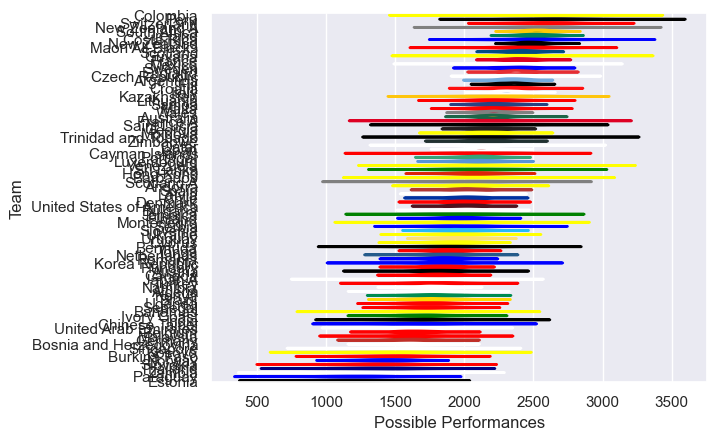

---  
title: "International Test Match 2024 Status"  
date: 2025-07-28 6:00:00 -0500  
categories: model review projection  
layout: article  
aside:  
    toc: true  
---
# Current Team Rankings

# Standings

## Current Standings

| Club                     |   Played |   Wins |   Point Differential |   Losing Bonus Points |   Try Bonus Points |   Competition Points |
|:-------------------------|---------:|-------:|---------------------:|----------------------:|-------------------:|---------------------:|
| Scotland                 |        8 |      7 |                  224 |                     0 |                  7 |                   35 |
| New Zealand              |        8 |      7 |                  124 |                     1 |                  3 |                   32 |
| South Africa             |        7 |      6 |                  136 |                     1 |                  5 |                   30 |
| Hong Kong                |        8 |      6 |                  243 |                     1 |                  2 |                   27 |
| Zimbabwe                 |        7 |      6 |                   99 |                     0 |                    |                   26 |
| Australia                |        7 |      5 |                   48 |                     1 |                  4 |                   25 |
| Chile                    |        8 |      5 |                  107 |                     2 |                    |                   22 |
| France                   |        5 |      4 |                   62 |                     0 |                  2 |                   18 |
| Ireland                  |        6 |      4 |                   25 |                     1 |                  1 |                   18 |
| Argentina                |        6 |      3 |                   82 |                     1 |                  3 |                   16 |
| England                  |        7 |      2 |                   56 |                     4 |                  3 |                   15 |
| United States of America |        5 |      3 |                  -11 |                     1 |                  2 |                   15 |
| Italy                    |        6 |      3 |                   -5 |                     0 |                  2 |                   14 |
| Brazil                   |        6 |      3 |                   47 |                     1 |                    |                   13 |
| Romania                  |        5 |      3 |                    5 |                     1 |                    |                   13 |
| Fiji                     |        6 |      3 |                  -89 |                     0 |                  1 |                   13 |
| Moldova                  |        3 |      3 |                  100 |                     0 |                    |                   12 |
| Latvia                   |        3 |      3 |                   83 |                     0 |                    |                   12 |
| Malta                    |        3 |      3 |                   39 |                     0 |                    |                   12 |
| Kenya                    |        5 |      3 |                   18 |                     0 |                    |                   12 |
| Algeria                  |        4 |      3 |                   16 |                     0 |                    |                   12 |
| Spain                    |        5 |      2 |                   -3 |                     2 |                  1 |                   11 |
| Samoa                    |        2 |      2 |                   12 |                     0 |                  2 |                   10 |
| Uganda                   |        5 |      2 |                   -7 |                     2 |                    |                   10 |
| Georgia                  |        6 |      2 |                  -24 |                     1 |                  1 |                   10 |
| Denmark                  |        3 |      2 |                  143 |                     1 |                    |                    9 |
| Hungary                  |        4 |      2 |                   40 |                     1 |                    |                    9 |
| United Arab Emirates     |        5 |      2 |                  -46 |                     1 |                    |                    9 |
| Colombia                 |        3 |      2 |                  150 |                     0 |                    |                    8 |
| Luxembourg               |        2 |      2 |                   80 |                     0 |                    |                    8 |
| Finland                  |        3 |      2 |                   79 |                     0 |                    |                    8 |
| Sri Lanka                |        2 |      2 |                   73 |                     0 |                    |                    8 |
| Austria                  |        2 |      2 |                   67 |                     0 |                    |                    8 |
| Mexico                   |        2 |      2 |                   41 |                     0 |                    |                    8 |
| Sweden                   |        2 |      2 |                   31 |                     0 |                    |                    8 |
| Belgium                  |        4 |      2 |                   16 |                     0 |                    |                    8 |
| Namibia                  |        4 |      2 |                    7 |                     0 |                    |                    8 |
| Switzerland              |        3 |      2 |                    0 |                     0 |                    |                    8 |
| Netherlands              |        2 |      1 |                    3 |                     0 |                    |                    6 |
| Korea Republic           |        4 |      1 |                  -19 |                     2 |                    |                    6 |
| Portugal                 |        4 |      1 |                  -70 |                     1 |                  1 |                    6 |
| Japan                    |        7 |      1 |                 -179 |                     1 |                  1 |                    6 |
| Peru                     |        3 |      1 |                   31 |                     1 |                    |                    5 |
| Andorra                  |        2 |      1 |                   17 |                     1 |                    |                    5 |
| Qatar                    |        2 |      1 |                    7 |                     1 |                    |                    5 |
| Chinese Taipei           |        2 |      1 |                   -3 |                     1 |                    |                    5 |
| Senegal                  |        4 |      1 |                  -19 |                     1 |                    |                    5 |
| Singapore                |        3 |      1 |                  -21 |                     1 |                    |                    5 |
| Canada                   |        4 |      1 |                  -86 |                     0 |                  1 |                    5 |
| Barbados                 |        1 |      1 |                   84 |                     0 |                    |                    4 |
| Ukraine                  |        3 |      1 |                   80 |                     0 |                    |                    4 |
| Montenegro               |        2 |      1 |                   35 |                     0 |                    |                    4 |
| Jamaica                  |        1 |      1 |                   34 |                     0 |                    |                    4 |
| Trinidad and Tobago      |        1 |      1 |                   23 |                     0 |                    |                    4 |
| New Zealand A            |        1 |      1 |                   18 |                     0 |                    |                    4 |
| France A                 |        1 |      1 |                   15 |                     0 |                    |                    4 |
| Czech Republic           |        2 |      1 |                   14 |                     0 |                    |                    4 |
| Maori All Blacks         |        2 |      1 |                   14 |                     0 |                    |                    4 |
| Turkey                   |        2 |      1 |                    9 |                     0 |                    |                    4 |
| Germany                  |        1 |      1 |                    6 |                     0 |                    |                    4 |
| Scotland A               |        1 |      1 |                    2 |                     0 |                    |                    4 |
| Bermuda                  |        2 |      1 |                   -2 |                     0 |                    |                    4 |
| Cayman Islands           |        3 |      1 |                   -9 |                     0 |                    |                    4 |
| Croatia                  |        2 |      1 |                  -10 |                     0 |                    |                    4 |
| Slovenia                 |        2 |      1 |                  -13 |                     0 |                    |                    4 |
| Japan A                  |        2 |      1 |                  -14 |                     0 |                    |                    4 |
| Thailand                 |        2 |      1 |                  -15 |                     0 |                    |                    4 |
| Ivory Coast              |        3 |      1 |                  -24 |                     0 |                    |                    4 |
| Venezuela                |        2 |      1 |                  -33 |                     0 |                    |                    4 |
| Kazakhstan               |        2 |      1 |                  -36 |                     0 |                    |                    4 |
| Bulgaria                 |        3 |      1 |                  -58 |                     0 |                    |                    4 |
| Bosnia and Herzegovina   |        3 |      1 |                  -65 |                     0 |                    |                    4 |
| Malaysia                 |        4 |      1 |                 -118 |                     0 |                    |                    4 |
| Uruguay                  |        6 |      1 |                 -124 |                     0 |                    |                    4 |
| Costa Rica               |        3 |      1 |                 -179 |                     0 |                    |                    4 |
| Paraguay                 |        5 |      1 |                 -186 |                     0 |                    |                    4 |
| Wales                    |        6 |      0 |                 -115 |                     1 |                  1 |                    2 |
| Zambia                   |        1 |      0 |                   -4 |                     1 |                    |                    1 |
| Guyana                   |        1 |      0 |                  -23 |                     0 |                    |                    0 |
| Cyprus                   |        2 |      0 |                  -32 |                     0 |                    |                    0 |
| Lithuania                |        2 |      0 |                  -34 |                     0 |                    |                    0 |
| India                    |        2 |      0 |                  -44 |                     0 |                    |                    0 |
| Serbia                   |        2 |      0 |                  -51 |                     0 |                    |                    0 |
| Burkina Faso             |        3 |      0 |                  -56 |                     0 |                    |                    0 |
| Bahamas                  |        2 |      0 |                  -64 |                     0 |                    |                    0 |
| Tonga                    |        5 |      0 |                  -75 |                     0 |                    |                    0 |
| Saint Lucia              |        1 |      0 |                  -84 |                     0 |                    |                    0 |
| Kosovo                   |        2 |      0 |                 -109 |                     0 |                    |                    0 |
| Slovakia                 |        2 |      0 |                 -157 |                     0 |                    |                    0 |
| Norway                   |        4 |      0 |                 -162 |                     0 |                    |                    0 |
| Estonia                  |        2 |      0 |                 -167 |                     0 |                    |                    0 |

## Projected Remaining Table

| Club      |   To Play |   Projected Wins |   Projected Differential |   Projected Losing Bonus Points | Projected Try Bonus Points   |   Projected Competition Points |
|:----------|----------:|-----------------:|-------------------------:|--------------------------------:|:-----------------------------|-------------------------------:|
| Argentina |         1 |             0.65 |                     7.23 |                            0.2  |                              |                           2.9  |
| Chile     |         1 |             0.3  |                    -7.23 |                            0.21 |                              |                           1.51 |

## Projected Total Table

| Club                     |   Played |   Wins |   Point Differential |   Losing Bonus Points |   Try Bonus Points |   Competition Points |
|:-------------------------|---------:|-------:|---------------------:|----------------------:|-------------------:|---------------------:|
| Scotland                 |        8 |   7    |               224    |                  0    |                  7 |                35    |
| New Zealand              |        8 |   7    |               124    |                  1    |                  3 |                32    |
| South Africa             |        7 |   6    |               136    |                  1    |                  5 |                30    |
| Hong Kong                |        8 |   6    |               243    |                  1    |                  2 |                27    |
| Zimbabwe                 |        7 |   6    |                99    |                  0    |                    |                26    |
| Australia                |        7 |   5    |                48    |                  1    |                  4 |                25    |
| Chile                    |        9 |   5.3  |                99.77 |                  2.21 |                    |                23.51 |
| Argentina                |        7 |   3.65 |                89.23 |                  1.2  |                  3 |                18.9  |
| France                   |        5 |   4    |                62    |                  0    |                  2 |                18    |
| Ireland                  |        6 |   4    |                25    |                  1    |                  1 |                18    |
| England                  |        7 |   2    |                56    |                  4    |                  3 |                15    |
| United States of America |        5 |   3    |               -11    |                  1    |                  2 |                15    |
| Italy                    |        6 |   3    |                -5    |                  0    |                  2 |                14    |
| Brazil                   |        6 |   3    |                47    |                  1    |                    |                13    |
| Romania                  |        5 |   3    |                 5    |                  1    |                    |                13    |
| Fiji                     |        6 |   3    |               -89    |                  0    |                  1 |                13    |
| Moldova                  |        3 |   3    |               100    |                  0    |                    |                12    |
| Latvia                   |        3 |   3    |                83    |                  0    |                    |                12    |
| Malta                    |        3 |   3    |                39    |                  0    |                    |                12    |
| Kenya                    |        5 |   3    |                18    |                  0    |                    |                12    |
| Algeria                  |        4 |   3    |                16    |                  0    |                    |                12    |
| Spain                    |        5 |   2    |                -3    |                  2    |                  1 |                11    |
| Samoa                    |        2 |   2    |                12    |                  0    |                  2 |                10    |
| Uganda                   |        5 |   2    |                -7    |                  2    |                    |                10    |
| Georgia                  |        6 |   2    |               -24    |                  1    |                  1 |                10    |
| Denmark                  |        3 |   2    |               143    |                  1    |                    |                 9    |
| Hungary                  |        4 |   2    |                40    |                  1    |                    |                 9    |
| United Arab Emirates     |        5 |   2    |               -46    |                  1    |                    |                 9    |
| Colombia                 |        3 |   2    |               150    |                  0    |                    |                 8    |
| Luxembourg               |        2 |   2    |                80    |                  0    |                    |                 8    |
| Finland                  |        3 |   2    |                79    |                  0    |                    |                 8    |
| Sri Lanka                |        2 |   2    |                73    |                  0    |                    |                 8    |
| Austria                  |        2 |   2    |                67    |                  0    |                    |                 8    |
| Mexico                   |        2 |   2    |                41    |                  0    |                    |                 8    |
| Sweden                   |        2 |   2    |                31    |                  0    |                    |                 8    |
| Belgium                  |        4 |   2    |                16    |                  0    |                    |                 8    |
| Namibia                  |        4 |   2    |                 7    |                  0    |                    |                 8    |
| Switzerland              |        3 |   2    |                 0    |                  0    |                    |                 8    |
| Netherlands              |        2 |   1    |                 3    |                  0    |                    |                 6    |
| Korea Republic           |        4 |   1    |               -19    |                  2    |                    |                 6    |
| Portugal                 |        4 |   1    |               -70    |                  1    |                  1 |                 6    |
| Japan                    |        7 |   1    |              -179    |                  1    |                  1 |                 6    |
| Peru                     |        3 |   1    |                31    |                  1    |                    |                 5    |
| Andorra                  |        2 |   1    |                17    |                  1    |                    |                 5    |
| Qatar                    |        2 |   1    |                 7    |                  1    |                    |                 5    |
| Chinese Taipei           |        2 |   1    |                -3    |                  1    |                    |                 5    |
| Senegal                  |        4 |   1    |               -19    |                  1    |                    |                 5    |
| Singapore                |        3 |   1    |               -21    |                  1    |                    |                 5    |
| Canada                   |        4 |   1    |               -86    |                  0    |                  1 |                 5    |
| Barbados                 |        1 |   1    |                84    |                  0    |                    |                 4    |
| Ukraine                  |        3 |   1    |                80    |                  0    |                    |                 4    |
| Montenegro               |        2 |   1    |                35    |                  0    |                    |                 4    |
| Jamaica                  |        1 |   1    |                34    |                  0    |                    |                 4    |
| Trinidad and Tobago      |        1 |   1    |                23    |                  0    |                    |                 4    |
| New Zealand A            |        1 |   1    |                18    |                  0    |                    |                 4    |
| France A                 |        1 |   1    |                15    |                  0    |                    |                 4    |
| Czech Republic           |        2 |   1    |                14    |                  0    |                    |                 4    |
| Maori All Blacks         |        2 |   1    |                14    |                  0    |                    |                 4    |
| Turkey                   |        2 |   1    |                 9    |                  0    |                    |                 4    |
| Germany                  |        1 |   1    |                 6    |                  0    |                    |                 4    |
| Scotland A               |        1 |   1    |                 2    |                  0    |                    |                 4    |
| Bermuda                  |        2 |   1    |                -2    |                  0    |                    |                 4    |
| Cayman Islands           |        3 |   1    |                -9    |                  0    |                    |                 4    |
| Croatia                  |        2 |   1    |               -10    |                  0    |                    |                 4    |
| Slovenia                 |        2 |   1    |               -13    |                  0    |                    |                 4    |
| Japan A                  |        2 |   1    |               -14    |                  0    |                    |                 4    |
| Thailand                 |        2 |   1    |               -15    |                  0    |                    |                 4    |
| Ivory Coast              |        3 |   1    |               -24    |                  0    |                    |                 4    |
| Venezuela                |        2 |   1    |               -33    |                  0    |                    |                 4    |
| Kazakhstan               |        2 |   1    |               -36    |                  0    |                    |                 4    |
| Bulgaria                 |        3 |   1    |               -58    |                  0    |                    |                 4    |
| Bosnia and Herzegovina   |        3 |   1    |               -65    |                  0    |                    |                 4    |
| Malaysia                 |        4 |   1    |              -118    |                  0    |                    |                 4    |
| Uruguay                  |        6 |   1    |              -124    |                  0    |                    |                 4    |
| Costa Rica               |        3 |   1    |              -179    |                  0    |                    |                 4    |
| Paraguay                 |        5 |   1    |              -186    |                  0    |                    |                 4    |
| Wales                    |        6 |   0    |              -115    |                  1    |                  1 |                 2    |
| Zambia                   |        1 |   0    |                -4    |                  1    |                    |                 1    |
| Guyana                   |        1 |   0    |               -23    |                  0    |                    |                 0    |
| Cyprus                   |        2 |   0    |               -32    |                  0    |                    |                 0    |
| Lithuania                |        2 |   0    |               -34    |                  0    |                    |                 0    |
| India                    |        2 |   0    |               -44    |                  0    |                    |                 0    |
| Serbia                   |        2 |   0    |               -51    |                  0    |                    |                 0    |
| Burkina Faso             |        3 |   0    |               -56    |                  0    |                    |                 0    |
| Bahamas                  |        2 |   0    |               -64    |                  0    |                    |                 0    |
| Tonga                    |        5 |   0    |               -75    |                  0    |                    |                 0    |
| Saint Lucia              |        1 |   0    |               -84    |                  0    |                    |                 0    |
| Kosovo                   |        2 |   0    |              -109    |                  0    |                    |                 0    |
| Slovakia                 |        2 |   0    |              -157    |                  0    |                    |                 0    |
| Norway                   |        4 |   0    |              -162    |                  0    |                    |                 0    |
| Estonia                  |        2 |   0    |              -167    |                  0    |                    |                 0    |

# Completed Match Review

| Model | Percent Correct Predictions | Spread Error |
| ------ | ------ | ------ |
| Club Level | 72.5% | 22.4 |
| Player Level: Lineup | nan% | nan |
| Player Level: Minutes | nan% | nan |

# Future Predictions

## Week 9

### Chile V Argentina on 2024/07/27

Average Margin: Argentina by 7.2

