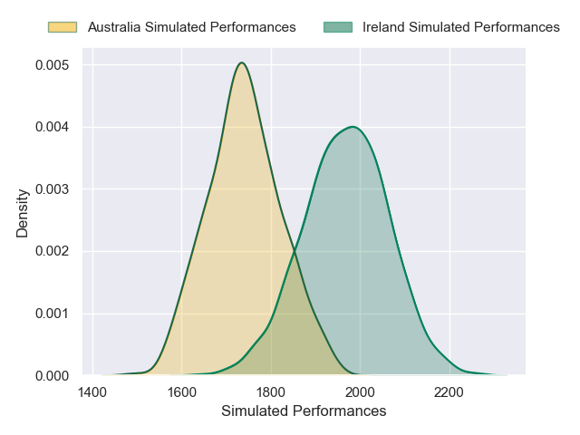
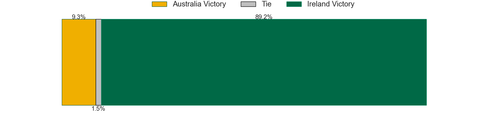
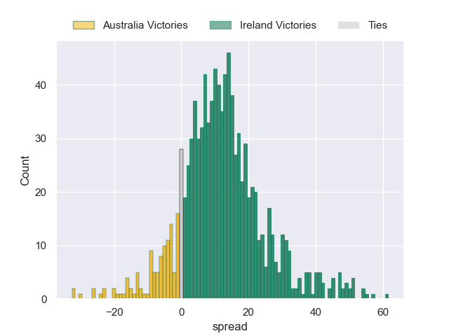

---  
title: "International Test Match 2024 Status"  
date: 2024-11-29 6:00:00 -0500  
categories: model review projection  
layout: article  
aside:  
    toc: true  
---
# Current Team Rankings

# Current Rankings

|   Rank | Team                     |   Rating |
|-------:|:-------------------------|---------:|
|      1 | South Africa             |  1855.33 |
|      2 | New Zealand              |  1787.44 |
|      3 | Ireland                  |  1715.2  |
|      4 | Scotland                 |  1669.03 |
|      5 | France                   |  1668.65 |
|      6 | Argentina                |  1666.73 |
|      7 | England                  |  1582.14 |
|      8 | Australia                |  1575.08 |
|      9 | Fiji                     |  1552.7  |
|     10 | Italy                    |  1480.86 |
|     11 | Wales                    |  1434.5  |
|     12 | Georgia                  |  1404.73 |
|     13 | Japan                    |  1354.88 |
|     14 | United States of America |  1328.87 |
|     15 | Samoa                    |  1301.46 |
|     16 | Zimbabwe                 |  1298.62 |
|     17 | Portugal                 |  1232.95 |
|     18 | Spain                    |  1205.54 |
|     19 | Chile                    |  1166.69 |
|     20 | Uruguay                  |  1152.86 |
|     21 | Tonga                    |  1127.53 |
|     22 | Romania                  |  1092.93 |
|     23 | Hong Kong                |  1070.35 |
|     24 | Namibia                  |   999.37 |
|     25 | Kenya                    |   961.98 |
|     26 | Belgium                  |   954.26 |
|     27 | Netherlands              |   953.65 |
|     28 | Canada                   |   948.68 |
# Completed Match Review

| Model | Percent Correct Predictions | Spread Error |
| ------ | ------ | ------ |
| Club Level | 73.3% | 13.9 |
| Player Level: Lineup | 67.3% | 22.3 |
| Player Level: Minutes | 70.8% | 44.1 |

# Future Predictions

## Week 9

### Ireland V Australia on 2024/11/30

Average Margin: Ireland by 11.9

Average Scoreline: 35-23

