---  
title: "International Test Match 2024 Status"  
date: 2024-07-10 6:00:00 -0500  
categories: model review projection  
layout: article  
aside:  
    toc: true  
---
# Current Team Rankings

# Standings

## Current Standings

| Club                     |   Played |   Wins |   Point Differential |   Losing Bonus Points |   Try Bonus Points |   Competition Points |
|:-------------------------|---------:|-------:|---------------------:|----------------------:|-------------------:|---------------------:|
| Hong Kong                |        4 |      3 |                  166 |                     1 |                nan |                   13 |
| South Africa             |        2 |      2 |                   35 |                     0 |                nan |                    9 |
| Luxembourg               |        2 |      2 |                   80 |                     0 |                nan |                    8 |
| Sri Lanka                |        2 |      2 |                   73 |                     0 |                nan |                    8 |
| Switzerland              |        2 |      2 |                   41 |                     0 |                nan |                    8 |
| Sweden                   |        2 |      2 |                   31 |                     0 |                nan |                    8 |
| United Arab Emirates     |        3 |      2 |                    0 |                     0 |                nan |                    8 |
| England                  |        2 |      1 |                   34 |                     1 |                nan |                    6 |
| Hungary                  |        2 |      1 |                   32 |                     1 |                nan |                    5 |
| Qatar                    |        2 |      1 |                    7 |                     1 |                nan |                    5 |
| Chinese Taipei           |        2 |      1 |                   -3 |                     1 |                nan |                    5 |
| Korea Republic           |        3 |      1 |                  -14 |                     1 |                nan |                    5 |
| Singapore                |        3 |      1 |                  -21 |                     1 |                nan |                    5 |
| Barbados                 |        1 |      1 |                   84 |                     0 |                nan |                    4 |
| Scotland                 |        1 |      1 |                   61 |                     0 |                nan |                    4 |
| Finland                  |        1 |      1 |                   50 |                     0 |                nan |                    4 |
| Moldova                  |        1 |      1 |                   42 |                     0 |                nan |                    4 |
| Austria                  |        1 |      1 |                   40 |                     0 |                nan |                    4 |
| Jamaica                  |        1 |      1 |                   34 |                     0 |                nan |                    4 |
| Andorra                  |        1 |      1 |                   24 |                     0 |                nan |                    4 |
| Trinidad and Tobago      |        1 |      1 |                   23 |                     0 |                nan |                    4 |
| Cayman Islands           |        2 |      1 |                   22 |                     0 |                nan |                    4 |
| France                   |        1 |      1 |                   15 |                     0 |                nan |                    4 |
| Czech Republic           |        2 |      1 |                   14 |                     0 |                nan |                    4 |
| Algeria                  |        1 |      1 |                   14 |                     0 |                nan |                    4 |
| Mexico                   |        1 |      1 |                   10 |                     0 |                nan |                    4 |
| Malta                    |        1 |      1 |                   10 |                     0 |                nan |                    4 |
| Australia                |        1 |      1 |                    9 |                     0 |                nan |                    4 |
| Fiji                     |        1 |      1 |                    9 |                     0 |                nan |                    4 |
| Samoa                    |        1 |      1 |                    8 |                     0 |                nan |                    4 |
| Chile                    |        1 |      1 |                    5 |                     0 |                nan |                    4 |
| Latvia                   |        1 |      1 |                    4 |                     0 |                nan |                    4 |
| Zimbabwe                 |        1 |      1 |                    4 |                     0 |                nan |                    4 |
| Romania                  |        1 |      1 |                    2 |                     0 |                nan |                    4 |
| New Zealand              |        1 |      1 |                    1 |                     0 |                nan |                    4 |
| Bermuda                  |        2 |      1 |                   -2 |                     0 |                nan |                    4 |
| Croatia                  |        2 |      1 |                  -10 |                     0 |                nan |                    4 |
| Thailand                 |        2 |      1 |                  -15 |                     0 |                nan |                    4 |
| Bulgaria                 |        2 |      1 |                  -19 |                     0 |                nan |                    4 |
| Kazakhstan               |        2 |      1 |                  -36 |                     0 |                nan |                    4 |
| Malaysia                 |        4 |      1 |                 -118 |                     0 |                nan |                    4 |
| United States of America |        1 |      0 |                   -2 |                     1 |                nan |                    1 |
| Denmark                  |        1 |      0 |                   -4 |                     1 |                nan |                    1 |
| Zambia                   |        1 |      0 |                   -4 |                     1 |                nan |                    1 |
| Ireland                  |        1 |      0 |                   -7 |                     1 |                nan |                    1 |
| Italy                    |        1 |      0 |                   -8 |                     0 |                nan |                    0 |
| Georgia                  |        1 |      0 |                   -9 |                     0 |                nan |                    0 |
| Cyprus                   |        1 |      0 |                  -10 |                     0 |                nan |                    0 |
| Senegal                  |        1 |      0 |                  -14 |                     0 |                nan |                    0 |
| Argentina                |        1 |      0 |                  -15 |                     0 |                nan |                    0 |
| Guyana                   |        1 |      0 |                  -23 |                     0 |                nan |                    0 |
| Serbia                   |        1 |      0 |                  -23 |                     0 |                nan |                    0 |
| Lithuania                |        2 |      0 |                  -34 |                     0 |                nan |                    0 |
| Japan                    |        1 |      0 |                  -35 |                     0 |                  0 |                    0 |
| Wales                    |        2 |      0 |                  -37 |                     0 |                nan |                    0 |
| Ukraine                  |        2 |      0 |                  -42 |                     0 |                nan |                    0 |
| India                    |        2 |      0 |                  -44 |                     0 |                nan |                    0 |
| Canada                   |        1 |      0 |                  -61 |                     0 |                nan |                    0 |
| Bahamas                  |        2 |      0 |                  -64 |                     0 |                nan |                    0 |
| Norway                   |        2 |      0 |                  -74 |                     0 |                nan |                    0 |
| Bosnia and Herzegovina   |        2 |      0 |                  -75 |                     0 |                nan |                    0 |
| Slovenia                 |        1 |      0 |                  -77 |                     0 |                nan |                    0 |
| Saint Lucia              |        1 |      0 |                  -84 |                     0 |                nan |                    0 |

## Projected Remaining Table

| Club                     |   Matches Remaining |   Wins |   Point Differential |   Losing Bonus Points |   Try Bonus Points |   Competition Points |
|:-------------------------|--------------------:|-------:|---------------------:|----------------------:|-------------------:|---------------------:|
| France                   |                   2 |    1.8 |             25.5823  |                   0.1 |                1.3 |                  8.8 |
| Hong Kong                |                   1 |    1   |             29.0475  |                   0   |                0.8 |                  4.8 |
| Samoa                    |                   1 |    1   |             20.6507  |                   0   |                0.7 |                  4.7 |
| Scotland                 |                   1 |    1   |             14.7929  |                   0   |                0.7 |                  4.6 |
| Chile                    |                   1 |    1   |             15.4208  |                   0   |                0.6 |                  4.5 |
| New Zealand              |                   1 |    0.9 |              8.16863 |                   0.1 |                0.5 |                  4.2 |
| Australia                |                   1 |    0.8 |              4.93193 |                   0.2 |                0.2 |                  3.5 |
| Portugal                 |                   1 |    0.6 |              3.34562 |                   0.2 |                0.5 |                  3.3 |
| Italy                    |                   1 |    0.6 |              2.95906 |                   0.3 |                0.5 |                  3.3 |
| South Africa             |                   1 |    0.7 |              3.51323 |                   0.2 |                0.1 |                  3.1 |
| Canada                   |                   1 |    0.6 |              2.79163 |                   0.2 |                0.1 |                  3   |
| Georgia                  |                   1 |    0.6 |              1.21094 |                   0.3 |                0.3 |                  2.9 |
| Romania                  |                   1 |    0.4 |             -2.79163 |                   0.3 |                0.6 |                  2.3 |
| Japan                    |                   1 |    0.4 |             -1.21094 |                   0.4 |                0.1 |                  2.2 |
| Tonga                    |                   1 |    0.4 |             -2.95906 |                   0.4 |                0.1 |                  1.9 |
| Namibia                  |                   1 |    0.4 |             -3.34562 |                   0.3 |                0.2 |                  1.9 |
| Ireland                  |                   1 |    0.3 |             -3.51323 |                   0.4 |                0.2 |                  1.8 |
| Wales                    |                   1 |    0.2 |             -4.93193 |                   0.4 |                0.1 |                  1.4 |
| Argentina                |                   1 |    0.2 |             -6.58816 |                   0.4 |                0.1 |                  1.1 |
| England                  |                   1 |    0.1 |             -8.16863 |                   0.3 |                0.2 |                  0.9 |
| Belgium                  |                   1 |    0   |            -15.4208  |                   0.1 |                0.1 |                  0.5 |
| United States of America |                   1 |    0   |            -14.7929  |                   0.1 |                0.1 |                  0.3 |
| Spain                    |                   1 |    0   |            -20.6507  |                   0   |                0.2 |                  0.2 |
| Paraguay                 |                   1 |    0   |            -29.0475  |                   0   |                0.1 |                  0.2 |
| Uruguay                  |                   1 |    0   |            -18.9942  |                   0.1 |                0   |                  0.1 |

## Projected Total Table

| Club                     |   Total Matches |   Wins |   Point Differential |   Losing Bonus Points |   Try Bonus Points |   Competition Points |
|:-------------------------|----------------:|-------:|---------------------:|----------------------:|-------------------:|---------------------:|
| Hong Kong                |               5 |    4   |           195.048    |                   1   |                0.8 |                 17.8 |
| France                   |               3 |    2.8 |            40.5823   |                   0.1 |                1.3 |                 12.8 |
| South Africa             |               3 |    2.7 |            38.5132   |                   0.2 |                0.1 |                 12.1 |
| Samoa                    |               2 |    2   |            28.6507   |                   0   |                0.7 |                  8.7 |
| Scotland                 |               2 |    2   |            75.7929   |                   0   |                0.7 |                  8.6 |
| Chile                    |               2 |    2   |            20.4208   |                   0   |                0.6 |                  8.5 |
| New Zealand              |               2 |    1.9 |             9.16863  |                   0.1 |                0.5 |                  8.2 |
| Luxembourg               |               2 |    2   |            80        |                   0   |                0   |                  8   |
| Sri Lanka                |               2 |    2   |            73        |                   0   |                0   |                  8   |
| Switzerland              |               2 |    2   |            41        |                   0   |                0   |                  8   |
| Sweden                   |               2 |    2   |            31        |                   0   |                0   |                  8   |
| United Arab Emirates     |               3 |    2   |             0        |                   0   |                0   |                  8   |
| Australia                |               2 |    1.8 |            13.9319   |                   0.2 |                0.2 |                  7.5 |
| England                  |               3 |    1.1 |            25.8314   |                   1.3 |                0.2 |                  6.9 |
| Romania                  |               2 |    1.4 |            -0.791633 |                   0.3 |                0.6 |                  6.3 |
| Hungary                  |               2 |    1   |            32        |                   1   |                0   |                  5   |
| Qatar                    |               2 |    1   |             7        |                   1   |                0   |                  5   |
| Chinese Taipei           |               2 |    1   |            -3        |                   1   |                0   |                  5   |
| Korea Republic           |               3 |    1   |           -14        |                   1   |                0   |                  5   |
| Singapore                |               3 |    1   |           -21        |                   1   |                0   |                  5   |
| Barbados                 |               1 |    1   |            84        |                   0   |                0   |                  4   |
| Finland                  |               1 |    1   |            50        |                   0   |                0   |                  4   |
| Moldova                  |               1 |    1   |            42        |                   0   |                0   |                  4   |
| Austria                  |               1 |    1   |            40        |                   0   |                0   |                  4   |
| Jamaica                  |               1 |    1   |            34        |                   0   |                0   |                  4   |
| Andorra                  |               1 |    1   |            24        |                   0   |                0   |                  4   |
| Trinidad and Tobago      |               1 |    1   |            23        |                   0   |                0   |                  4   |
| Cayman Islands           |               2 |    1   |            22        |                   0   |                0   |                  4   |
| Algeria                  |               1 |    1   |            14        |                   0   |                0   |                  4   |
| Czech Republic           |               2 |    1   |            14        |                   0   |                0   |                  4   |
| Malta                    |               1 |    1   |            10        |                   0   |                0   |                  4   |
| Mexico                   |               1 |    1   |            10        |                   0   |                0   |                  4   |
| Fiji                     |               1 |    1   |             9        |                   0   |                0   |                  4   |
| Latvia                   |               1 |    1   |             4        |                   0   |                0   |                  4   |
| Zimbabwe                 |               1 |    1   |             4        |                   0   |                0   |                  4   |
| Bermuda                  |               2 |    1   |            -2        |                   0   |                0   |                  4   |
| Croatia                  |               2 |    1   |           -10        |                   0   |                0   |                  4   |
| Thailand                 |               2 |    1   |           -15        |                   0   |                0   |                  4   |
| Bulgaria                 |               2 |    1   |           -19        |                   0   |                0   |                  4   |
| Kazakhstan               |               2 |    1   |           -36        |                   0   |                0   |                  4   |
| Malaysia                 |               4 |    1   |          -118        |                   0   |                0   |                  4   |
| Portugal                 |               1 |    0.6 |             3.34562  |                   0.2 |                0.5 |                  3.3 |
| Italy                    |               2 |    0.6 |            -5.04094  |                   0.3 |                0.5 |                  3.3 |
| Canada                   |               2 |    0.6 |           -58.2084   |                   0.2 |                0.1 |                  3   |
| Georgia                  |               2 |    0.6 |            -7.78906  |                   0.3 |                0.3 |                  2.9 |
| Ireland                  |               2 |    0.3 |           -10.5132   |                   1.4 |                0.2 |                  2.8 |
| Japan                    |               2 |    0.4 |           -36.2109   |                   0.4 |                0.1 |                  2.2 |
| Tonga                    |               1 |    0.4 |            -2.95906  |                   0.4 |                0.1 |                  1.9 |
| Namibia                  |               1 |    0.4 |            -3.34562  |                   0.3 |                0.2 |                  1.9 |
| Wales                    |               3 |    0.2 |           -41.9319   |                   0.4 |                0.1 |                  1.4 |
| United States of America |               2 |    0   |           -16.7929   |                   1.1 |                0.1 |                  1.3 |
| Argentina                |               2 |    0.2 |           -21.5882   |                   0.4 |                0.1 |                  1.1 |
| Denmark                  |               1 |    0   |            -4        |                   1   |                0   |                  1   |
| Zambia                   |               1 |    0   |            -4        |                   1   |                0   |                  1   |
| Belgium                  |               1 |    0   |           -15.4208   |                   0.1 |                0.1 |                  0.5 |
| Spain                    |               1 |    0   |           -20.6507   |                   0   |                0.2 |                  0.2 |
| Paraguay                 |               1 |    0   |           -29.0475   |                   0   |                0.1 |                  0.2 |
| Uruguay                  |               1 |    0   |           -18.9942   |                   0.1 |                0   |                  0.1 |
| Cyprus                   |               1 |    0   |           -10        |                   0   |                0   |                  0   |
| Senegal                  |               1 |    0   |           -14        |                   0   |                0   |                  0   |
| Guyana                   |               1 |    0   |           -23        |                   0   |                0   |                  0   |
| Serbia                   |               1 |    0   |           -23        |                   0   |                0   |                  0   |
| Lithuania                |               2 |    0   |           -34        |                   0   |                0   |                  0   |
| Ukraine                  |               2 |    0   |           -42        |                   0   |                0   |                  0   |
| India                    |               2 |    0   |           -44        |                   0   |                0   |                  0   |
| Bahamas                  |               2 |    0   |           -64        |                   0   |                0   |                  0   |
| Norway                   |               2 |    0   |           -74        |                   0   |                0   |                  0   |
| Bosnia and Herzegovina   |               2 |    0   |           -75        |                   0   |                0   |                  0   |
| Slovenia                 |               1 |    0   |           -77        |                   0   |                0   |                  0   |
| Saint Lucia              |               1 |    0   |           -84        |                   0   |                0   |                  0   |

# Completed Match Review

| Model | Percent Correct Predictions | Spread Error |
| ------ | ------ | ------ |
| Club Level | 69.4% | 23.2 |
| Player Level: Lineup | 60.0% | 17.7 |
| Player Level: Minutes | 60.0% | 18.5 |

# Future Predictions

## Week 5

### Uruguay V France on 2024/07/10

Average Margin: France by 19.0

Average Scoreline: 34-15

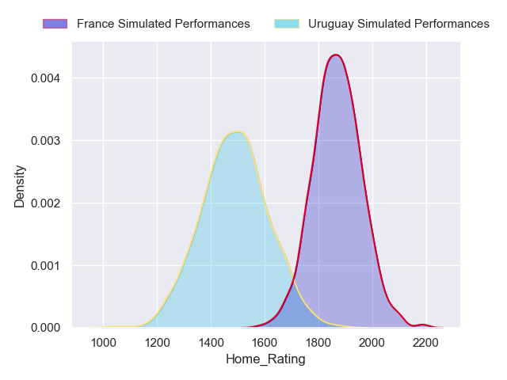
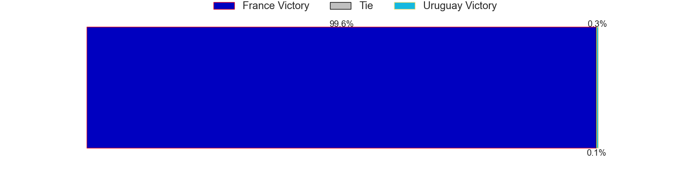
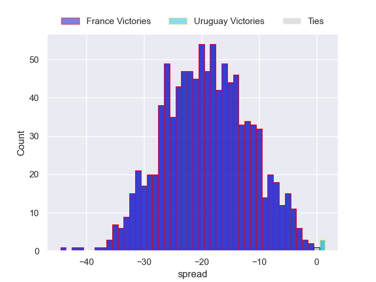

### United States of America V Scotland on 2024/07/12

Average Margin: Scotland by 14.8

Average Scoreline: 33-18

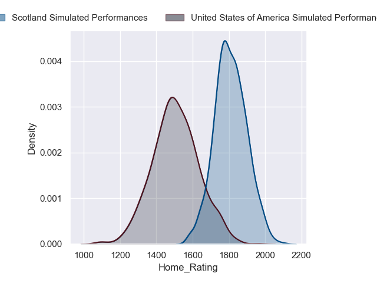
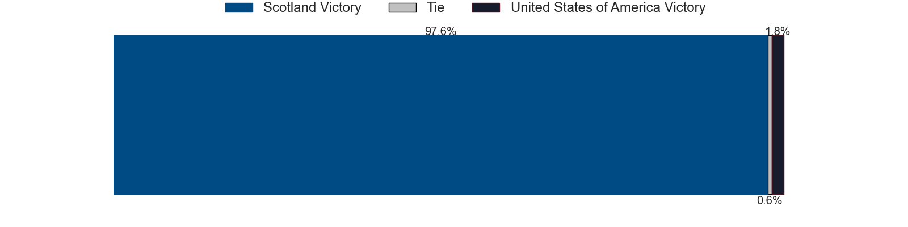
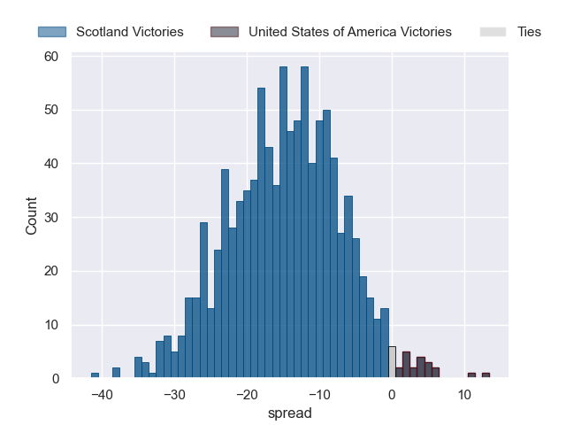

### Tonga V Italy on 2024/07/12

Average Margin: Italy by 3.0

Average Scoreline: 29-26

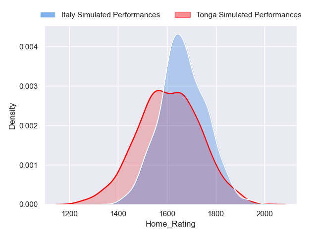
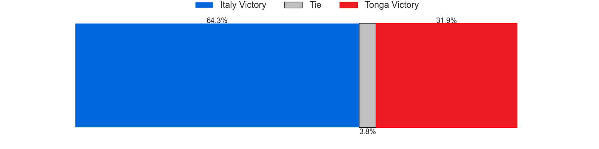
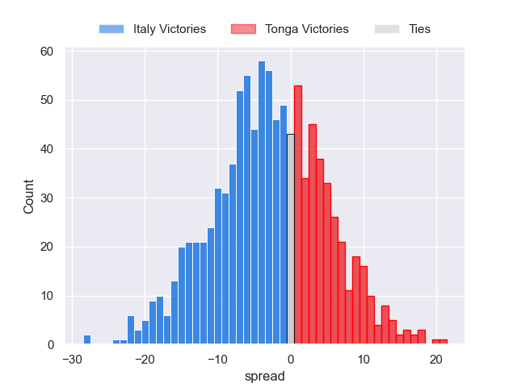

### Argentina V France on 2024/07/13

Average Margin: France by 6.6

Average Scoreline: 25-19

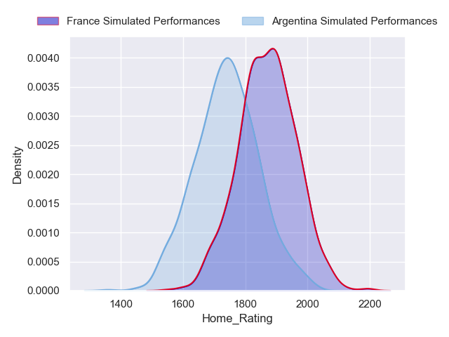
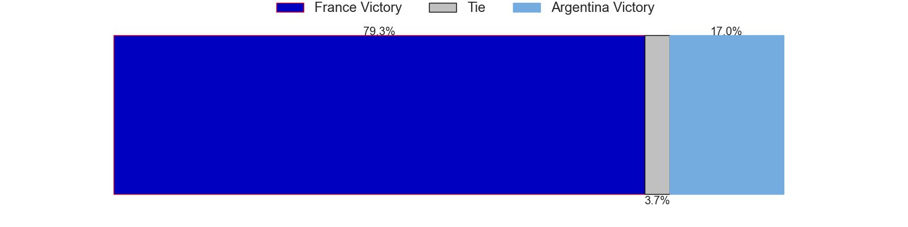
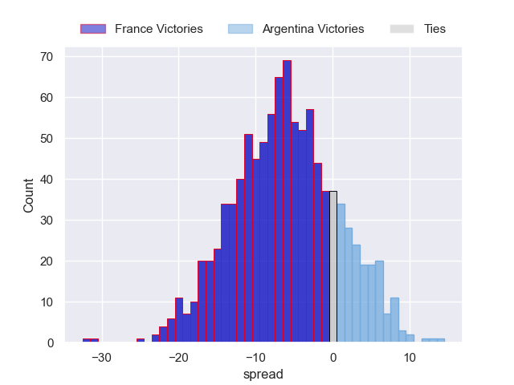

### Samoa V Spain on 2024/07/13

Average Margin: Samoa by 20.7

Average Scoreline: 38-18

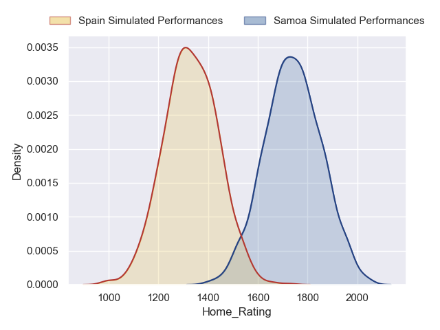
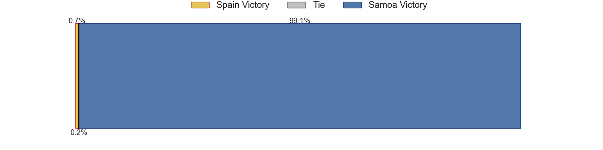
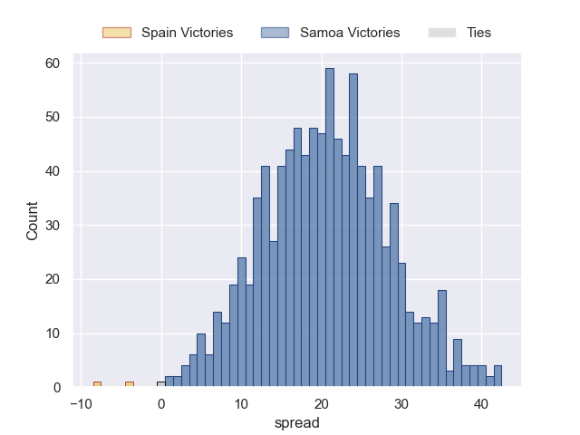

### New Zealand V England on 2024/07/13

Average Margin: New Zealand by 8.2

Average Scoreline: 35-27

### Japan V Georgia on 2024/07/13

Average Margin: Georgia by 1.2

Average Scoreline: 24-23

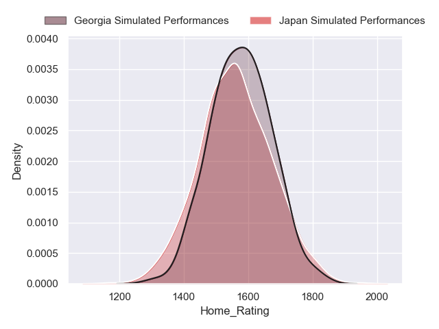

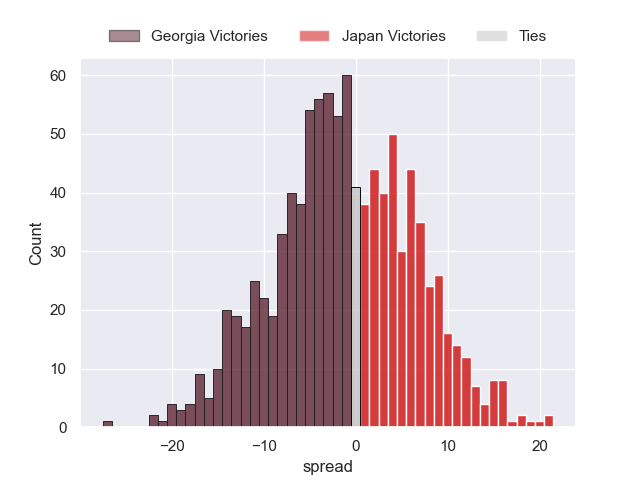

### Namibia V Portugal on 2024/07/13

Average Margin: Portugal by 3.3

Average Scoreline: 34-30

### South Africa V Ireland on 2024/07/13

Average Margin: South Africa by 3.5

Average Scoreline: 26-23

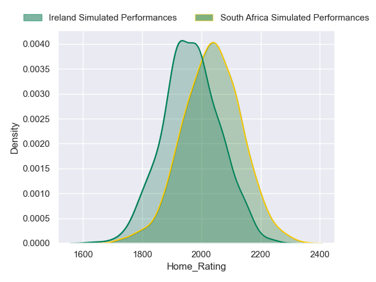
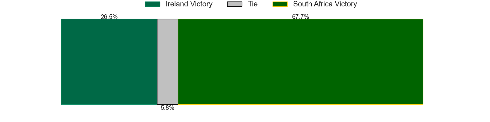
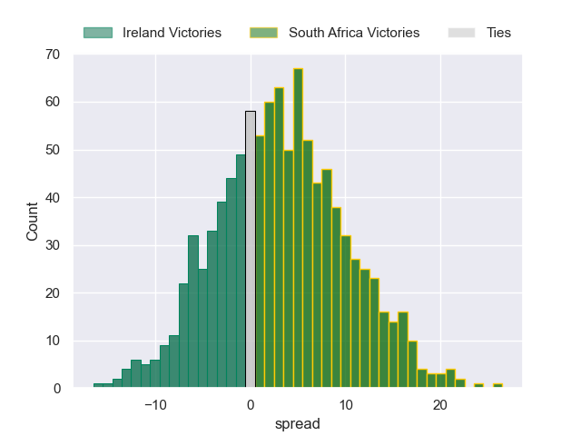

### Canada V Romania on 2024/07/13

Average Margin: Canada by 2.8

Average Scoreline: 32-29

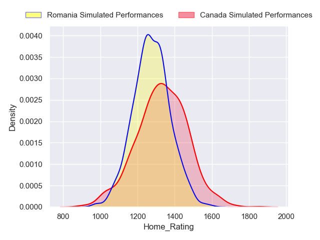
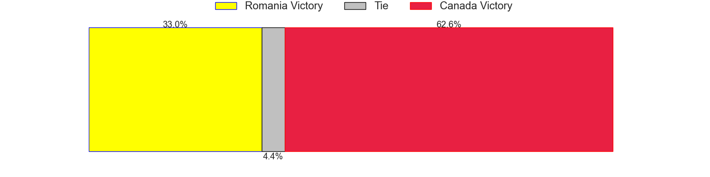
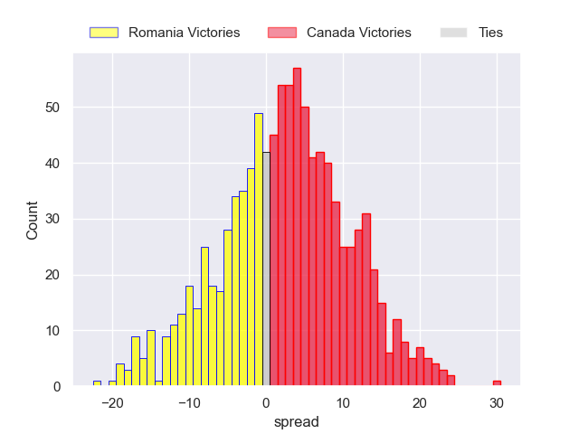

### Chile V Belgium on 2024/07/13

Average Margin: Chile by 15.4

Average Scoreline: 32-17

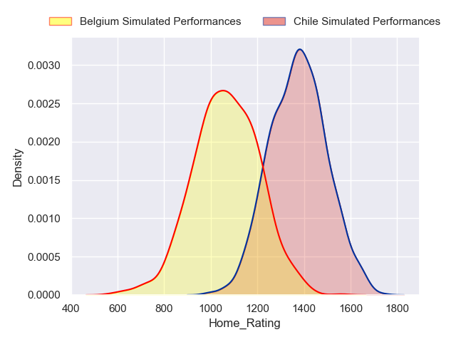
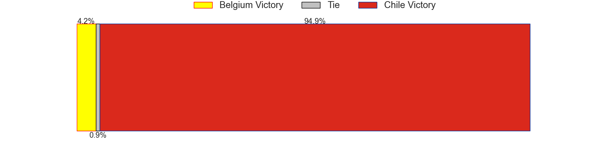
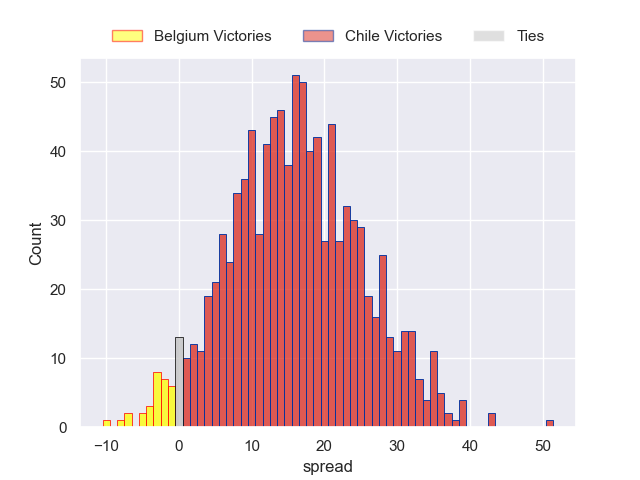

### Australia V Wales on 2024/07/13

Average Margin: Australia by 4.9

Average Scoreline: 23-18

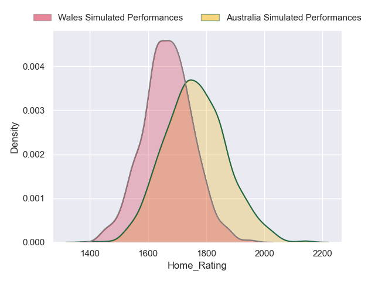
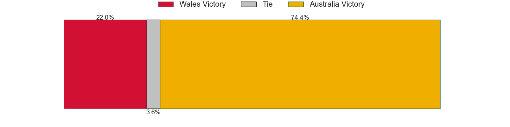
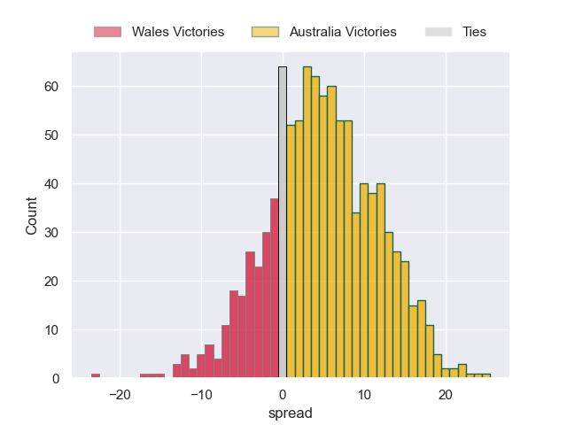

### Paraguay V Hong Kong on 2024/07/14

Average Margin: Hong Kong by 29.0

Average Scoreline: 49-20

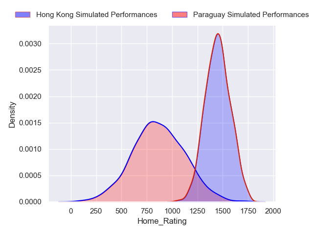
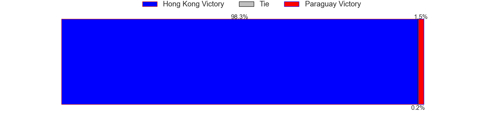
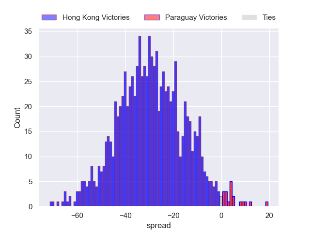

