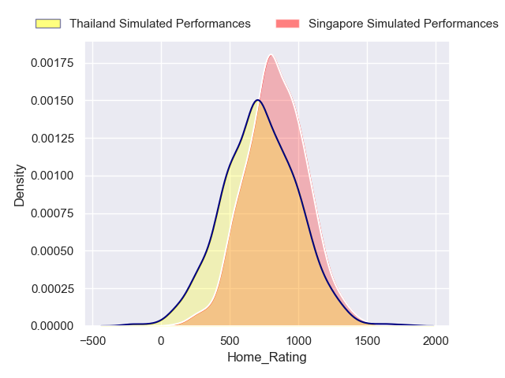
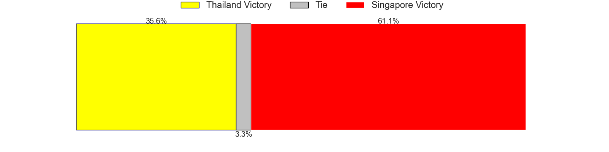
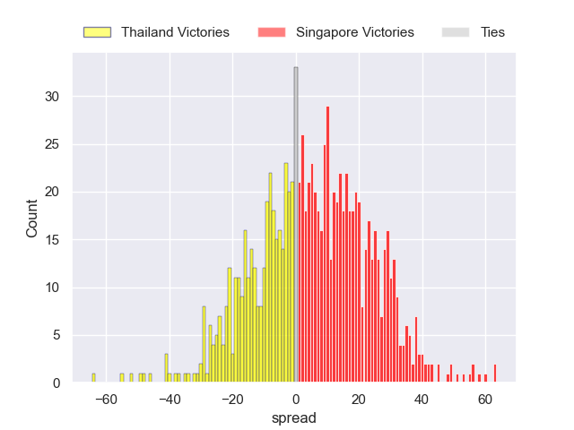
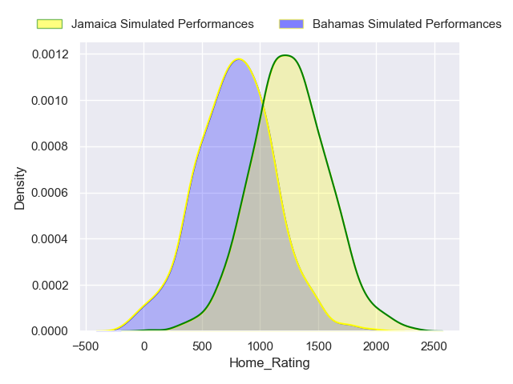
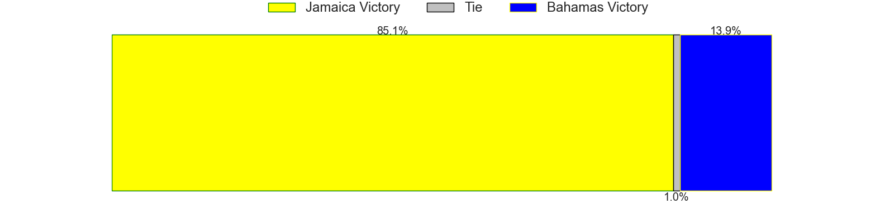
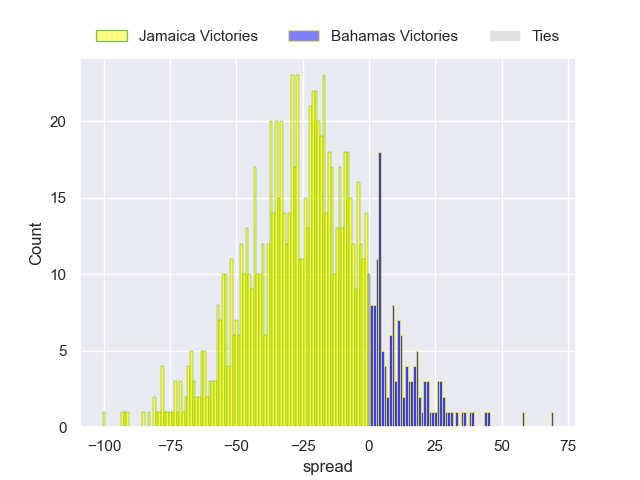

---  
title: "International Test Match 2024 Status"  
date: 2024-06-24 6:00:00 -0500  
categories: model review projection  
layout: article  
aside:  
    toc: true  
---
# Current Team Rankings

# Standings

## Current Standings

| Club                   |   Played |   Wins |   Point Differential |   Losing Bonus Points |   Try Bonus Points |   Competition Points |
|:-----------------------|---------:|-------:|---------------------:|----------------------:|-------------------:|---------------------:|
| Hong Kong              |        3 |      3 |                  171 |                     0 |                nan |                   12 |
| Luxembourg             |        2 |      2 |                   80 |                     0 |                nan |                    8 |
| Sri Lanka              |        2 |      2 |                   73 |                     0 |                nan |                    8 |
| Switzerland            |        2 |      2 |                   41 |                     0 |                nan |                    8 |
| Sweden                 |        2 |      2 |                   31 |                     0 |                nan |                    8 |
| United Arab Emirates   |        3 |      2 |                    0 |                     0 |                nan |                    8 |
| England                |        1 |      1 |                   35 |                     0 |                  1 |                    5 |
| Hungary                |        2 |      1 |                   32 |                     1 |                nan |                    5 |
| South Africa           |        1 |      1 |                   28 |                     0 |                  1 |                    5 |
| Qatar                  |        2 |      1 |                    7 |                     1 |                nan |                    5 |
| Korea Republic         |        3 |      1 |                  -14 |                     1 |                nan |                    5 |
| Barbados               |        1 |      1 |                   84 |                     0 |                nan |                    4 |
| Finland                |        1 |      1 |                   50 |                     0 |                nan |                    4 |
| Moldova                |        1 |      1 |                   42 |                     0 |                nan |                    4 |
| Austria                |        1 |      1 |                   40 |                     0 |                nan |                    4 |
| Andorra                |        1 |      1 |                   24 |                     0 |                nan |                    4 |
| Trinidad and Tobago    |        1 |      1 |                   23 |                     0 |                nan |                    4 |
| Cayman Islands         |        2 |      1 |                   22 |                     0 |                nan |                    4 |
| Czech Republic         |        2 |      1 |                   14 |                     0 |                nan |                    4 |
| Algeria                |        1 |      1 |                   14 |                     0 |                nan |                    4 |
| Mexico                 |        1 |      1 |                   10 |                     0 |                nan |                    4 |
| Malta                  |        1 |      1 |                   10 |                     0 |                nan |                    4 |
| Latvia                 |        1 |      1 |                    4 |                     0 |                nan |                    4 |
| Zimbabwe               |        1 |      1 |                    4 |                     0 |                nan |                    4 |
| Bermuda                |        2 |      1 |                   -2 |                     0 |                nan |                    4 |
| Croatia                |        2 |      1 |                  -10 |                     0 |                nan |                    4 |
| Bulgaria               |        2 |      1 |                  -19 |                     0 |                nan |                    4 |
| Kazakhstan             |        2 |      1 |                  -36 |                     0 |                nan |                    4 |
| Malaysia               |        4 |      1 |                 -118 |                     0 |                nan |                    4 |
| Denmark                |        1 |      0 |                   -4 |                     1 |                nan |                    1 |
| Zambia                 |        1 |      0 |                   -4 |                     1 |                nan |                    1 |
| Cyprus                 |        1 |      0 |                  -10 |                     0 |                nan |                    0 |
| Senegal                |        1 |      0 |                  -14 |                     0 |                nan |                    0 |
| Guyana                 |        1 |      0 |                  -23 |                     0 |                nan |                    0 |
| Serbia                 |        1 |      0 |                  -23 |                     0 |                nan |                    0 |
| Wales                  |        1 |      0 |                  -28 |                     0 |                  0 |                    0 |
| Bahamas                |        1 |      0 |                  -30 |                     0 |                nan |                    0 |
| Lithuania              |        2 |      0 |                  -34 |                     0 |                nan |                    0 |
| Japan                  |        1 |      0 |                  -35 |                     0 |                  0 |                    0 |
| Singapore              |        1 |      0 |                  -39 |                     0 |                nan |                    0 |
| Ukraine                |        2 |      0 |                  -42 |                     0 |                nan |                    0 |
| India                  |        2 |      0 |                  -44 |                     0 |                nan |                    0 |
| Norway                 |        2 |      0 |                  -74 |                     0 |                nan |                    0 |
| Bosnia and Herzegovina |        2 |      0 |                  -75 |                     0 |                nan |                    0 |
| Slovenia               |        1 |      0 |                  -77 |                     0 |                nan |                    0 |
| Saint Lucia            |        1 |      0 |                  -84 |                     0 |                nan |                    0 |

## Projected Remaining Table

| Club      |   Matches Remaining |   Wins |   Point Differential |   Losing Bonus Points |   Try Bonus Points |   Competition Points |
|:----------|--------------------:|-------:|---------------------:|----------------------:|-------------------:|---------------------:|
| Jamaica   |                   1 |    0.9 |             23.4405  |                   0.1 |                0.8 |                  4.3 |
| Singapore |                   1 |    0.6 |              5.76357 |                   0.1 |                0.3 |                  3   |
| Thailand  |                   1 |    0.4 |             -5.76357 |                   0.2 |                0.2 |                  1.8 |
| Bahamas   |                   1 |    0.1 |            -23.4405  |                   0.1 |                0.1 |                  0.8 |

## Projected Total Table

| Club                   |   Total Matches |   Wins |   Point Differential |   Losing Bonus Points |   Try Bonus Points |   Competition Points |
|:-----------------------|----------------:|-------:|---------------------:|----------------------:|-------------------:|---------------------:|
| Hong Kong              |               3 |    3   |            171       |                   0   |                0   |                 12   |
| Luxembourg             |               2 |    2   |             80       |                   0   |                0   |                  8   |
| Sri Lanka              |               2 |    2   |             73       |                   0   |                0   |                  8   |
| Switzerland            |               2 |    2   |             41       |                   0   |                0   |                  8   |
| Sweden                 |               2 |    2   |             31       |                   0   |                0   |                  8   |
| United Arab Emirates   |               3 |    2   |              0       |                   0   |                0   |                  8   |
| England                |               1 |    1   |             35       |                   0   |                1   |                  5   |
| Hungary                |               2 |    1   |             32       |                   1   |                0   |                  5   |
| South Africa           |               1 |    1   |             28       |                   0   |                1   |                  5   |
| Qatar                  |               2 |    1   |              7       |                   1   |                0   |                  5   |
| Korea Republic         |               3 |    1   |            -14       |                   1   |                0   |                  5   |
| Jamaica                |               1 |    0.9 |             23.4405  |                   0.1 |                0.8 |                  4.3 |
| Barbados               |               1 |    1   |             84       |                   0   |                0   |                  4   |
| Finland                |               1 |    1   |             50       |                   0   |                0   |                  4   |
| Moldova                |               1 |    1   |             42       |                   0   |                0   |                  4   |
| Austria                |               1 |    1   |             40       |                   0   |                0   |                  4   |
| Andorra                |               1 |    1   |             24       |                   0   |                0   |                  4   |
| Trinidad and Tobago    |               1 |    1   |             23       |                   0   |                0   |                  4   |
| Cayman Islands         |               2 |    1   |             22       |                   0   |                0   |                  4   |
| Algeria                |               1 |    1   |             14       |                   0   |                0   |                  4   |
| Czech Republic         |               2 |    1   |             14       |                   0   |                0   |                  4   |
| Malta                  |               1 |    1   |             10       |                   0   |                0   |                  4   |
| Mexico                 |               1 |    1   |             10       |                   0   |                0   |                  4   |
| Latvia                 |               1 |    1   |              4       |                   0   |                0   |                  4   |
| Zimbabwe               |               1 |    1   |              4       |                   0   |                0   |                  4   |
| Bermuda                |               2 |    1   |             -2       |                   0   |                0   |                  4   |
| Croatia                |               2 |    1   |            -10       |                   0   |                0   |                  4   |
| Bulgaria               |               2 |    1   |            -19       |                   0   |                0   |                  4   |
| Kazakhstan             |               2 |    1   |            -36       |                   0   |                0   |                  4   |
| Malaysia               |               4 |    1   |           -118       |                   0   |                0   |                  4   |
| Singapore              |               2 |    0.6 |            -33.2364  |                   0.1 |                0.3 |                  3   |
| Thailand               |               1 |    0.4 |             -5.76357 |                   0.2 |                0.2 |                  1.8 |
| Denmark                |               1 |    0   |             -4       |                   1   |                0   |                  1   |
| Zambia                 |               1 |    0   |             -4       |                   1   |                0   |                  1   |
| Bahamas                |               2 |    0.1 |            -53.4405  |                   0.1 |                0.1 |                  0.8 |
| Cyprus                 |               1 |    0   |            -10       |                   0   |                0   |                  0   |
| Senegal                |               1 |    0   |            -14       |                   0   |                0   |                  0   |
| Guyana                 |               1 |    0   |            -23       |                   0   |                0   |                  0   |
| Serbia                 |               1 |    0   |            -23       |                   0   |                0   |                  0   |
| Wales                  |               1 |    0   |            -28       |                   0   |                0   |                  0   |
| Lithuania              |               2 |    0   |            -34       |                   0   |                0   |                  0   |
| Japan                  |               1 |    0   |            -35       |                   0   |                0   |                  0   |
| Ukraine                |               2 |    0   |            -42       |                   0   |                0   |                  0   |
| India                  |               2 |    0   |            -44       |                   0   |                0   |                  0   |
| Norway                 |               2 |    0   |            -74       |                   0   |                0   |                  0   |
| Bosnia and Herzegovina |               2 |    0   |            -75       |                   0   |                0   |                  0   |
| Slovenia               |               1 |    0   |            -77       |                   0   |                0   |                  0   |
| Saint Lucia            |               1 |    0   |            -84       |                   0   |                0   |                  0   |

# Completed Match Review

| Model | Percent Correct Predictions | Spread Error |
| ------ | ------ | ------ |
| Club Level | 69.4% | 26.8 |
| Player Level: Lineup | 100.0% | 10.0 |
| Player Level: Minutes | 100.0% | 13.1 |

# Future Predictions

## Week 5

### Singapore V Thailand on 2024/06/29

Average Margin: Singapore by 5.8

Average Scoreline: 32-26

### Bahamas V Jamaica on 2024/06/29

Average Margin: Jamaica by 23.4

Average Scoreline: 41-17

