---  
title: "International Test Match 2024 Status"  
date: 2024-11-22 6:00:00 -0500  
categories: model review projection  
layout: article  
aside:  
    toc: true  
---
# Current Team Rankings

# Current Rankings

|    | Team                     |   Rating |
|---:|:-------------------------|---------:|
|  1 | South Africa             |  1855.33 |
|  2 | New Zealand              |  1787.44 |
|  3 | Ireland                  |  1715.2  |
|  4 | Scotland                 |  1669.03 |
|  5 | France                   |  1668.65 |
|  6 | Argentina                |  1666.73 |
|  7 | England                  |  1582.14 |
|  8 | Australia                |  1575.08 |
|  9 | Fiji                     |  1552.7  |
| 10 | Italy                    |  1480.86 |
| 11 | Wales                    |  1434.5  |
| 12 | Georgia                  |  1404.73 |
| 13 | Japan                    |  1354.88 |
| 14 | United States of America |  1336.7  |
| 15 | Samoa                    |  1271.54 |
| 16 | Zimbabwe                 |  1259.66 |
| 17 | Portugal                 |  1238.35 |
| 18 | Spain                    |  1213.82 |
| 19 | Chile                    |  1161.12 |
| 20 | Uruguay                  |  1143.52 |
| 21 | Tonga                    |  1130.56 |
| 22 | Romania                  |  1088.87 |
| 23 | Hong Kong                |  1070.35 |
| 24 | Netherlands              |  1012.55 |
| 25 | Namibia                  |   999.37 |
| 26 | Kenya                    |   961.98 |
| 27 | Belgium                  |   954.26 |
| 28 | Canada                   |   948.68 |
# Completed Match Review

| Model | Percent Correct Predictions | Spread Error |
| ------ | ------ | ------ |
| Club Level | 74.1% | 14.2 |
| Player Level: Lineup | 68.1% | 22.6 |
| Player Level: Minutes | 70.2% | 44.1 |

# Future Predictions

## Week 9

### France V Argentina on 2024/11/22

Average Margin: France by 5.1

Average Scoreline: 31-26

### Spain V United States of America on 2024/11/23

Average Margin: United States of America by 2.8

Average Scoreline: 33-30

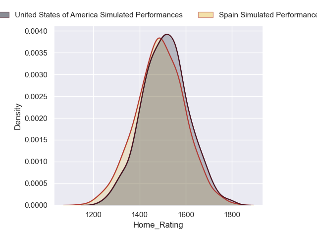

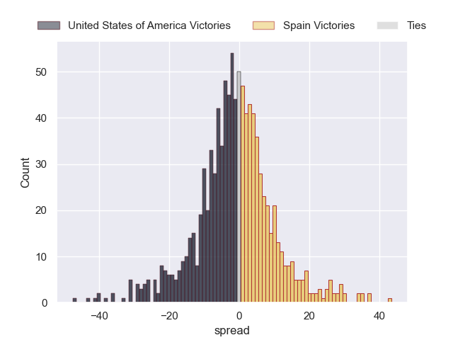

### Ireland V Fiji on 2024/11/23

Average Margin: Ireland by 12.9

Average Scoreline: 30-17

### Romania V Uruguay on 2024/11/23

Average Margin: Uruguay by 0.9

Average Scoreline: 27-26

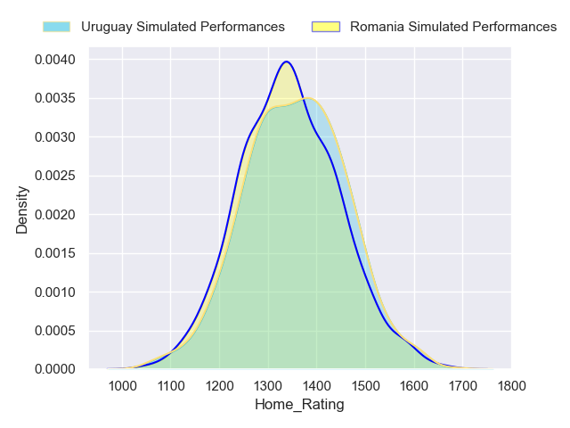

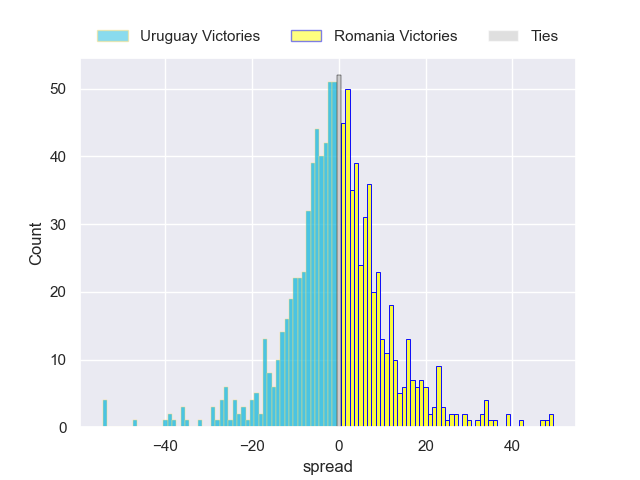

### Wales V South Africa on 2024/11/23

Average Margin: South Africa by 16.7

Average Scoreline: 35-18

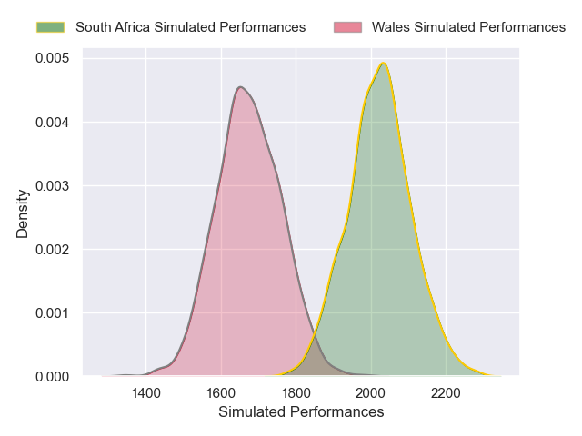
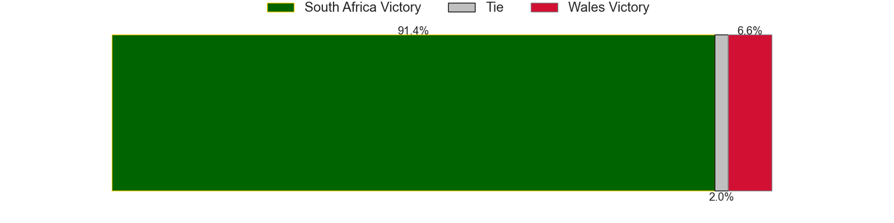
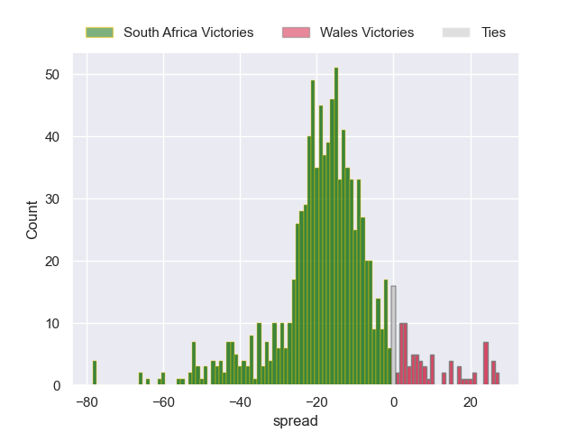

### Italy V New Zealand on 2024/11/23

Average Margin: New Zealand by 11.3

Average Scoreline: 30-19

### England V Japan on 2024/11/24

Average Margin: England by 14.9

Average Scoreline: 39-24

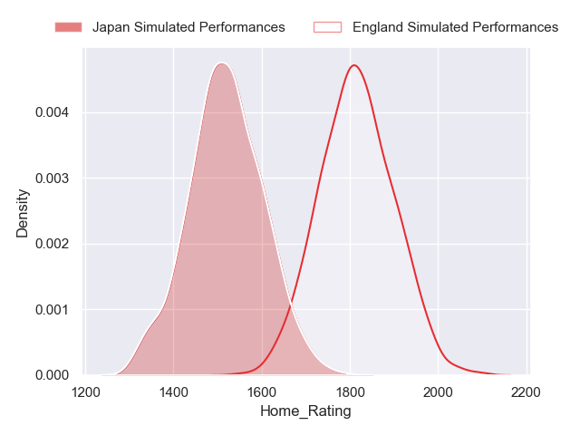
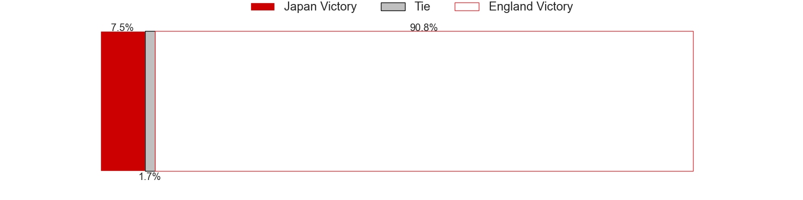
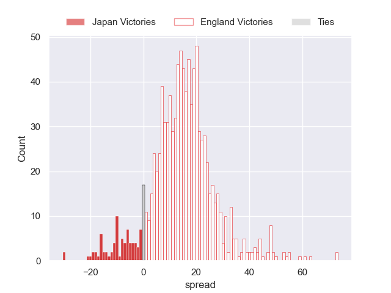

### Scotland V Australia on 2024/11/24

Average Margin: Scotland by 9.9

Average Scoreline: 33-23

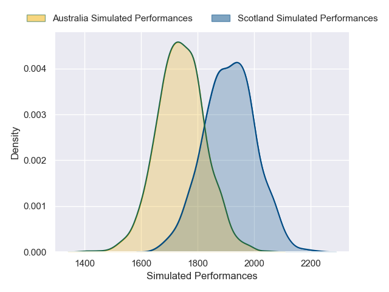
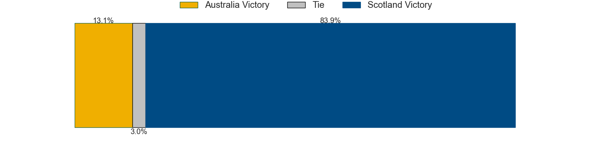
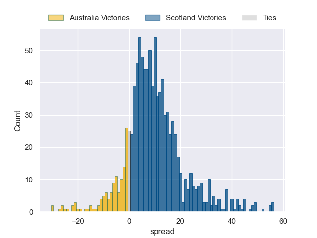

### Georgia V Tonga on 2024/11/24

Average Margin: Georgia by 17.5

Average Scoreline: 36-18

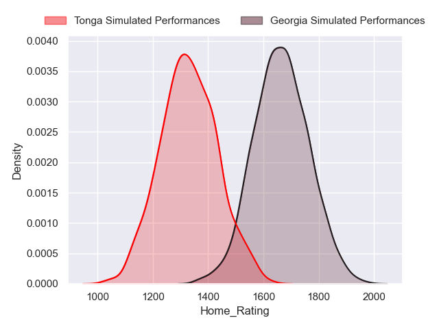

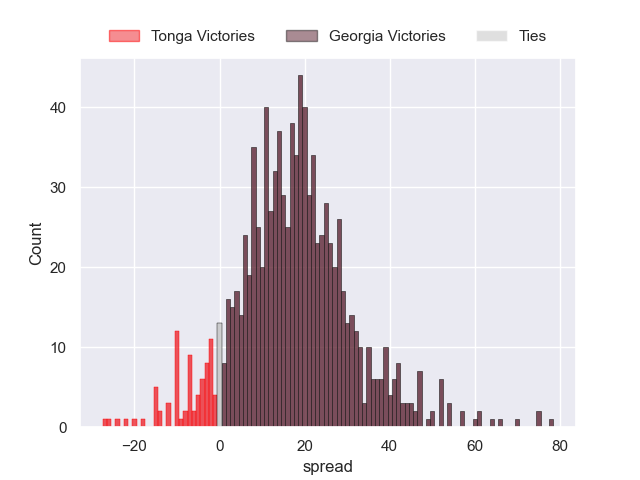

