---  
title: "International Test Match 2024 Status"  
date: 2024-06-20 6:00:00 -0500  
categories: model review projection  
layout: article  
aside:  
    toc: true  
---
# Current Team Rankings

# Standings

## Current Standings

| Club                   |   Played |   Wins |   Point Differential |   Losing Bonus Points |   Try Bonus Points |   Competition Points |
|:-----------------------|---------:|-------:|---------------------:|----------------------:|-------------------:|---------------------:|
| Hong Kong              |        2 |      2 |                  111 |                     0 |                nan |                    8 |
| Luxembourg             |        2 |      2 |                   80 |                     0 |                nan |                    8 |
| Sri Lanka              |        2 |      2 |                   73 |                     0 |                nan |                    8 |
| Switzerland            |        2 |      2 |                   41 |                     0 |                nan |                    8 |
| Sweden                 |        2 |      2 |                   31 |                     0 |                nan |                    8 |
| Korea Republic         |        2 |      1 |                   46 |                     1 |                nan |                    5 |
| Hungary                |        2 |      1 |                   32 |                     1 |                nan |                    5 |
| Qatar                  |        2 |      1 |                    7 |                     1 |                nan |                    5 |
| Barbados               |        1 |      1 |                   84 |                     0 |                nan |                    4 |
| Finland                |        1 |      1 |                   50 |                     0 |                nan |                    4 |
| Moldova                |        1 |      1 |                   42 |                     0 |                nan |                    4 |
| Austria                |        1 |      1 |                   40 |                     0 |                nan |                    4 |
| Andorra                |        1 |      1 |                   24 |                     0 |                nan |                    4 |
| Cayman Islands         |        2 |      1 |                   22 |                     0 |                nan |                    4 |
| Czech Republic         |        2 |      1 |                   14 |                     0 |                nan |                    4 |
| Algeria                |        1 |      1 |                   14 |                     0 |                nan |                    4 |
| Mexico                 |        1 |      1 |                   10 |                     0 |                nan |                    4 |
| Malta                  |        1 |      1 |                   10 |                     0 |                nan |                    4 |
| Latvia                 |        1 |      1 |                    4 |                     0 |                nan |                    4 |
| Zimbabwe               |        1 |      1 |                    4 |                     0 |                nan |                    4 |
| Bermuda                |        2 |      1 |                   -2 |                     0 |                nan |                    4 |
| Croatia                |        2 |      1 |                  -10 |                     0 |                nan |                    4 |
| Bulgaria               |        2 |      1 |                  -19 |                     0 |                nan |                    4 |
| Kazakhstan             |        2 |      1 |                  -36 |                     0 |                nan |                    4 |
| United Arab Emirates   |        2 |      1 |                  -43 |                     0 |                nan |                    4 |
| Malaysia               |        3 |      1 |                  -75 |                     0 |                nan |                    4 |
| Denmark                |        1 |      0 |                   -4 |                     1 |                nan |                    1 |
| Zambia                 |        1 |      0 |                   -4 |                     1 |                nan |                    1 |
| Cyprus                 |        1 |      0 |                  -10 |                     0 |                nan |                    0 |
| Senegal                |        1 |      0 |                  -14 |                     0 |                nan |                    0 |
| Serbia                 |        1 |      0 |                  -23 |                     0 |                nan |                    0 |
| Bahamas                |        1 |      0 |                  -30 |                     0 |                nan |                    0 |
| Lithuania              |        2 |      0 |                  -34 |                     0 |                nan |                    0 |
| Singapore              |        1 |      0 |                  -39 |                     0 |                nan |                    0 |
| Ukraine                |        2 |      0 |                  -42 |                     0 |                nan |                    0 |
| India                  |        2 |      0 |                  -44 |                     0 |                nan |                    0 |
| Norway                 |        2 |      0 |                  -74 |                     0 |                nan |                    0 |
| Bosnia and Herzegovina |        2 |      0 |                  -75 |                     0 |                nan |                    0 |
| Slovenia               |        1 |      0 |                  -77 |                     0 |                nan |                    0 |
| Saint Lucia            |        1 |      0 |                  -84 |                     0 |                nan |                    0 |

## Projected Remaining Table

| Club                 |   Matches Remaining |   Wins |   Point Differential |   Losing Bonus Points |   Try Bonus Points |   Competition Points |
|:---------------------|--------------------:|-------:|---------------------:|----------------------:|-------------------:|---------------------:|
| South Africa         |                   1 |    1   |             16.5949  |                   0   |                0.6 |                  4.6 |
| England              |                   1 |    0.9 |              8.843   |                   0.1 |                0.8 |                  4.4 |
| United Arab Emirates |                   1 |    0.9 |             15.4761  |                   0.1 |                0.4 |                  4   |
| Guyana               |                   1 |    0.8 |             21.6098  |                   0.1 |                0.4 |                  3.8 |
| Hong Kong            |                   1 |    0.7 |              7.06401 |                   0.1 |                0.4 |                  3.3 |
| Korea Republic       |                   1 |    0.3 |             -7.06401 |                   0.2 |                0.1 |                  1.6 |
| Malaysia             |                   1 |    0.1 |            -15.4761  |                   0.1 |                0.4 |                  1   |
| Trinidad and Tobago  |                   1 |    0.2 |            -21.6098  |                   0.1 |                0.1 |                  0.9 |
| Japan                |                   1 |    0.1 |             -8.843   |                   0.3 |                0.1 |                  0.8 |
| Wales                |                   1 |    0   |            -16.5949  |                   0.1 |                0   |                  0.2 |

## Projected Total Table

| Club                   |   Total Matches |   Wins |   Point Differential |   Losing Bonus Points |   Try Bonus Points |   Competition Points |
|:-----------------------|----------------:|-------:|---------------------:|----------------------:|-------------------:|---------------------:|
| Hong Kong              |               3 |    2.7 |             118.064  |                   0.1 |                0.4 |                 11.3 |
| Luxembourg             |               2 |    2   |              80      |                   0   |                0   |                  8   |
| Sri Lanka              |               2 |    2   |              73      |                   0   |                0   |                  8   |
| Switzerland            |               2 |    2   |              41      |                   0   |                0   |                  8   |
| Sweden                 |               2 |    2   |              31      |                   0   |                0   |                  8   |
| United Arab Emirates   |               3 |    1.9 |             -27.5239 |                   0.1 |                0.4 |                  8   |
| Korea Republic         |               3 |    1.3 |              38.936  |                   1.2 |                0.1 |                  6.6 |
| Hungary                |               2 |    1   |              32      |                   1   |                0   |                  5   |
| Qatar                  |               2 |    1   |               7      |                   1   |                0   |                  5   |
| Malaysia               |               4 |    1.1 |             -90.4761 |                   0.1 |                0.4 |                  5   |
| South Africa           |               1 |    1   |              16.5949 |                   0   |                0.6 |                  4.6 |
| England                |               1 |    0.9 |               8.843  |                   0.1 |                0.8 |                  4.4 |
| Barbados               |               1 |    1   |              84      |                   0   |                0   |                  4   |
| Finland                |               1 |    1   |              50      |                   0   |                0   |                  4   |
| Moldova                |               1 |    1   |              42      |                   0   |                0   |                  4   |
| Austria                |               1 |    1   |              40      |                   0   |                0   |                  4   |
| Andorra                |               1 |    1   |              24      |                   0   |                0   |                  4   |
| Cayman Islands         |               2 |    1   |              22      |                   0   |                0   |                  4   |
| Algeria                |               1 |    1   |              14      |                   0   |                0   |                  4   |
| Czech Republic         |               2 |    1   |              14      |                   0   |                0   |                  4   |
| Malta                  |               1 |    1   |              10      |                   0   |                0   |                  4   |
| Mexico                 |               1 |    1   |              10      |                   0   |                0   |                  4   |
| Latvia                 |               1 |    1   |               4      |                   0   |                0   |                  4   |
| Zimbabwe               |               1 |    1   |               4      |                   0   |                0   |                  4   |
| Bermuda                |               2 |    1   |              -2      |                   0   |                0   |                  4   |
| Croatia                |               2 |    1   |             -10      |                   0   |                0   |                  4   |
| Bulgaria               |               2 |    1   |             -19      |                   0   |                0   |                  4   |
| Kazakhstan             |               2 |    1   |             -36      |                   0   |                0   |                  4   |
| Guyana                 |               1 |    0.8 |              21.6098 |                   0.1 |                0.4 |                  3.8 |
| Denmark                |               1 |    0   |              -4      |                   1   |                0   |                  1   |
| Zambia                 |               1 |    0   |              -4      |                   1   |                0   |                  1   |
| Trinidad and Tobago    |               1 |    0.2 |             -21.6098 |                   0.1 |                0.1 |                  0.9 |
| Japan                  |               1 |    0.1 |              -8.843  |                   0.3 |                0.1 |                  0.8 |
| Wales                  |               1 |    0   |             -16.5949 |                   0.1 |                0   |                  0.2 |
| Cyprus                 |               1 |    0   |             -10      |                   0   |                0   |                  0   |
| Senegal                |               1 |    0   |             -14      |                   0   |                0   |                  0   |
| Serbia                 |               1 |    0   |             -23      |                   0   |                0   |                  0   |
| Bahamas                |               1 |    0   |             -30      |                   0   |                0   |                  0   |
| Lithuania              |               2 |    0   |             -34      |                   0   |                0   |                  0   |
| Singapore              |               1 |    0   |             -39      |                   0   |                0   |                  0   |
| Ukraine                |               2 |    0   |             -42      |                   0   |                0   |                  0   |
| India                  |               2 |    0   |             -44      |                   0   |                0   |                  0   |
| Norway                 |               2 |    0   |             -74      |                   0   |                0   |                  0   |
| Bosnia and Herzegovina |               2 |    0   |             -75      |                   0   |                0   |                  0   |
| Slovenia               |               1 |    0   |             -77      |                   0   |                0   |                  0   |
| Saint Lucia            |               1 |    0   |             -84      |                   0   |                0   |                  0   |

# Completed Match Review

| Model | Percent Correct Predictions | Spread Error |
| ------ | ------ | ------ |
| Club Level | 67.7% | 26.6 |
| Player Level: Lineup | 0.0% | nan |
| Player Level: Minutes | nan% | nan |

# Future Predictions

## Week 4

### United Arab Emirates V Malaysia on 2024/06/21

Average Margin: United Arab Emirates by 15.5

Average Scoreline: 35-20

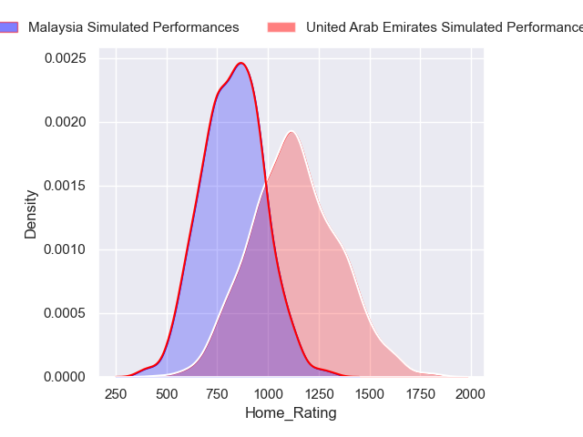
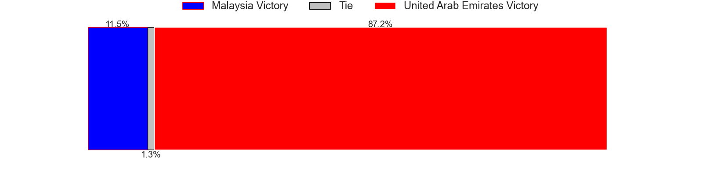
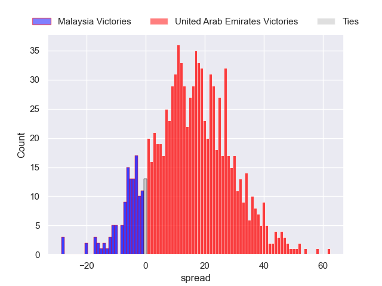

### South Africa V Wales on 2024/06/22

Average Margin: South Africa by 16.6

Average Scoreline: 37-21

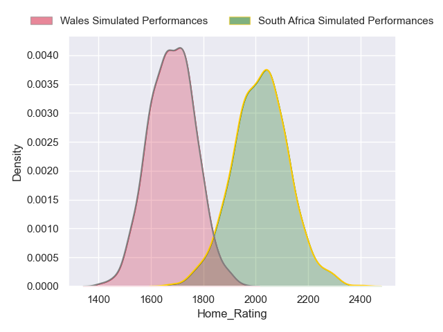
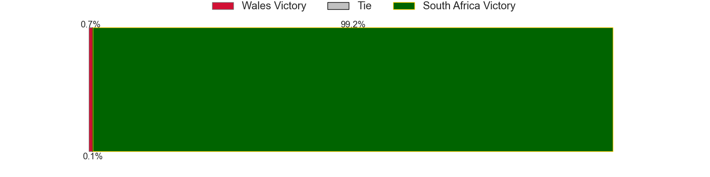
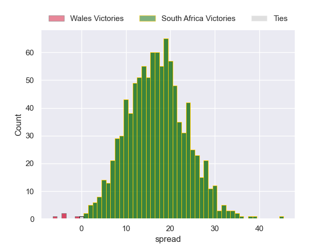

### Japan V England on 2024/06/22

Average Margin: England by 8.8

Average Scoreline: 32-23

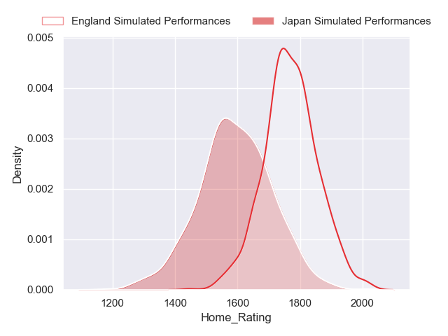
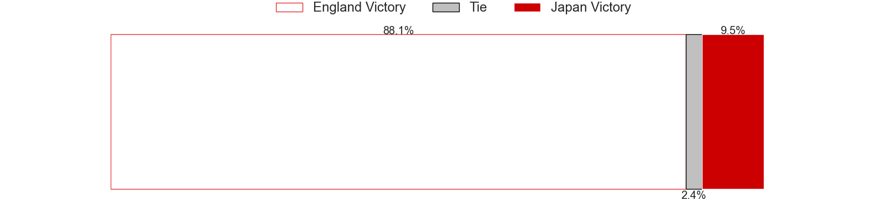
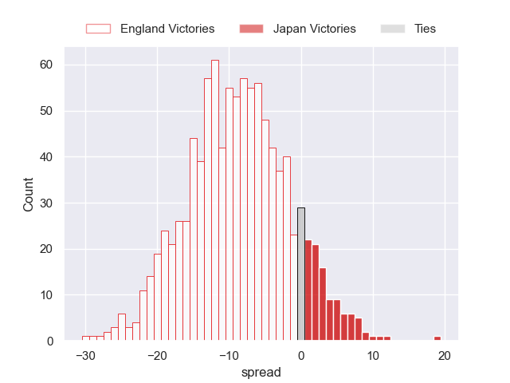

### Guyana V Trinidad and Tobago on 2024/06/22

Average Margin: Guyana by 21.6

Average Scoreline: 37-15

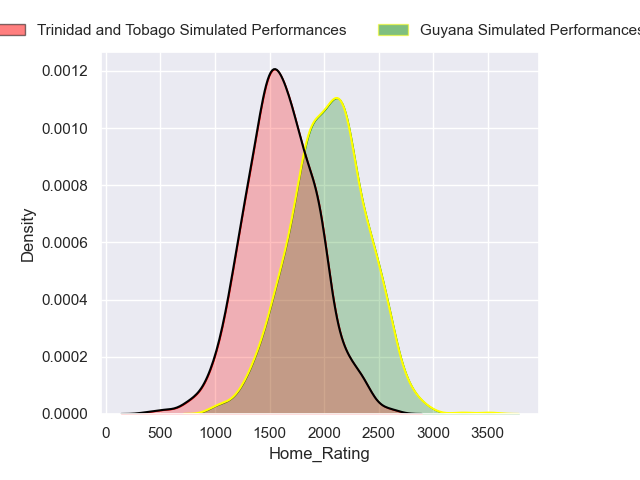
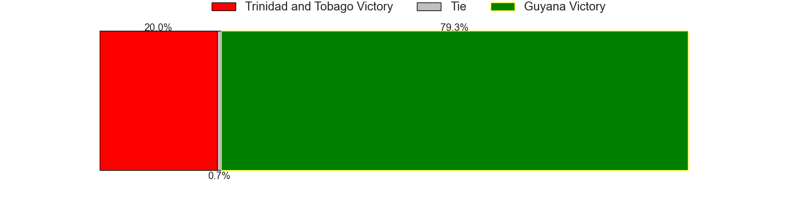
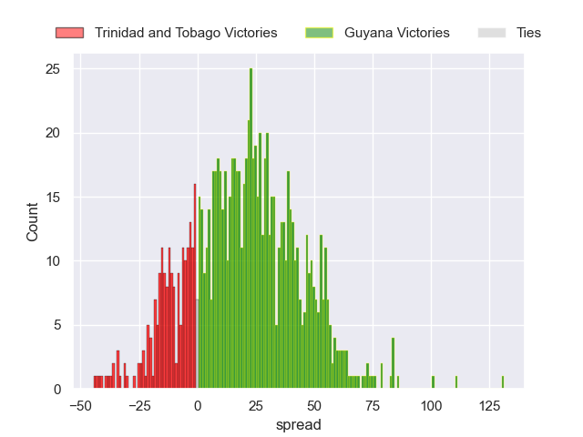

### Hong Kong V Korea Republic on 2024/06/22

Average Margin: Hong Kong by 7.1

Average Scoreline: 33-26

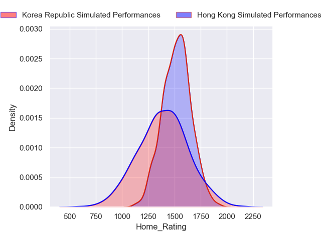
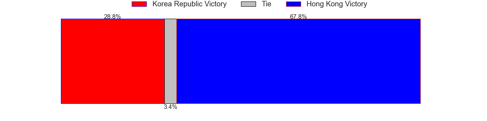
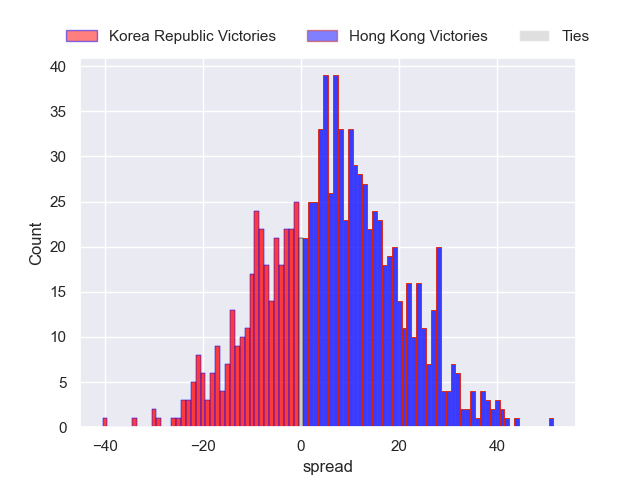

