---  
title: "International Test Match 2024 Status"  
date: 2024-07-03 6:00:00 -0500  
categories: model review projection  
layout: article  
aside:  
    toc: true  
---
# Current Team Rankings

# Standings

## Current Standings

| Club                   |   Played |   Wins |   Point Differential |   Losing Bonus Points |   Try Bonus Points |   Competition Points |
|:-----------------------|---------:|-------:|---------------------:|----------------------:|-------------------:|---------------------:|
| Hong Kong              |        3 |      3 |                  171 |                     0 |                nan |                   12 |
| Luxembourg             |        2 |      2 |                   80 |                     0 |                nan |                    8 |
| Sri Lanka              |        2 |      2 |                   73 |                     0 |                nan |                    8 |
| Switzerland            |        2 |      2 |                   41 |                     0 |                nan |                    8 |
| Sweden                 |        2 |      2 |                   31 |                     0 |                nan |                    8 |
| United Arab Emirates   |        3 |      2 |                    0 |                     0 |                nan |                    8 |
| England                |        1 |      1 |                   35 |                     0 |                  1 |                    5 |
| Hungary                |        2 |      1 |                   32 |                     1 |                nan |                    5 |
| South Africa           |        1 |      1 |                   28 |                     0 |                  1 |                    5 |
| Qatar                  |        2 |      1 |                    7 |                     1 |                nan |                    5 |
| Korea Republic         |        3 |      1 |                  -14 |                     1 |                nan |                    5 |
| Barbados               |        1 |      1 |                   84 |                     0 |                nan |                    4 |
| Finland                |        1 |      1 |                   50 |                     0 |                nan |                    4 |
| Moldova                |        1 |      1 |                   42 |                     0 |                nan |                    4 |
| Austria                |        1 |      1 |                   40 |                     0 |                nan |                    4 |
| Jamaica                |        1 |      1 |                   34 |                     0 |                nan |                    4 |
| Andorra                |        1 |      1 |                   24 |                     0 |                nan |                    4 |
| Trinidad and Tobago    |        1 |      1 |                   23 |                     0 |                nan |                    4 |
| Cayman Islands         |        2 |      1 |                   22 |                     0 |                nan |                    4 |
| Czech Republic         |        2 |      1 |                   14 |                     0 |                nan |                    4 |
| Algeria                |        1 |      1 |                   14 |                     0 |                nan |                    4 |
| Mexico                 |        1 |      1 |                   10 |                     0 |                nan |                    4 |
| Malta                  |        1 |      1 |                   10 |                     0 |                nan |                    4 |
| Latvia                 |        1 |      1 |                    4 |                     0 |                nan |                    4 |
| Zimbabwe               |        1 |      1 |                    4 |                     0 |                nan |                    4 |
| Bermuda                |        2 |      1 |                   -2 |                     0 |                nan |                    4 |
| Croatia                |        2 |      1 |                  -10 |                     0 |                nan |                    4 |
| Singapore              |        2 |      1 |                  -18 |                     0 |                nan |                    4 |
| Bulgaria               |        2 |      1 |                  -19 |                     0 |                nan |                    4 |
| Kazakhstan             |        2 |      1 |                  -36 |                     0 |                nan |                    4 |
| Malaysia               |        4 |      1 |                 -118 |                     0 |                nan |                    4 |
| Denmark                |        1 |      0 |                   -4 |                     1 |                nan |                    1 |
| Zambia                 |        1 |      0 |                   -4 |                     1 |                nan |                    1 |
| Cyprus                 |        1 |      0 |                  -10 |                     0 |                nan |                    0 |
| Senegal                |        1 |      0 |                  -14 |                     0 |                nan |                    0 |
| Thailand               |        1 |      0 |                  -21 |                     0 |                nan |                    0 |
| Guyana                 |        1 |      0 |                  -23 |                     0 |                nan |                    0 |
| Serbia                 |        1 |      0 |                  -23 |                     0 |                nan |                    0 |
| Wales                  |        1 |      0 |                  -28 |                     0 |                  0 |                    0 |
| Lithuania              |        2 |      0 |                  -34 |                     0 |                nan |                    0 |
| Japan                  |        1 |      0 |                  -35 |                     0 |                  0 |                    0 |
| Ukraine                |        2 |      0 |                  -42 |                     0 |                nan |                    0 |
| India                  |        2 |      0 |                  -44 |                     0 |                nan |                    0 |
| Bahamas                |        2 |      0 |                  -64 |                     0 |                nan |                    0 |
| Norway                 |        2 |      0 |                  -74 |                     0 |                nan |                    0 |
| Bosnia and Herzegovina |        2 |      0 |                  -75 |                     0 |                nan |                    0 |
| Slovenia               |        1 |      0 |                  -77 |                     0 |                nan |                    0 |
| Saint Lucia            |        1 |      0 |                  -84 |                     0 |                nan |                    0 |

## Projected Remaining Table

| Club                     |   Matches Remaining |   Wins |   Point Differential |   Losing Bonus Points |   Try Bonus Points |   Competition Points |
|:-------------------------|--------------------:|-------:|---------------------:|----------------------:|-------------------:|---------------------:|
| Scotland                 |                   1 |    1   |            22.3411   |                   0   |                0.9 |                  4.9 |
| United States of America |                   1 |    1   |            17.7461   |                   0   |                0.7 |                  4.7 |
| New Zealand              |                   1 |    0.9 |            10.6808   |                   0.1 |                0.4 |                  4.2 |
| Hong Kong                |                   1 |    0.8 |             8.62024  |                   0.1 |                0.6 |                  4   |
| France                   |                   1 |    0.7 |             3.91007  |                   0.2 |                0.6 |                  3.6 |
| Australia                |                   1 |    0.7 |             3.99347  |                   0.2 |                0.3 |                  3.3 |
| Singapore                |                   1 |    0.7 |             7.12151  |                   0.1 |                0.2 |                  3.1 |
| Samoa                    |                   1 |    0.6 |             2.7324   |                   0.3 |                0.2 |                  3   |
| South Africa             |                   1 |    0.6 |             2.55801  |                   0.3 |                0.2 |                  2.9 |
| Georgia                  |                   1 |    0.6 |             0.998671 |                   0.3 |                0.1 |                  2.6 |
| Fiji                     |                   1 |    0.4 |            -0.998671 |                   0.3 |                0.4 |                  2.5 |
| Ireland                  |                   1 |    0.4 |            -2.55801  |                   0.3 |                0.2 |                  2   |
| Italy                    |                   1 |    0.4 |            -2.7324   |                   0.3 |                0.2 |                  2   |
| Argentina                |                   1 |    0.3 |            -3.91007  |                   0.4 |                0.1 |                  1.7 |
| Wales                    |                   1 |    0.3 |            -3.99347  |                   0.4 |                0.1 |                  1.7 |
| Chinese Taipei           |                   1 |    0.3 |            -7.12151  |                   0.2 |                0.1 |                  1.6 |
| Chile                    |                   1 |    0.2 |            -8.62024  |                   0.3 |                0.3 |                  1.3 |
| England                  |                   1 |    0.1 |           -10.6808   |                   0.2 |                0.2 |                  0.6 |
| Romania                  |                   1 |    0   |           -17.7461   |                   0.1 |                0.2 |                  0.3 |
| Canada                   |                   1 |    0   |           -22.3411   |                   0   |                0.1 |                  0.1 |

## Projected Total Table

| Club                     |   Total Matches |   Wins |   Point Differential |   Losing Bonus Points |   Try Bonus Points |   Competition Points |
|:-------------------------|----------------:|-------:|---------------------:|----------------------:|-------------------:|---------------------:|
| Hong Kong                |               4 |    3.8 |           179.62     |                   0.1 |                0.6 |                 16   |
| Luxembourg               |               2 |    2   |            80        |                   0   |                0   |                  8   |
| Sri Lanka                |               2 |    2   |            73        |                   0   |                0   |                  8   |
| Switzerland              |               2 |    2   |            41        |                   0   |                0   |                  8   |
| Sweden                   |               2 |    2   |            31        |                   0   |                0   |                  8   |
| United Arab Emirates     |               3 |    2   |             0        |                   0   |                0   |                  8   |
| South Africa             |               2 |    1.6 |            30.558    |                   0.3 |                1.2 |                  7.9 |
| Singapore                |               3 |    1.7 |           -10.8785   |                   0.1 |                0.2 |                  7.1 |
| England                  |               2 |    1.1 |            24.3192   |                   0.2 |                1.2 |                  5.6 |
| Hungary                  |               2 |    1   |            32        |                   1   |                0   |                  5   |
| Qatar                    |               2 |    1   |             7        |                   1   |                0   |                  5   |
| Korea Republic           |               3 |    1   |           -14        |                   1   |                0   |                  5   |
| Scotland                 |               1 |    1   |            22.3411   |                   0   |                0.9 |                  4.9 |
| United States of America |               1 |    1   |            17.7461   |                   0   |                0.7 |                  4.7 |
| New Zealand              |               1 |    0.9 |            10.6808   |                   0.1 |                0.4 |                  4.2 |
| Barbados                 |               1 |    1   |            84        |                   0   |                0   |                  4   |
| Finland                  |               1 |    1   |            50        |                   0   |                0   |                  4   |
| Moldova                  |               1 |    1   |            42        |                   0   |                0   |                  4   |
| Austria                  |               1 |    1   |            40        |                   0   |                0   |                  4   |
| Jamaica                  |               1 |    1   |            34        |                   0   |                0   |                  4   |
| Andorra                  |               1 |    1   |            24        |                   0   |                0   |                  4   |
| Trinidad and Tobago      |               1 |    1   |            23        |                   0   |                0   |                  4   |
| Cayman Islands           |               2 |    1   |            22        |                   0   |                0   |                  4   |
| Algeria                  |               1 |    1   |            14        |                   0   |                0   |                  4   |
| Czech Republic           |               2 |    1   |            14        |                   0   |                0   |                  4   |
| Malta                    |               1 |    1   |            10        |                   0   |                0   |                  4   |
| Mexico                   |               1 |    1   |            10        |                   0   |                0   |                  4   |
| Latvia                   |               1 |    1   |             4        |                   0   |                0   |                  4   |
| Zimbabwe                 |               1 |    1   |             4        |                   0   |                0   |                  4   |
| Bermuda                  |               2 |    1   |            -2        |                   0   |                0   |                  4   |
| Croatia                  |               2 |    1   |           -10        |                   0   |                0   |                  4   |
| Bulgaria                 |               2 |    1   |           -19        |                   0   |                0   |                  4   |
| Kazakhstan               |               2 |    1   |           -36        |                   0   |                0   |                  4   |
| Malaysia                 |               4 |    1   |          -118        |                   0   |                0   |                  4   |
| France                   |               1 |    0.7 |             3.91007  |                   0.2 |                0.6 |                  3.6 |
| Australia                |               1 |    0.7 |             3.99347  |                   0.2 |                0.3 |                  3.3 |
| Samoa                    |               1 |    0.6 |             2.7324   |                   0.3 |                0.2 |                  3   |
| Georgia                  |               1 |    0.6 |             0.998671 |                   0.3 |                0.1 |                  2.6 |
| Fiji                     |               1 |    0.4 |            -0.998671 |                   0.3 |                0.4 |                  2.5 |
| Ireland                  |               1 |    0.4 |            -2.55801  |                   0.3 |                0.2 |                  2   |
| Italy                    |               1 |    0.4 |            -2.7324   |                   0.3 |                0.2 |                  2   |
| Argentina                |               1 |    0.3 |            -3.91007  |                   0.4 |                0.1 |                  1.7 |
| Wales                    |               2 |    0.3 |           -31.9935   |                   0.4 |                0.1 |                  1.7 |
| Chinese Taipei           |               1 |    0.3 |            -7.12151  |                   0.2 |                0.1 |                  1.6 |
| Chile                    |               1 |    0.2 |            -8.62024  |                   0.3 |                0.3 |                  1.3 |
| Denmark                  |               1 |    0   |            -4        |                   1   |                0   |                  1   |
| Zambia                   |               1 |    0   |            -4        |                   1   |                0   |                  1   |
| Romania                  |               1 |    0   |           -17.7461   |                   0.1 |                0.2 |                  0.3 |
| Canada                   |               1 |    0   |           -22.3411   |                   0   |                0.1 |                  0.1 |
| Cyprus                   |               1 |    0   |           -10        |                   0   |                0   |                  0   |
| Senegal                  |               1 |    0   |           -14        |                   0   |                0   |                  0   |
| Thailand                 |               1 |    0   |           -21        |                   0   |                0   |                  0   |
| Guyana                   |               1 |    0   |           -23        |                   0   |                0   |                  0   |
| Serbia                   |               1 |    0   |           -23        |                   0   |                0   |                  0   |
| Lithuania                |               2 |    0   |           -34        |                   0   |                0   |                  0   |
| Japan                    |               1 |    0   |           -35        |                   0   |                0   |                  0   |
| Ukraine                  |               2 |    0   |           -42        |                   0   |                0   |                  0   |
| India                    |               2 |    0   |           -44        |                   0   |                0   |                  0   |
| Bahamas                  |               2 |    0   |           -64        |                   0   |                0   |                  0   |
| Norway                   |               2 |    0   |           -74        |                   0   |                0   |                  0   |
| Bosnia and Herzegovina   |               2 |    0   |           -75        |                   0   |                0   |                  0   |
| Slovenia                 |               1 |    0   |           -77        |                   0   |                0   |                  0   |
| Saint Lucia              |               1 |    0   |           -84        |                   0   |                0   |                  0   |

# Completed Match Review

| Model | Percent Correct Predictions | Spread Error |
| ------ | ------ | ------ |
| Club Level | 71.1% | 26.1 |
| Player Level: Lineup | 100.0% | 10.0 |
| Player Level: Minutes | 100.0% | 13.2 |

# Future Predictions

## Week 5

### Samoa V Italy on 2024/07/05

Average Margin: Samoa by 2.7

Average Scoreline: 24-21

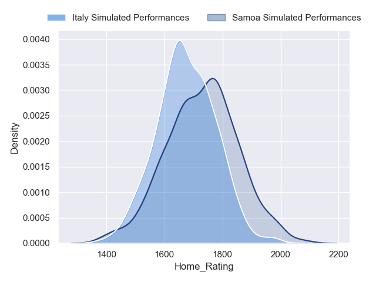

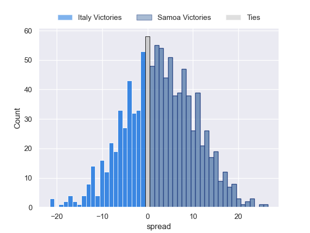

### Singapore V Chinese Taipei on 2024/07/05

Average Margin: Singapore by 7.1

Average Scoreline: 26-19

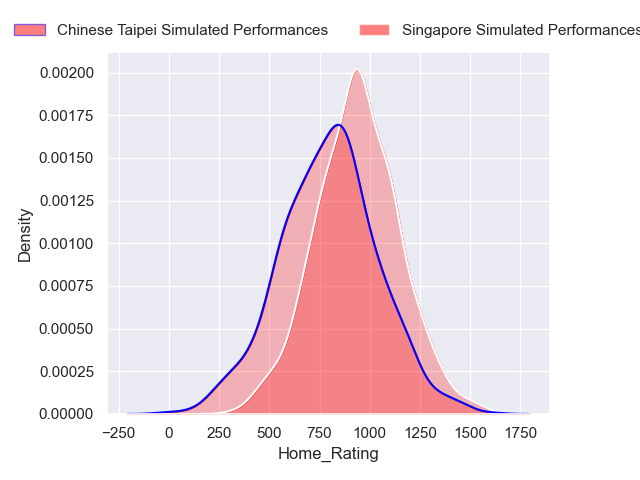
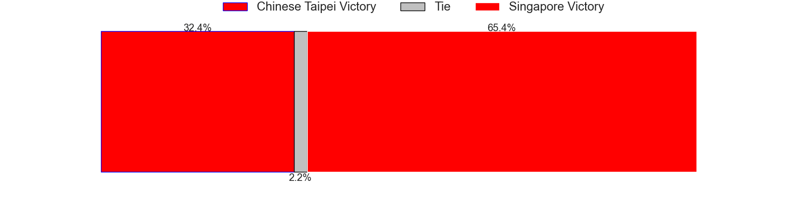
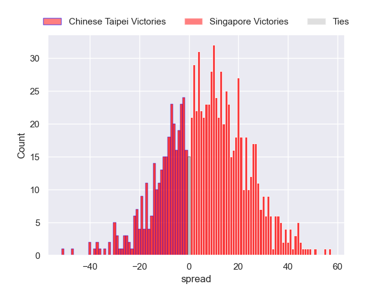

### Georgia V Fiji on 2024/07/05

Average Margin: Georgia by 1.0

Average Scoreline: 25-24

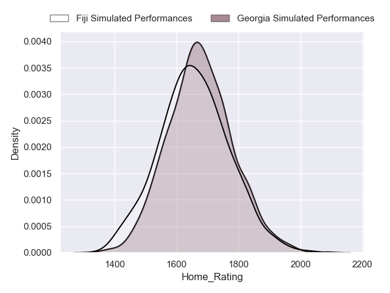

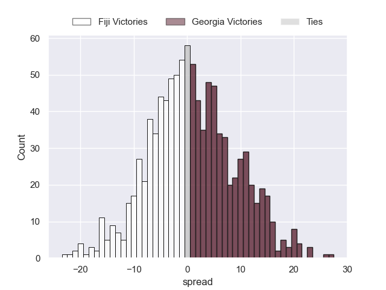

### Canada V Scotland on 2024/07/06

Average Margin: Scotland by 22.3

Average Scoreline: 31-9

### Chile V Hong Kong on 2024/07/06

Average Margin: Hong Kong by 8.6

Average Scoreline: 28-19

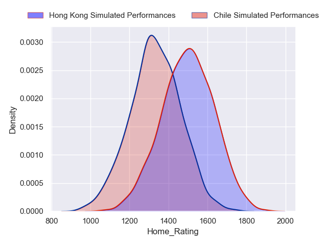
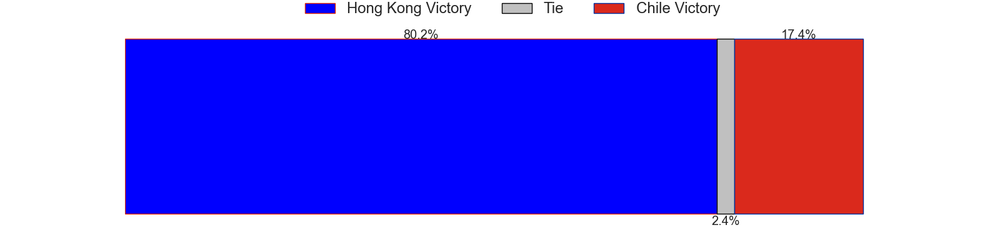
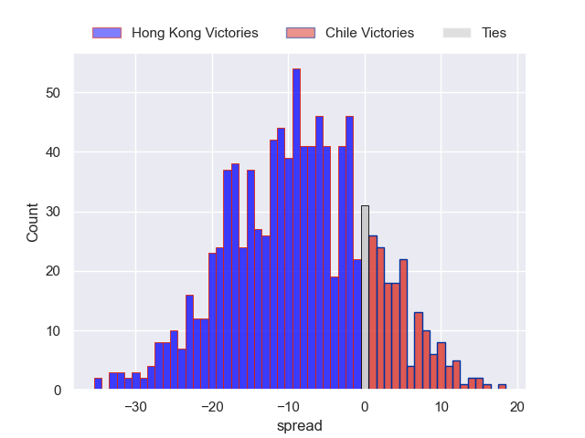

### United States of America V Romania on 2024/07/06

Average Margin: United States of America by 17.7

Average Scoreline: 34-16

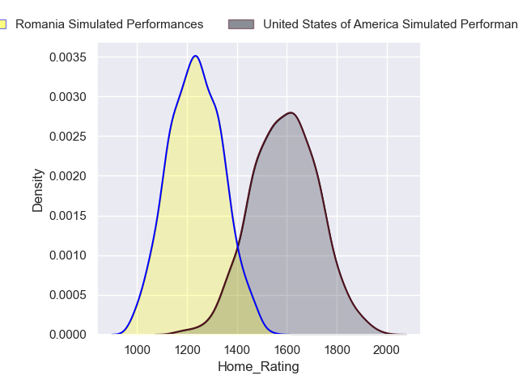
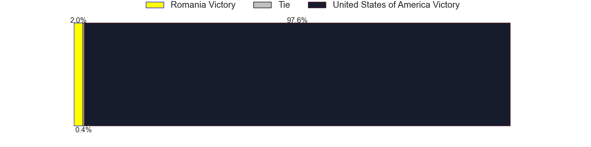
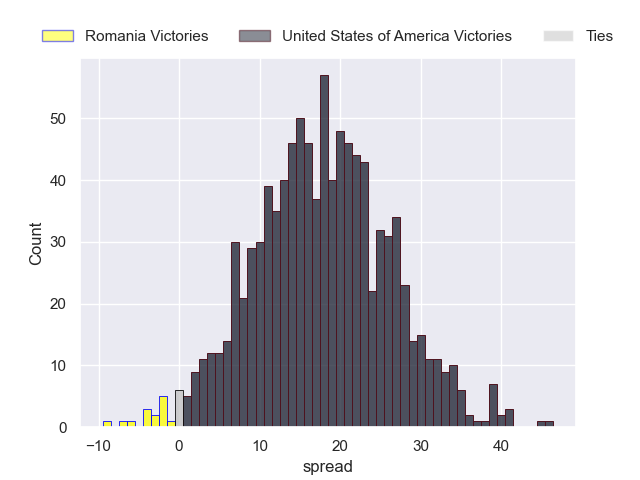

### New Zealand V England on 2024/07/06

Average Margin: New Zealand by 10.7

Average Scoreline: 32-22

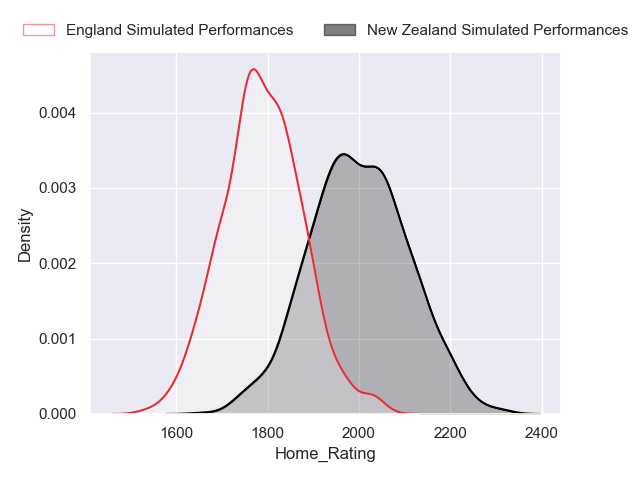
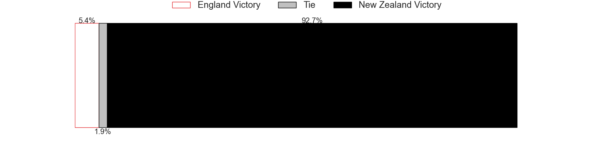
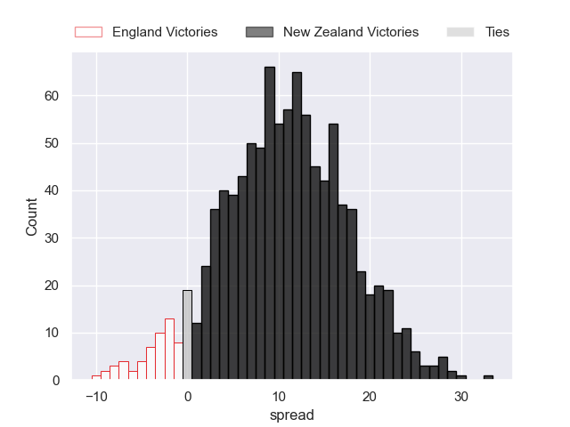

### Argentina V France on 2024/07/06

Average Margin: France by 3.9

Average Scoreline: 27-23

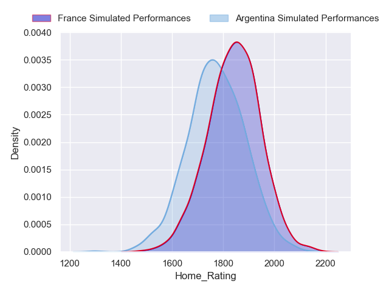
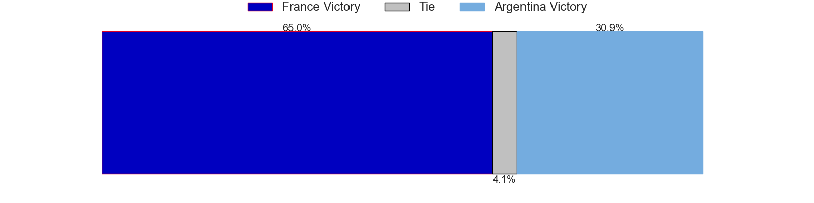
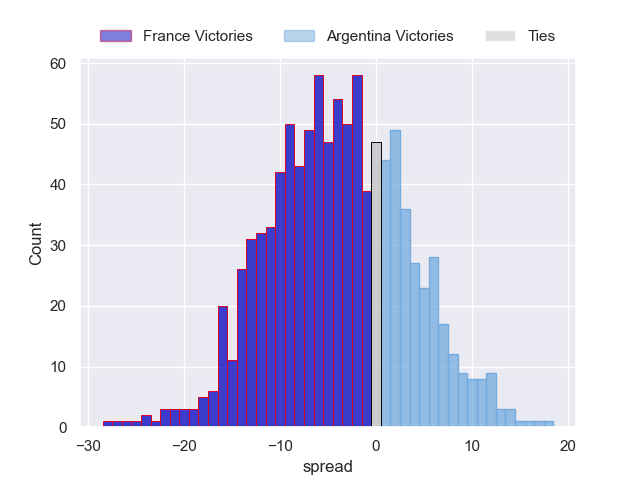

### Australia V Wales on 2024/07/06

Average Margin: Australia by 4.0

Average Scoreline: 27-23

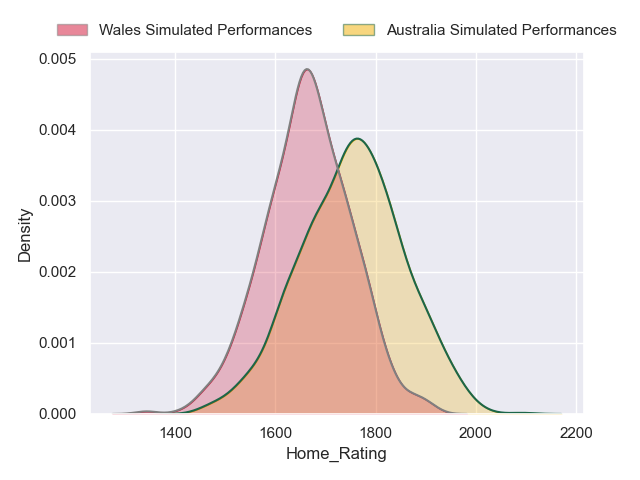
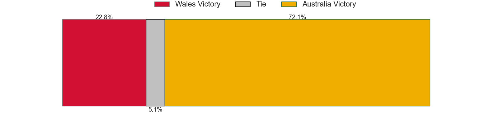
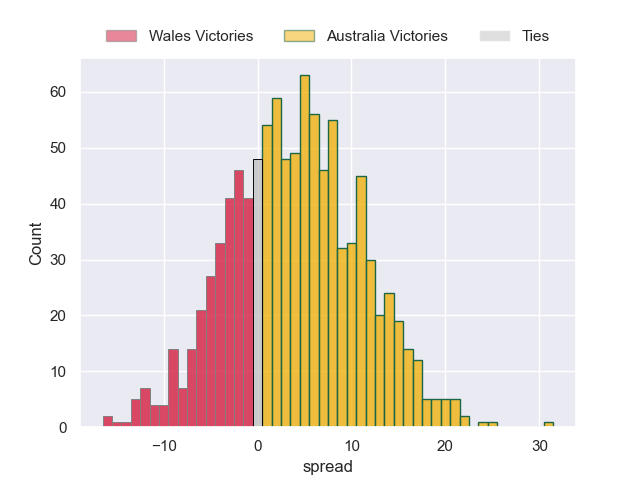

### South Africa V Ireland on 2024/07/06

Average Margin: South Africa by 2.6

Average Scoreline: 28-26

