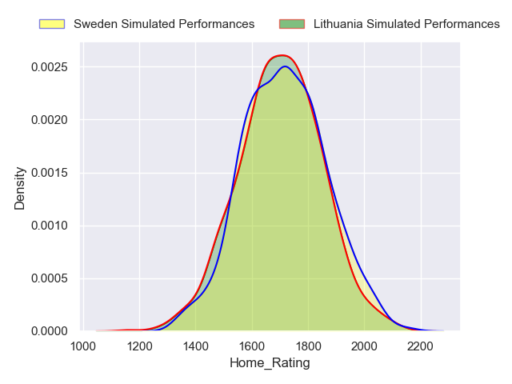
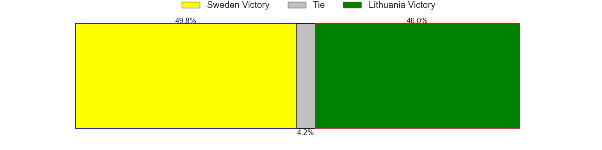
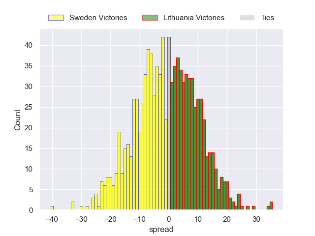

---  
title: "International Test Match 2024 Status"  
date: 2024-03-18 6:00:00 -0500  
categories: model review projection  
layout: article  
aside:  
    toc: true  
---
# Current Team Rankings

# Standings

## Current Standings

| Club           |   Played |   Wins |   Point Differential |   Losing Bonus Points |   Try Bonus Points |   Competition Points |
|:---------------|---------:|-------:|---------------------:|----------------------:|-------------------:|---------------------:|
| Switzerland    |        1 |      1 |                   16 |                     0 |                nan |                    4 |
| Croatia        |        1 |      1 |                   15 |                     0 |                nan |                    4 |
| Algeria        |        1 |      1 |                   14 |                     0 |                nan |                    4 |
| Senegal        |        1 |      0 |                  -14 |                     0 |                nan |                    0 |
| Lithuania      |        1 |      0 |                  -15 |                     0 |                nan |                    0 |
| Czech Republic |        1 |      0 |                  -16 |                     0 |                nan |                    0 |

## Projected Remaining Table

| Club                   |   Matches Remaining |   Wins |   Point Differential |   Losing Bonus Points |   Try Bonus Points |   Competition Points |
|:-----------------------|--------------------:|-------:|---------------------:|----------------------:|-------------------:|---------------------:|
| Andorra                |                   2 |    1.7 |            24.8168   |                   0.2 |                1.2 |                  8.2 |
| Sweden                 |                   2 |    1.5 |            22.321    |                   0.3 |                0.9 |                  7.1 |
| Denmark                |                   2 |    1.2 |            18.076    |                   0.2 |                0.9 |                  6.1 |
| Bulgaria               |                   2 |    1.2 |            25.6217   |                   0.2 |                1.1 |                  6   |
| Finland                |                   2 |    1.1 |             7.11246  |                   0.3 |                1   |                  5.8 |
| Hungary                |                   2 |    1   |            -1.40495  |                   0.4 |                0.8 |                  5.1 |
| Slovenia               |                   1 |    1   |            24.6995   |                   0   |                0.7 |                  4.7 |
| Czech Republic         |                   1 |    0.9 |            15.1469   |                   0   |                0.6 |                  4.4 |
| Luxembourg             |                   1 |    0.8 |             8.87639  |                   0.1 |                0.6 |                  3.8 |
| Moldova                |                   1 |    0.8 |            10.2467   |                   0.1 |                0.4 |                  3.7 |
| Austria                |                   2 |    0.7 |           -19.2029   |                   0.2 |                0.5 |                  3.6 |
| Latvia                 |                   1 |    0.7 |             7.10842  |                   0.2 |                0.4 |                  3.5 |
| Bosnia and Herzegovina |                   2 |    0.6 |           -12.968    |                   0.5 |                0.5 |                  3.3 |
| Turkey                 |                   1 |    0.6 |             5.22632  |                   0.2 |                0.5 |                  3.1 |
| Cyprus                 |                   1 |    0.6 |             2.11582  |                   0.2 |                0.3 |                  2.8 |
| Lithuania              |                   1 |    0.5 |            -0.765944 |                   0.2 |                0.1 |                  2.3 |
| Malta                  |                   1 |    0.4 |            -2.11582  |                   0.3 |                0.4 |                  2.3 |
| Serbia                 |                   2 |    0.4 |           -41.0947   |                   0.2 |                0.2 |                  2   |
| Norway                 |                   3 |    0.2 |           -57.1136   |                   0.3 |                0.8 |                  1.9 |
| Ukraine                |                   2 |    0.1 |           -36.702    |                   0.2 |                0.3 |                  0.9 |

## Projected Total Table

| Club                   |   Total Matches |   Wins |   Point Differential |   Losing Bonus Points |   Try Bonus Points |   Competition Points |
|:-----------------------|----------------:|-------:|---------------------:|----------------------:|-------------------:|---------------------:|
| Andorra                |               2 |    1.7 |            24.8168   |                   0.2 |                1.2 |                  8.2 |
| Sweden                 |               2 |    1.5 |            22.321    |                   0.3 |                0.9 |                  7.1 |
| Denmark                |               2 |    1.2 |            18.076    |                   0.2 |                0.9 |                  6.1 |
| Bulgaria               |               2 |    1.2 |            25.6217   |                   0.2 |                1.1 |                  6   |
| Finland                |               2 |    1.1 |             7.11246  |                   0.3 |                1   |                  5.8 |
| Hungary                |               2 |    1   |            -1.40495  |                   0.4 |                0.8 |                  5.1 |
| Slovenia               |               1 |    1   |            24.6995   |                   0   |                0.7 |                  4.7 |
| Czech Republic         |               2 |    0.9 |            -0.853089 |                   0   |                0.6 |                  4.4 |
| Switzerland            |               1 |    1   |            16        |                   0   |                0   |                  4   |
| Croatia                |               1 |    1   |            15        |                   0   |                0   |                  4   |
| Algeria                |               1 |    1   |            14        |                   0   |                0   |                  4   |
| Luxembourg             |               1 |    0.8 |             8.87639  |                   0.1 |                0.6 |                  3.8 |
| Moldova                |               1 |    0.8 |            10.2467   |                   0.1 |                0.4 |                  3.7 |
| Austria                |               2 |    0.7 |           -19.2029   |                   0.2 |                0.5 |                  3.6 |
| Latvia                 |               1 |    0.7 |             7.10842  |                   0.2 |                0.4 |                  3.5 |
| Bosnia and Herzegovina |               2 |    0.6 |           -12.968    |                   0.5 |                0.5 |                  3.3 |
| Turkey                 |               1 |    0.6 |             5.22632  |                   0.2 |                0.5 |                  3.1 |
| Cyprus                 |               1 |    0.6 |             2.11582  |                   0.2 |                0.3 |                  2.8 |
| Malta                  |               1 |    0.4 |            -2.11582  |                   0.3 |                0.4 |                  2.3 |
| Lithuania              |               2 |    0.5 |           -15.7659   |                   0.2 |                0.1 |                  2.3 |
| Serbia                 |               2 |    0.4 |           -41.0947   |                   0.2 |                0.2 |                  2   |
| Norway                 |               3 |    0.2 |           -57.1136   |                   0.3 |                0.8 |                  1.9 |
| Ukraine                |               2 |    0.1 |           -36.702    |                   0.2 |                0.3 |                  0.9 |
| Senegal                |               1 |    0   |           -14        |                   0   |                0   |                  0   |

# Completed Match Review

| Model | Percent Correct Predictions | Spread Error |
| ------ | ------ | ------ |
| Club Level | 100.0% | 9.9 |
| Player Level: Lineup | nan% | nan |
| Player Level: Minutes | nan% | nan |

# Future Predictions

## Week 2

### Ukraine V Czech Republic on 2024/03/23

Average Margin: Czech Republic by 15.1

Average Scoreline: 37-22

### Lithuania V Sweden on 2024/03/23

Average Margin: Sweden by 0.8

Average Scoreline: 29-28

## Week 3

### Sweden V Ukraine on 2024/04/06

Average Margin: Sweden by 21.6

Average Scoreline: 35-13

### Hungary V Luxembourg on 2024/04/06

Average Margin: Luxembourg by 8.9

Average Scoreline: 26-17

### Austria V Bosnia and Herzegovina on 2024/04/06

Average Margin: Austria by 5.5

Average Scoreline: 23-18

## Week 4

### Andorra V Finland on 2024/04/13

Average Margin: Andorra by 7.5

Average Scoreline: 26-19

### Slovenia V Austria on 2024/04/13

Average Margin: Slovenia by 24.7

Average Scoreline: 37-12

### Denmark V Norway on 2024/04/13

Average Margin: Denmark by 25.2

Average Scoreline: 36-11

### Serbia V Turkey on 2024/04/13

Average Margin: Turkey by 5.2

Average Scoreline: 23-18

## Week 5

### Latvia V Denmark on 2024/04/20

Average Margin: Latvia by 7.1

Average Scoreline: 24-16

### Bosnia and Herzegovina V Hungary on 2024/04/20

Average Margin: Hungary by 7.5

Average Scoreline: 28-21

### Bulgaria V Serbia on 2024/04/20

Average Margin: Bulgaria by 35.9

Average Scoreline: 47-11

## Week 6

### Norway V Andorra on 2024/05/04

Average Margin: Andorra by 17.4

Average Scoreline: 31-13

### Moldova V Bulgaria on 2024/05/04

Average Margin: Moldova by 10.2

Average Scoreline: 29-19

### Cyprus V Malta on 2024/05/04

Average Margin: Cyprus by 2.1

Average Scoreline: 22-19

## Week 7

### Norway V Finland on 2024/05/11

Average Margin: Finland by 14.6

Average Scoreline: 30-15

