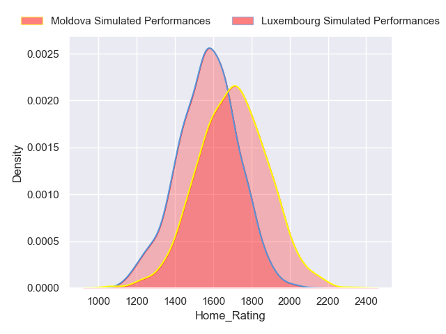
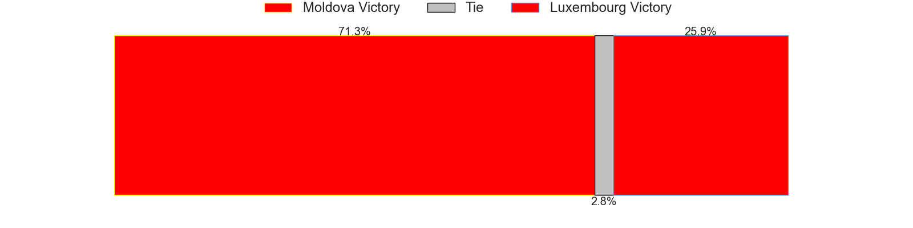
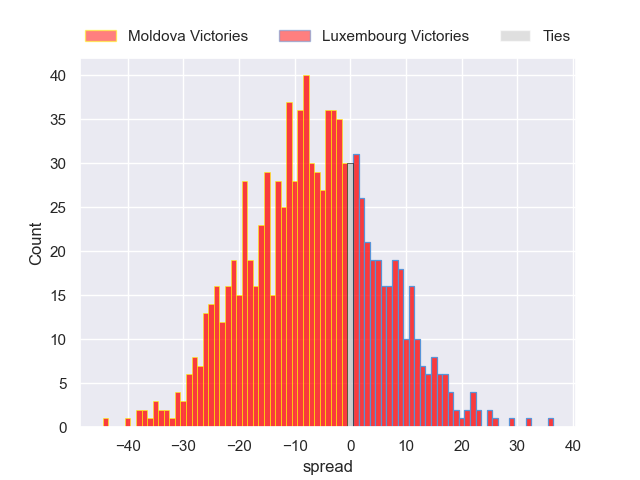

---  
title: "International Test Match 2024 Status"  
date: 2024-05-20 6:00:00 -0500  
categories: model review projection  
layout: article  
aside:  
    toc: true  
---
# Current Team Rankings

# Standings

## Current Standings

| Club                   |   Played |   Wins |   Point Differential |   Losing Bonus Points |   Try Bonus Points |   Competition Points |
|:-----------------------|---------:|-------:|---------------------:|----------------------:|-------------------:|---------------------:|
| Luxembourg             |        2 |      2 |                   80 |                     0 |                nan |                    8 |
| Sri Lanka              |        2 |      2 |                   73 |                     0 |                nan |                    8 |
| Switzerland            |        2 |      2 |                   41 |                     0 |                nan |                    8 |
| Sweden                 |        2 |      2 |                   31 |                     0 |                nan |                    8 |
| Hungary                |        2 |      1 |                   32 |                     1 |                nan |                    5 |
| Qatar                  |        2 |      1 |                    7 |                     1 |                nan |                    5 |
| Finland                |        1 |      1 |                   50 |                     0 |                nan |                    4 |
| Moldova                |        1 |      1 |                   42 |                     0 |                nan |                    4 |
| Austria                |        1 |      1 |                   40 |                     0 |                nan |                    4 |
| Malaysia               |        1 |      1 |                   39 |                     0 |                nan |                    4 |
| Cayman Islands         |        1 |      1 |                   32 |                     0 |                nan |                    4 |
| Andorra                |        1 |      1 |                   24 |                     0 |                nan |                    4 |
| Czech Republic         |        2 |      1 |                   14 |                     0 |                nan |                    4 |
| Algeria                |        1 |      1 |                   14 |                     0 |                nan |                    4 |
| Malta                  |        1 |      1 |                   10 |                     0 |                nan |                    4 |
| Latvia                 |        1 |      1 |                    4 |                     0 |                nan |                    4 |
| Zimbabwe               |        1 |      1 |                    4 |                     0 |                nan |                    4 |
| Croatia                |        2 |      1 |                  -10 |                     0 |                nan |                    4 |
| Bulgaria               |        2 |      1 |                  -19 |                     0 |                nan |                    4 |
| Kazakhstan             |        2 |      1 |                  -36 |                     0 |                nan |                    4 |
| Denmark                |        1 |      0 |                   -4 |                     1 |                nan |                    1 |
| Zambia                 |        1 |      0 |                   -4 |                     1 |                nan |                    1 |
| Cyprus                 |        1 |      0 |                  -10 |                     0 |                nan |                    0 |
| Senegal                |        1 |      0 |                  -14 |                     0 |                nan |                    0 |
| Serbia                 |        1 |      0 |                  -23 |                     0 |                nan |                    0 |
| Bermuda                |        1 |      0 |                  -32 |                     0 |                nan |                    0 |
| Lithuania              |        2 |      0 |                  -34 |                     0 |                nan |                    0 |
| Singapore              |        1 |      0 |                  -39 |                     0 |                nan |                    0 |
| Ukraine                |        2 |      0 |                  -42 |                     0 |                nan |                    0 |
| India                  |        2 |      0 |                  -44 |                     0 |                nan |                    0 |
| Norway                 |        2 |      0 |                  -74 |                     0 |                nan |                    0 |
| Bosnia and Herzegovina |        2 |      0 |                  -75 |                     0 |                nan |                    0 |
| Slovenia               |        1 |      0 |                  -77 |                     0 |                nan |                    0 |

## Projected Remaining Table

| Club       |   Matches Remaining |   Wins |   Point Differential |   Losing Bonus Points |   Try Bonus Points |   Competition Points |
|:-----------|--------------------:|-------:|---------------------:|----------------------:|-------------------:|---------------------:|
| Moldova    |                   1 |    0.7 |              6.80809 |                   0.2 |                0.3 |                  3.4 |
| Luxembourg |                   1 |    0.3 |             -6.80809 |                   0.2 |                0.2 |                  1.5 |

## Projected Total Table

| Club                   |   Total Matches |   Wins |   Point Differential |   Losing Bonus Points |   Try Bonus Points |   Competition Points |
|:-----------------------|----------------:|-------:|---------------------:|----------------------:|-------------------:|---------------------:|
| Luxembourg             |               3 |    2.3 |              73.1919 |                   0.2 |                0.2 |                  9.5 |
| Sri Lanka              |               2 |    2   |              73      |                   0   |                0   |                  8   |
| Switzerland            |               2 |    2   |              41      |                   0   |                0   |                  8   |
| Sweden                 |               2 |    2   |              31      |                   0   |                0   |                  8   |
| Moldova                |               2 |    1.7 |              48.8081 |                   0.2 |                0.3 |                  7.4 |
| Hungary                |               2 |    1   |              32      |                   1   |                0   |                  5   |
| Qatar                  |               2 |    1   |               7      |                   1   |                0   |                  5   |
| Finland                |               1 |    1   |              50      |                   0   |                0   |                  4   |
| Austria                |               1 |    1   |              40      |                   0   |                0   |                  4   |
| Malaysia               |               1 |    1   |              39      |                   0   |                0   |                  4   |
| Cayman Islands         |               1 |    1   |              32      |                   0   |                0   |                  4   |
| Andorra                |               1 |    1   |              24      |                   0   |                0   |                  4   |
| Algeria                |               1 |    1   |              14      |                   0   |                0   |                  4   |
| Czech Republic         |               2 |    1   |              14      |                   0   |                0   |                  4   |
| Malta                  |               1 |    1   |              10      |                   0   |                0   |                  4   |
| Latvia                 |               1 |    1   |               4      |                   0   |                0   |                  4   |
| Zimbabwe               |               1 |    1   |               4      |                   0   |                0   |                  4   |
| Croatia                |               2 |    1   |             -10      |                   0   |                0   |                  4   |
| Bulgaria               |               2 |    1   |             -19      |                   0   |                0   |                  4   |
| Kazakhstan             |               2 |    1   |             -36      |                   0   |                0   |                  4   |
| Denmark                |               1 |    0   |              -4      |                   1   |                0   |                  1   |
| Zambia                 |               1 |    0   |              -4      |                   1   |                0   |                  1   |
| Cyprus                 |               1 |    0   |             -10      |                   0   |                0   |                  0   |
| Senegal                |               1 |    0   |             -14      |                   0   |                0   |                  0   |
| Serbia                 |               1 |    0   |             -23      |                   0   |                0   |                  0   |
| Bermuda                |               1 |    0   |             -32      |                   0   |                0   |                  0   |
| Lithuania              |               2 |    0   |             -34      |                   0   |                0   |                  0   |
| Singapore              |               1 |    0   |             -39      |                   0   |                0   |                  0   |
| Ukraine                |               2 |    0   |             -42      |                   0   |                0   |                  0   |
| India                  |               2 |    0   |             -44      |                   0   |                0   |                  0   |
| Norway                 |               2 |    0   |             -74      |                   0   |                0   |                  0   |
| Bosnia and Herzegovina |               2 |    0   |             -75      |                   0   |                0   |                  0   |
| Slovenia               |               1 |    0   |             -77      |                   0   |                0   |                  0   |

# Completed Match Review

| Model | Percent Correct Predictions | Spread Error |
| ------ | ------ | ------ |
| Club Level | 75.0% | 21.1 |
| Player Level: Lineup | nan% | nan |
| Player Level: Minutes | nan% | nan |

# Future Predictions

## Week 3

### Luxembourg V Moldova on 2024/05/25

Average Margin: Moldova by 6.8

Average Scoreline: 35-28

